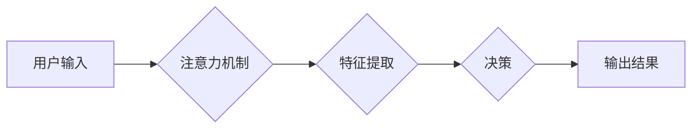

                 

## AI如何影响我们对注意力的感知

> 关键词：人工智能、注意力机制、深度学习、认知科学、神经网络、信息过滤、用户体验、未来趋势

## 1. 背景介绍

在信息爆炸的时代，我们每天都被海量信息包围。从社交媒体的推送消息到电子邮件的提醒，从新闻网站的滚动条到手机应用程序的通知，无处不在的信息洪流使得我们难以集中注意力，专注于当下。在这种背景下，人工智能（AI）技术应运而生，它不仅能够帮助我们处理信息，更能够深刻地影响我们对注意力的感知。

注意力机制是AI领域的重要研究方向之一，它模拟了人类大脑对重要信息进行筛选和聚焦的过程。近年来，深度学习技术的快速发展使得注意力机制在自然语言处理、计算机视觉等领域取得了突破性进展。AI驱动的注意力机制不仅能够帮助我们更有效地获取信息，也可能改变我们对注意力的认知和理解。

## 2. 核心概念与联系

### 2.1 注意力机制

注意力机制是一种模仿人类视觉和认知过程的计算模型，它允许模型在处理信息时，根据其重要性分配不同的计算资源。简单来说，注意力机制可以帮助模型“聚焦”于输入数据中最重要的部分，从而提高处理效率和准确性。

### 2.2 深度学习

深度学习是一种机器学习的子领域，它利用多层神经网络来学习复杂的数据模式。深度学习模型能够从海量数据中自动提取特征，并进行复杂的推理和决策。

### 2.3 人工智能与注意力机制

AI技术与注意力机制相结合，能够构建出更智能、更具适应性的系统。例如，AI驱动的搜索引擎可以根据用户的搜索历史和行为模式，精准地推荐相关信息；AI驱动的聊天机器人可以根据对话内容，更好地理解用户的意图并提供更精准的回复。

**Mermaid 流程图**



## 3. 核心算法原理 & 具体操作步骤

### 3.1 算法原理概述

注意力机制的核心原理是通过一个“注意力权重”来分配输入数据的计算资源。注意力权重可以看作是模型对不同输入元素的重要性程度的评估。

### 3.2 算法步骤详解

1. **输入数据处理:** 将输入数据转换为模型可以理解的格式。
2. **特征提取:** 使用神经网络提取输入数据的特征表示。
3. **注意力计算:** 计算每个输入元素的注意力权重。
4. **加权求和:** 根据注意力权重对特征表示进行加权求和，得到最终的输出。

### 3.3 算法优缺点

**优点:**

* 能够提高模型对重要信息的关注度。
* 可以处理长序列数据，例如文本和音频。
* 能够学习到数据中的复杂关系。

**缺点:**

* 计算复杂度较高。
* 需要大量的训练数据。
* 难以解释注意力权重的生成机制。

### 3.4 算法应用领域

注意力机制在自然语言处理、计算机视觉、语音识别等领域都有广泛的应用。

* **自然语言处理:** 机器翻译、文本摘要、问答系统等。
* **计算机视觉:** 图像识别、目标检测、图像 captioning 等。
* **语音识别:** 语音转文本、语音合成等。

## 4. 数学模型和公式 & 详细讲解 & 举例说明

### 4.1 数学模型构建

注意力机制的数学模型通常基于一个“注意力分数”的计算。注意力分数表示模型对每个输入元素的重要性程度。

### 4.2 公式推导过程

假设我们有一个输入序列 X = {x1, x2, ..., xn}，其中每个元素 xi 代表一个输入特征。注意力机制的目标是计算每个元素 xi 的注意力权重 αi，使得 αi 表示 xi 对最终输出的重要性程度。

注意力分数通常使用一个“注意力函数”来计算，例如：

$$
\alpha_i = \frac{exp(e_i)}{\sum_{j=1}^{n} exp(e_j)}
$$

其中，ei 是每个元素 xi 的“注意力得分”。注意力得分可以根据不同的任务和模型设计，例如：

$$
e_i = f(x_i, h)
$$

其中，f 是一个神经网络函数，h 是模型的隐藏状态。

### 4.3 案例分析与讲解

例如，在机器翻译任务中，注意力机制可以帮助模型关注源语言中与目标语言单词相关的关键信息。

假设我们有一个源语言句子 "The cat sat on the mat" 和一个目标语言句子 "Le chat s'est assis sur le tapis"。

使用注意力机制，模型可以计算每个源语言单词与每个目标语言单词之间的注意力分数。例如，模型可能会将 "cat" 和 "chat" 之间的注意力分数设置为较高值，因为它们是对应的单词。

通过关注这些高注意力分数的单词对，模型可以更好地理解句子之间的关系，并生成更准确的翻译结果。

## 5. 项目实践：代码实例和详细解释说明

### 5.1 开发环境搭建

* Python 3.6+
* TensorFlow 或 PyTorch

### 5.2 源代码详细实现

```python
import tensorflow as tf

# 定义注意力机制
def attention_layer(inputs, hidden_state):
  # 计算注意力分数
  attention_scores = tf.matmul(inputs, hidden_state, transpose_b=True)
  # 归一化注意力分数
  attention_weights = tf.nn.softmax(attention_scores, axis=-1)
  # 加权求和
  context_vector = tf.matmul(attention_weights, inputs)
  return context_vector

# 定义模型
model = tf.keras.Sequential([
  # ... 其他层 ...
  attention_layer(inputs, hidden_state),
  # ... 其他层 ...
])

# 训练模型
model.compile(optimizer='adam', loss='mse')
model.fit(x_train, y_train, epochs=10)
```

### 5.3 代码解读与分析

* `attention_layer` 函数定义了注意力机制的计算过程。
* `attention_scores` 计算了每个输入元素与隐藏状态之间的注意力得分。
* `attention_weights` 将注意力得分归一化，得到每个元素的注意力权重。
* `context_vector` 通过加权求和，将注意力权重与输入元素相结合，得到最终的输出。

### 5.4 运行结果展示

* 通过训练模型并测试其性能，可以评估注意力机制的效果。
* 可以使用指标，例如准确率、召回率、F1-score 等来衡量模型的性能。

## 6. 实际应用场景

### 6.1 搜索引擎

AI驱动的搜索引擎可以利用注意力机制，更精准地理解用户的搜索意图，并返回更相关的结果。

### 6.2 个性化推荐

注意力机制可以帮助电商平台和流媒体服务提供商，根据用户的行为模式和偏好，提供更个性化的商品和内容推荐。

### 6.3 医疗诊断

注意力机制可以帮助医生分析医学图像和病历，更快地识别潜在的疾病风险。

### 6.4 教育领域

注意力机制可以帮助教育平台开发更智能的学习助手，根据学生的学习进度和理解能力，提供个性化的学习内容和辅导。

### 6.5 未来应用展望

随着AI技术的不断发展，注意力机制将在更多领域得到应用，例如：

* **自动驾驶:** 帮助自动驾驶系统更精准地感知周围环境。
* **机器人技术:** 帮助机器人更好地理解人类指令和行为。
* **虚拟现实:** 增强虚拟现实体验，使虚拟世界更逼真和沉浸式。

## 7. 工具和资源推荐

### 7.1 学习资源推荐

* **书籍:**
    * "Deep Learning" by Ian Goodfellow, Yoshua Bengio, and Aaron Courville
    * "Attention Is All You Need" by Vaswani et al.
* **在线课程:**
    * Coursera: "Deep Learning Specialization" by Andrew Ng
    * Udacity: "Deep Learning Nanodegree"

### 7.2 开发工具推荐

* **TensorFlow:** https://www.tensorflow.org/
* **PyTorch:** https://pytorch.org/

### 7.3 相关论文推荐

* "Attention Is All You Need" (https://arxiv.org/abs/1706.03762)
* "BERT: Pre-training of Deep Bidirectional Transformers for Language Understanding" (https://arxiv.org/abs/1810.04805)

## 8. 总结：未来发展趋势与挑战

### 8.1 研究成果总结

注意力机制在AI领域取得了显著的进展，它为处理长序列数据、学习复杂关系提供了新的思路。

### 8.2 未来发展趋势

* **更有效的注意力机制:** 研究更有效的注意力机制，例如可解释性更强、计算效率更高的注意力机制。
* **跨模态注意力:** 研究跨模态注意力机制，例如将文本、图像、音频等不同模态的信息融合在一起。
* **动态注意力:** 研究动态注意力机制，例如能够根据任务和输入数据动态调整注意力权重的机制。

### 8.3 面临的挑战

* **计算复杂度:** 现有的注意力机制计算复杂度较高，难以应用于大规模数据处理。
* **可解释性:** 注意力机制的决策过程难以解释，这限制了其在一些安全关键应用中的应用。
* **数据依赖性:** 注意力机制需要大量的训练数据，这在一些数据稀缺的领域是一个挑战。

### 8.4 研究展望

未来，注意力机制将继续是AI领域的重要研究方向，它将推动AI技术的进一步发展，并为我们带来更多创新应用。

## 9. 附录：常见问题与解答

### 9.1 什么是注意力机制？

注意力机制是一种模仿人类视觉和认知过程的计算模型，它允许模型在处理信息时，根据其重要性分配不同的计算资源。

### 9.2 注意力机制有什么优点？

注意力机制能够提高模型对重要信息的关注度，可以处理长序列数据，例如文本和音频，并且能够学习到数据中的复杂关系。

### 9.3 注意力机制有什么缺点？

注意力机制的计算复杂度较高，需要大量的训练数据，并且难以解释注意力权重的生成机制。


作者：禅与计算机程序设计艺术 / Zen and the Art of Computer Programming 
<end_of_turn>

