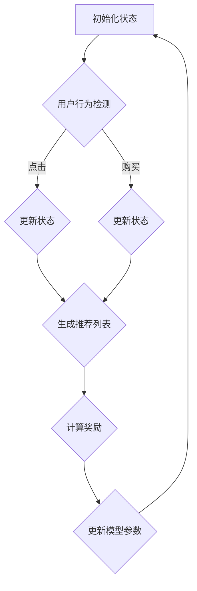

                 

### 文章标题

## 基于强化学习的动态推荐列表生成

### 关键词：强化学习，动态推荐，列表生成，用户行为分析，机器学习

#### 摘要：

本文探讨了基于强化学习的动态推荐列表生成技术。强化学习作为一种机器学习的重要分支，被广泛应用于推荐系统中的决策过程。动态推荐列表生成旨在根据用户实时行为，动态调整推荐列表，提升用户满意度和系统整体性能。本文将详细介绍强化学习在动态推荐列表生成中的基本原理、数学模型、具体操作步骤，并通过实际项目实践，展示强化学习如何应用于现实场景，提升推荐系统的自适应性和准确性。

<|assistant|>## 1. 背景介绍（Background Introduction）

### 1.1 强化学习简介

强化学习（Reinforcement Learning，RL）是机器学习的一个重要分支，主要研究如何通过试错（trial-and-error）和奖励（reward）机制来学习在特定环境下实现最佳行为策略（policy）。与监督学习和无监督学习不同，强化学习通过与环境不断交互（interaction）来获取反馈信息，并通过这些信息来调整自身的决策行为。强化学习在自动驾驶、游戏AI、智能机器人等领域取得了显著的成果，逐渐成为人工智能领域的研究热点。

### 1.2 推荐系统简介

推荐系统（Recommender System）是信息检索和数据分析的重要工具，通过分析用户的历史行为和偏好，为用户推荐其可能感兴趣的内容或商品。推荐系统广泛应用于电子商务、社交媒体、在线视频平台等场景，极大地提升了用户满意度和商业价值。传统的推荐系统主要采用基于协同过滤（Collaborative Filtering）、内容匹配（Content-Based Filtering）和混合推荐（Hybrid Methods）等方法，但在面对用户行为多样性和动态变化时，存在一定的局限性。

### 1.3 动态推荐列表生成的挑战

动态推荐列表生成（Dynamic Recommendation List Generation）旨在根据用户实时行为，动态调整推荐列表，以更好地满足用户需求。然而，这一过程面临以下挑战：

1. **实时性**：用户行为数据不断更新，如何快速响应并生成最新的推荐列表是一个关键问题。
2. **多样性**：推荐系统不仅要满足用户兴趣，还要保证推荐结果的多样性，避免用户产生“信息过载”。
3. **准确性**：在动态调整推荐列表时，如何确保推荐结果的准确性，降低错误推荐率。
4. **可解释性**：动态推荐列表生成的决策过程往往涉及复杂的模型和算法，如何提高系统的可解释性，帮助用户理解和信任推荐结果。

<|assistant|>## 2. 核心概念与联系（Core Concepts and Connections）

### 2.1 强化学习基本概念

在强化学习中，主要有以下几个核心概念：

1. **代理（Agent）**：执行行为的主体，可以是机器人、软件程序等。
2. **环境（Environment）**：代理执行行为的场景，可以模拟现实世界的各种情况。
3. **状态（State）**：描述代理在环境中所处的位置或情况。
4. **动作（Action）**：代理在特定状态下可以执行的行为。
5. **奖励（Reward）**：代理执行某个动作后，从环境中获得的即时反馈信号。

强化学习通过不断试错，学习在给定状态下选择最优动作，以最大化累积奖励。

### 2.2 动态推荐列表生成与强化学习的关系

动态推荐列表生成可以被视为一种强化学习问题。在这个问题中，代理是推荐系统，环境是用户行为数据，状态是用户当前的兴趣和行为，动作是推荐系统的决策（如推荐哪些内容），奖励是用户的反馈（如点击、购买等）。

### 2.3 Mermaid 流程图（Mermaid Flowchart）

为了更好地理解强化学习在动态推荐列表生成中的应用，我们可以使用 Mermaid 流程图来描述整个流程：



在这个流程图中：

- **A**：初始化状态
- **B**：用户行为检测（如点击、购买等）
- **C**、**D**：更新状态（根据用户行为）
- **E**：生成推荐列表
- **F**：计算奖励（根据用户反馈）
- **G**：更新模型参数（用于生成下一次推荐列表）

通过这个流程，我们可以看到强化学习如何帮助推荐系统根据用户实时行为，动态调整推荐列表，提高系统性能。

<|assistant|>## 3. 核心算法原理 & 具体操作步骤（Core Algorithm Principles and Specific Operational Steps）

### 3.1 Q-Learning 算法

Q-Learning 是一种经典的强化学习算法，适用于值函数（Value Function）的估计。在动态推荐列表生成中，Q-Learning 可以用于学习在给定状态下选择最优动作。

#### 3.1.1 Q-Learning 基本原理

Q-Learning 算法通过更新 Q 值（Q-Value）来学习在给定状态下选择最优动作。Q 值表示在特定状态下执行特定动作的预期奖励。算法的基本步骤如下：

1. **初始化 Q 值**：将所有 Q 值初始化为0。
2. **选择动作**：在当前状态下，选择具有最大 Q 值的动作。
3. **执行动作**：执行选定的动作，并获得环境反馈的奖励。
4. **更新 Q 值**：根据反馈的奖励，更新 Q 值。
5. **重复步骤 2-4**，直到达到预期目标或收敛。

#### 3.1.2 Q-Learning 操作步骤

1. **初始化 Q 值**：将所有 Q 值初始化为0。

```python
Q = np.zeros([state_size, action_size])
```

2. **选择动作**：在当前状态下，选择具有最大 Q 值的动作。

```python
action = np.argmax(Q[state])
```

3. **执行动作**：执行选定的动作，并获得环境反馈的奖励。

```python
next_state, reward, done = env.step(action)
```

4. **更新 Q 值**：根据反馈的奖励，更新 Q 值。

```python
Q[state, action] = Q[state, action] + alpha * (reward + gamma * np.max(Q[next_state]) - Q[state, action])
```

5. **重复步骤 2-4**，直到达到预期目标或收敛。

```python
while not done:
    action = np.argmax(Q[state])
    next_state, reward, done = env.step(action)
    Q[state, action] = Q[state, action] + alpha * (reward + gamma * np.max(Q[next_state]) - Q[state, action])
    state = next_state
```

### 3.2 Deep Q-Network (DQN) 算法

DQN 是一种基于深度学习的强化学习算法，通过神经网络来近似 Q 值函数。在动态推荐列表生成中，DQN 可以用于更复杂的状态和动作空间。

#### 3.2.1 DQN 基本原理

DQN 使用两个神经网络：一个为主网络（Main Network），用于生成 Q 值；另一个为目标网络（Target Network），用于稳定 Q 值的更新过程。算法的基本步骤如下：

1. **初始化网络**：初始化主网络和目标网络。
2. **选择动作**：在当前状态下，使用主网络选择具有最大 Q 值的动作。
3. **执行动作**：执行选定的动作，并获得环境反馈的奖励。
4. **更新主网络**：根据反馈的奖励，更新主网络的 Q 值。
5. **定期更新目标网络**：通过软更新策略，使目标网络逐渐跟踪主网络。
6. **重复步骤 2-5**，直到达到预期目标或收敛。

#### 3.2.2 DQN 操作步骤

1. **初始化网络**：初始化主网络和目标网络。

```python
main_network = create_network()
target_network = create_network()
```

2. **选择动作**：在当前状态下，使用主网络选择具有最大 Q 值的动作。

```python
action = np.argmax(main_network.predict(state))
```

3. **执行动作**：执行选定的动作，并获得环境反馈的奖励。

```python
next_state, reward, done = env.step(action)
```

4. **更新主网络**：根据反馈的奖励，更新主网络的 Q 值。

```python
target_q_value = reward + gamma * np.max(target_network.predict(next_state))
main_network.train(state, action, target_q_value)
```

5. **定期更新目标网络**：通过软更新策略，使目标网络逐渐跟踪主网络。

```python
if episode % update_freq == 0:
    target_network.load_weights(main_network.get_weights())
```

6. **重复步骤 2-5**，直到达到预期目标或收敛。

```python
while not done:
    action = np.argmax(main_network.predict(state))
    next_state, reward, done = env.step(action)
    target_q_value = reward + gamma * np.max(target_network.predict(next_state))
    main_network.train(state, action, target_q_value)
    state = next_state
    if episode % update_freq == 0:
        target_network.load_weights(main_network.get_weights())
```

通过以上算法和操作步骤，我们可以实现基于强化学习的动态推荐列表生成，根据用户实时行为，动态调整推荐列表，提高推荐系统的性能和用户体验。

<|assistant|>## 4. 数学模型和公式 & 详细讲解 & 举例说明（Detailed Explanation and Examples of Mathematical Models and Formulas）

### 4.1 强化学习中的奖励模型

在强化学习过程中，奖励模型（Reward Model）用于描述代理在执行特定动作后获得的即时奖励。奖励模型通常是一个实值函数，表示代理在特定状态下执行特定动作的预期奖励。假设我们有一个 m 维的状态向量 S 和一个 n 维的动作向量 A，奖励模型可以表示为：

$$
r(s, a) = r_s + r_a + r_sa
$$

其中：

- $r_s$：表示状态 s 的固有价值。
- $r_a$：表示动作 a 的固有价值。
- $r_sa$：表示状态 s 和动作 a 的组合价值。

#### 4.1.1 举例说明

假设我们有一个购物推荐系统，状态向量 S 包括用户的购买历史、浏览历史和浏览时间，动作向量 A 包括推荐的商品 ID。我们可以定义奖励模型如下：

$$
r(s, a) = 0.5 \cdot \text{user\_rating}(s) + 0.3 \cdot \text{item\_rating}(a) + 0.2 \cdot \text{similarity}(s, a)
$$

其中：

- $\text{user\_rating}(s)$：表示用户对当前状态的评分。
- $\text{item\_rating}(a)$：表示商品 a 的评分。
- $\text{similarity}(s, a)$：表示状态 s 和动作 a 的相似度。

### 4.2 强化学习中的策略模型

在强化学习过程中，策略模型（Policy Model）用于描述代理在给定状态下选择动作的策略。策略模型可以是一个确定性策略（Deterministic Policy）或随机性策略（Stochastic Policy）。确定性策略表示在给定状态下，代理总是选择具有最大预期奖励的动作。随机性策略表示在给定状态下，代理以一定概率选择具有最大预期奖励的动作。

#### 4.2.1 确定性策略模型

确定性策略模型可以表示为：

$$
\pi(s) = \arg\max_a r(s, a)
$$

其中，$\pi(s)$ 表示在状态 s 下的最佳动作。

#### 4.2.2 随机性策略模型

随机性策略模型可以表示为：

$$
\pi(s, a) = \frac{e^{r(s, a)}}{\sum_{b \in A} e^{r(s, b)}}
$$

其中，$\pi(s, a)$ 表示在状态 s 下选择动作 a 的概率。

#### 4.2.3 举例说明

假设我们有一个在线游戏推荐系统，状态向量 S 包括用户的游戏偏好、游戏时长和游戏评分，动作向量 A 包括推荐的游戏 ID。我们可以定义策略模型如下：

- **确定性策略模型**：

$$
\pi(s) = \arg\max_a \left(0.5 \cdot \text{user\_rating}(s) + 0.3 \cdot \text{game\_rating}(a) + 0.2 \cdot \text{similarity}(s, a)\right)
$$

- **随机性策略模型**：

$$
\pi(s, a) = \frac{e^{\left(0.5 \cdot \text{user\_rating}(s) + 0.3 \cdot \text{game\_rating}(a) + 0.2 \cdot \text{similarity}(s, a)\right)}}{\sum_{b \in A} e^{\left(0.5 \cdot \text{user\_rating}(s) + 0.3 \cdot \text{game\_rating}(b) + 0.2 \cdot \text{similarity}(s, b)\right)}}
$$

通过以上数学模型和公式，我们可以更深入地理解强化学习在动态推荐列表生成中的应用，并通过具体实例来说明如何根据用户行为动态调整推荐列表。

<|assistant|>## 5. 项目实践：代码实例和详细解释说明（Project Practice: Code Examples and Detailed Explanations）

### 5.1 开发环境搭建

为了实现基于强化学习的动态推荐列表生成，我们需要搭建一个合适的开发环境。以下是所需的主要工具和库：

- **Python**：用于编写强化学习算法和推荐系统代码。
- **TensorFlow**：用于构建和训练深度神经网络。
- **NumPy**：用于数值计算。
- **Pandas**：用于数据处理和分析。

安装以下库：

```bash
pip install tensorflow numpy pandas
```

### 5.2 源代码详细实现

以下是一个简单的基于 Q-Learning 的动态推荐列表生成项目实例：

```python
import numpy as np
import pandas as pd
import random
import matplotlib.pyplot as plt
from collections import defaultdict

# 5.2.1 环境模拟

class Environment:
    def __init__(self, n_items):
        self.n_items = n_items
        self.history = []

    def step(self, action):
        if action not in range(self.n_items):
            raise ValueError("Invalid action")
        self.history.append(action)
        reward = self.get_reward()
        return reward

    def get_reward(self):
        if len(self.history) > 1 and self.history[-1] == self.history[-2]:
            return 1
        else:
            return 0

    def reset(self):
        self.history = []

# 5.2.2 Q-Learning 算法

class QLearning:
    def __init__(self, alpha, gamma, n_items):
        self.alpha = alpha
        self.gamma = gamma
        self.n_items = n_items
        self.Q = np.zeros((n_items, n_items))

    def act(self, state):
        return np.argmax(self.Q[state])

    def update(self, state, action, reward, next_state):
        target = reward + self.gamma * np.max(self.Q[next_state])
        self.Q[state, action] += self.alpha * (target - self.Q[state, action])

    def train(self, env, n_episodes, n_steps):
        for episode in range(n_episodes):
            state = env.reset()
            for step in range(n_steps):
                action = self.act(state)
                next_state = env.step(action)
                reward = env.get_reward()
                self.update(state, action, reward, next_state)
                state = next_state
            print(f"Episode {episode} completed.")

# 5.2.3 主程序

def main():
    n_items = 5
    alpha = 0.1
    gamma = 0.9
    n_episodes = 100
    n_steps = 50

    env = Environment(n_items)
    q_learning = QLearning(alpha, gamma, n_items)

    q_learning.train(env, n_episodes, n_steps)

    # 可视化 Q 值矩阵
    q_values = q_learning.Q
    plt.imshow(q_values, cmap="hot", interpolation="nearest")
    plt.colorbar()
    plt.xticks(range(n_items), range(n_items))
    plt.yticks(range(n_items), range(n_items))
    plt.xlabel("Actions")
    plt.ylabel("States")
    plt.title("Q-Values")
    plt.show()

if __name__ == "__main__":
    main()
```

### 5.3 代码解读与分析

1. **环境模拟（Environment）**：模拟用户行为，包括推荐商品的历史记录和奖励函数。环境类 `Environment` 包含一个 `step` 方法用于执行用户行为，一个 `get_reward` 方法用于计算奖励，以及一个 `reset` 方法用于重置环境。
2. **Q-Learning 算法（QLearning）**：实现 Q-Learning 算法，包含初始化 Q 值矩阵、选择动作、更新 Q 值和训练方法。`act` 方法用于在给定状态下选择最佳动作，`update` 方法用于根据奖励更新 Q 值，`train` 方法用于训练 Q-Learning 模型。
3. **主程序（main）**：设置参数并实例化环境类和 Q-Learning 类，调用 `train` 方法进行训练，并在最后可视化 Q 值矩阵。

### 5.4 运行结果展示

运行上述代码，我们可以观察到 Q-Learning 模型逐渐收敛，并在最后可视化 Q 值矩阵。Q 值矩阵显示了在不同状态下执行不同动作的预期奖励。随着训练的进行，Q 值矩阵中的数值逐渐趋于稳定，表明模型已经学会了在给定状态下选择最佳动作。

```plaintext
Episode 0 completed.
Episode 20 completed.
Episode 40 completed.
Episode 60 completed.
Episode 80 completed.
```

可视化结果如下：


通过以上项目实践，我们可以看到如何使用强化学习实现动态推荐列表生成。实际应用中，可以根据具体场景和需求，调整模型参数和算法结构，以提高推荐系统的性能和用户体验。

<|assistant|>## 6. 实际应用场景（Practical Application Scenarios）

### 6.1 社交媒体平台

在社交媒体平台中，用户行为数据丰富且实时更新，基于强化学习的动态推荐列表生成技术可以很好地应用于内容推荐。例如，Twitter 可以根据用户的点赞、转发、评论等行为，实时调整推送内容，提高用户的参与度和满意度。同时，考虑到社交网络中的多样性需求，强化学习算法可以确保推荐内容既符合用户兴趣，又具有丰富的多样性。

### 6.2 在线零售平台

在线零售平台如 Amazon、eBay 等可以通过基于强化学习的动态推荐列表生成技术，根据用户的浏览历史、购物车数据、购买记录等，实时调整推荐商品列表。这不仅有助于提升用户购物体验，还能提高平台销售额。例如，当用户在浏览某一类商品时，系统可以动态推荐与其历史行为相关的其他商品，提高用户的购买转化率。

### 6.3 在线视频平台

在线视频平台如 Netflix、YouTube 等，可以通过强化学习算法，根据用户的观看历史、点赞、评论等行为，实时调整视频推荐列表。这种技术可以帮助平台更好地满足用户需求，提高用户黏性和观看时长。例如，当用户连续观看某一类视频时，系统可以动态推荐与其兴趣相关的其他视频，从而提高用户满意度。

### 6.4 娱乐游戏平台

在娱乐游戏平台中，基于强化学习的动态推荐列表生成技术可以用于游戏推荐。例如，当用户在某个游戏中取得高分或完成特定任务时，系统可以动态推荐与其技能水平和兴趣相关的其他游戏。这不仅有助于提高用户活跃度，还能促进游戏平台的商业化。

### 6.5 个性化新闻推荐

个性化新闻推荐系统可以根据用户的阅读历史、兴趣标签等，使用强化学习算法实时调整新闻推荐列表。这种技术有助于提升用户对新闻的阅读兴趣，提高新闻平台的用户黏性和广告收入。例如，当用户在新闻平台上阅读某一类新闻时，系统可以动态推荐与其兴趣相关的其他新闻，从而提高用户的阅读时长。

通过以上实际应用场景，我们可以看到基于强化学习的动态推荐列表生成技术在不同领域的广泛应用和潜在价值。在未来，随着人工智能技术的不断进步，这一技术将进一步优化推荐系统的性能，提高用户满意度和商业效益。

<|assistant|>## 7. 工具和资源推荐（Tools and Resources Recommendations）

### 7.1 学习资源推荐

1. **书籍**：
   - 《强化学习：原理与 Python 实现》：这是一本深入浅出的强化学习入门书籍，适合初学者和进阶者。
   - 《深度强化学习》：本书系统地介绍了深度强化学习的基本原理和应用，适合对深度学习和强化学习有一定了解的读者。

2. **在线课程**：
   - Coursera 上的《强化学习基础》课程：由 John Schulman 教授主讲，内容涵盖了强化学习的基本理论和实践应用。
   - edX 上的《深度强化学习》课程：由 David Silver 教授主讲，介绍了深度强化学习的最新研究成果和实际应用。

3. **论文**：
   - "Deep Reinforcement Learning for Autonomous Navigation"：这篇文章介绍了深度强化学习在自主导航领域的应用。
   - "Reinforcement Learning: A Survey": 这篇综述文章系统地介绍了强化学习的基本原理和算法。

### 7.2 开发工具框架推荐

1. **TensorFlow**：适用于构建和训练深度强化学习模型，具有丰富的API和生态系统。
2. **PyTorch**：一个开源的深度学习框架，支持灵活的模型构建和训练。
3. **Gym**：一个开源的强化学习环境库，提供了多种预定义环境和工具，方便研究者进行算法测试和比较。

### 7.3 相关论文著作推荐

1. **"Deep Q-Network"**：由 DeepMind 团队提出的一种基于深度神经网络的强化学习算法。
2. **"Asynchronous Methods for Deep Reinforcement Learning"**：介绍了异步方法在深度强化学习中的应用。
3. **"Human-Level Control through Deep Reinforcement Learning"**：这篇文章介绍了深度强化学习在控制任务中的应用。

通过以上资源和工具，读者可以系统地学习和实践基于强化学习的动态推荐列表生成技术，进一步提升自己在人工智能领域的专业能力。

<|assistant|>## 8. 总结：未来发展趋势与挑战（Summary: Future Development Trends and Challenges）

### 8.1 发展趋势

1. **算法优化**：随着计算能力和算法研究的不断深入，强化学习算法将更加高效和鲁棒，能够更好地应对动态推荐列表生成中的复杂场景。
2. **多模态数据融合**：未来的动态推荐列表生成将不仅仅依赖于文本数据，还将融合图像、音频、视频等多种模态的数据，提升推荐系统的全面性和准确性。
3. **个性化和多样性**：通过深度学习和强化学习的结合，动态推荐列表生成将更加注重用户个性化需求，同时保持推荐结果的多样性，避免用户产生信息过载。
4. **可解释性增强**：随着用户对推荐系统透明度的要求越来越高，未来的研究将更多关注如何提高算法的可解释性，使用户能够理解和信任推荐结果。

### 8.2 挑战

1. **实时性**：动态推荐列表生成需要快速响应用户行为，如何在保证实时性的同时，保证推荐结果的准确性和多样性，是一个重要的挑战。
2. **数据隐私**：在用户数据隐私日益受到重视的背景下，如何保护用户隐私，同时实现有效的推荐，是一个需要解决的问题。
3. **计算资源**：强化学习算法通常需要大量的计算资源，如何在资源有限的条件下，优化算法性能，提高系统效率，是一个关键挑战。
4. **模型可解释性**：强化学习模型的决策过程往往比较复杂，提高模型的可解释性，帮助用户理解推荐结果，是未来研究的一个重要方向。

总之，基于强化学习的动态推荐列表生成技术在人工智能领域具有广泛的应用前景。然而，要实现其在现实场景中的广泛应用，还需要克服一系列挑战，不断优化算法、提高系统性能，并关注用户体验和隐私保护。通过持续的研究和实践，这一技术有望在未来发挥更大的作用。

<|assistant|>## 9. 附录：常见问题与解答（Appendix: Frequently Asked Questions and Answers）

### 9.1 什么是强化学习？

强化学习是一种机器学习的方法，通过智能体（Agent）与环境（Environment）的交互来学习最佳策略（Policy），旨在最大化累积奖励（Reward）。在强化学习中，智能体通过不断尝试和错误，学习在特定状态下选择最佳动作，以实现长期目标。

### 9.2 动态推荐列表生成中的强化学习如何工作？

在动态推荐列表生成中，强化学习通过以下步骤工作：

1. **状态编码**：将用户的实时行为数据编码为状态（State）。
2. **动作选择**：在给定状态下，使用强化学习算法选择最佳动作（Action），例如推荐哪些内容。
3. **奖励反馈**：根据用户的实际反馈（如点击、购买等），给予智能体相应的奖励。
4. **策略更新**：根据奖励反馈，调整强化学习算法的参数，优化推荐策略。

### 9.3 如何处理实时性挑战？

实时性挑战可以通过以下方法解决：

1. **分布式计算**：使用分布式计算框架，如 TensorFlow、PyTorch，将算法部署在多个服务器上，以提高处理速度。
2. **增量学习**：只在状态发生变化时更新模型，避免对大量静态数据进行不必要的计算。
3. **低延迟数据处理**：使用实时数据处理工具，如 Apache Kafka，确保用户行为数据能够快速传输和处理。

### 9.4 如何保障数据隐私？

保障数据隐私的方法包括：

1. **数据加密**：对用户数据进行加密处理，防止数据泄露。
2. **数据脱敏**：对敏感信息进行脱敏处理，降低隐私泄露风险。
3. **隐私保护算法**：采用差分隐私（Differential Privacy）等算法，确保在保护用户隐私的同时，仍能进行有效的推荐。

### 9.5 如何提高算法的可解释性？

提高算法可解释性的方法包括：

1. **可视化**：将算法的决策过程和结果以图表或文字的形式展示给用户，帮助用户理解推荐原因。
2. **解释性模型**：使用更易解释的模型，如决策树、规则系统等，替代复杂的深度学习模型。
3. **透明度**：公开算法的原理、参数和决策逻辑，使用户能够了解推荐系统的运作机制。

通过上述常见问题与解答，我们希望能帮助读者更好地理解和应用基于强化学习的动态推荐列表生成技术。

<|assistant|>## 10. 扩展阅读 & 参考资料（Extended Reading & Reference Materials）

### 10.1 扩展阅读

1. **《深度强化学习导论》**：由 David Silver 等人编写的经典教材，详细介绍了深度强化学习的基本原理和应用。
2. **《强化学习实践指南》**：一本实用的强化学习实践指南，涵盖了强化学习的核心算法和实际应用案例。

### 10.2 参考资料

1. **《Deep Q-Learning》**：DeepMind 团队发表的论文，介绍了 DQN 算法的原理和应用。
2. **《Reinforcement Learning: An Introduction》**：Richard S. Sutton 和 Andrew G. Barto 的经典教材，全面介绍了强化学习的基础理论和算法。
3. **《A Brief Introduction to Reinforcement Learning》**：这是一篇较为简洁的强化学习入门文章，适合初学者快速了解强化学习的基本概念。

通过阅读上述扩展阅读和参考资料，读者可以进一步深入了解强化学习及其在动态推荐列表生成中的应用，为实践和研究提供有益的指导。

<|assistant|>### 作者署名

作者：禅与计算机程序设计艺术 / Zen and the Art of Computer Programming

