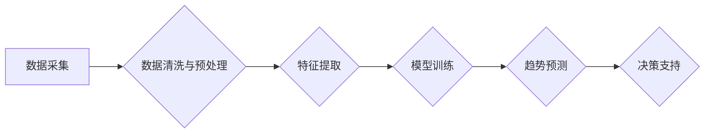

                 

## AI时尚预测软件：为时尚行业提供数据分析、预测、决策支持和趋势分析

> 关键词：人工智能、时尚预测、数据分析、趋势分析、机器学习、深度学习、时装设计

## 1. 背景介绍

时尚行业是一个充满创意和竞争的领域，它对趋势的敏锐感知和快速反应能力有着极高的要求。传统的时尚预测方法往往依赖于设计师的经验和市场调研，但这些方法往往不够准确、不够及时，难以捕捉到细微的市场变化。随着人工智能技术的快速发展，AI时尚预测软件应运而生，为时尚行业提供了一种全新的数据驱动决策工具。

AI时尚预测软件利用大数据分析、机器学习和深度学习等技术，从海量的数据中挖掘出隐藏的模式和趋势，并对未来时尚走向进行预测。它可以帮助时尚企业更好地了解消费者需求，优化产品设计，提高生产效率，降低库存风险，最终实现更高的商业效益。

## 2. 核心概念与联系

### 2.1 数据驱动决策

AI时尚预测软件的核心是数据驱动决策。它依赖于海量的数据，包括销售数据、市场调研数据、社交媒体数据、天气数据、经济数据等，通过数据分析和挖掘，发现隐藏的模式和趋势，为决策提供依据。

### 2.2 机器学习与深度学习

机器学习和深度学习是AI时尚预测软件的核心技术。机器学习算法可以从数据中学习，并根据学习到的知识对未来进行预测。深度学习算法则是一种更高级的机器学习算法，它能够学习更复杂的模式和关系。

### 2.3 趋势分析与预测

AI时尚预测软件可以对时尚趋势进行分析和预测，包括颜色、款式、面料、价格等方面。它可以帮助设计师和采购人员了解未来流行趋势，提前做好准备，避免落后于市场。

**核心概念与架构流程图**



## 3. 核心算法原理 & 具体操作步骤

### 3.1 算法原理概述

AI时尚预测软件常用的算法包括：

* **线性回归:** 用于预测连续变量，例如销售额、价格等。
* **逻辑回归:** 用于预测分类变量，例如产品是否畅销、颜色是否流行等。
* **决策树:** 用于构建决策规则，例如根据消费者特征预测购买意愿。
* **支持向量机:** 用于分类和回归，能够处理高维数据。
* **神经网络:** 用于学习复杂的模式和关系，例如图像识别、文本分析等。

### 3.2 算法步骤详解

1. **数据采集:** 收集相关数据，包括销售数据、市场调研数据、社交媒体数据、天气数据、经济数据等。
2. **数据清洗与预处理:** 清理数据中的缺失值、异常值、重复值等，并对数据进行标准化、归一化等预处理操作。
3. **特征提取:** 从原始数据中提取有价值的特征，例如颜色、款式、面料、价格、季节、地区等。
4. **模型训练:** 选择合适的算法，并使用训练数据对模型进行训练，学习数据中的模式和关系。
5. **模型评估:** 使用测试数据对模型进行评估，评估模型的准确率、召回率、F1-score等指标。
6. **模型部署:** 将训练好的模型部署到生产环境中，用于对新数据进行预测。

### 3.3 算法优缺点

不同的算法有不同的优缺点，需要根据实际情况选择合适的算法。例如，线性回归算法简单易实现，但对数据线性关系要求较高；决策树算法能够处理非线性关系，但容易过拟合；神经网络算法能够学习复杂的模式，但训练时间长，参数设置复杂。

### 3.4 算法应用领域

AI时尚预测软件的应用领域非常广泛，包括：

* **时装设计:** 预测未来流行趋势，帮助设计师设计更符合市场需求的服装。
* **产品开发:** 预测消费者对不同产品类型的需求，帮助企业优化产品开发策略。
* **采购决策:** 预测未来商品需求，帮助企业优化采购计划，降低库存风险。
* **营销推广:** 预测消费者对不同营销活动的响应，帮助企业制定更有效的营销策略。

## 4. 数学模型和公式 & 详细讲解 & 举例说明

### 4.1 数学模型构建

AI时尚预测软件常用的数学模型包括线性回归模型、逻辑回归模型、决策树模型、支持向量机模型、神经网络模型等。

**线性回归模型:**

假设我们想要预测服装销售额，我们可以使用线性回归模型，将销售额作为因变量，颜色、款式、价格等特征作为自变量。线性回归模型的数学表达式为：

$$y = \beta_0 + \beta_1x_1 + \beta_2x_2 + ... + \beta_nx_n + \epsilon$$

其中：

* $y$ 是销售额
* $x_1, x_2, ..., x_n$ 是颜色、款式、价格等特征
* $\beta_0, \beta_1, \beta_2, ..., \beta_n$ 是模型参数
* $\epsilon$ 是误差项

### 4.2 公式推导过程

线性回归模型的参数可以通过最小二乘法进行估计。最小二乘法旨在找到一组参数，使得模型预测值与实际值之间的误差平方和最小。

### 4.3 案例分析与讲解

假设我们收集了以下数据：

| 颜色 | 款式 | 价格 | 销售额 |
|---|---|---|---|
| 红色 | A | 100 | 100 |
| 蓝色 | B | 200 | 200 |
| 绿色 | A | 150 | 150 |
| 黄色 | B | 250 | 250 |

我们可以使用线性回归模型来预测销售额。通过最小二乘法估计模型参数，得到以下模型：

$$y = 50 + 50x_1 + 50x_2$$

其中：

* $x_1$ 是颜色特征（红色为1，其他颜色为0）
* $x_2$ 是款式特征（A为1，B为0）

根据这个模型，我们可以预测新产品的销售额。例如，如果新产品的颜色是蓝色，款式是B，价格是300，那么预测的销售额为：

$$y = 50 + 50 * 0 + 50 * 1 + 50 = 150$$

## 5. 项目实践：代码实例和详细解释说明

### 5.1 开发环境搭建

AI时尚预测软件的开发环境可以根据实际需求进行搭建。常用的开发工具包括Python、R、Java等编程语言，以及数据分析工具如Pandas、Scikit-learn、TensorFlow等。

### 5.2 源代码详细实现

以下是一个使用Python和Scikit-learn库实现线性回归模型的代码示例：

```python
import pandas as pd
from sklearn.linear_model import LinearRegression
from sklearn.model_selection import train_test_split

# 加载数据
data = pd.read_csv('fashion_data.csv')

# 分割数据
X = data[['颜色', '款式', '价格']]
y = data['销售额']
X_train, X_test, y_train, y_test = train_test_split(X, y, test_size=0.2, random_state=42)

# 创建线性回归模型
model = LinearRegression()

# 训练模型
model.fit(X_train, y_train)

# 预测测试数据
y_pred = model.predict(X_test)

# 评估模型性能
from sklearn.metrics import mean_squared_error
mse = mean_squared_error(y_test, y_pred)
print('均方误差:', mse)
```

### 5.3 代码解读与分析

这段代码首先加载数据，然后将数据分为训练集和测试集。接着创建线性回归模型，并使用训练集训练模型。最后使用测试集预测销售额，并评估模型性能。

### 5.4 运行结果展示

运行代码后，会输出模型的均方误差值。均方误差值越小，模型的预测精度越高。

## 6. 实际应用场景

AI时尚预测软件在时尚行业有着广泛的应用场景：

### 6.1 时装设计

AI时尚预测软件可以帮助设计师预测未来流行趋势，例如颜色、款式、面料等，从而设计更符合市场需求的服装。

### 6.2 产品开发

AI时尚预测软件可以帮助企业预测消费者对不同产品类型的需求，例如不同款式的裙子、裤子、衬衫等，从而优化产品开发策略。

### 6.3 采购决策

AI时尚预测软件可以帮助企业预测未来商品需求，例如不同颜色的T恤、不同尺码的牛仔裤等，从而优化采购计划，降低库存风险。

### 6.4 营销推广

AI时尚预测软件可以帮助企业预测消费者对不同营销活动的响应，例如广告投放、促销活动等，从而制定更有效的营销策略。

### 6.5 未来应用展望

随着人工智能技术的不断发展，AI时尚预测软件的应用场景将会更加广泛。例如，未来可以利用AI技术进行个性化服装推荐、虚拟试衣等，为消费者提供更便捷、更个性化的购物体验。

## 7. 工具和资源推荐

### 7.1 学习资源推荐

* **书籍:**
    * 《Python机器学习》
    * 《深度学习》
    * 《数据挖掘：概念与技术》
* **在线课程:**
    * Coursera
    * edX
    * Udacity

### 7.2 开发工具推荐

* **编程语言:** Python, R, Java
* **数据分析工具:** Pandas, Scikit-learn, TensorFlow
* **可视化工具:** Matplotlib, Seaborn, Plotly

### 7.3 相关论文推荐

* **深度学习在时尚预测中的应用**
* **基于机器学习的时尚趋势预测方法**
* **数据驱动时尚设计：人工智能的应用**

## 8. 总结：未来发展趋势与挑战

### 8.1 研究成果总结

AI时尚预测软件已经取得了一定的成果，能够帮助时尚企业更好地了解消费者需求，优化产品设计，提高生产效率，降低库存风险。

### 8.2 未来发展趋势

未来，AI时尚预测软件的发展趋势包括：

* **模型精度提升:** 采用更先进的机器学习算法和深度学习模型，提高预测精度。
* **数据融合:** 将更多类型的數據融合到模型中，例如社交媒体数据、天气数据、经济数据等，提高预测的准确性和全面性。
* **个性化定制:** 利用AI技术进行个性化服装推荐、虚拟试衣等，为消费者提供更便捷、更个性化的购物体验。

### 8.3 面临的挑战

AI时尚预测软件的发展也面临着一些挑战：

* **数据质量:** 

时尚行业的数据往往是分散的、不完整的、格式不统一的，需要进行大量的清洗和预处理工作。
* **模型 interpretability:** 

许多深度学习模型是黑箱模型，难以解释模型的决策过程，这对于时尚行业来说是一个重要的挑战。
* **伦理问题:** 

AI技术的发展也带来了伦理问题，例如数据隐私、算法偏见等，需要引起足够的重视。

### 8.4 研究展望

未来，我们需要继续加强对AI时尚预测软件的研究，解决上述挑战，推动其在时尚行业的应用，为时尚行业带来更大的价值。

## 9. 附录：常见问题与解答

### 9.1 如何选择合适的算法？

选择合适的算法需要根据实际情况进行判断，例如数据类型、数据规模、预测目标等。

### 9.2 如何处理数据缺失值？

常用的处理数据缺失值的方法包括删除缺失值、用均值或中位数填充缺失值、使用机器学习算法进行预测填充等。

### 9.3 如何评估模型性能？

常用的评估模型性能的方法包括均方误差、平均绝对误差、R-squared等。

### 9.4 如何部署AI时尚预测软件？

AI时尚预测软件可以部署到云端、本地服务器或移动设备上，具体部署方式需要根据实际情况进行选择。


作者：禅与计算机程序设计艺术 / Zen and the Art of Computer Programming 
<end_of_turn>

