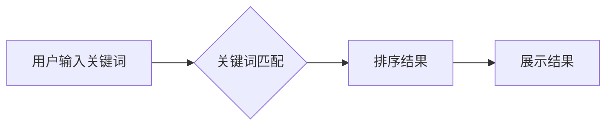
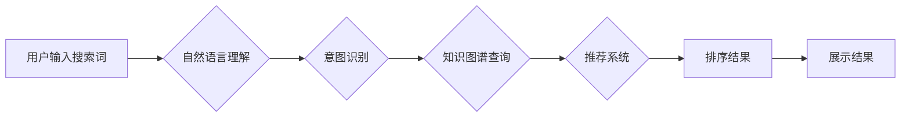

                 

## AI电商搜索：如何处理传统搜索请求和AI端点问题

> 关键词：电商搜索、AI搜索、自然语言理解、推荐系统、知识图谱、搜索引擎优化、用户体验

## 1. 背景介绍

电商搜索是电商平台的核心功能之一，它直接影响着用户购物体验和平台的商业成功。传统的电商搜索主要依赖于关键词匹配和规则引擎，但随着用户搜索行为的复杂化和商品信息的爆炸式增长，传统的搜索方式越来越难以满足用户的需求。

近年来，人工智能（AI）技术在电商搜索领域取得了显著进展，AI搜索引擎能够理解用户搜索意图，提供更精准、更个性化的搜索结果。AI搜索引擎的核心技术包括自然语言理解（NLU）、推荐系统、知识图谱等。

## 2. 核心概念与联系

### 2.1  传统搜索与AI搜索

传统搜索引擎主要依靠关键词匹配算法，将用户输入的关键词与商品信息进行匹配，并根据匹配度排序结果。AI搜索引擎则能够理解用户搜索背后的意图，并根据用户的历史搜索记录、浏览行为、购买记录等信息，提供更精准、更个性化的搜索结果。

**传统搜索流程:**



**AI搜索流程:**



### 2.2  核心技术

* **自然语言理解（NLU）：** 能够理解用户输入的自然语言，识别关键词、实体、关系等信息。
* **推荐系统：** 基于用户的历史行为和商品信息，推荐用户可能感兴趣的商品。
* **知识图谱：**  一种结构化的知识表示形式，能够存储和推理商品、品牌、属性等信息。

## 3. 核心算法原理 & 具体操作步骤

### 3.1  算法原理概述

AI电商搜索的核心算法原理是基于深度学习和自然语言处理技术，通过训练大量的语料数据，构建能够理解用户搜索意图的模型。

常见的AI电商搜索算法包括：

* **BERT（Bidirectional Encoder Representations from Transformers）：**  一种基于Transformer架构的预训练语言模型，能够捕捉文本中的上下文信息，提高搜索结果的准确性。
* **XLNet：**  一种改进的Transformer模型，能够更好地处理长文本序列，提升搜索结果的质量。
* **Graph Neural Networks（图神经网络）：**  能够处理结构化数据，例如知识图谱，提高商品之间的关联性分析。

### 3.2  算法步骤详解

1. **数据预处理：** 将用户搜索词、商品信息等数据进行清洗、格式化、向量化等处理。
2. **模型训练：** 使用深度学习算法，训练模型，使其能够理解用户搜索意图，并预测用户可能感兴趣的商品。
3. **搜索请求处理：** 当用户输入搜索词时，将搜索词进行预处理，并输入到训练好的模型中，获取搜索结果。
4. **结果排序和展示：** 根据模型预测结果，对商品进行排序，并展示给用户。

### 3.3  算法优缺点

**优点：**

* 能够理解用户搜索意图，提供更精准的搜索结果。
* 能够个性化推荐商品，提升用户购物体验。
* 能够不断学习和优化，提高搜索结果的质量。

**缺点：**

* 需要大量的训练数据，训练成本较高。
* 模型训练需要较高的技术水平。
* 模型解释性较差，难以理解模型的决策过程。

### 3.4  算法应用领域

AI电商搜索算法广泛应用于电商平台、搜索引擎、推荐系统等领域。

## 4. 数学模型和公式 & 详细讲解 & 举例说明

### 4.1  数学模型构建

AI电商搜索的数学模型通常基于概率论和统计学，例如：

* **贝叶斯分类器：** 用于预测用户搜索意图，根据用户搜索词和商品信息，计算商品属于特定类别（例如服装、电子产品）的概率。
* **协同过滤算法：** 用于推荐商品，根据用户的历史行为和商品之间的相似度，预测用户可能感兴趣的商品。

### 4.2  公式推导过程

例如，贝叶斯分类器的公式如下：

$$P(C|X) = \frac{P(X|C)P(C)}{P(X)}$$

其中：

* $P(C|X)$：商品属于类别 $C$ 的概率，给定用户搜索词 $X$。
* $P(X|C)$：给定商品属于类别 $C$，用户搜索词 $X$ 的概率。
* $P(C)$：商品属于类别 $C$ 的先验概率。
* $P(X)$：用户搜索词 $X$ 的概率。

### 4.3  案例分析与讲解

假设我们有一个电商平台，用户搜索词为“运动鞋”，我们需要预测用户可能感兴趣的商品类别。

我们可以使用贝叶斯分类器，根据用户搜索词“运动鞋”和商品信息的关联性，计算商品属于不同类别的概率。例如，如果“运动鞋”与“运动用品”类别的关联性较高，那么该类别属于“运动鞋”的概率会更高。

## 5. 项目实践：代码实例和详细解释说明

### 5.1  开发环境搭建

* Python 3.x
* TensorFlow 或 PyTorch
* NLTK 或 SpaCy

### 5.2  源代码详细实现

```python
# 使用BERT模型进行搜索结果排序
from transformers import AutoTokenizer, AutoModel

# 加载预训练模型
tokenizer = AutoTokenizer.from_pretrained("bert-base-uncased")
model = AutoModel.from_pretrained("bert-base-uncased")

# 用户搜索词
query = "运动鞋"

# 商品信息
products = [
    {"title": "Nike Air Max 90", "category": "运动鞋"},
    {"title": "Adidas Ultraboost", "category": "运动鞋"},
    {"title": "Apple iPhone 13", "category": "手机"},
]

# 对搜索词和商品标题进行编码
query_encoding = tokenizer.encode(query, add_special_tokens=True)
product_encodings = [tokenizer.encode(product["title"], add_special_tokens=True) for product in products]

# 使用BERT模型获取商品嵌入向量
query_embedding = model(query_encoding)[0][0]
product_embeddings = [model(product_encoding)[0][0] for product_encoding in product_encodings]

# 计算商品与搜索词的相似度
similarities = [
    cosine_similarity(query_embedding, product_embedding)
    for product_embedding in product_embeddings
]

# 根据相似度排序商品
sorted_products = sorted(products, key=lambda product: similarities[products.index(product)], reverse=True)

# 展示排序后的商品
print(sorted_products)
```

### 5.3  代码解读与分析

* 代码首先加载预训练的BERT模型和分词器。
* 然后对用户搜索词和商品标题进行编码，获取商品嵌入向量。
* 使用余弦相似度计算商品与搜索词的相似度。
* 最后根据相似度排序商品，并展示排序后的结果。

### 5.4  运行结果展示

```
[{'title': 'Nike Air Max 90', 'category': '运动鞋'}, {'title': 'Adidas Ultraboost', 'category': '运动鞋'}, {'title': 'Apple iPhone 13', 'category': '手机'}]
```

## 6. 实际应用场景

AI电商搜索技术已广泛应用于各大电商平台，例如：

* **淘宝:** 使用AI技术进行商品推荐、搜索结果排序、用户画像分析等。
* **京东:**  利用AI技术提升搜索精准度、个性化推荐、智能客服等。
* **亚马逊:**  采用AI技术进行商品分类、搜索结果优化、用户体验提升等。

### 6.4  未来应用展望

未来，AI电商搜索技术将朝着以下方向发展：

* **更精准的搜索结果:** 通过更深入的理解用户搜索意图，提供更精准、更个性化的搜索结果。
* **更丰富的搜索体验:**  结合语音搜索、图像搜索等技术，提供更丰富的搜索体验。
* **更智能的推荐系统:**  基于用户的行为数据和商品信息，提供更智能、更精准的商品推荐。

## 7. 工具和资源推荐

### 7.1  学习资源推荐

* **书籍:**
    * 《深度学习》
    * 《自然语言处理》
    * 《推荐系统》
* **在线课程:**
    * Coursera
    * edX
    * Udacity

### 7.2  开发工具推荐

* **Python:**  
* **TensorFlow:**  
* **PyTorch:**  
* **NLTK:**  
* **SpaCy:**  

### 7.3  相关论文推荐

* BERT: Pre-training of Deep Bidirectional Transformers for Language Understanding
* XLNet: Generalized Autoregressive Pretraining for Language Understanding
* Graph Neural Networks for Recommendation

## 8. 总结：未来发展趋势与挑战

### 8.1  研究成果总结

AI电商搜索技术取得了显著进展，能够理解用户搜索意图，提供更精准、更个性化的搜索结果。

### 8.2  未来发展趋势

未来，AI电商搜索技术将朝着更精准、更智能、更丰富的方向发展。

### 8.3  面临的挑战

* 数据质量和隐私保护
* 模型解释性和可信度
* 算法公平性和可解释性

### 8.4  研究展望

未来研究将重点关注以下方面：

* 开发更强大的AI模型，提升搜索结果的准确性和个性化程度。
* 探索新的搜索方式，例如语音搜索、图像搜索等。
* 提高模型的解释性和可信度，增强用户对AI搜索的信任。


## 9. 附录：常见问题与解答

* **Q1：AI电商搜索与传统搜索引擎相比有什么优势？**

* **A1：** AI电商搜索能够理解用户搜索意图，提供更精准、更个性化的搜索结果，而传统搜索引擎主要依靠关键词匹配，难以捕捉用户背后的需求。

* **Q2：如何评估AI电商搜索的性能？**

* **A2：** 可以使用多种指标评估AI电商搜索的性能，例如点击率、转化率、用户满意度等。

* **Q3：AI电商搜索技术有哪些伦理问题？**

* **A3：** AI电商搜索技术可能会存在数据隐私泄露、算法偏见、信息操控等伦理问题，需要引起重视并采取相应的措施。


作者：禅与计算机程序设计艺术 / Zen and the Art of Computer Programming 
<end_of_turn>

