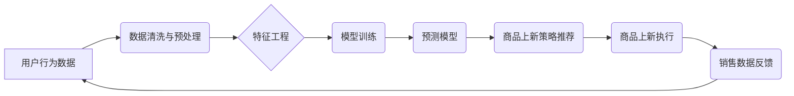

                 

## AI驱动的电商平台商品上新策略

> 关键词：电商平台、商品上新、人工智能、预测模型、推荐系统、数据分析、机器学习、深度学习

## 1. 背景介绍

在当今竞争激烈的电商市场，商品上新策略是电商平台的核心竞争力之一。传统的商品上新策略往往依赖于人工经验和市场调研，效率低下，难以精准把握用户需求。随着人工智能技术的快速发展，AI驱动的商品上新策略逐渐成为行业趋势，为电商平台带来了新的机遇。

AI驱动的商品上新策略利用大数据分析、机器学习等技术，从海量用户数据中挖掘潜在需求，预测商品热度，优化商品上新时间、渠道和推广策略，从而提高商品销售转化率，提升用户体验。

## 2. 核心概念与联系

### 2.1  核心概念

* **商品上新策略:** 指电商平台为新商品发布制定的一系列计划和措施，包括商品选择、上新时间、价格策略、推广方式等。
* **人工智能 (AI):**  模拟人类智能的计算机系统，能够学习、推理、决策等。
* **机器学习 (ML):**  人工智能的一种实现方式，通过算法训练模型，使模型能够从数据中学习规律，并进行预测或分类。
* **深度学习 (DL):**  机器学习的一种高级形式，利用多层神经网络模拟人类大脑的学习过程，能够处理更复杂的数据和任务。
* **数据分析:**  通过收集、整理、分析数据，发现数据背后的规律和趋势。

### 2.2  架构图



## 3. 核心算法原理 & 具体操作步骤

### 3.1  算法原理概述

AI驱动的商品上新策略主要基于机器学习算法，通过训练模型预测商品的潜在热度和销售潜力。常用的算法包括：

* **线性回归:**  用于预测连续数值，例如商品销量。
* **逻辑回归:**  用于预测分类结果，例如商品是否会成为爆款。
* **决策树:**  用于根据一系列规则对商品进行分类和预测。
* **支持向量机 (SVM):**  用于寻找最佳分类超平面，提高分类精度。
* **神经网络:**  能够处理复杂数据关系，预测更精准的结果。

### 3.2  算法步骤详解

1. **数据收集:** 收集用户行为数据，例如浏览记录、购买记录、评价数据、购物车数据等。
2. **数据清洗与预处理:**  去除数据中的噪声、缺失值和重复数据，并将数据转换为模型可识别的格式。
3. **特征工程:**  从原始数据中提取特征，例如商品类别、价格、品牌、用户画像等，这些特征能够帮助模型更好地理解商品和用户需求。
4. **模型训练:**  选择合适的机器学习算法，利用训练数据训练模型，并评估模型的性能。
5. **模型部署:** 将训练好的模型部署到线上环境，用于实时预测商品热度和销售潜力。
6. **策略优化:**  根据模型预测结果，优化商品上新策略，例如调整上新时间、价格策略、推广方式等。

### 3.3  算法优缺点

| 算法 | 优点 | 缺点 |
|---|---|---|
| 线性回归 | 简单易懂，计算效率高 | 难以处理非线性关系 |
| 逻辑回归 | 适用于分类问题，解释性强 | 难以处理高维数据 |
| 决策树 | 能够处理非线性关系，解释性强 | 容易过拟合 |
| 支持向量机 | 能够处理高维数据，泛化能力强 | 计算复杂度高 |
| 神经网络 | 能够处理复杂数据关系，预测精度高 | 训练时间长，参数众多 |

### 3.4  算法应用领域

AI驱动的商品上新策略广泛应用于电商平台、零售企业、品牌商等领域，例如：

* **商品推荐:**  根据用户行为数据，推荐用户可能感兴趣的商品。
* **新品上新预测:**  预测新品的销售潜力，优化上新时间和策略。
* **库存管理:**  根据预测销量，优化库存水平，避免缺货或积压。
* **价格优化:**  根据市场需求和竞争对手价格，优化商品价格。

## 4. 数学模型和公式 & 详细讲解 & 举例说明

### 4.1  数学模型构建

商品上新策略预测模型通常采用回归模型，例如线性回归模型。线性回归模型假设商品销量与特征变量之间存在线性关系，可以用以下公式表示：

$$
y = \beta_0 + \beta_1x_1 + \beta_2x_2 + ... + \beta_nx_n + \epsilon
$$

其中：

* $y$：商品销量
* $x_1, x_2, ..., x_n$：特征变量，例如商品价格、品牌、类别等
* $\beta_0, \beta_1, ..., \beta_n$：模型参数，需要通过训练数据进行估计
* $\epsilon$：随机误差项

### 4.2  公式推导过程

线性回归模型的目标是找到最佳的模型参数，使模型预测的销量与实际销量之间的误差最小化。常用的损失函数是均方误差 (MSE)，定义如下：

$$
MSE = \frac{1}{n}\sum_{i=1}^{n}(y_i - \hat{y}_i)^2
$$

其中：

* $n$：样本数量
* $y_i$：第 $i$ 个样本的实际销量
* $\hat{y}_i$：第 $i$ 个样本的预测销量

通过最小化 MSE，可以得到最佳的模型参数。常用的优化算法包括梯度下降法。

### 4.3  案例分析与讲解

假设我们想要预测一款新手机的销量，收集了以下特征数据：

* 价格：2999 元
* 品牌：小米
* 类别：智能手机
* 屏幕尺寸：6.67 英寸

我们可以使用线性回归模型，根据历史数据训练模型，并利用训练好的模型预测这款新手机的销量。

## 5. 项目实践：代码实例和详细解释说明

### 5.1  开发环境搭建

* Python 3.x
* Jupyter Notebook
* scikit-learn 机器学习库
* pandas 数据处理库
* matplotlib 数据可视化库

### 5.2  源代码详细实现

```python
import pandas as pd
from sklearn.linear_model import LinearRegression
from sklearn.model_selection import train_test_split
from sklearn.metrics import mean_squared_error

# 加载数据
data = pd.read_csv('商品数据.csv')

# 选择特征变量和目标变量
X = data[['价格', '品牌', '类别', '屏幕尺寸']]
y = data['销量']

# 将数据分成训练集和测试集
X_train, X_test, y_train, y_test = train_test_split(X, y, test_size=0.2, random_state=42)

# 创建线性回归模型
model = LinearRegression()

# 训练模型
model.fit(X_train, y_train)

# 预测测试集销量
y_pred = model.predict(X_test)

# 计算均方误差
mse = mean_squared_error(y_test, y_pred)
print('均方误差:', mse)

# 可视化预测结果
import matplotlib.pyplot as plt
plt.scatter(y_test, y_pred)
plt.xlabel('实际销量')
plt.ylabel('预测销量')
plt.title('预测结果可视化')
plt.show()
```

### 5.3  代码解读与分析

* 首先，我们加载数据，选择特征变量和目标变量。
* 然后，我们将数据分成训练集和测试集，用于训练和评估模型。
* 创建线性回归模型，并使用训练数据训练模型。
* 训练完成后，我们可以使用模型预测测试集的销量。
* 最后，我们计算均方误差，并可视化预测结果。

### 5.4  运行结果展示

运行代码后，会输出均方误差值，以及预测结果的可视化图。均方误差值越小，模型预测的精度越高。

## 6. 实际应用场景

AI驱动的商品上新策略在电商平台的实际应用场景非常广泛，例如：

* **新品上新推荐:**  根据用户画像和历史购买数据，推荐平台上新商品，提高用户转化率。
* **商品分类优化:**  利用机器学习算法对商品进行分类，提高商品搜索和推荐的精准度。
* **价格动态调整:**  根据市场需求和竞争对手价格，动态调整商品价格，提高利润率。
* **库存管理优化:**  预测商品销量，优化库存水平，避免缺货或积压。

### 6.4  未来应用展望

随着人工智能技术的不断发展，AI驱动的商品上新策略将更加智能化、个性化和精准化。未来，我们可能会看到以下应用场景：

* **个性化商品推荐:**  根据用户的兴趣爱好、购买习惯等个性化信息，推荐更精准的商品。
* **预测性维护:**  利用机器学习算法预测商品的潜在问题，提前进行维护，避免商品出现故障。
* **智能化决策支持:**  为电商平台决策者提供数据驱动的决策支持，帮助他们制定更有效的商品上新策略。

## 7. 工具和资源推荐

### 7.1  学习资源推荐

* **书籍:**
    * 《Python机器学习》
    * 《深度学习》
    * 《数据挖掘：概念与技术》
* **在线课程:**
    * Coursera: 机器学习
    * edX: 深度学习
    * Udacity: 数据科学

### 7.2  开发工具推荐

* **Python:**  通用编程语言，广泛应用于数据科学和机器学习领域。
* **Jupyter Notebook:**  交互式编程环境，方便进行数据分析和模型开发。
* **scikit-learn:**  Python机器学习库，提供各种机器学习算法和工具。
* **pandas:**  Python数据处理库，用于数据清洗、转换和分析。
* **matplotlib:**  Python数据可视化库，用于生成各种图表和图形。

### 7.3  相关论文推荐

* **《Collaborative Filtering for Recommender Systems》**
* **《Deep Learning for Recommender Systems》**
* **《A Survey on Deep Learning for Recommender Systems》**

## 8. 总结：未来发展趋势与挑战

### 8.1  研究成果总结

AI驱动的商品上新策略已经取得了显著的成果，能够有效提高商品销售转化率，提升用户体验。

### 8.2  未来发展趋势

* **更精准的预测:**  利用更先进的机器学习算法和数据分析技术，提高商品销量预测的精准度。
* **更个性化的推荐:**  根据用户的兴趣爱好、购买习惯等个性化信息，推荐更精准的商品。
* **更智能化的决策支持:**  为电商平台决策者提供数据驱动的决策支持，帮助他们制定更有效的商品上新策略。

### 8.3  面临的挑战

* **数据质量:**  AI模型的性能依赖于数据质量，需要不断提高数据收集、清洗和预处理的效率。
* **算法复杂度:**  一些先进的机器学习算法计算复杂度高，需要更高效的计算资源。
* **解释性:**  一些深度学习模型的决策过程难以解释，需要开发更可解释的模型。

### 8.4  研究展望

未来，AI驱动的商品上新策略将继续朝着更智能化、个性化和精准化的方向发展，为电商平台带来更大的价值。


## 9. 附录：常见问题与解答

**Q1:  AI驱动的商品上新策略需要哪些数据？**

**A1:**  AI驱动的商品上新策略需要收集用户行为数据，例如浏览记录、购买记录、评价数据、购物车数据等，以及商品信息数据，例如价格、品牌、类别、属性等。

**Q2:  如何评估AI驱动的商品上新策略的性能？**

**A2:**  常用的评估指标包括均方误差 (MSE)、平均绝对误差 (MAE) 和 R-squared 等。

**Q3:  AI驱动的商品上新策略有哪些应用场景？**

**A3:**  AI驱动的商品上新策略广泛应用于电商平台、零售企业、品牌商等领域，例如新品上新推荐、商品分类优化、价格动态调整、库存管理优化等。


作者：禅与计算机程序设计艺术 / Zen and the Art of Computer Programming 
<end_of_turn>

