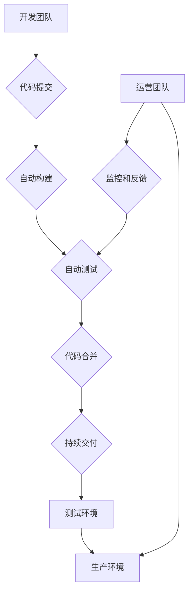

                 

## DevOps 文化：理解开发和运营的结合

> 关键词：DevOps, 持续集成, 持续交付, 敏捷开发, 协作文化, 自动化, 监控

### 1. 背景介绍

在当今快速迭代的软件开发环境中，传统的开发和运营模式已经难以满足业务需求。开发团队专注于快速构建新功能，而运营团队则负责部署和维护系统稳定性。这种分隔导致沟通障碍、流程冗长、交付周期长，最终影响了软件产品的质量和时间到市场的速度。

DevOps 文化应运而生，旨在打破开发和运营之间的壁垒，实现协作、自动化和持续交付。它强调将开发和运营流程紧密结合，共同承担软件生命周期的所有环节，从代码编写到部署、监控和维护。

### 2. 核心概念与联系

DevOps 文化的核心概念包括：

* **持续集成 (Continuous Integration):** 开发人员频繁将代码提交到共享代码库，并自动构建和测试代码，确保代码质量和稳定性。
* **持续交付 (Continuous Delivery):** 将构建好的软件自动部署到测试环境和生产环境，实现快速交付和迭代。
* **自动化:** 通过自动化工具和脚本，简化和加速软件开发和运营流程，减少人为错误和重复工作。
* **监控和反馈:** 实时监控系统运行状态，收集用户反馈，并根据反馈进行改进和优化。
* **协作文化:** 鼓励开发人员和运营人员之间的沟通和协作，共同承担责任，共同提升软件产品质量。

DevOps 文化的实现需要从组织文化、流程和工具三个方面进行改变。



### 3. 核心算法原理 & 具体操作步骤

DevOps 文化的核心算法原理是基于敏捷开发理念，强调迭代开发、快速反馈和持续改进。

#### 3.1 算法原理概述

DevOps 算法的核心在于将软件开发和运营流程进行自动化和集成，实现快速、高效、可靠的软件交付。

#### 3.2 算法步骤详解

1. **代码提交:** 开发人员将代码提交到共享代码库，触发自动构建和测试流程。
2. **自动构建:** 构建工具自动下载代码、编译代码、生成可执行文件等。
3. **自动测试:** 测试工具自动执行单元测试、集成测试、系统测试等，确保代码质量和稳定性。
4. **代码合并:** 通过代码审查和合并工具，将测试通过的代码合并到主分支。
5. **持续交付:** 将构建好的软件自动部署到测试环境和生产环境，实现快速交付和迭代。
6. **监控和反馈:** 实时监控系统运行状态，收集用户反馈，并根据反馈进行改进和优化。

#### 3.3 算法优缺点

**优点:**

* **提高开发效率:** 自动化流程简化了开发工作，提高了开发效率。
* **提高软件质量:** 自动测试和持续集成确保了代码质量和稳定性。
* **缩短交付周期:** 持续交付和自动化部署缩短了软件交付周期。
* **提高团队协作:** DevOps 文化鼓励开发人员和运营人员之间的沟通和协作。

**缺点:**

* **需要投入时间和资源:** 建立 DevOps 文化需要投入时间和资源进行流程和工具的调整。
* **需要改变组织文化:** DevOps 文化需要改变传统的开发和运营模式，需要组织文化和人员观念的转变。
* **需要技术支持:** DevOps 需要使用各种自动化工具和技术，需要具备相应的技术支持。

#### 3.4 算法应用领域

DevOps 文化适用于所有需要快速迭代、持续交付软件的领域，例如：

* 软件开发
* Web 开发
* 移动应用开发
* 云计算
* 大数据

### 4. 数学模型和公式 & 详细讲解 & 举例说明

DevOps 文化的实现可以借助数学模型和公式进行量化分析和优化。例如，可以使用以下公式来衡量软件交付速度：

$$
Lead Time = Time to Deploy - Time to Commit
$$

其中：

* Lead Time: 软件交付时间
* Time to Deploy: 部署到生产环境的时间
* Time to Commit: 代码提交到代码库的时间

通过分析 Lead Time 的变化趋势，可以了解软件交付速度的提升情况。

### 5. 项目实践：代码实例和详细解释说明

#### 5.1 开发环境搭建

DevOps 项目的开发环境搭建需要包含以下组件:

* 代码库管理系统 (例如 Git)
* 构建工具 (例如 Jenkins, Maven, Gradle)
* 测试工具 (例如 JUnit, Selenium)
* 部署工具 (例如 Ansible, Docker)
* 监控工具 (例如 Prometheus, Grafana)

#### 5.2 源代码详细实现

以下是一个简单的 DevOps 项目代码实例，使用 Java 语言开发一个简单的 Web 应用，并使用 Jenkins 进行自动化构建和部署:

```java
// HelloWorld.java
public class HelloWorld {
    public static void main(String[] args) {
        System.out.println("Hello, World!");
    }
}
```

#### 5.3 代码解读与分析

* HelloWorld.java 是一个简单的 Java 类，包含一个 main 方法，打印 "Hello, World!" 到控制台。

#### 5.4 运行结果展示

在 Jenkins 中配置构建和部署任务，可以自动编译、测试和部署 HelloWorld 应用到测试环境和生产环境。

### 6. 实际应用场景

DevOps 文化在各个行业都有广泛的应用场景，例如：

* **金融行业:** 提高金融系统的稳定性和安全性，加速新产品的开发和发布。
* **电商行业:** 提高电商平台的可用性和性能，优化用户体验。
* **医疗行业:** 提高医疗系统的可靠性和安全性，加速医疗技术的创新和应用。

### 7. 工具和资源推荐

#### 7.1 学习资源推荐

* **书籍:**

    * The Phoenix Project: A Novel About IT, DevOps, and Helping Your Business Win
    * DevOps Handbook: How to Create World-Class Agility, Reliability, and Security in Technology Organizations
    * Accelerate: The Science of Lean Software and DevOps: Building and Scaling High Performing Technology Organizations

* **网站:**

    * DevOps.com
    * The DevOps Institute
    * Atlassian DevOps

#### 7.2 开发工具推荐

* **代码库管理:** Git, GitHub, Bitbucket
* **构建工具:** Jenkins, Maven, Gradle
* **测试工具:** JUnit, Selenium, Cucumber
* **部署工具:** Ansible, Docker, Kubernetes
* **监控工具:** Prometheus, Grafana, Datadog

#### 7.3 相关论文推荐

* The DevOps Handbook: How to Create World-Class Agility, Reliability, and Security in Technology Organizations
* Accelerate: The Science of Lean Software and DevOps: Building and Scaling High Performing Technology Organizations
* Building Microservices: Designing Fine-Grained Systems

### 8. 总结：未来发展趋势与挑战

#### 8.1 研究成果总结

DevOps 文化已经取得了显著的成果，提高了软件开发效率、软件质量和交付速度。

#### 8.2 未来发展趋势

* **人工智能 (AI) 和机器学习 (ML) 的应用:** AI 和 ML 可以用于自动化更多 DevOps 环节，例如代码审查、故障诊断和性能优化。
* **云原生开发:** 云原生开发强调在云环境中构建和部署软件，DevOps 文化将与云原生开发更加紧密结合。
* **安全DevOps:** 将安全纳入 DevOps 流程，实现全生命周期安全保障。

#### 8.3 面临的挑战

* **组织文化转变:** DevOps 文化需要改变传统的开发和运营模式，需要组织文化和人员观念的转变。
* **技术复杂性:** DevOps 需要使用各种自动化工具和技术，需要具备相应的技术支持。
* **人才短缺:** DevOps 领域人才短缺，需要加强人才培养和引进。

#### 8.4 研究展望

未来 DevOps 研究将更加注重 AI 和 ML 的应用，云原生开发的实践，以及安全DevOps 的探索。


### 9. 附录：常见问题与解答

* **什么是 DevOps?** DevOps 是开发 (Development) 和运维 (Operations) 的结合，旨在通过自动化、协作和持续交付，提高软件开发效率和软件质量。
* **DevOps 的优势是什么?** DevOps 的优势包括提高开发效率、提高软件质量、缩短交付周期、提高团队协作。
* **如何实施 DevOps?** 实施 DevOps 需要从组织文化、流程和工具三个方面进行改变。

作者：禅与计算机程序设计艺术 / Zen and the Art of Computer Programming


<end_of_turn>

