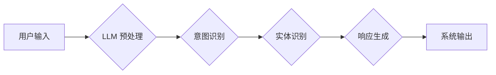

                 

## LLM与人类意图的最优契合探索

> 关键词：大型语言模型 (LLM)、人类意图、自然语言理解 (NLU)、对话系统、机器学习、深度学习、文本生成、意图识别、实体识别

## 1. 背景介绍

大型语言模型 (LLM) 近年来取得了令人瞩目的进展，展现出强大的文本生成、翻译、摘要和问答能力。这些模型通过训练海量文本数据，学习了语言的复杂结构和语义关系，能够生成逼真、流畅的文本。然而，LLM 的核心目标并非仅仅是生成文本，而是更深入地理解人类意图，并提供精准、有意义的响应。

人类意图是指用户在与系统交互时所表达的真实需求或目标。理解人类意图是构建有效对话系统的关键，因为它决定了系统如何解读用户输入，并提供相应的解决方案。传统的自然语言理解 (NLU) 系统通常依赖于规则和特征工程，但随着语言的复杂性和多样性不断增加，这些方法逐渐显得不足。

LLM 的出现为理解人类意图提供了新的可能性。其强大的语义理解能力和文本生成能力使其能够更好地捕捉用户意图的细微差别，并生成更自然、更符合用户需求的响应。

## 2. 核心概念与联系

### 2.1  LLM 与 NLU 的关系

LLM 和 NLU 紧密相连，LLM 可以看作是 NLU 的一种新型实现方式。

传统的 NLU 系统通常包含以下几个步骤：

1. **词性标注:** 将文本中的每个词标记为相应的词性，例如名词、动词、形容词等。
2. **依存句法分析:** 分析句子结构，确定每个词与其他词之间的关系。
3. **实体识别:** 识别文本中的关键实体，例如人名、地名、组织名称等。
4. **意图识别:** 根据文本内容，识别用户表达的意图，例如查询信息、预订服务、进行交易等。

LLM 可以直接学习这些任务，无需人工设计复杂的规则和特征。其强大的语义理解能力使其能够更好地捕捉文本中的上下文信息，从而提高意图识别的准确率。

**Mermaid 流程图:**



### 2.2  人类意图的复杂性

人类意图的表达方式多种多样，并且往往包含着隐含的含义和上下文信息。理解人类意图是一个非常复杂的任务，需要考虑以下几个方面：

1. **语言的歧义性:** 许多词语和短语具有多种含义，需要根据上下文才能确定其准确含义。
2. **隐含信息:** 人类常常使用暗示、比喻和幽默等方式表达意图，这些信息并非直接明示。
3. **情感和态度:** 用户的语气、情感和态度也会影响意图的表达，需要考虑这些因素才能准确理解用户意图。
4. **文化背景:** 不同文化背景的人们表达意图的方式可能存在差异，需要考虑文化因素才能更好地理解用户意图。

## 3. 核心算法原理 & 具体操作步骤

### 3.1  算法原理概述

LLM 的核心算法是基于深度学习的 Transformer 架构。Transformer 模型通过自注意力机制学习文本中的长距离依赖关系，能够捕捉文本的全局语义信息。

LLM 的训练过程是通过大量的文本数据进行监督学习。模型会学习将输入文本映射到相应的输出文本，例如完成文本生成、翻译、摘要等任务。

### 3.2  算法步骤详解

1. **数据预处理:** 将原始文本数据进行清洗、分词、标记等预处理操作，使其能够被模型理解。
2. **模型训练:** 使用训练数据训练 Transformer 模型，通过反向传播算法不断调整模型参数，使其能够生成更准确的输出文本。
3. **模型评估:** 使用测试数据评估模型的性能，例如计算准确率、困惑度等指标。
4. **模型调优:** 根据评估结果，调整模型参数、训练策略等，以提高模型性能。

### 3.3  算法优缺点

**优点:**

* 强大的语义理解能力
* 能够捕捉文本中的长距离依赖关系
* 训练数据量大，泛化能力强

**缺点:**

* 训练成本高，需要大量的计算资源
* 容易受到训练数据偏差的影响
* 缺乏对真实世界知识的理解

### 3.4  算法应用领域

* **对话系统:** 构建更自然、更智能的对话系统，例如聊天机器人、虚拟助手等。
* **文本生成:** 生成高质量的文本内容，例如文章、故事、诗歌等。
* **机器翻译:** 实现更准确、更流畅的机器翻译。
* **问答系统:** 构建能够回答复杂问题的问答系统。

## 4. 数学模型和公式 & 详细讲解 & 举例说明

### 4.1  数学模型构建

LLM 的核心数学模型是 Transformer 架构，其主要由以下几个部分组成：

* **编码器:** 将输入文本序列编码成一个固定长度的向量表示。
* **解码器:** 根据编码器输出的向量表示，生成输出文本序列。
* **自注意力机制:** 用于捕捉文本中的长距离依赖关系。

### 4.2  公式推导过程

Transformer 模型的训练目标是最大化输出文本序列的似然概率。

$$
P(y_1, y_2, ..., y_T | x_1, x_2, ..., x_S)
$$

其中，$x_1, x_2, ..., x_S$ 是输入文本序列，$y_1, y_2, ..., y_T$ 是输出文本序列。

为了实现这个目标，Transformer 模型使用交叉熵损失函数。

$$
Loss = - \sum_{t=1}^{T} log P(y_t | y_{<t}, x)
$$

其中，$y_{<t}$ 表示输出序列的前 $t-1$ 个词。

### 4.3  案例分析与讲解

例如，在机器翻译任务中，输入文本序列是英文句子，输出文本序列是对应的中文句子。Transformer 模型会学习将英文句子编码成一个向量表示，然后根据这个向量表示生成对应的中文句子。

## 5. 项目实践：代码实例和详细解释说明

### 5.1  开发环境搭建

* Python 3.7+
* PyTorch 或 TensorFlow
* CUDA 和 cuDNN (可选)

### 5.2  源代码详细实现

```python
# 导入必要的库
import torch
import torch.nn as nn

# 定义 Transformer 模型
class Transformer(nn.Module):
    def __init__(self, vocab_size, embedding_dim, num_heads, num_layers):
        super(Transformer, self).__init__()
        # ... (模型结构定义)

    def forward(self, x):
        # ... (模型前向传播过程)

# 实例化模型
model = Transformer(vocab_size=10000, embedding_dim=512, num_heads=8, num_layers=6)

# 定义优化器和损失函数
optimizer = torch.optim.Adam(model.parameters())
loss_fn = nn.CrossEntropyLoss()

# ... (训练模型)
```

### 5.3  代码解读与分析

* Transformer 模型的结构由编码器和解码器组成，每个部分包含多个 Transformer 层。
* Transformer 层包含自注意力机制、前馈神经网络等模块，用于学习文本的语义关系和上下文信息。
* 模型的训练过程是通过反向传播算法不断调整模型参数，使其能够生成更准确的输出文本。

### 5.4  运行结果展示

* 在测试集上评估模型的性能，例如计算准确率、困惑度等指标。
* 使用模型生成文本，并展示生成的文本质量。

## 6. 实际应用场景

### 6.1  聊天机器人

LLM 可以用于构建更智能、更自然的聊天机器人，能够理解用户的意图，并提供更精准、更有针对性的回复。

### 6.2  虚拟助手

LLM 可以用于构建虚拟助手，帮助用户完成各种任务，例如设置提醒、查询天气、预订酒店等。

### 6.3  客服系统

LLM 可以用于构建客服系统，自动处理用户咨询，提高客服效率。

### 6.4  未来应用展望

LLM 的应用场景非常广泛，未来还将有更多新的应用场景出现，例如：

* **个性化教育:** 根据学生的学习情况，提供个性化的学习内容和辅导。
* **医疗诊断:** 辅助医生进行疾病诊断，提高诊断准确率。
* **法律服务:** 帮助律师进行法律研究和案件分析。

## 7. 工具和资源推荐

### 7.1  学习资源推荐

* **书籍:**
    * 《深度学习》
    * 《自然语言处理》
* **在线课程:**
    * Coursera: 自然语言处理
    * edX: 深度学习
* **博客和论坛:**
    * Hugging Face
    * TensorFlow Blog

### 7.2  开发工具推荐

* **PyTorch:** 深度学习框架
* **TensorFlow:** 深度学习框架
* **Transformers:** 预训练 Transformer 模型库

### 7.3  相关论文推荐

* **Attention Is All You Need:** https://arxiv.org/abs/1706.03762
* **BERT: Pre-training of Deep Bidirectional Transformers for Language Understanding:** https://arxiv.org/abs/1810.04805

## 8. 总结：未来发展趋势与挑战

### 8.1  研究成果总结

LLM 在自然语言理解和文本生成方面取得了显著进展，为构建更智能的对话系统和应用提供了强大的工具。

### 8.2  未来发展趋势

* **模型规模和能力的提升:** 未来 LLMs 将会拥有更大的规模和更强的能力，能够理解更复杂的语言和知识。
* **多模态理解:** LLMs 将会融合视觉、音频等多模态信息，实现更全面的理解。
* **可解释性和安全性:** 研究者将更加关注 LLMs 的可解释性和安全性，使其能够更好地服务于人类。

### 8.3  面临的挑战

* **数据偏见:** LLMs 的训练数据可能存在偏见，导致模型输出存在歧视或不准确的情况。
* **计算资源:** 训练大型 LLMs 需要大量的计算资源，这对于资源有限的机构或个人来说是一个挑战。
* **伦理问题:** LLMs 的应用可能会带来一些伦理问题，例如隐私泄露、信息操纵等，需要谨慎对待。

### 8.4  研究展望

未来研究将集中在解决上述挑战，并探索 LLMs 在更多领域的新应用。例如，如何构建更公平、更安全的 LLMs，如何将 LLMs 应用于医疗、教育、法律等领域，如何让 LLMs 更深入地理解人类意图和情感。


## 9. 附录：常见问题与解答

* **Q: LLMs 如何理解人类意图？**

A: LLMs 通过学习大量的文本数据，并使用自注意力机制捕捉文本中的长距离依赖关系，从而能够理解人类意图。

* **Q: LLMs 的训练成本很高吗？**

A: 是的，训练大型 LLMs 需要大量的计算资源和时间。

* **Q: LLMs 是否会存在偏见？**

A: LLMs 的训练数据可能存在偏见，导致模型输出存在歧视或不准确的情况。

* **Q: 如何评估 LLMs 的性能？**

A: 可以使用准确率、困惑度等指标来评估 LLMs 的性能。

* **Q: LLMs 的未来发展趋势是什么？**

A: 未来 LLMs 将会拥有更大的规模和更强的能力，并融合多模态信息，实现更全面的理解。


作者：禅与计算机程序设计艺术 / Zen and the Art of Computer Programming 
<end_of_turn>

