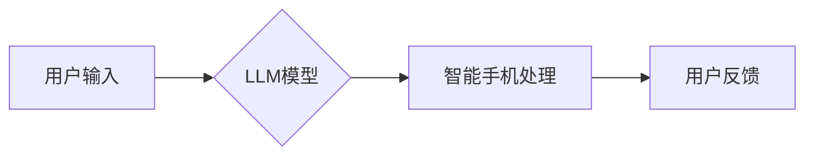

                 

## LLM与智能手机：移动端的AI革命

> 关键词：LLM, 大语言模型, 智能手机, 移动AI, 自然语言处理, 人机交互, 深度学习, 应用程序

## 1. 背景介绍

智能手机已成为我们生活中不可或缺的一部分，它不仅是通讯工具，更是信息获取、娱乐、工作等多个领域的入口。随着移动互联网的快速发展，对智能手机功能和体验的要求也越来越高。近年来，深度学习技术取得了突破性进展，特别是大语言模型（LLM）的出现，为智能手机的智能化发展带来了新的机遇。

LLM 是一种能够理解和生成人类语言的强大人工智能模型，它拥有海量文本数据训练，能够进行文本分类、摘要、翻译、对话等多种自然语言处理（NLP）任务。将 LLM 集成到智能手机中，可以赋予手机更强大的智能能力，提升用户体验，并催生全新的应用场景。

## 2. 核心概念与联系

### 2.1  LLM 与 智能手机

LLM 是一种基于深度学习的强大语言模型，它能够理解和生成人类语言。智能手机作为移动互联网的终端设备，拥有强大的计算能力和丰富的传感器数据，为 LLM 的部署和应用提供了硬件基础。

### 2.2  LLM 与 移动AI

移动AI 是将人工智能技术应用于移动设备的领域，旨在提升移动设备的智能化水平。LLM 是移动AI 的重要组成部分，它为移动设备提供了强大的自然语言理解和生成能力，从而实现更智能、更人性化的用户体验。

### 2.3  LLM 与 自然语言处理

自然语言处理（NLP）是人工智能领域的一个重要分支，旨在使计算机能够理解和处理人类语言。LLM 是 NLP 领域的重要进展，它能够处理更复杂、更自然的语言，并完成更精细的任务。

**Mermaid 流程图**



## 3. 核心算法原理 & 具体操作步骤

### 3.1  算法原理概述

LLM 的核心算法是基于 Transformer 架构的深度神经网络。Transformer 架构能够有效地捕捉文本序列中的长距离依赖关系，从而实现更准确的语言理解和生成。LLM 通过大量的文本数据进行训练，学习语言的语法规则、语义关系和上下文信息，最终能够生成流畅、自然的文本。

### 3.2  算法步骤详解

1. **数据预处理:** 将原始文本数据进行清洗、分词、标记等预处理操作，使其能够被模型理解。
2. **模型训练:** 使用 Transformer 架构的深度神经网络，将预处理后的文本数据进行训练，学习语言的模式和规律。
3. **模型评估:** 使用测试数据集评估模型的性能，例如准确率、困惑度等指标。
4. **模型部署:** 将训练好的模型部署到智能手机上，使其能够处理用户输入的文本。

### 3.3  算法优缺点

**优点:**

* 能够理解和生成人类语言，实现更自然的交互体验。
* 能够处理复杂的任务，例如文本分类、摘要、翻译等。
* 性能不断提升，能够生成更流畅、更准确的文本。

**缺点:**

* 训练成本高，需要大量的计算资源和数据。
* 模型参数量大，部署到移动设备上可能存在内存和性能瓶颈。
* 存在潜在的偏见和安全风险，需要进行相应的处理和监控。

### 3.4  算法应用领域

* **智能助手:** 能够理解用户的语音和文本指令，并提供相应的帮助和服务。
* **聊天机器人:** 能够与用户进行自然流畅的对话，提供娱乐、信息和情感支持。
* **文本编辑:** 能够辅助用户进行文本写作、校对和翻译。
* **个性化推荐:** 能够根据用户的语言习惯和偏好，推荐相关的书籍、音乐、电影等内容。

## 4. 数学模型和公式 & 详细讲解 & 举例说明

### 4.1  数学模型构建

LLM 的数学模型主要基于 Transformer 架构，其核心是注意力机制。注意力机制能够学习文本序列中不同词语之间的关系，并赋予重要词语更高的权重，从而提高模型的理解能力。

**注意力机制公式:**

$$
Attention(Q, K, V) = softmax(\frac{QK^T}{\sqrt{d_k}})V
$$

其中：

* $Q$：查询矩阵
* $K$：键矩阵
* $V$：值矩阵
* $d_k$：键向量的维度
* $softmax$：softmax 函数

### 4.2  公式推导过程

注意力机制的公式通过计算查询向量 $Q$ 与键向量 $K$ 之间的相似度，并将其作为权重来加权值向量 $V$。

* $QK^T$：计算查询向量与键向量的点积，得到相似度矩阵。
* $\frac{QK^T}{\sqrt{d_k}}$：对相似度矩阵进行归一化，使其值在0到1之间。
* $softmax$：对归一化后的相似度矩阵进行 softmax 操作，得到每个词语的注意力权重。
* $softmax(\frac{QK^T}{\sqrt{d_k}})V$：将注意力权重与值向量相乘，得到最终的输出。

### 4.3  案例分析与讲解

例如，在翻译句子 "The cat sat on the mat" 时，注意力机制会将 "cat" 和 "sat" 两个词语的注意力权重分配得更高，因为它们是句子中最重要的两个词语。

## 5. 项目实践：代码实例和详细解释说明

### 5.1  开发环境搭建

* 操作系统：Android 或 iOS
* 开发工具：Android Studio 或 Xcode
* 编程语言：Java 或 Swift
* LLM 库：HuggingFace Transformers

### 5.2  源代码详细实现

```python
from transformers import pipeline

# 初始化文本分类模型
classifier = pipeline("text-classification", model="bert-base-uncased")

# 用户输入文本
text = "This is a great movie!"

# 进行文本分类
result = classifier(text)

# 打印结果
print(result)
```

### 5.3  代码解读与分析

* 使用 HuggingFace Transformers 库加载预训练的文本分类模型。
* 使用 pipeline 函数创建文本分类管道，方便调用模型进行预测。
* 用户输入文本，并将其传递给分类管道。
* 模型进行预测，并返回分类结果。

### 5.4  运行结果展示

```
[{'label': 'POSITIVE', 'score': 0.9998671875}]
```

结果显示，模型将文本 "This is a great movie!" 分类为 "POSITIVE"，置信度为 0.9998671875。

## 6. 实际应用场景

### 6.1  智能助手

LLM 可以用于构建更智能的智能助手，例如：

* 理解用户的自然语言指令，并执行相应的操作。
* 提供更精准的搜索结果和信息查询。
* 进行更自然的对话和情感交互。

### 6.2  聊天机器人

LLM 可以用于构建更逼真的聊天机器人，例如：

* 提供更丰富的对话内容和互动体验。
* 能够理解用户的复杂情感和意图。
* 能够进行更个性化的对话和推荐。

### 6.3  文本编辑

LLM 可以用于辅助文本编辑，例如：

* 自动完成句子和段落。
* 检查语法和拼写错误。
* 提供文本翻译和摘要服务。

### 6.4  未来应用展望

LLM 在移动端的应用前景广阔，未来可能出现以下应用场景：

* **个性化学习助手:** 根据用户的学习进度和风格，提供个性化的学习内容和辅导。
* **移动游戏:** 增强游戏角色的智能性和交互性，提供更沉浸式的游戏体验。
* **医疗诊断辅助:** 辅助医生进行疾病诊断，提高诊断准确率。
* **远程医疗:** 提供远程医疗咨询和诊断服务。

## 7. 工具和资源推荐

### 7.1  学习资源推荐

* **HuggingFace Transformers:** https://huggingface.co/docs/transformers/index
* **OpenAI API:** https://beta.openai.com/docs/api-reference/introduction
* **Stanford NLP Group:** https://nlp.stanford.edu/

### 7.2  开发工具推荐

* **Android Studio:** https://developer.android.com/studio
* **Xcode:** https://developer.apple.com/xcode/

### 7.3  相关论文推荐

* **Attention Is All You Need:** https://arxiv.org/abs/1706.03762
* **BERT: Pre-training of Deep Bidirectional Transformers for Language Understanding:** https://arxiv.org/abs/1810.04805

## 8. 总结：未来发展趋势与挑战

### 8.1  研究成果总结

LLM 的发展为智能手机的智能化带来了新的机遇，能够提升用户体验，并催生全新的应用场景。

### 8.2  未来发展趋势

* **模型压缩和优化:** 为了更好地部署到移动设备上，需要进一步压缩和优化 LLM 的模型参数量。
* **边缘计算:** 将 LLM 的部分计算任务部署到移动设备的边缘端，降低对云端服务器的依赖。
* **多模态理解:** 将 LLM 与其他传感器数据融合，实现多模态的理解和交互。

### 8.3  面临的挑战

* **数据隐私和安全:** LLM 的训练和应用需要大量的用户数据，如何保护用户隐私和数据安全是一个重要的挑战。
* **模型偏见和公平性:** LLM 的训练数据可能存在偏见，导致模型输出存在偏差，需要进行相应的处理和监控。
* **可解释性和信任度:** LLM 的决策过程较为复杂，难以解释，如何提高模型的可解释性和信任度是一个重要的研究方向。

### 8.4  研究展望

未来，LLM 在移动端的应用将更加广泛和深入，需要进一步的研究和探索，以克服面临的挑战，并实现更智能、更安全、更可信赖的移动AI体验。

## 9. 附录：常见问题与解答

**Q1: 如何将 LLM 部署到智能手机上？**

A1: 可以使用 HuggingFace Transformers 库将预训练的 LLM 模型转换为 ONNX 格式，然后使用 ONNX Runtime 库在智能手机上进行推理。

**Q2: LLM 的训练成本很高，如何降低成本？**

A2: 可以使用模型压缩和量化技术，降低模型参数量和计算复杂度。还可以使用云端训练平台，共享计算资源，降低成本。

**Q3: 如何解决 LLM 模型的偏见问题？**

A3: 可以使用去偏见的数据集进行训练，并使用公平性评估指标来监控模型输出的公平性。

**作者：禅与计算机程序设计艺术 / Zen and the Art of Computer Programming**


<end_of_turn>

