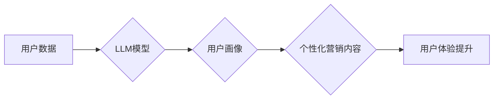

                 

## LLM在智能个性化营销中的应用探索

> 关键词：LLM, 个性化营销, 自然语言处理, 深度学习, 营销策略, 客户体验, 数据分析

## 1. 背景介绍

在当今数据爆炸的时代，企业面临着如何有效地与目标客户进行沟通和互动的新挑战。传统的营销策略往往过于泛化，难以满足个性化需求，导致营销效果不佳。而随着人工智能技术的快速发展，特别是大型语言模型（LLM）的出现，为智能个性化营销提供了全新的可能性。

LLM 是一种强大的深度学习模型，能够理解和生成人类语言，具备强大的文本处理能力。它可以从海量数据中学习用户行为、偏好和需求，并根据这些信息生成个性化的营销内容，例如推荐产品、撰写个性化邮件、提供定制化服务等。

## 2. 核心概念与联系

### 2.1  智能个性化营销

智能个性化营销是指利用数据分析、人工智能等技术，根据用户的个人特征、行为模式、兴趣爱好等信息，为每个用户提供定制化的营销服务，以提升用户体验和营销效果。

### 2.2  大型语言模型（LLM）

大型语言模型（LLM）是一种基于深度学习的强大自然语言处理模型，通过训练海量文本数据，能够理解和生成人类语言，具备强大的文本生成、翻译、摘要、问答等能力。

### 2.3  LLM在智能个性化营销中的应用

LLM 可以通过以下方式应用于智能个性化营销：

* **用户画像构建:** LLM 可以分析用户历史数据，例如浏览记录、购买记录、社交媒体行为等，构建用户画像，了解用户的兴趣爱好、需求偏好等信息。
* **个性化内容生成:** LLM 可以根据用户画像，生成个性化的营销内容，例如推荐产品、撰写个性化邮件、创建定制化广告等。
* **智能客服:** LLM 可以作为智能客服，与用户进行自然语言对话，解答用户疑问、提供产品信息、处理售后问题等。
* **营销策略优化:** LLM 可以分析营销数据，例如广告点击率、转化率等，为营销策略提供数据支持，帮助企业优化营销效果。

**Mermaid 流程图**



## 3. 核心算法原理 & 具体操作步骤

### 3.1  算法原理概述

LLM 的核心算法原理是基于 Transformer 架构的深度学习模型。Transformer 模型通过自注意力机制，能够捕捉文本序列中长距离依赖关系，从而实现更精准的文本理解和生成。

### 3.2  算法步骤详解

1. **数据预处理:** 将原始文本数据进行清洗、分词、标记等预处理操作，使其能够被模型理解。
2. **模型训练:** 使用预处理后的数据训练 Transformer 模型，通过反向传播算法不断调整模型参数，使其能够生成更准确的文本。
3. **模型评估:** 使用测试数据评估模型的性能，例如准确率、困惑度等指标。
4. **模型部署:** 将训练好的模型部署到生产环境中，用于实际应用。

### 3.3  算法优缺点

**优点:**

* 强大的文本理解和生成能力
* 能够捕捉长距离依赖关系
* 可处理多种自然语言

**缺点:**

* 训练成本高
* 模型参数量大
* 需要大量高质量数据进行训练

### 3.4  算法应用领域

LLM 的应用领域非常广泛，除了智能个性化营销，还包括：

* 自然语言理解
* 机器翻译
* 文本摘要
* 问答系统
* 代码生成

## 4. 数学模型和公式 & 详细讲解 & 举例说明

### 4.1  数学模型构建

LLM 的数学模型主要基于 Transformer 架构，其核心是自注意力机制。自注意力机制能够计算每个词在句子中与其他词之间的相关性，从而捕捉文本序列中的长距离依赖关系。

### 4.2  公式推导过程

自注意力机制的计算公式如下：

$$
Attention(Q, K, V) = softmax(\frac{QK^T}{\sqrt{d_k}})V
$$

其中：

* $Q$：查询矩阵
* $K$：键矩阵
* $V$：值矩阵
* $d_k$：键向量的维度
* $softmax$：softmax 函数

### 4.3  案例分析与讲解

假设我们有一个句子 "The cat sat on the mat"，我们想要计算 "cat" 与 "mat" 之间的注意力权重。

1. 将句子中的每个词转换为词向量，形成查询矩阵 $Q$、键矩阵 $K$ 和值矩阵 $V$。
2. 计算 $QK^T$，得到一个矩阵，每个元素代表两个词之间的相关性。
3. 对 $QK^T$ 进行归一化，得到注意力权重矩阵。
4. 将注意力权重矩阵与值矩阵 $V$ 进行加权求和，得到 "cat" 与 "mat" 之间的注意力向量。

## 5. 项目实践：代码实例和详细解释说明

### 5.1  开发环境搭建

* Python 3.7+
* TensorFlow 或 PyTorch 深度学习框架
* NLTK 自然语言处理库
* HuggingFace Transformers 库

### 5.2  源代码详细实现

```python
from transformers import AutoModelForSequenceClassification, AutoTokenizer

# 加载预训练模型和词典
model_name = "bert-base-uncased"
tokenizer = AutoTokenizer.from_pretrained(model_name)
model = AutoModelForSequenceClassification.from_pretrained(model_name)

# 输入文本
text = "This is a sample text."

# 对文本进行编码
inputs = tokenizer(text, return_tensors="pt")

# 使用模型进行预测
outputs = model(**inputs)

# 获取预测结果
predicted_class = outputs.logits.argmax().item()

# 打印预测结果
print(f"Predicted class: {predicted_class}")
```

### 5.3  代码解读与分析

* 该代码示例使用 HuggingFace Transformers 库加载预训练的 BERT 模型。
* BERT 模型是一个强大的文本理解模型，可以用于各种自然语言处理任务，例如文本分类。
* 代码首先使用 tokenizer 将输入文本转换为模型可以理解的格式。
* 然后，使用模型进行预测，并获取预测结果。
* 最后，打印预测结果。

### 5.4  运行结果展示

运行该代码示例，会输出预测结果，例如：

```
Predicted class: 0
```

其中 0 代表预测文本属于某个特定类别。

## 6. 实际应用场景

### 6.1  电商推荐

LLM 可以分析用户的浏览历史、购买记录、评价等数据，构建用户画像，并根据用户的兴趣爱好推荐个性化的商品。

### 6.2  内容营销

LLM 可以根据用户的阅读习惯、关注领域等信息，生成个性化的文章、视频、广告等内容，提高用户参与度和转化率。

### 6.3  客户服务

LLM 可以作为智能客服，与用户进行自然语言对话，解答用户疑问、提供产品信息、处理售后问题等，提高客户满意度。

### 6.4  未来应用展望

LLM 在智能个性化营销领域的应用前景广阔，未来可能应用于：

* 更精准的营销策略制定
* 更个性化的用户体验
* 更智能的营销自动化

## 7. 工具和资源推荐

### 7.1  学习资源推荐

* **书籍:**

    * 《深度学习》 - Ian Goodfellow, Yoshua Bengio, Aaron Courville
    * 《自然语言处理入门》 - Jacob Eisenstein

* **在线课程:**

    * Coursera: 自然语言处理
    * edX: 深度学习

### 7.2  开发工具推荐

* **Python:** 强大的编程语言，广泛应用于人工智能领域。
* **TensorFlow:** Google 开发的开源深度学习框架。
* **PyTorch:** Facebook 开发的开源深度学习框架。
* **HuggingFace Transformers:** 提供预训练的 Transformer 模型和工具。

### 7.3  相关论文推荐

* **Attention Is All You Need** - Vaswani et al. (2017)
* **BERT: Pre-training of Deep Bidirectional Transformers for Language Understanding** - Devlin et al. (2018)

## 8. 总结：未来发展趋势与挑战

### 8.1  研究成果总结

LLM 在智能个性化营销领域取得了显著的成果，能够帮助企业更精准地了解用户需求，提供更个性化的营销服务，提升营销效果。

### 8.2  未来发展趋势

* **模型规模和性能的提升:** 未来 LLM 模型规模将进一步扩大，性能将得到进一步提升，能够处理更复杂的任务。
* **多模态学习:** LLM 将与其他模态数据，例如图像、音频等进行融合，实现更全面的用户理解。
* **可解释性增强:** 研究者将致力于提高 LLM 的可解释性，使其决策过程更加透明，增强用户信任。

### 8.3  面临的挑战

* **数据隐私和安全:** LLM 的训练需要大量用户数据，如何保护用户隐私和数据安全是一个重要挑战。
* **模型偏见:** LLM 模型可能存在偏见，导致营销策略不公平，需要进行针对性的缓解措施。
* **伦理问题:** LLM 的应用可能引发一些伦理问题，例如虚假信息生成、用户操控等，需要进行深入探讨和规范。

### 8.4  研究展望

未来，LLM 在智能个性化营销领域的应用将更加广泛和深入，需要进一步研究和探索，以实现更智能、更个性化、更可持续的营销模式。

## 9. 附录：常见问题与解答

### 9.1  LLM 是否会取代人类营销人员？

LLM 可以自动化一些营销任务，但它无法完全取代人类营销人员。人类营销人员需要具备创造力、洞察力和沟通能力，这些能力目前 LLM 还无法完全替代。

### 9.2  如何评估 LLM 在营销中的效果？

可以根据具体的营销目标，例如转化率、用户参与度等指标，评估 LLM 的效果。

### 9.3  如何解决 LLM 模型的偏见问题？

可以通过以下方式缓解 LLM 模型的偏见问题：

* 使用更加多样化的训练数据
* 开发针对性地缓解偏见的算法
* 对模型输出进行人工审核

作者：禅与计算机程序设计艺术 / Zen and the Art of Computer Programming


<end_of_turn>

