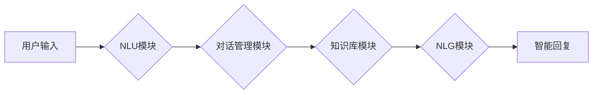

                 

## LLM在智能客户服务系统中的应用前景

> 关键词：LLM, 大语言模型, 智能客服, 自然语言处理, 客户服务, 人工智能, 聊天机器人, 语义理解

## 1. 背景介绍

随着人工智能技术的飞速发展，大语言模型（LLM）的出现为智能客户服务系统带来了革命性的变革。LLM 拥有强大的自然语言理解和生成能力，能够理解用户复杂的需求，并提供精准、人性化的回复。传统基于规则的客服系统难以应对多样化的用户交互，而LLM则能够学习和适应用户的语言风格，提供更流畅、更自然的对话体验。

智能客服系统旨在通过自动化技术，提高客户服务效率，降低成本，提升客户满意度。传统的客服系统主要依靠人工客服人员进行处理，存在着效率低、成本高、服务质量不稳定等问题。而LLM驱动的智能客服系统能够24小时在线，快速响应用户需求，并提供个性化的服务，有效解决这些问题。

## 2. 核心概念与联系

### 2.1  LLM概述

大语言模型（LLM）是一种基于深度学习的强大人工智能模型，能够理解和生成人类语言。它们通过训练海量文本数据，学习语言的语法、语义和上下文关系，从而具备强大的文本处理能力。

### 2.2  智能客服系统概述

智能客服系统是一种利用人工智能技术，自动处理客户咨询和服务请求的系统。它通常由以下几个核心组件组成：

* **自然语言理解（NLU）模块：**负责将用户输入的文本转换为机器可理解的结构化数据。
* **对话管理模块：**负责控制对话流程，根据用户输入和上下文信息，选择合适的回复。
* **知识库模块：**存储着公司产品、服务、政策等相关信息，为对话管理模块提供知识支持。
* **自然语言生成（NLG）模块：**负责将机器生成的回复转换为自然流畅的文本。

### 2.3  LLM与智能客服系统的联系

LLM可以作为智能客服系统的核心引擎，为其提供强大的自然语言理解和生成能力。

* **NLU模块：**LLM可以替代传统的规则引擎，更准确地理解用户意图和需求。
* **对话管理模块：**LLM可以学习用户对话习惯，提供更自然、更人性化的对话体验。
* **知识库模块：**LLM可以自动从文本数据中提取知识，构建更完善的知识库。
* **NLG模块：**LLM可以生成更流畅、更自然的回复，提升用户体验。

**Mermaid 流程图**



## 3. 核心算法原理 & 具体操作步骤

### 3.1  算法原理概述

LLM的核心算法是基于Transformer架构的深度神经网络。Transformer模型通过自注意力机制，能够捕捉文本序列中的长距离依赖关系，从而实现更准确的语义理解。

### 3.2  算法步骤详解

1. **数据预处理：**将原始文本数据进行清洗、分词、标记等预处理操作，使其能够被模型理解。
2. **模型训练：**使用预处理后的数据训练Transformer模型，通过反向传播算法，不断调整模型参数，使其能够生成更准确的文本预测。
3. **模型评估：**使用测试数据评估模型的性能，常用的指标包括准确率、召回率、F1-score等。
4. **模型部署：**将训练好的模型部署到服务器上，使其能够接入智能客服系统。

### 3.3  算法优缺点

**优点：**

* **强大的语义理解能力：**能够理解用户复杂的需求，并提供精准的回复。
* **自然流畅的对话体验：**能够生成更自然、更人性化的回复，提升用户体验。
* **可扩展性强：**可以根据需要添加新的知识库和功能模块。

**缺点：**

* **训练成本高：**需要大量的计算资源和训练数据。
* **模型参数量大：**部署和运行成本较高。
* **存在偏差和错误：**模型的训练数据可能存在偏差，导致模型生成不准确或有偏见的回复。

### 3.4  算法应用领域

LLM在智能客服系统之外，还广泛应用于其他领域，例如：

* **机器翻译：**将一种语言翻译成另一种语言。
* **文本摘要：**将长篇文本压缩成短篇摘要。
* **问答系统：**根据用户的问题，从知识库中找到答案。
* **代码生成：**根据用户需求，自动生成代码。

## 4. 数学模型和公式 & 详细讲解 & 举例说明

### 4.1  数学模型构建

LLM的核心数学模型是Transformer，其主要由以下几个部分组成：

* **嵌入层：**将文本单词映射到低维向量空间。
* **多头自注意力层：**捕捉文本序列中的长距离依赖关系。
* **前馈神经网络层：**对每个单词的嵌入向量进行非线性变换。
* **位置编码层：**为每个单词添加位置信息，使模型能够理解单词在序列中的顺序。

### 4.2  公式推导过程

Transformer模型的训练目标是最大化预测下一个单词的概率。

$$
P(w_t | w_{<t}) = \text{softmax}(h_t^T W_o)
$$

其中：

* $w_t$ 是目标单词。
* $w_{<t}$ 是目标单词之前的上下文单词。
* $h_t$ 是目标单词的隐藏状态。
* $W_o$ 是输出权重矩阵。

### 4.3  案例分析与讲解

假设我们有一个文本序列“The cat sat on the mat”，目标是预测下一个单词。

* 嵌入层将每个单词映射到低维向量空间。
* 多头自注意力层捕捉每个单词与其他单词之间的关系。
* 前馈神经网络层对每个单词的隐藏状态进行非线性变换。
* 位置编码层为每个单词添加位置信息。
* 最后，softmax函数将隐藏状态映射到每个单词的概率分布。

通过训练，模型能够学习到每个单词出现的概率分布，从而预测下一个单词。

## 5. 项目实践：代码实例和详细解释说明

### 5.1  开发环境搭建

* **操作系统：**Linux或macOS
* **编程语言：**Python
* **深度学习框架：**TensorFlow或PyTorch
* **其他依赖库：**NLTK、spaCy等

### 5.2  源代码详细实现

```python
# 使用TensorFlow构建一个简单的LLM模型
import tensorflow as tf

# 定义模型结构
model = tf.keras.Sequential([
    tf.keras.layers.Embedding(input_dim=vocab_size, output_dim=embedding_dim),
    tf.keras.layers.MultiHeadAttention(num_heads=8),
    tf.keras.layers.FeedForwardNetwork(units=hidden_units),
    tf.keras.layers.Dense(units=vocab_size, activation='softmax')
])

# 编译模型
model.compile(optimizer='adam', loss='sparse_categorical_crossentropy', metrics=['accuracy'])

# 训练模型
model.fit(train_data, train_labels, epochs=10)

# 评估模型
loss, accuracy = model.evaluate(test_data, test_labels)
print('Loss:', loss)
print('Accuracy:', accuracy)
```

### 5.3  代码解读与分析

* **Embedding层：**将每个单词映射到低维向量空间。
* **MultiHeadAttention层：**捕捉每个单词与其他单词之间的关系。
* **FeedForwardNetwork层：**对每个单词的隐藏状态进行非线性变换。
* **Dense层：**将隐藏状态映射到每个单词的概率分布。

### 5.4  运行结果展示

训练完成后，模型能够预测下一个单词的概率分布。

## 6. 实际应用场景

LLM驱动的智能客服系统已经应用于各个行业，例如：

* **电商：**为客户提供产品信息、订单查询、退换货等服务。
* **金融：**为客户提供账户查询、转账、理财咨询等服务。
* **医疗：**为客户提供预约挂号、问诊、药品查询等服务。

### 6.4  未来应用展望

LLM在智能客服系统领域的应用前景广阔，未来将朝着以下方向发展：

* **更精准的语义理解：**通过更先进的算法和更大的训练数据，LLM能够更准确地理解用户的意图和需求。
* **更个性化的服务：**LLM能够根据用户的历史对话记录和个人喜好，提供更个性化的服务。
* **多模态交互：**LLM能够结合语音、图像、视频等多模态信息，提供更丰富的交互体验。

## 7. 工具和资源推荐

### 7.1  学习资源推荐

* **书籍：**
    * 《深度学习》
    * 《自然语言处理》
* **在线课程：**
    * Coursera
    * edX
* **博客和论坛：**
    * TensorFlow博客
    * PyTorch博客
    * Reddit

### 7.2  开发工具推荐

* **深度学习框架：**TensorFlow、PyTorch
* **自然语言处理库：**NLTK、spaCy
* **代码编辑器：**VS Code、Sublime Text

### 7.3  相关论文推荐

* **Attention Is All You Need**
* **BERT: Pre-training of Deep Bidirectional Transformers for Language Understanding**
* **GPT-3: Language Models are Few-Shot Learners**

## 8. 总结：未来发展趋势与挑战

### 8.1  研究成果总结

LLM在智能客服系统领域的应用取得了显著成果，能够提供更精准、更自然、更个性化的服务体验。

### 8.2  未来发展趋势

LLM在智能客服系统领域的应用将朝着更精准的语义理解、更个性化的服务、多模态交互等方向发展。

### 8.3  面临的挑战

LLM在智能客服系统领域的应用还面临着一些挑战，例如：

* **数据安全和隐私保护：**LLM需要训练大量的用户数据，如何保证数据安全和隐私保护是一个重要问题。
* **模型可解释性：**LLM的决策过程往往是复杂的，如何提高模型的可解释性，让用户能够理解模型的 reasoning 过程是一个挑战。
* **伦理问题：**LLM可能会被用于生成虚假信息或进行恶意攻击，如何规范LLM的应用，避免其被滥用是一个伦理问题。

### 8.4  研究展望

未来，研究者将继续探索LLM在智能客服系统领域的应用，解决上述挑战，推动LLM技术在智能客服领域的更广泛应用。

## 9. 附录：常见问题与解答

* **Q：LLM训练需要多少数据？**

A：LLM训练需要海量文本数据，通常需要数十亿甚至数千亿个单词。

* **Q：LLM训练需要多少计算资源？**

A：LLM训练需要大量的计算资源，通常需要使用GPU集群进行训练。

* **Q：LLM是否能够理解用户的真实意图？**

A：LLM能够理解用户的表面意图，但对于复杂的隐含意图，可能还需要进一步的改进。


作者：禅与计算机程序设计艺术 / Zen and the Art of Computer Programming 
<end_of_turn>

