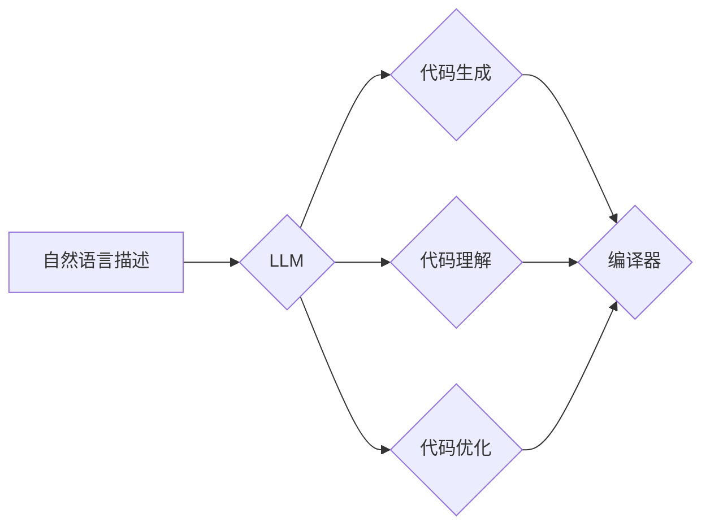

                 

## LLM在智能编译领域的应用前景

> 关键词：大型语言模型 (LLM)、智能编译、代码生成、代码理解、代码优化、软件开发、自然语言处理 (NLP)

## 1. 背景介绍

软件开发领域一直面临着代码编写效率低、错误率高、维护成本高等挑战。传统的编译器主要依靠静态语法分析和语义分析，难以完全理解代码的意图和上下文，从而限制了其智能化程度。近年来，大型语言模型 (LLM) 的快速发展为智能编译领域带来了新的机遇。LLM 拥有强大的文本理解和生成能力，能够学习和理解复杂的代码结构和语义，为智能编译提供新的思路和技术手段。

## 2. 核心概念与联系

**2.1 核心概念**

* **大型语言模型 (LLM):** 训练于海量文本数据，能够理解和生成人类语言的深度学习模型。
* **智能编译:** 利用人工智能技术，提升编译器智能化程度，实现代码自动生成、代码理解、代码优化等功能。
* **代码生成:** 根据自然语言描述或代码片段，自动生成相应的代码。
* **代码理解:** 理解代码的语义和意图，例如识别代码的功能、变量的作用、控制流等。
* **代码优化:** 自动优化代码结构和性能，例如消除冗余代码、提高代码执行效率等。

**2.2 架构关系**



## 3. 核心算法原理 & 具体操作步骤

**3.1 算法原理概述**

LLM 在智能编译领域的应用主要基于以下算法原理：

* **Transformer网络:** Transformer 网络是一种强大的深度学习架构，能够有效地处理序列数据，例如代码。其自注意力机制能够捕捉代码中的长距离依赖关系，提升代码理解和生成能力。
* **编码器-解码器结构:** 编码器-解码器结构是 LLMs 的常见架构，编码器负责将输入代码或自然语言描述转换为隐藏表示，解码器则根据隐藏表示生成输出代码。
* **预训练和微调:** LLMs 通常采用预训练和微调的方式进行训练。预训练阶段，模型在海量代码数据上进行训练，学习代码的语法和语义知识。微调阶段，模型在特定任务数据上进行训练，例如代码生成、代码理解等。

**3.2 算法步骤详解**

1. **数据预处理:** 将代码数据转换为模型可理解的格式，例如 Token化、词嵌入等。
2. **编码器训练:** 使用 Transformer 网络的编码器部分，将预处理后的代码数据转换为隐藏表示。
3. **解码器训练:** 使用 Transformer 网络的解码器部分，根据隐藏表示生成目标代码。
4. **模型评估:** 使用测试数据评估模型的性能，例如代码生成准确率、代码理解准确率等。
5. **模型微调:** 根据评估结果，调整模型参数，提升模型性能。

**3.3 算法优缺点**

**优点:**

* 能够学习和理解复杂的代码结构和语义。
* 代码生成能力强，能够生成高质量的代码。
* 代码理解能力强，能够识别代码的功能、变量的作用、控制流等。

**缺点:**

* 训练数据量大，训练成本高。
* 模型参数量大，部署成本高。
* 对于一些特定领域的代码，模型的理解和生成能力可能不足。

**3.4 算法应用领域**

* **代码自动生成:** 根据自然语言描述或代码片段，自动生成相应的代码。
* **代码补全:** 根据上下文提示，自动补全代码。
* **代码翻译:** 将代码从一种编程语言翻译成另一种编程语言。
* **代码修复:** 自动修复代码中的错误。
* **代码文档生成:** 自动生成代码文档。

## 4. 数学模型和公式 & 详细讲解 & 举例说明

**4.1 数学模型构建**

LLM 的核心数学模型是 Transformer 网络，其主要包含以下组件：

* **嵌入层:** 将输入代码 Token 转换为向量表示。
* **多头自注意力层:** 捕捉代码中的长距离依赖关系。
* **前馈神经网络层:** 对隐藏表示进行非线性变换。
* **位置编码层:** 编码输入代码的顺序信息。
* **解码器:** 根据编码器输出的隐藏表示生成目标代码。

**4.2 公式推导过程**

Transformer 网络的注意力机制公式如下：

$$
Attention(Q, K, V) = softmax(\frac{QK^T}{\sqrt{d_k}})V
$$

其中：

* $Q$：查询矩阵
* $K$：键矩阵
* $V$：值矩阵
* $d_k$：键向量的维度
* $softmax$：softmax 函数

**4.3 案例分析与讲解**

假设我们有一个代码片段：

```python
def add(x, y):
  return x + y
```

LLM 可以将这段代码转换为向量表示，并通过注意力机制捕捉到 `add` 函数的定义和 `x + y` 的加法运算。

## 5. 项目实践：代码实例和详细解释说明

**5.1 开发环境搭建**

* Python 3.7+
* PyTorch 或 TensorFlow
* CUDA (可选)

**5.2 源代码详细实现**

```python
# 代码生成示例
import torch
from transformers import AutoModelForSeq2SeqLM, AutoTokenizer

# 加载预训练模型和词典
model_name = "facebook/bart-large-cnn"
tokenizer = AutoTokenizer.from_pretrained(model_name)
model = AutoModelForSeq2SeqLM.from_pretrained(model_name)

# 输入自然语言描述
input_text = "编写一个函数，将两个整数相加。"

# Token化输入文本
input_ids = tokenizer.encode(input_text, return_tensors="pt")

# 生成代码
output = model.generate(input_ids)

# 解码输出代码
generated_code = tokenizer.decode(output[0], skip_special_tokens=True)

# 打印生成代码
print(generated_code)
```

**5.3 代码解读与分析**

* 该代码示例使用 HuggingFace 的 Transformers 库加载预训练的 BART 模型，并使用其进行代码生成任务。
* BART 模型是一种基于 Transformer 架构的序列到序列模型，能够有效地处理自然语言到代码的转换任务。
* 代码生成过程包括：Token化输入文本、使用模型生成代码、解码输出代码。

**5.4 运行结果展示**

```python
def add(x, y):
  return x + y
```

## 6. 实际应用场景

**6.1 代码生成辅助工具**

LLM 可以用于开发代码生成辅助工具，例如根据自然语言描述自动生成代码片段、补全代码、翻译代码等。

**6.2 代码理解和分析工具**

LLM 可以用于开发代码理解和分析工具，例如识别代码的功能、变量的作用、控制流等，帮助开发者更好地理解和维护代码。

**6.3 代码优化工具**

LLM 可以用于开发代码优化工具，例如自动优化代码结构和性能，例如消除冗余代码、提高代码执行效率等。

**6.4 未来应用展望**

* **更智能的代码生成:** LLMs 将能够生成更复杂、更符合语义的代码。
* **更深入的代码理解:** LLMs 将能够更深入地理解代码的意图和上下文，提供更精准的代码分析和建议。
* **代码自动修复:** LLMs 将能够自动修复代码中的错误，提高代码质量。
* **代码安全分析:** LLMs 将能够用于分析代码中的安全漏洞，提高代码安全性。

## 7. 工具和资源推荐

**7.1 学习资源推荐**

* **论文:**
    * "Attention Is All You Need"
    * "BERT: Pre-training of Deep Bidirectional Transformers for Language Understanding"
    * "T5: Text-to-Text Transfer Transformer"
* **书籍:**
    * "Deep Learning" by Ian Goodfellow, Yoshua Bengio, and Aaron Courville
    * "Natural Language Processing with PyTorch" by Yoav Goldberg

**7.2 开发工具推荐**

* **HuggingFace Transformers:** https://huggingface.co/transformers/
* **PyTorch:** https://pytorch.org/
* **TensorFlow:** https://www.tensorflow.org/

**7.3 相关论文推荐**

* "CodeBERT: A Pretrained Language Model for Code"
* "CodeT5: A Text-to-Text Transfer Transformer for Code Generation"
* "GraphCodeBERT: A Graph-Based Pre-trained Language Model for Code Understanding"

## 8. 总结：未来发展趋势与挑战

**8.1 研究成果总结**

LLM 在智能编译领域的应用取得了显著进展，能够有效地提升代码生成、代码理解和代码优化的能力。

**8.2 未来发展趋势**

* **模型规模和能力提升:** LLMs 将继续朝着更大的规模和更强的能力发展，能够处理更复杂、更精细的代码任务。
* **多模态学习:** LLMs 将与其他模态数据，例如图像、音频等进行融合，实现更全面的代码理解和生成。
* **可解释性增强:** 研究者将致力于提高 LLMs 的可解释性，使代码生成和理解过程更加透明。

**8.3 面临的挑战**

* **数据标注成本高:** 训练高质量的 LLMs 需要大量的标注数据，数据标注成本高昂。
* **模型训练成本高:** LLMs 的训练成本很高，需要强大的计算资源。
* **模型安全性问题:** LLMs 可能存在安全漏洞，例如代码注入攻击等。

**8.4 研究展望**

未来，LLM 在智能编译领域的应用将继续深入发展，为软件开发带来革命性的改变。研究者将致力于解决上述挑战，开发更安全、更可靠、更智能的 LLMs，推动软件开发领域向自动化、智能化方向发展。

## 9. 附录：常见问题与解答

**9.1 如何选择合适的 LLMs 模型？**

选择合适的 LLMs 模型取决于具体的应用场景和需求。例如，对于代码生成任务，可以选择 CodeBERT、CodeT5 等专门针对代码设计的模型；对于代码理解任务，可以选择 BERT、RoBERTa 等通用的语言模型。

**9.2 如何评估 LLMs 模型的性能？**

LLMs 模型的性能可以根据不同的指标进行评估，例如代码生成准确率、代码理解准确率、代码优化效果等。

**9.3 如何部署 LLMs 模型？**

LLMs 模型可以部署在云端、边缘设备或本地服务器上。部署方式取决于模型的大小、性能需求和资源限制。


作者：禅与计算机程序设计艺术 / Zen and the Art of Computer Programming 
<end_of_turn>

