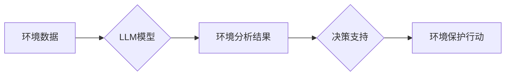

                 

## LLM在环境保护中的潜在贡献

> 关键词：大型语言模型（LLM）、环境保护、自然语言处理（NLP）、数据分析、可持续发展、气候变化、环境监测

## 1. 背景介绍

全球环境问题日益严峻，气候变化、资源枯竭、生物多样性丧失等挑战迫在眉睫。传统环境监测和保护方法面临着数据获取困难、分析效率低、决策制定缓慢等问题。近年来，人工智能技术，特别是大型语言模型（LLM）的快速发展，为环境保护领域带来了新的机遇。

LLM 是一种强大的机器学习模型，能够理解和生成人类语言，并具备强大的文本处理、数据分析和模式识别能力。其在环境保护领域的应用潜力巨大，可以帮助我们更有效地监测环境变化、预测环境风险、制定环境政策和促进可持续发展。

## 2. 核心概念与联系

### 2.1  LLM 的核心概念

LLM 是基于 Transformer 架构的深度神经网络，通过训练海量文本数据，学习语言的语法、语义和上下文关系。其核心特点包括：

* **强大的文本理解能力:** LLM 可以理解复杂的自然语言文本，提取关键信息、识别实体和关系。
* **优秀的文本生成能力:** LLM 可以生成流畅、自然的文本，用于报告、总结、翻译等任务。
* **泛化能力强:** LLM 可以应用于多种自然语言处理任务，例如文本分类、问答系统、机器翻译等。

### 2.2  LLM 与环境保护的联系

LLM 可以与环境保护领域的多项技术和数据相结合，发挥其优势，例如：

* **遥感数据分析:** LLM 可以分析遥感图像和数据，识别森林覆盖变化、土地利用变化、水体污染等环境问题。
* **环境监测数据处理:** LLM 可以处理海量环境监测数据，识别异常值、发现环境趋势和预测环境风险。
* **科学文献研究:** LLM 可以快速阅读和理解大量的环境科学文献，提取关键研究成果和发现新的研究方向。
* **公众参与和教育:** LLM 可以用于开发环境保护相关的问答系统、聊天机器人和教育平台，提高公众的环境意识和参与度。

### 2.3  LLM 应用架构



## 3. 核心算法原理 & 具体操作步骤

### 3.1  算法原理概述

LLM 的核心算法是 Transformer，它通过自注意力机制学习文本之间的上下文关系，并利用多头注意力机制捕捉不同层次的语义信息。

Transformer 模型由编码器和解码器组成。编码器将输入文本序列编码成一个固定长度的向量表示，解码器则根据编码后的向量表示生成输出文本序列。

### 3.2  算法步骤详解

1. **数据预处理:** 将环境数据转换为文本格式，并进行清洗、标注和分词等预处理操作。
2. **模型训练:** 使用预训练的 LLM 模型，在环境数据上进行微调训练，使其能够理解和处理环境相关的文本信息。
3. **环境分析:** 将环境数据输入到训练好的 LLM 模型中，模型会生成环境分析结果，例如环境趋势、风险预测、污染源识别等。
4. **决策支持:** 基于环境分析结果，为环境保护决策提供支持，例如制定环境政策、规划环境保护行动、评估环境影响等。

### 3.3  算法优缺点

**优点:**

* 强大的文本理解和生成能力
* 泛化能力强，可以应用于多种环境保护任务
* 可以处理海量环境数据，发现隐藏的模式和趋势

**缺点:**

* 训练成本高，需要大量的计算资源和数据
* 对数据质量要求高，训练数据必须准确、完整和可靠
* 缺乏对物理世界和因果关系的理解

### 3.4  算法应用领域

* **环境监测:** 识别森林火灾、水体污染、空气质量变化等环境问题。
* **气候变化研究:** 分析气候变化数据，预测未来气候趋势和影响。
* **生物多样性保护:** 识别和监测濒危物种，评估生物多样性变化。
* **环境政策制定:** 为环境政策制定提供数据支持和决策建议。

## 4. 数学模型和公式 & 详细讲解 & 举例说明

### 4.1  数学模型构建

LLM 的核心数学模型是 Transformer，其主要包含以下几个模块：

* **嵌入层:** 将文本单词映射到低维向量空间。
* **多头注意力层:** 学习文本单词之间的上下文关系，捕捉不同层次的语义信息。
* **前馈神经网络层:** 对注意力输出进行非线性变换，提取更深层次的特征。
* **位置编码层:** 为文本单词添加位置信息，帮助模型理解单词在句子中的顺序关系。

### 4.2  公式推导过程

Transformer 模型的注意力机制公式如下：

$$
Attention(Q, K, V) = softmax(\frac{QK^T}{\sqrt{d_k}})V
$$

其中：

* $Q$：查询矩阵
* $K$：键矩阵
* $V$：值矩阵
* $d_k$：键向量的维度
* $softmax$：softmax 函数

### 4.3  案例分析与讲解

例如，在环境监测任务中，LLM 可以使用注意力机制分析遥感图像数据，识别森林覆盖变化。

* $Q$：表示每个像素点的特征向量。
* $K$：表示每个像素点的上下文信息向量。
* $V$：表示每个像素点的类别标签向量。

通过计算注意力权重，LLM 可以识别与森林覆盖变化相关的像素点，并预测森林覆盖变化的趋势。

## 5. 项目实践：代码实例和详细解释说明

### 5.1  开发环境搭建

* Python 3.7+
* PyTorch 或 TensorFlow
* CUDA 和 cuDNN (可选，用于 GPU 加速)

### 5.2  源代码详细实现

```python
# 使用 HuggingFace Transformers 库加载预训练的 LLM 模型
from transformers import AutoModelForSequenceClassification, AutoTokenizer

model_name = "bert-base-uncased"
tokenizer = AutoTokenizer.from_pretrained(model_name)
model = AutoModelForSequenceClassification.from_pretrained(model_name)

# 对环境文本数据进行预处理
text = "森林覆盖面积正在减少，导致生物多样性丧失。"
inputs = tokenizer(text, return_tensors="pt")

# 将预处理后的数据输入到 LLM 模型中进行预测
outputs = model(**inputs)
predicted_class = outputs.logits.argmax().item()

# 根据预测结果进行分析和决策
if predicted_class == 1:
    print("环境风险较高，需要采取措施保护森林资源。")
else:
    print("环境状况良好，继续监测和保护。")
```

### 5.3  代码解读与分析

* 代码首先使用 HuggingFace Transformers 库加载预训练的 BERT 模型。
* 然后对环境文本数据进行预处理，将其转换为模型可识别的格式。
* 将预处理后的数据输入到模型中进行预测，模型会输出一个预测结果，表示环境风险等级。
* 最后根据预测结果进行分析和决策，例如采取措施保护森林资源或继续监测环境状况。

### 5.4  运行结果展示

运行上述代码，如果环境文本数据表示环境风险较高，则输出“环境风险较高，需要采取措施保护森林资源。”；否则，输出“环境状况良好，继续监测和保护。”

## 6. 实际应用场景

### 6.1  环境监测

LLM 可以分析遥感图像、气象数据、水质数据等环境监测数据，识别环境问题、预测环境变化趋势和评估环境风险。例如，LLM 可以用于监测森林火灾、水体污染、空气质量变化等环境问题。

### 6.2  气候变化研究

LLM 可以分析气候变化数据，预测未来气候趋势和影响，为气候变化应对策略提供数据支持。例如，LLM 可以用于分析海平面上升、极端天气事件、生物多样性变化等气候变化影响。

### 6.3  生物多样性保护

LLM 可以识别和监测濒危物种，评估生物多样性变化，为生物多样性保护提供数据支持。例如，LLM 可以用于识别和监测大熊猫、老虎、鲸鱼等濒危物种，评估森林生态系统中的生物多样性变化。

### 6.4  未来应用展望

LLM 在环境保护领域的应用潜力巨大，未来可以应用于更多领域，例如：

* **环境政策制定:** 为环境政策制定提供数据支持和决策建议。
* **公众参与和教育:** 开发环境保护相关的问答系统、聊天机器人和教育平台，提高公众的环境意识和参与度。
* **可持续发展:** 促进可持续发展，例如优化资源利用、减少碳排放、保护生物多样性等。

## 7. 工具和资源推荐

### 7.1  学习资源推荐

* **HuggingFace Transformers:** https://huggingface.co/docs/transformers/index
* **OpenAI GPT-3:** https://openai.com/api/
* **Google AI Platform:** https://cloud.google.com/ai-platform

### 7.2  开发工具推荐

* **Python:** https://www.python.org/
* **PyTorch:** https://pytorch.org/
* **TensorFlow:** https://www.tensorflow.org/

### 7.3  相关论文推荐

* **BERT: Pre-training of Deep Bidirectional Transformers for Language Understanding:** https://arxiv.org/abs/1810.04805
* **Attention Is All You Need:** https://arxiv.org/abs/1706.03762
* **Language Models are Few-Shot Learners:** https://arxiv.org/abs/2005.14165

## 8. 总结：未来发展趋势与挑战

### 8.1  研究成果总结

LLM 在环境保护领域的应用取得了初步成果，例如在环境监测、气候变化研究、生物多样性保护等方面展现出强大的潜力。

### 8.2  未来发展趋势

* **模型规模和性能提升:** 未来 LLM 模型规模将进一步扩大，性能将得到显著提升，能够处理更复杂的环境问题。
* **多模态融合:** LLM 将与其他模态数据，例如图像、音频、视频等融合，实现更全面的环境分析和决策支持。
* **解释性和可解释性增强:** 研究如何提高 LLM 的解释性和可解释性，使环境保护决策更加透明和可信。

### 8.3  面临的挑战

* **数据质量和可用性:** LLM 的训练和应用需要大量高质量的环境数据，而现有的环境数据往往分散、不完整和难以获取。
* **计算资源需求:** 训练大型 LLM 模型需要大量的计算资源，这对于资源有限的机构和个人来说是一个挑战。
* **伦理和社会影响:** LLM 的应用可能带来一些伦理和社会影响，例如数据隐私、算法偏见等问题，需要引起重视和研究。

### 8.4  研究展望

未来，LLM 在环境保护领域的应用将更加广泛和深入，为解决全球环境问题提供新的技术支撑。需要加强基础研究，提高 LLM 模型的性能和可解释性，并关注 LLM 的伦理和社会影响，确保其安全、有效和可持续地应用于环境保护领域。

## 9. 附录：常见问题与解答

**Q1: LLM 在环境保护领域有哪些具体的应用案例？**

**A1:** 

* **森林火灾监测:** LLM 可以分析卫星图像和气象数据，识别森林火灾风险区域，并预测火灾蔓延路径。
* **水质污染监测:** LLM 可以分析水质监测数据，识别水体污染源，并预测污染物扩散范围。
* **空气质量预测:** LLM 可以分析气象数据和污染物排放数据，预测空气质量变化趋势，并提供空气质量预警信息。

**Q2: LLM 的训练数据来源是什么？**

**A2:** LLM 的训练数据主要来自公开的文本数据，例如书籍、文章、网站等。

**Q3: LLM 的应用需要哪些技术基础？**

**A3:** LLM 的应用需要一定的机器学习、自然语言处理和数据分析基础。

**Q4: LLM 的应用会带来哪些伦理和社会影响？**

**A4:** LLM 的应用可能带来一些伦理和社会影响，例如数据隐私、算法偏见等问题，需要引起重视和研究。


作者：禅与计算机程序设计艺术 / Zen and the Art of Computer Programming 
<end_of_turn>

