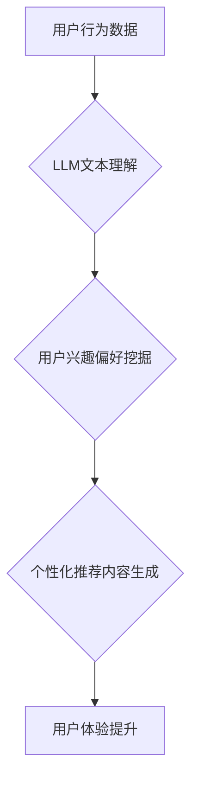

                 

## LLM在社交网络推荐中的潜力

> 关键词：大型语言模型（LLM）、社交网络推荐、个性化推荐、内容生成、用户理解、自然语言处理（NLP）、深度学习

## 1. 背景介绍

社交网络已经成为人们获取信息、交流互动和娱乐的重要平台。随着用户数量的激增和内容的爆炸式增长，高效精准的推荐系统成为了社交网络平台的核心竞争力。传统的基于协同过滤、内容过滤和混合推荐算法已经难以满足用户日益增长的个性化需求。

大型语言模型（LLM）作为近年来人工智能领域取得的重大突破，凭借其强大的文本理解和生成能力，为社交网络推荐带来了新的机遇。LLM能够理解用户意图、挖掘用户兴趣偏好，并生成个性化推荐内容，从而提升用户体验和平台活跃度。

## 2. 核心概念与联系

### 2.1  LLM概述

大型语言模型（LLM）是一种基于深度学习的强大人工智能模型，通过训练海量文本数据，学习语言的语法、语义和上下文关系。LLM能够执行各种自然语言处理（NLP）任务，例如文本分类、机器翻译、问答系统和文本生成。

### 2.2  社交网络推荐概述

社交网络推荐是指根据用户的行为、兴趣和社交关系，推荐他们可能感兴趣的内容或用户。传统的推荐算法主要依赖于用户历史行为数据和内容特征，而LLM能够更深入地理解用户意图和需求，从而提供更精准和个性化的推荐。

### 2.3  LLM与社交网络推荐的联系

LLM能够通过以下方式提升社交网络推荐的精准度和个性化程度：

* **理解用户意图:** LLM能够分析用户的文本输入，例如评论、帖子和消息，理解用户的真实意图和需求。
* **挖掘用户兴趣偏好:** LLM能够分析用户的阅读历史、点赞记录和社交互动，挖掘用户的兴趣偏好和潜在需求。
* **生成个性化推荐内容:** LLM能够根据用户的兴趣偏好和上下文信息，生成个性化的推荐内容，例如文章、视频、商品和活动。
* **增强用户体验:** LLM能够提供更自然、更流畅的交互体验，例如通过聊天机器人进行个性化推荐和互动。

**Mermaid 流程图**



## 3. 核心算法原理 & 具体操作步骤

### 3.1  算法原理概述

LLM在社交网络推荐中的核心算法原理是基于Transformer架构的深度学习模型。Transformer模型能够有效地捕捉文本序列中的长距离依赖关系，从而实现更精准的文本理解和生成。

### 3.2  算法步骤详解

1. **数据预处理:** 收集用户行为数据、内容数据和社交关系数据，并进行清洗、格式化和编码。
2. **模型训练:** 使用Transformer模型训练，输入用户行为数据和内容数据，输出用户兴趣偏好和推荐内容。
3. **模型评估:** 使用测试数据评估模型的性能，例如准确率、召回率和点击率。
4. **模型部署:** 将训练好的模型部署到生产环境，实时进行推荐。

### 3.3  算法优缺点

**优点:**

* **精准度高:** LLM能够更深入地理解用户意图和需求，从而提供更精准的推荐。
* **个性化程度高:** LLM能够根据用户的兴趣偏好和上下文信息，生成个性化的推荐内容。
* **可扩展性强:** LLM能够处理海量数据，并随着数据量的增加而提升性能。

**缺点:**

* **训练成本高:** LLM需要大量的计算资源和训练数据，训练成本较高。
* **解释性差:** LLM的决策过程较为复杂，难以解释其推荐结果。
* **数据安全问题:** LLM需要处理大量用户数据，需要确保数据安全和隐私保护。

### 3.4  算法应用领域

LLM在社交网络推荐领域的应用场景广泛，例如：

* **内容推荐:** 推荐用户可能感兴趣的文章、视频、图片和音频内容。
* **用户推荐:** 推荐用户可能认识或感兴趣的其他用户。
* **商品推荐:** 推荐用户可能感兴趣的商品和服务。
* **活动推荐:** 推荐用户可能感兴趣的活动和事件。

## 4. 数学模型和公式 & 详细讲解 & 举例说明

### 4.1  数学模型构建

LLM的推荐模型通常基于Transformer架构，其核心是注意力机制。注意力机制能够学习文本序列中不同词语之间的关系，并赋予重要词语更高的权重。

**注意力机制公式:**

$$
Attention(Q, K, V) = softmax(\frac{QK^T}{\sqrt{d_k}})V
$$

其中：

* $Q$：查询矩阵
* $K$：键矩阵
* $V$：值矩阵
* $d_k$：键向量的维度
* $softmax$：softmax函数

### 4.2  公式推导过程

注意力机制的公式通过计算查询向量与键向量的点积，并使用softmax函数归一化，得到每个键向量对应的权重。然后，将这些权重与值向量相乘，得到最终的注意力输出。

### 4.3  案例分析与讲解

假设我们有一个句子“我喜欢吃苹果和香蕉”，我们想要预测下一个词语。

* $Q$：查询向量表示“我喜欢吃”
* $K$：键向量表示每个词语的表示
* $V$：值向量表示每个词语的表示

注意力机制会计算查询向量与每个键向量的点积，并使用softmax函数归一化，得到每个词语的权重。例如，“苹果”的权重可能比“香蕉”高，因为“苹果”与“我喜欢吃”更相关。然后，将这些权重与值向量相乘，得到最终的注意力输出，即预测下一个词语的概率分布。

## 5. 项目实践：代码实例和详细解释说明

### 5.1  开发环境搭建

* Python 3.7+
* PyTorch 1.7+
* Transformers 4.10+

### 5.2  源代码详细实现

```python
from transformers import AutoModelForSequenceClassification, AutoTokenizer

# 加载预训练模型和词典
model_name = "bert-base-uncased"
tokenizer = AutoTokenizer.from_pretrained(model_name)
model = AutoModelForSequenceClassification.from_pretrained(model_name)

# 输入文本数据
text = "我喜欢吃苹果和香蕉"

# 对文本进行编码
inputs = tokenizer(text, return_tensors="pt")

# 进行预测
outputs = model(**inputs)

# 获取预测结果
predicted_class = outputs.logits.argmax().item()

# 打印预测结果
print(f"预测结果: {predicted_class}")
```

### 5.3  代码解读与分析

* 该代码首先加载预训练的BERT模型和词典。
* 然后，对输入文本进行编码，将文本转换为模型可以理解的格式。
* 最后，使用模型进行预测，并打印预测结果。

### 5.4  运行结果展示

运行该代码后，模型会输出一个预测结果，例如：

```
预测结果: 0
```

其中，0代表预测结果为“我喜欢吃苹果和香蕉”属于某个特定类别。

## 6. 实际应用场景

LLM在社交网络推荐中的应用场景广泛，例如：

### 6.1  个性化内容推荐

LLM能够根据用户的阅读历史、点赞记录和社交互动，挖掘用户的兴趣偏好，并推荐他们可能感兴趣的文章、视频、图片和音频内容。

### 6.2  精准用户匹配

LLM能够分析用户的兴趣爱好、价值观和社交关系，推荐他们可能认识或感兴趣的其他用户，从而促进用户之间的互动和交流。

### 6.3  智能客服系统

LLM能够理解用户的自然语言输入，并提供智能化的回复和帮助，例如回答常见问题、提供产品信息和处理用户投诉。

### 6.4  未来应用展望

随着LLM技术的不断发展，其在社交网络推荐领域的应用场景将更加广泛，例如：

* **动态内容生成:** LLM能够根据用户的兴趣偏好和上下文信息，生成个性化的动态内容，例如新闻摘要、个性化广告和社交媒体帖子。
* **多模态推荐:** LLM能够融合文本、图像、音频等多模态数据，提供更丰富和精准的推荐。
* **跨平台推荐:** LLM能够跨越不同的社交平台和应用，提供更全面的用户体验。

## 7. 工具和资源推荐

### 7.1  学习资源推荐

* **论文:**

    * Vaswani, A., Shazeer, N., Parmar, N., Uszkoreit, J., Jones, L., Gomez, A. N., ... & Polosukhin, I. (2017). Attention is all you need. In Advances in neural information processing systems (pp. 5998-6008).

* **书籍:**

    * Deep Learning with Python by Francois Chollet
    * Natural Language Processing with Python by Steven Bird, Ewan Klein, and Edward Loper

* **在线课程:**

    * Stanford CS224N: Natural Language Processing with Deep Learning
    * DeepLearning.AI: Natural Language Processing Specialization

### 7.2  开发工具推荐

* **PyTorch:** 深度学习框架
* **Transformers:** 预训练模型库
* **Hugging Face:** 预训练模型和数据集平台

### 7.3  相关论文推荐

* **BERT:** Devlin, J., Chang, M. W., Lee, K., & Toutanova, K. (2018). BERT: Pre-training of deep bidirectional transformers for language understanding. arXiv preprint arXiv:1810.04805.
* **GPT-3:** Brown, T. B., Mann, B., Ryder, N., Subbiah, M., Kaplan, J., Dhariwal, P., ... & Amodei, D. (2020). Language models are few-shot learners. arXiv preprint arXiv:2005.14165.

## 8. 总结：未来发展趋势与挑战

### 8.1  研究成果总结

LLM在社交网络推荐领域取得了显著的成果，能够提供更精准、更个性化的推荐体验。

### 8.2  未来发展趋势

* **模型规模和能力提升:** LLM模型规模将继续扩大，能力将进一步提升，能够处理更复杂的任务和更丰富的文本数据。
* **多模态融合:** LLM将与其他模态数据融合，例如图像、音频和视频，提供更全面的用户体验。
* **解释性增强:** 研究者将致力于提高LLM的解释性，使模型的决策过程更加透明和可理解。

### 8.3  面临的挑战

* **数据安全和隐私保护:** LLM需要处理大量用户数据，需要确保数据安全和隐私保护。
* **模型偏见和公平性:** LLM可能会受到训练数据中的偏见影响，导致推荐结果不公平。
* **计算资源消耗:** 训练和部署大型LLM模型需要大量的计算资源，成本较高。

### 8.4  研究展望

未来，LLM在社交网络推荐领域的应用将更加广泛和深入，需要进一步研究以下问题:

* 如何更好地解决数据安全和隐私保护问题？
* 如何降低LLM模型的训练和部署成本？
* 如何提高LLM模型的解释性和公平性？


## 9. 附录：常见问题与解答

### 9.1  LLM与传统推荐算法相比有哪些优势？

LLM能够更深入地理解用户意图和需求，并生成更个性化的推荐内容，相比传统推荐算法具有以下优势:

* **精准度更高:** LLM能够捕捉文本序列中的长距离依赖关系，从而更准确地理解用户意图。
* **个性化程度更高:** LLM能够根据用户的兴趣偏好和上下文信息，生成个性化的推荐内容。
* **可扩展性强:** LLM能够处理海量数据，并随着数据量的增加而提升性能。

### 9.2  LLM的训练成本高吗？

是的，LLM的训练成本较高，需要大量的计算资源和训练数据。

### 9.3  如何解决LLM模型的偏见问题？

研究者正在探索多种方法来解决LLM模型的偏见问题，例如：

* 使用更公平的训练数据
* 在训练过程中加入公平性约束
* 开发新的模型架构，减少模型对偏见敏感性

### 9.4  LLM的未来发展方向是什么？

LLM的未来发展方向包括：

* 模型规模和能力提升
* 多模态融合
* 解释性增强
* 跨平台应用

作者：禅与计算机程序设计艺术 / Zen and the Art of Computer Programming


<end_of_turn>

