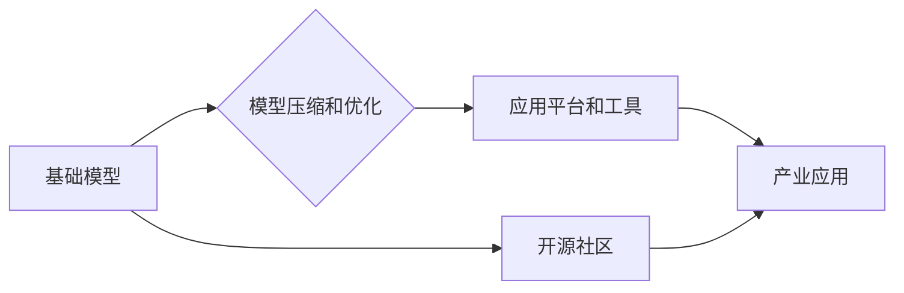

                 

## LLM生态圈:AI产业新格局初现

> 关键词：大型语言模型 (LLM)、AI生态圈、深度学习、自然语言处理 (NLP)、迁移学习、模型压缩、开源社区、产业应用

### 1. 背景介绍

近年来，人工智能（AI）技术突飞猛进，特别是深度学习的突破性进展，为大型语言模型（LLM）的诞生和发展提供了强劲动力。LLM，作为一种强大的AI技术，能够理解和生成人类语言，展现出令人惊叹的文本生成、翻译、问答、代码编写等能力。其广泛的应用潜力引发了全球科技巨头和创业公司的热切关注，也催生了蓬勃发展的LLM生态圈。

传统的AI应用往往依赖于特定领域的数据和模型，而LLM的出现打破了这一局限性。其强大的泛化能力和迁移学习特性使得它们能够在不同领域和任务中进行高效的应用，为AI技术走向更广泛的应用场景提供了可能。

### 2. 核心概念与联系

**2.1  LLM的定义和特点**

大型语言模型（LLM）是指参数量巨大、训练数据海量的人工智能模型，能够通过深度学习技术学习和理解人类语言的复杂结构和语义关系。其核心特点包括：

* **规模庞大:** LLM通常拥有数十亿甚至数千亿个参数，使其能够捕捉语言的复杂性和微妙性。
* **数据驱动:** LLM的训练依赖于海量文本数据，通过学习这些数据中的模式和规律，从而掌握语言的规则和知识。
* **泛化能力强:** 经过充分训练的LLM能够在不同领域和任务中进行有效应用，展现出强大的泛化能力。
* **迁移学习:** LLM可以利用预训练的知识和能力，通过少量领域特定数据进行微调，快速适应新的任务和领域。

**2.2  LLM生态圈的构成**

LLM生态圈是一个由多个关键要素组成的复杂系统，包括：

* **基础模型:** 这是LLM生态圈的核心，由大型科技公司或研究机构开发，例如GPT-3、BERT、LaMDA等。
* **模型压缩和优化技术:** 为了降低LLM的部署成本和资源消耗，需要采用模型压缩和优化技术，例如量化、剪枝、知识蒸馏等。
* **应用平台和工具:** 提供了基于LLM的应用开发和部署平台，例如HuggingFace、OpenAI API等，方便开发者利用LLM进行创新应用。
* **开源社区:** 众多开发者和研究者积极参与LLM的开源开发和研究，推动LLM技术的发展和普及。
* **产业应用:** LLM在各个行业领域都有着广泛的应用前景，例如自然语言处理、机器翻译、文本摘要、代码生成、聊天机器人等。

**2.3  LLM生态圈的架构**



### 3. 核心算法原理 & 具体操作步骤

**3.1  算法原理概述**

LLM的核心算法是基于Transformer网络架构的深度学习模型。Transformer网络通过自注意力机制（Self-Attention）和多头注意力机制（Multi-Head Attention）学习语言的上下文关系，能够捕捉长距离依赖关系，从而实现更准确的文本理解和生成。

**3.2  算法步骤详解**

LLM的训练过程主要包括以下步骤：

1. **数据预处理:** 收集海量文本数据，进行清洗、分词、标记等预处理操作，使其能够被模型理解和学习。
2. **模型构建:** 基于Transformer网络架构构建LLM模型，定义模型结构、参数数量等。
3. **模型训练:** 使用预处理后的数据训练模型，通过反向传播算法不断调整模型参数，使其能够生成更符合语义的文本。
4. **模型评估:** 使用测试数据评估模型的性能，例如准确率、困惑度等指标。
5. **模型部署:** 将训练好的模型部署到实际应用场景中，例如API接口、嵌入式系统等。

**3.3  算法优缺点**

**优点:**

* 强大的文本理解和生成能力
* 泛化能力强，能够应用于不同领域和任务
* 迁移学习特性，能够快速适应新的任务

**缺点:**

* 训练成本高，需要海量数据和计算资源
* 模型规模庞大，部署成本较高
* 存在潜在的偏差和误导性问题

**3.4  算法应用领域**

LLM在各个领域都有着广泛的应用前景，例如：

* **自然语言处理:** 文本分类、情感分析、问答系统、机器翻译等
* **人工智能助手:** 聊天机器人、虚拟助理、智能客服等
* **内容创作:** 文本生成、代码生成、剧本创作等
* **教育和科研:** 自动化写作、知识问答、数据分析等

### 4. 数学模型和公式 & 详细讲解 & 举例说明

**4.1  数学模型构建**

LLM的核心数学模型是基于Transformer网络架构的深度神经网络。Transformer网络由多个编码器（Encoder）和解码器（Decoder）层组成，每个层包含多头注意力机制、前馈神经网络等模块。

**4.2  公式推导过程**

Transformer网络的注意力机制的核心公式是：

$$
Attention(Q, K, V) = softmax(\frac{QK^T}{\sqrt{d_k}})V
$$

其中：

* $Q$：查询矩阵
* $K$：键矩阵
* $V$：值矩阵
* $d_k$：键向量的维度
* $softmax$：softmax函数

**4.3  案例分析与讲解**

假设我们有一个句子“我爱吃苹果”，将其转换为词向量表示，得到四个词向量：

* 我： [0.1, 0.2, 0.3]
* 爱： [0.4, 0.5, 0.6]
* 吃： [0.7, 0.8, 0.9]
* 苹果： [1.0, 1.1, 1.2]

通过注意力机制，模型可以学习到“爱”和“吃”之间的关系，以及“苹果”与“吃”之间的关系，从而更好地理解句子的语义。

### 5. 项目实践：代码实例和详细解释说明

**5.1  开发环境搭建**

LLM的开发环境通常需要具备强大的计算能力和丰富的软件工具支持。常用的开发环境包括：

* **云计算平台:** AWS、Google Cloud、Azure等
* **深度学习框架:** TensorFlow、PyTorch等
* **自然语言处理库:** NLTK、spaCy等

**5.2  源代码详细实现**

由于LLM的代码实现非常复杂，这里只提供一个简单的文本生成示例代码：

```python
from transformers import pipeline

generator = pipeline("text-generation", model="gpt2")

text = "今天天气真好"
output = generator(text, max_length=50, num_return_sequences=3)

for sequence in output:
    print(sequence["generated_text"])
```

**5.3  代码解读与分析**

这段代码使用HuggingFace Transformers库中的预训练模型gpt2进行文本生成。

* `pipeline("text-generation", model="gpt2")`：创建文本生成管道，使用gpt2模型。
* `generator(text, max_length=50, num_return_sequences=3)`：使用输入文本进行文本生成，最大长度为50个词，生成3个不同的文本序列。
* `print(sequence["generated_text"])`：打印生成的文本序列。

**5.4  运行结果展示**

运行这段代码后，会输出三个不同的文本序列，例如：

* 今天天气真好，阳光明媚。
* 今天天气真好，适合出去散步。
* 今天天气真好，心情愉悦。

### 6. 实际应用场景

LLM在各个行业领域都有着广泛的应用前景，例如：

* **自然语言处理:** 文本分类、情感分析、问答系统、机器翻译等
* **人工智能助手:** 聊天机器人、虚拟助理、智能客服等
* **内容创作:** 文本生成、代码生成、剧本创作等
* **教育和科研:** 自动化写作、知识问答、数据分析等

**6.1  案例分析**

* **聊天机器人:** LLM可以用于构建更智能、更自然的聊天机器人，能够理解用户的意图，并提供更精准的回复。例如，OpenAI的ChatGPT就是一个基于LLM的聊天机器人，能够进行流畅的对话，并完成各种任务，例如写作、翻译、编程等。
* **机器翻译:** LLM可以用于构建更准确、更流畅的机器翻译系统，能够更好地理解语言的语义和文化背景。例如，Google Translate已经开始使用LLM技术进行机器翻译，取得了显著的提升。
* **文本摘要:** LLM可以用于自动生成文本摘要，能够提取文本的关键信息，并生成简洁明了的摘要。例如，一些新闻网站和学术期刊已经开始使用LLM技术进行文本摘要。

**6.2  未来应用展望**

随着LLM技术的不断发展，其应用场景将会更加广泛，例如：

* **个性化教育:** LLM可以根据学生的学习进度和特点，提供个性化的学习内容和辅导。
* **医疗诊断:** LLM可以辅助医生进行疾病诊断，并提供个性化的治疗方案。
* **法律服务:** LLM可以用于法律文本分析、合同审查等，提高法律服务的效率和准确性。

### 7. 工具和资源推荐

**7.1  学习资源推荐**

* **书籍:**
    * 《深度学习》 by Ian Goodfellow, Yoshua Bengio, Aaron Courville
    * 《自然语言处理》 by Dan Jurafsky, James H. Martin
* **在线课程:**
    * Coursera: Deep Learning Specialization
    * Stanford CS224N: Natural Language Processing with Deep Learning
* **博客和网站:**
    * The Gradient
    * Towards Data Science
    * OpenAI Blog

**7.2  开发工具推荐**

* **深度学习框架:** TensorFlow, PyTorch
* **自然语言处理库:** NLTK, spaCy, HuggingFace Transformers
* **云计算平台:** AWS, Google Cloud, Azure

**7.3  相关论文推荐**

* Attention Is All You Need (Vaswani et al., 2017)
* BERT: Pre-training of Deep Bidirectional Transformers for Language Understanding (Devlin et al., 2018)
* GPT-3: Language Models are Few-Shot Learners (Brown et al., 2020)

### 8. 总结：未来发展趋势与挑战

**8.1  研究成果总结**

近年来，LLM技术取得了令人瞩目的进展，其强大的文本理解和生成能力为人工智能的广泛应用提供了新的可能性。

**8.2  未来发展趋势**

* **模型规模和能力的提升:** 未来LLM模型的规模将会进一步扩大，参数量将达到数万亿甚至数千亿级别，其能力将会更加强大，能够处理更复杂的任务。
* **多模态LLM的开发:** 未来LLM将会融合多模态数据，例如文本、图像、音频等，能够理解和生成更丰富的表达形式。
* **可解释性和安全性:** 未来LLM的研究将更加注重可解释性和安全性，使其能够更好地解释自己的决策过程，并避免潜在的偏差和误导性问题。

**8.3  面临的挑战**

* **计算资源和训练成本:** 训练大型LLM模型需要大量的计算资源和时间，成本非常高。
* **数据获取和标注:** LLM的训练依赖于海量高质量的数据，数据获取和标注是一个巨大的挑战。
* **伦理和社会影响:** LLM的应用可能会带来一些伦理和社会问题，例如信息操纵、隐私泄露等，需要引起足够的重视。

**8.4  研究展望**

未来LLM研究将朝着更加安全、可解释、高效的方向发展，并将其应用于更广泛的领域，推动人工智能技术向更智能、更普惠的方向发展。

### 9. 附录：常见问题与解答

**9.1  LLM与传统机器学习模型有什么区别？**

LLM是基于深度学习的Transformer网络架构，能够学习语言的上下文关系，而传统机器学习模型通常依赖于手工设计的特征，无法捕捉语言的复杂性和微妙性。

**9.2  如何训练一个LLM模型？**

训练LLM模型需要海量文本数据、强大的计算资源和专业的技术团队。通常需要使用深度学习框架，例如TensorFlow或PyTorch，并采用自监督学习或迁移学习等方法。

**9.3  LLM的应用场景有哪些？**

LLM在各个行业领域都有着广泛的应用前景，例如自然语言处理、人工智能助手、内容创作、教育和科研等。

**9.4  LLM有哪些开源工具和资源？**

HuggingFace Transformers库是一个非常受欢迎的LLM开源工具，提供了许多预训练模型和开发工具。此外，还有许多在线课程、博客和网站提供LLM相关的学习资源。


作者：禅与计算机程序设计艺术 / Zen and the Art of Computer Programming 
<end_of_turn>

