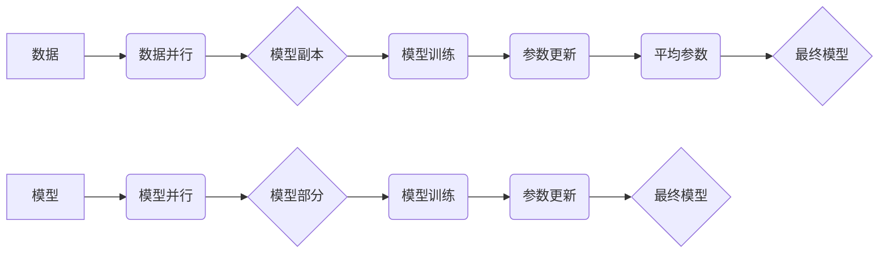

                 

## LLM的模型并行化方法比较

> 关键词：大型语言模型、模型并行、数据并行、模型并行策略、参数服务器、梯度累积、分布式训练

## 1. 背景介绍

大型语言模型 (LLM) 在自然语言处理领域取得了显著的进展，其强大的文本生成、理解和翻译能力为各种应用场景提供了新的可能性。然而，LLM 的规模庞大，训练和部署这些模型需要大量的计算资源和时间。为了应对这一挑战，模型并行化技术应运而生，它通过将模型参数分布在多个计算节点上进行训练，从而有效提高训练速度和模型规模。

随着模型规模的不断增长，模型并行化技术变得越来越重要。本文将深入探讨 LLMs 中常用的模型并行化方法，分析其原理、优缺点以及应用场景，并提供一些实践建议。

## 2. 核心概念与联系

模型并行化是指将一个大型模型的参数分布在多个计算节点上进行训练。通过这种方式，可以利用多个节点的计算能力，加速模型训练速度。

### 2.1 模型并行化策略

模型并行化策略决定了模型参数如何在多个节点上进行分配。常见的策略包括：

* **数据并行 (Data Parallelism):** 将训练数据均匀地分配到多个节点，每个节点训练一个独立的模型副本。模型副本之间共享相同的模型参数，并在训练结束后进行平均。
* **模型并行 (Model Parallelism):** 将模型参数分割成多个部分，分别分配到不同的节点上。每个节点负责训练模型的一部分，并通过通信机制进行参数更新。
* **混合并行 (Hybrid Parallelism):** 将数据并行和模型并行策略结合起来，以充分利用计算资源。

### 2.2 架构图



## 3. 核心算法原理 & 具体操作步骤

### 3.1 算法原理概述

模型并行化算法的核心思想是将模型参数分布在多个节点上，并通过通信机制进行参数更新。

* **数据并行:** 每个节点接收一部分训练数据，并训练一个独立的模型副本。模型副本之间共享相同的模型参数，并在训练结束后进行平均。
* **模型并行:** 模型参数被分割成多个部分，分别分配到不同的节点上。每个节点负责训练模型的一部分，并通过通信机制进行参数更新。

### 3.2 算法步骤详解

**数据并行:**

1. 将训练数据均匀地分配到多个节点上。
2. 每个节点训练一个独立的模型副本，并使用分配到的数据进行训练。
3. 在每个训练迭代结束时，每个节点将模型参数发送到参数服务器。
4. 参数服务器将所有节点的模型参数进行平均，并将其发送回每个节点。
5. 重复步骤 2-4，直到模型训练完成。

**模型并行:**

1. 将模型参数分割成多个部分，分别分配到不同的节点上。
2. 每个节点负责训练模型的一部分，并使用分配到的参数进行训练。
3. 在每个训练迭代结束时，每个节点将模型参数更新发送到其他节点。
4. 所有节点接收并应用来自其他节点的参数更新。
5. 重复步骤 2-4，直到模型训练完成。

### 3.3 算法优缺点

**数据并行:**

* **优点:** 实现简单，易于部署。
* **缺点:** 训练速度提升受限于节点数量，模型规模有限。

**模型并行:**

* **优点:** 可以训练更大的模型，训练速度提升显著。
* **缺点:** 实现复杂，通信开销较大。

### 3.4 算法应用领域

* **数据并行:** 适合训练规模较小的模型，例如文本分类、情感分析等。
* **模型并行:** 适合训练规模较大的模型，例如语言模型、图像识别模型等。

## 4. 数学模型和公式 & 详细讲解 & 举例说明

### 4.1 数学模型构建

假设模型参数为 $\theta$, 训练数据为 $\{x_i, y_i\}_{i=1}^{N}$, 损失函数为 $L(\theta, x_i, y_i)$. 数据并行训练的目标是找到最优参数 $\theta$，使得损失函数最小化:

$$
\theta^* = \arg \min_{\theta} \frac{1}{N} \sum_{i=1}^{N} L(\theta, x_i, y_i)
$$

模型并行训练的目标是将模型参数 $\theta$ 分配到多个节点上，并通过通信机制进行参数更新，最终找到最优参数 $\theta^*$.

### 4.2 公式推导过程

数据并行训练中，每个节点训练一个模型副本，并使用分配到的数据进行训练。在每个训练迭代结束时，每个节点将模型参数发送到参数服务器。参数服务器将所有节点的模型参数进行平均，并将其发送回每个节点。

假设有 $P$ 个节点，每个节点训练模型副本 $\theta_p$, 参数服务器存储平均参数 $\bar{\theta}$. 则参数更新公式为:

$$
\theta_p = \bar{\theta} + \eta \cdot \nabla_{\theta_p} L(\theta_p, x_p, y_p)
$$

其中，$\eta$ 为学习率，$\nabla_{\theta_p} L(\theta_p, x_p, y_p)$ 为节点 $p$ 模型参数 $\theta_p$ 关于损失函数 $L$ 的梯度。

### 4.3 案例分析与讲解

假设我们有一个包含 100 万个参数的模型，将其分布在 4 个节点上进行训练。每个节点负责训练模型的一部分，并使用分配到的数据进行训练。在每个训练迭代结束时，每个节点将模型参数更新发送到其他节点。所有节点接收并应用来自其他节点的参数更新。

通过模型并行化，我们可以将模型训练时间缩短到原来的 1/4，同时还可以训练更大的模型。

## 5. 项目实践：代码实例和详细解释说明

### 5.1 开发环境搭建

* 操作系统: Ubuntu 20.04
* Python 版本: 3.8
* 深度学习框架: PyTorch

### 5.2 源代码详细实现

```python
import torch
import torch.nn as nn
import torch.distributed as dist

# 定义模型
class MyModel(nn.Module):
    # ... 模型定义 ...

# 初始化分布式训练环境
dist.init_process_group(backend='nccl')

# 获取当前进程的 rank
rank = dist.get_rank()

# 创建模型实例
model = MyModel()

# 将模型参数分布到各个进程
model.to(rank)

# 定义优化器
optimizer = torch.optim.Adam(model.parameters())

# ... 训练循环 ...

# 保存模型参数
torch.save(model.state_dict(), f'model_params_{rank}.pth')
```

### 5.3 代码解读与分析

* `torch.distributed.init_process_group()` 初始化分布式训练环境。
* `dist.get_rank()` 获取当前进程的 rank。
* `model.to(rank)` 将模型参数分布到各个进程。
* `torch.optim.Adam()` 定义优化器。
* `torch.save()` 保存模型参数。

### 5.4 运行结果展示

运行上述代码后，模型参数将分布在各个进程上进行训练。训练结束后，每个进程将保存自己的模型参数。

## 6. 实际应用场景

模型并行化技术广泛应用于各种 LLMs 的训练和部署，例如：

* **语言模型:** GPT-3、BERT 等大型语言模型的训练需要大量的计算资源，模型并行化技术可以有效提高训练速度和模型规模。
* **机器翻译:** 模型并行化可以提高机器翻译模型的性能和效率。
* **图像识别:** 模型并行化可以训练更准确、更强大的图像识别模型。

### 6.4 未来应用展望

随着计算资源的不断发展，模型并行化技术将继续发挥重要作用，推动 LLMs 的发展。未来，模型并行化技术可能会朝着以下方向发展：

* **更复杂的模型并行策略:** 为了训练更大的模型，需要开发更复杂的模型并行策略，例如混合并行、模型剪枝等。
* **更高效的通信机制:** 为了减少通信开销，需要开发更高效的通信机制，例如异步通信、数据压缩等。
* **自动化模型并行化:** 为了降低模型并行化的门槛，需要开发自动化模型并行化工具，帮助开发者轻松地将模型进行并行化训练。

## 7. 工具和资源推荐

### 7.1 学习资源推荐

* **论文:**
    * "Deep Learning with Large-Scale Distributed Training"
    * "Parameter-Efficient Fine-Tuning"
* **博客:**
    * https://ai.googleblog.com/2017/01/distributed-training-of-deep-learning.html
    * https://towardsdatascience.com/model-parallelism-for-large-language-models-a-comprehensive-guide-911611372497

### 7.2 开发工具推荐

* **PyTorch:** https://pytorch.org/
* **TensorFlow:** https://www.tensorflow.org/

### 7.3 相关论文推荐

* "Scaling Laws for Neural Language Models"
* "Megatron-LM: Training Multi-30B Parameter Language Models with Model Parallelism"

## 8. 总结：未来发展趋势与挑战

### 8.1 研究成果总结

模型并行化技术为 LLMs 的训练和部署提供了强大的工具，使其能够训练更大的模型，并提高训练速度和效率。

### 8.2 未来发展趋势

未来，模型并行化技术将继续朝着以下方向发展：

* 更复杂的模型并行策略
* 更高效的通信机制
* 自动化模型并行化

### 8.3 面临的挑战

模型并行化技术也面临一些挑战，例如：

* 通信开销
* 模型复杂度
* 资源分配

### 8.4 研究展望

未来研究将集中在解决这些挑战，并开发更先进的模型并行化技术，推动 LLMs 的发展。

## 9. 附录：常见问题与解答

* **Q: 模型并行化和数据并行有什么区别？**

* **A:** 数据并行是指将训练数据均匀地分配到多个节点上，每个节点训练一个独立的模型副本。模型并行是指将模型参数分割成多个部分，分别分配到不同的节点上。

* **Q: 模型并行化有什么优点？**

* **A:** 模型并行化可以训练更大的模型，并提高训练速度。

* **Q: 模型并行化有什么缺点？**

* **A:** 模型并行化实现复杂，通信开销较大。


作者：禅与计算机程序设计艺术 / Zen and the Art of Computer Programming 
<end_of_turn>

