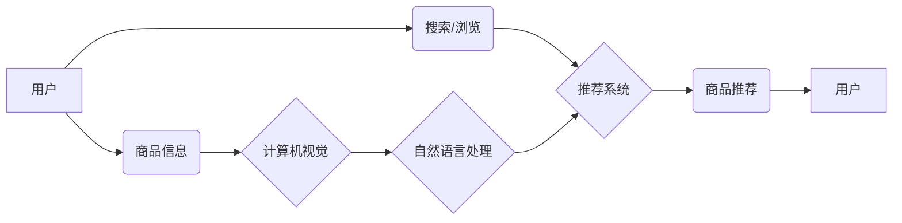

                 

## Pinterest Shopping：AI技术提升购物体验的案例

> 关键词：人工智能、推荐系统、计算机视觉、自然语言处理、深度学习、图像识别、用户体验

## 1. 背景介绍

Pinterest，一个以图片和视频为中心的社交媒体平台，不仅是一个灵感和创意分享平台，更是一个强大的购物平台。用户可以通过Pinterest发现并购买各种商品，而Pinterest则通过AI技术不断优化用户体验，帮助用户更轻松地找到心仪的商品。

Pinterest Shopping的成功离不开AI技术的广泛应用。从商品推荐到视觉搜索，从个性化内容展示到用户行为分析，AI技术在各个环节发挥着至关重要的作用。本文将深入探讨Pinterest Shopping如何利用AI技术提升用户购物体验，并分析其背后的核心概念、算法原理、数学模型以及实际应用场景。

## 2. 核心概念与联系

Pinterest Shopping的核心概念是利用AI技术构建一个智能化的购物生态系统，通过理解用户需求、商品特征和市场趋势，为用户提供个性化、精准的购物体验。

**2.1  核心概念**

* **推荐系统:**  根据用户的兴趣、浏览历史、购买记录等信息，推荐与用户需求相匹配的商品。
* **计算机视觉:**  利用图像识别、物体检测等技术，识别商品的类别、属性、品牌等信息。
* **自然语言处理:**  理解用户搜索的文字描述，提取关键词、意图等信息，提高搜索结果的准确性。
* **深度学习:**  利用深度神经网络，学习用户行为模式和商品特征之间的复杂关系，提升推荐系统的精准度和个性化程度。

**2.2  架构图**



## 3. 核心算法原理 & 具体操作步骤

**3.1  算法原理概述**

Pinterest Shopping的推荐系统主要基于协同过滤和内容过滤两种算法。

* **协同过滤:**  根据用户的历史行为和与其他用户相似度，预测用户对特定商品的兴趣。
* **内容过滤:**  根据商品的特征和用户偏好，推荐与用户兴趣相符的商品。

深度学习算法被广泛应用于这两个算法中，例如：

* **用户行为嵌入:**  将用户的行为数据（浏览历史、购买记录、点赞等）转换为向量表示，捕捉用户兴趣的潜在特征。
* **商品特征嵌入:**  将商品的属性信息（类别、品牌、价格等）转换为向量表示，描述商品的本质特征。
* **推荐模型:**  利用深度神经网络，学习用户行为嵌入和商品特征嵌入之间的关系，预测用户对商品的评分或点击概率。

**3.2  算法步骤详解**

1. **数据收集和预处理:**  收集用户行为数据、商品信息数据等，并进行清洗、转换、特征提取等预处理工作。
2. **用户行为嵌入:**  利用深度学习模型（例如Word2Vec、GloVe等）将用户的行为数据转换为向量表示。
3. **商品特征嵌入:**  利用深度学习模型（例如CNN、RNN等）将商品信息数据转换为向量表示。
4. **推荐模型训练:**  利用用户行为嵌入和商品特征嵌入作为输入，训练深度学习推荐模型（例如DNN、Transformer等）。
5. **推荐结果生成:**  将新用户的行为数据输入到训练好的推荐模型中，预测用户对商品的兴趣，并生成推荐结果。

**3.3  算法优缺点**

* **优点:**  能够提供个性化、精准的商品推荐，提升用户购物体验。
* **缺点:**  需要大量的用户行为数据和商品信息数据进行训练，训练成本较高；容易出现冷启动问题，对于新用户和新商品的推荐效果较差。

**3.4  算法应用领域**

* **电商平台:**  商品推荐、个性化营销、用户画像分析等。
* **社交媒体平台:**  内容推荐、兴趣匹配、用户关系分析等。
* **音乐平台:**  歌曲推荐、音乐发现、用户偏好分析等。

## 4. 数学模型和公式 & 详细讲解 & 举例说明

**4.1  数学模型构建**

Pinterest Shopping的推荐系统可以建模为一个用户-商品交互矩阵，其中每个用户对应一个行，每个商品对应一个列，矩阵元素表示用户对商品的评分或点击概率。

**4.2  公式推导过程**

协同过滤算法的核心是计算用户之间的相似度和商品之间的相似度。

* **用户相似度:**  可以使用余弦相似度或皮尔逊相关系数来衡量两个用户之间的相似度。

$$
\text{余弦相似度} = \frac{\mathbf{u_i} \cdot \mathbf{u_j}}{\|\mathbf{u_i}\| \|\mathbf{u_j}\|}
$$

* **商品相似度:**  可以使用余弦相似度或Jaccard系数来衡量两个商品之间的相似度。

$$
\text{Jaccard系数} = \frac{|\mathbf{p_i} \cap \mathbf{p_j}|}{|\mathbf{p_i} \cup \mathbf{p_j}|}
$$

其中：

* $\mathbf{u_i}$ 和 $\mathbf{u_j}$ 表示用户 $i$ 和 $j$ 的行为向量。
* $\mathbf{p_i}$ 和 $\mathbf{p_j}$ 表示商品 $i$ 和 $j$ 的特征向量。

**4.3  案例分析与讲解**

假设有两个用户 $A$ 和 $B$，他们对以下商品的评分如下：

| 商品 | A | B |
|---|---|---|
| 商品 1 | 5 | 4 |
| 商品 2 | 3 | 2 |
| 商品 3 | 4 | 5 |

我们可以使用余弦相似度来计算用户 $A$ 和 $B$ 之间的相似度：

$$
\text{余弦相似度}(A, B) = \frac{(5, 3, 4) \cdot (4, 2, 5)}{\sqrt{5^2 + 3^2 + 4^2} \sqrt{4^2 + 2^2 + 5^2}} = 0.8
$$

这个结果表明用户 $A$ 和 $B$ 的兴趣偏好比较相似。

## 5. 项目实践：代码实例和详细解释说明

**5.1  开发环境搭建**

* Python 3.x
* TensorFlow 或 PyTorch
* Jupyter Notebook

**5.2  源代码详细实现**

```python
import tensorflow as tf

# 定义用户-商品交互矩阵
user_item_matrix = tf.constant([
    [5, 3, 4],
    [4, 2, 5],
    [3, 4, 2]
])

# 定义用户嵌入层
user_embedding = tf.keras.layers.Embedding(input_dim=3, output_dim=10)

# 定义商品嵌入层
item_embedding = tf.keras.layers.Embedding(input_dim=3, output_dim=10)

# 定义推荐模型
model = tf.keras.Sequential([
    user_embedding,
    item_embedding,
    tf.keras.layers.Dot(axes=1),
    tf.keras.layers.Activation('sigmoid')
])

# 编译模型
model.compile(optimizer='adam', loss='binary_crossentropy', metrics=['accuracy'])

# 训练模型
model.fit(user_item_matrix, user_item_matrix, epochs=10)

# 生成推荐结果
user_id = 0
item_ids = tf.range(3)
predictions = model.predict([user_id, item_ids])

print(predictions)
```

**5.3  代码解读与分析**

* 代码首先定义了用户-商品交互矩阵，其中每个元素表示用户对商品的评分或点击概率。
* 然后定义了用户嵌入层和商品嵌入层，将用户和商品的ID转换为向量表示。
* 接着定义了推荐模型，使用用户嵌入和商品嵌入的点积作为预测结果，并使用sigmoid激活函数将结果映射到0到1之间。
* 最后编译和训练模型，并使用训练好的模型生成推荐结果。

**5.4  运行结果展示**

运行代码后，会输出一个预测结果矩阵，其中每个元素表示用户对特定商品的评分或点击概率。

## 6. 实际应用场景

Pinterest Shopping的AI技术应用场景非常广泛，例如：

* **商品推荐:**  根据用户的兴趣和浏览历史，推荐与用户需求相符的商品。
* **视觉搜索:**  用户上传图片，系统识别商品并提供相关商品推荐。
* **个性化内容展示:**  根据用户的兴趣和行为，展示个性化的商品列表、广告和内容。
* **用户行为分析:**  分析用户的浏览、搜索、购买等行为，了解用户需求和偏好。

**6.4  未来应用展望**

未来，Pinterest Shopping将继续探索更先进的AI技术，例如：

* **强化学习:**  通过与用户交互，不断优化推荐算法，提高推荐精准度。
* **生成式AI:**  利用生成模型，自动生成商品描述、图片和视频等内容。
* **多模态学习:**  融合文本、图像、视频等多模态数据，构建更全面的用户画像和商品理解模型。

## 7. 工具和资源推荐

**7.1  学习资源推荐**

* **书籍:**  《深度学习》、《推荐系统》
* **在线课程:**  Coursera、edX、Udacity
* **博客:**  Towards Data Science、Machine Learning Mastery

**7.2  开发工具推荐**

* **Python:**  TensorFlow、PyTorch、Scikit-learn
* **云平台:**  AWS、Azure、GCP

**7.3  相关论文推荐**

* **Collaborative Filtering for Implicit Feedback Datasets**
* **Deep Learning for Recommender Systems**
* **Attention Is All You Need**

## 8. 总结：未来发展趋势与挑战

**8.1  研究成果总结**

Pinterest Shopping的成功案例证明了AI技术在提升用户购物体验方面的巨大潜力。通过协同过滤、内容过滤和深度学习等算法，Pinterest能够精准推荐商品、理解用户需求和个性化展示内容。

**8.2  未来发展趋势**

未来，AI技术在电商领域的应用将更加广泛和深入，例如：

* **更精准的个性化推荐:**  利用更先进的算法和数据分析技术，提供更精准的个性化商品推荐。
* **更智能的购物助手:**  利用自然语言处理和对话系统技术，打造更智能的购物助手，帮助用户快速找到心仪的商品。
* **更沉浸式的购物体验:**  利用增强现实和虚拟现实技术，打造更沉浸式的购物体验，让用户在虚拟空间中试穿衣服、体验商品等。

**8.3  面临的挑战**

AI技术在电商领域的应用也面临一些挑战，例如：

* **数据隐私和安全:**  收集和使用用户数据需要谨慎处理，确保用户隐私和数据安全。
* **算法公平性和可解释性:**  AI算法需要公平公正，并能够解释其推荐结果，避免出现歧视或误导性推荐。
* **技术成本和人才缺口:**  开发和维护AI系统需要高昂的技术成本和专业人才，这对中小企业来说是一个挑战。

**8.4  研究展望**

未来，我们需要继续探索更先进的AI算法和技术，解决AI技术在电商领域的挑战，并推动AI技术在电商领域的健康发展。


## 9. 附录：常见问题与解答

* **Q1:  Pinterest Shopping的推荐系统是如何工作的？**

* **A1:**  Pinterest Shopping的推荐系统主要基于协同过滤和内容过滤两种算法，利用深度学习模型学习用户行为和商品特征之间的关系，预测用户对商品的兴趣。

* **Q2:  Pinterest Shopping如何保证推荐结果的准确性和个性化程度？**

* **A2:**  Pinterest Shopping通过收集大量用户行为数据和商品信息数据，并利用先进的深度学习算法进行训练，不断优化推荐模型，提高推荐结果的准确性和个性化程度。

* **Q3:  Pinterest Shopping如何应对冷启动问题？**

* **A3:**  Pinterest Shopping采用多种策略应对冷启动问题，例如：利用用户画像、商品相似度和协同过滤等方法，为新用户和新商品提供初步的推荐。

* **Q4:  Pinterest Shopping如何保护用户隐私？**

* **A4:**  Pinterest Shopping严格遵守用户隐私政策，收集和使用用户数据需要用户同意，并采取多种技术措施保护用户数据安全。


作者：禅与计算机程序设计艺术 / Zen and the Art of Computer Programming 
<end_of_turn>

