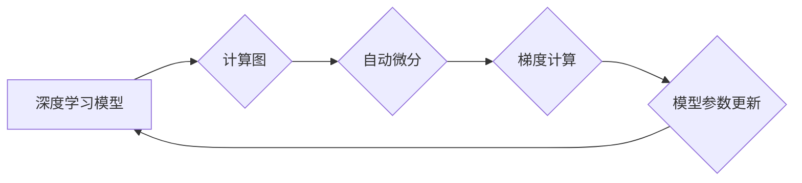

                 

## PyTorch vs JAX：深度学习框架的比较与选择

> 关键词：PyTorch, JAX, 深度学习, 框架, 自动微分, XLA, 性能优化, 科学计算

## 1. 背景介绍

深度学习近年来取得了令人瞩目的成就，推动了人工智能领域的飞速发展。深度学习模型的训练和部署离不开高效的深度学习框架。PyTorch 和 JAX 作为两个备受关注的深度学习框架，在学术界和工业界都获得了广泛应用。

PyTorch 由 Facebook AI Research (FAIR) 开发，以其灵活性和易用性而闻名。它采用动态计算图的机制，允许用户在运行时构建和修改计算图，这使得 PyTorch 更适合于研究和快速原型开发。

JAX 由 Google DeepMind 开发，以其高性能和强大的数学功能而著称。它基于 XLA (Accelerated Linear Algebra) 编译器，能够将代码编译为高效的机器码，从而实现高性能计算。JAX 还支持自动微分和高阶函数，为科学计算和数学建模提供了强大的工具。

## 2. 核心概念与联系

### 2.1 深度学习框架

深度学习框架提供了一套工具和库，用于构建、训练和部署深度学习模型。它们抽象了底层硬件和软件细节，使开发者能够专注于模型的设计和训练。

### 2.2 计算图

计算图是一种数据结构，用于表示深度学习模型的计算过程。每个节点代表一个操作，每个边代表一个数据流。

### 2.3 自动微分

自动微分是一种技术，用于自动计算函数的梯度。它在深度学习中至关重要，因为梯度用于更新模型参数。

### 2.4 XLA 编译器

XLA (Accelerated Linear Algebra) 是一种编译器，用于优化线性代数运算。它能够将 Python 代码编译为高效的机器码，从而提高计算性能。

**Mermaid 流程图**



## 3. 核心算法原理 & 具体操作步骤

### 3.1 算法原理概述

PyTorch 和 JAX 都基于反向传播算法训练深度学习模型。反向传播算法的核心思想是通过计算梯度来更新模型参数，从而最小化模型的损失函数。

### 3.2 算法步骤详解

1. **前向传播:** 将输入数据通过模型进行计算，得到输出结果。
2. **损失函数计算:** 计算模型输出与真实值的差异，即损失函数的值。
3. **反向传播:** 计算损失函数对每个参数的梯度。
4. **参数更新:** 使用梯度下降算法更新模型参数，从而减小损失函数的值。

### 3.3 算法优缺点

**PyTorch**

* **优点:** 灵活、易用、社区活跃。
* **缺点:** 性能相对较低，缺乏 JAX 的 XLA 编译器优化。

**JAX**

* **优点:** 高性能、强大的数学功能、支持自动微分和高阶函数。
* **缺点:** 学习曲线相对陡峭，社区相对较小。

### 3.4 算法应用领域

PyTorch 和 JAX 都广泛应用于各种深度学习领域，例如：

* **计算机视觉:** 图像分类、目标检测、图像分割等。
* **自然语言处理:** 文本分类、机器翻译、文本生成等。
* **语音识别:** 语音转文本、语音合成等。
* **强化学习:** 游戏 AI、机器人控制等。

## 4. 数学模型和公式 & 详细讲解 & 举例说明

### 4.1 数学模型构建

深度学习模型通常由多个层组成，每层都包含多个神经元。每个神经元接收来自上一层的输入，并通过激活函数进行处理，输出到下一层。

**示例:**

一个简单的全连接神经网络模型可以表示为：

```
y = f(W * x + b)
```

其中：

* $y$ 是模型输出
* $x$ 是输入数据
* $W$ 是权重矩阵
* $b$ 是偏置向量
* $f$ 是激活函数

### 4.2 公式推导过程

反向传播算法的核心是计算梯度。梯度表示损失函数对每个参数的偏导数。

**示例:**

假设损失函数为均方误差 (MSE)，则梯度可以表示为：

```
∂L/∂W = 2 * (y - t) * x^T
```

其中：

* $L$ 是损失函数
* $t$ 是真实值

### 4.3 案例分析与讲解

**示例:**

假设我们训练一个图像分类模型，目标是将图像分类为猫或狗。我们可以使用交叉熵损失函数来衡量模型的性能。

**交叉熵损失函数:**

```
L = - (y * log(p) + (1 - y) * log(1 - p))
```

其中：

* $y$ 是真实标签 (0 或 1)
* $p$ 是模型预测的概率

通过反向传播算法，我们可以计算损失函数对模型参数的梯度，并使用梯度下降算法更新模型参数，从而提高模型的分类准确率。

## 5. 项目实践：代码实例和详细解释说明

### 5.1 开发环境搭建

PyTorch 和 JAX 都支持多种操作系统和硬件平台。

**PyTorch:**

* 安装 Python 3.6 或更高版本
* 使用 pip 安装 PyTorch 库

**JAX:**

* 安装 Python 3.7 或更高版本
* 使用 pip 安装 JAX 库

### 5.2 源代码详细实现

**PyTorch:**

```python
import torch
import torch.nn as nn

class SimpleNet(nn.Module):
    def __init__(self):
        super(SimpleNet, self).__init__()
        self.linear1 = nn.Linear(10, 5)
        self.linear2 = nn.Linear(5, 1)

    def forward(self, x):
        x = torch.relu(self.linear1(x))
        x = self.linear2(x)
        return x

model = SimpleNet()
optimizer = torch.optim.Adam(model.parameters(), lr=0.01)
loss_fn = nn.MSELoss()

# 训练循环
for epoch in range(10):
    # 前向传播
    outputs = model(inputs)
    # 计算损失
    loss = loss_fn(outputs, targets)
    # 反向传播
    optimizer.zero_grad()
    loss.backward()
    # 更新参数
    optimizer.step()
```

**JAX:**

```python
import jax
import jax.numpy as jnp
from flax import linen as nn

class SimpleNet(nn.Module):
    @nn.compact
    def __call__(self, x):
        x = nn.relu(nn.Dense(5)(x))
        x = nn.Dense(1)(x)
        return x

model = SimpleNet()
optimizer = jax.optimizers.adam(learning_rate=0.01)
loss_fn = jnp.mean(jnp.square(model.apply(params, inputs) - targets))

# 训练循环
for epoch in range(10):
    # 前向传播
    outputs = model.apply(params, inputs)
    # 计算损失
    loss = loss_fn(outputs, targets)
    # 反向传播
    grads = jax.grad(loss)(params)
    # 更新参数
    params = optimizer.update(grads, params)
```

### 5.3 代码解读与分析

PyTorch 和 JAX 的代码实现都遵循类似的结构。

* **模型定义:** 使用 nn.Module 类定义 PyTorch 模型，使用 flax.linen.Module 类定义 JAX 模型。
* **前向传播:** 定义模型的计算过程，即输入数据如何经过各个层进行处理。
* **损失函数:** 定义用于衡量模型性能的损失函数。
* **优化器:** 定义用于更新模型参数的优化算法。
* **训练循环:** 迭代训练模型，计算损失，反向传播梯度，更新参数。

### 5.4 运行结果展示

训练完成后，可以评估模型的性能，例如计算准确率、损失值等。

## 6. 实际应用场景

### 6.1 图像分类

PyTorch 和 JAX 都可以用于构建图像分类模型，例如 ResNet、VGG 等。

### 6.2 自然语言处理

PyTorch 和 JAX 都可以用于构建自然语言处理模型，例如 BERT、GPT 等。

### 6.3 科学计算

JAX 的高性能和强大的数学功能使其非常适合于科学计算，例如数值模拟、机器学习算法开发等。

### 6.4 未来应用展望

随着深度学习技术的不断发展，PyTorch 和 JAX 将在更多领域得到应用，例如：

* **自动驾驶:** 构建自动驾驶系统的感知、决策和控制模块。
* **医疗诊断:** 辅助医生进行疾病诊断和治疗方案制定。
* **金融预测:** 进行股票价格预测、风险评估等。

## 7. 工具和资源推荐

### 7.1 学习资源推荐

* **PyTorch 官方文档:** https://pytorch.org/docs/stable/
* **JAX 官方文档:** https://jax.readthedocs.io/en/latest/
* **深度学习书籍:** 深度学习，深度学习实践，深度学习框架

### 7.2 开发工具推荐

* **IDE:** PyCharm, VS Code
* **GPU加速库:** CUDA, cuDNN

### 7.3 相关论文推荐

* **Attention Is All You Need:** https://arxiv.org/abs/1706.03762
* **BERT: Pre-training of Deep Bidirectional Transformers for Language Understanding:** https://arxiv.org/abs/1810.04805

## 8. 总结：未来发展趋势与挑战

### 8.1 研究成果总结

PyTorch 和 JAX 都是强大的深度学习框架，各自拥有独特的优势。PyTorch 以其易用性和灵活性而闻名，JAX 以其高性能和强大的数学功能而著称。

### 8.2 未来发展趋势

未来，深度学习框架将朝着以下方向发展：

* **更易用:** 提供更直观、更友好的用户界面和开发体验。
* **更高效:** 进一步优化计算性能，降低训练时间和资源消耗。
* **更强大:** 支持更多类型的模型和算法，例如强化学习、生成对抗网络等。
* **更安全:** 加强模型安全性，防止攻击和数据泄露。

### 8.3 面临的挑战

深度学习框架也面临一些挑战：

* **模型复杂度:** 深度学习模型越来越复杂，训练和部署越来越困难。
* **数据隐私:** 深度学习模型需要大量数据进行训练，如何保护数据隐私是一个重要问题。
* **可解释性:** 深度学习模型的决策过程难以解释，如何提高模型的可解释性是一个研究热点。

### 8.4 研究展望

未来，我们将继续研究和开发更强大、更易用、更安全的深度学习框架，推动人工智能技术的进步。

## 9. 附录：常见问题与解答

### 9.1 PyTorch 和 JAX 的区别是什么？

PyTorch 和 JAX 都是强大的深度学习框架，但它们在一些方面有所不同。

* **计算图:** PyTorch 使用动态计算图，而 JAX 使用静态计算图。
* **性能:** JAX 通常比 PyTorch 更快，因为它可以利用 XLA 编译器进行优化。
* **易用性:** PyTorch 更加易于学习和使用，因为它更接近传统的 Python 代码风格。

### 9.2 如何选择 PyTorch 或 JAX？

选择 PyTorch 或 JAX 取决于您的具体需求。

* 如果您需要一个易于学习和使用的框架，并且对性能要求不高，那么 PyTorch 是一个不错的选择。
* 如果您需要一个高性能的框架，并且对数学功能有较高要求，那么 JAX 是一个更好的选择。

### 9.3 PyTorch 和 JAX 的未来发展趋势是什么？

PyTorch 和 JAX 都将继续朝着更易用、更高效、更强大的方向发展。

* PyTorch 将继续改进其易用性和社区支持。
* JAX 将继续优化其性能和数学功能，并支持更多类型的模型和算法。


作者：禅与计算机程序设计艺术 / Zen and the Art of Computer Programming 
<end_of_turn>

