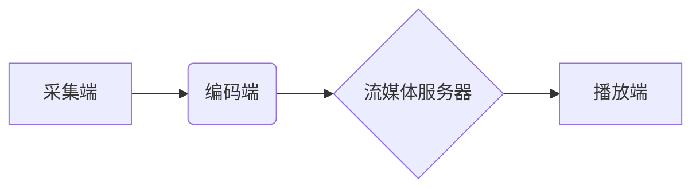

                 

## SRS流媒体服务器：构建直播平台的选择

> 关键词：SRS流媒体服务器，直播平台，流媒体技术，RTMP协议，HLS协议，低延迟直播，高并发直播，视频编码，CDN加速

## 1. 背景介绍

随着互联网技术的快速发展和移动设备的普及，直播平台已成为人们获取信息、娱乐消遣和社交互动的重要途径。直播平台的兴起也催生了对高性能、低延迟、高可靠性的流媒体服务器的需求。

SRS（Simple Realtime Streaming Server）是一个开源的、高性能的流媒体服务器，它支持多种协议，包括RTMP、HLS、WebRTC等，能够满足各种直播场景的需求。本文将深入探讨SRS流媒体服务器的特点、架构、核心算法原理以及实际应用场景，帮助读者了解如何选择SRS构建直播平台。

## 2. 核心概念与联系

### 2.1 流媒体技术概述

流媒体技术是指将媒体内容（如音频、视频）以连续流的方式传输和播放的技术。与传统的点播模式不同，流媒体内容在传输过程中不断更新，用户可以实时观看或收听。

### 2.2 直播平台架构

直播平台通常由以下几个主要模块组成：

* **采集端:** 用于采集视频和音频信号，可以是摄像头、麦克风、游戏设备等。
* **编码端:** 将采集到的视频和音频信号进行编码，压缩成适合网络传输的格式。
* **流媒体服务器:** 接收编码后的视频和音频流，进行转发、存储、播放等操作。
* **播放端:** 用户通过浏览器、手机APP等设备接收并播放流媒体内容。

### 2.3 SRS流媒体服务器架构

SRS流媒体服务器采用分层架构，主要包括以下几个组件：

* **接收层:** 负责接收来自采集端的视频和音频流，支持多种协议，如RTMP、HLS等。
* **处理层:** 对接收到的流进行处理，包括解码、转码、重打包等操作。
* **存储层:** 可选，用于存储直播内容，方便用户回看。
* **播放层:** 负责将流媒体内容转发给播放端，支持多种播放协议，如HLS、DASH等。

**Mermaid 流程图**

## 3. 核心算法原理 & 具体操作步骤

### 3.1 算法原理概述

SRS流媒体服务器的核心算法包括视频和音频编码、流媒体协议处理、数据转发、缓存管理等。

* **视频编码:** SRS支持多种视频编码格式，如H.264、H.265等，通过压缩算法将视频数据量减少，提高传输效率。
* **音频编码:** SRS支持多种音频编码格式，如AAC、MP3等，通过压缩算法将音频数据量减少，提高传输效率。
* **流媒体协议处理:** SRS支持多种流媒体协议，如RTMP、HLS、WebRTC等，能够与不同的采集端和播放端进行通信。
* **数据转发:** SRS能够将流媒体数据转发到不同的播放端，实现多用户同时观看直播。
* **缓存管理:** SRS支持缓存机制，将热门直播内容缓存到本地服务器，提高播放效率和降低延迟。

### 3.2 算法步骤详解

1. **采集端:** 采集视频和音频信号，并将其编码成符合SRS支持的格式。
2. **编码端:** 将采集到的视频和音频信号进行编码，压缩成适合网络传输的格式。
3. **流媒体服务器:** 接收编码后的视频和音频流，进行解码、转码、重打包等操作。
4. **播放端:** 接收流媒体内容，并将其解码播放。

### 3.3 算法优缺点

**优点:**

* 高性能：SRS采用高效的算法和架构，能够处理高并发直播。
* 低延迟：SRS支持多种低延迟传输协议，能够提供流畅的直播体验。
* 高可靠性：SRS支持冗余机制和故障切换，能够保证直播的稳定性。
* 开源免费：SRS是一个开源项目，可以免费使用和修改。

**缺点:**

* 配置复杂：SRS的配置相对复杂，需要一定的技术基础。
* 功能有限：SRS的功能相对有限，一些高级功能需要额外开发。

### 3.4 算法应用领域

SRS流媒体服务器广泛应用于以下领域：

* 直播平台：用于直播游戏、演唱会、体育赛事等。
* 视频会议：用于远程会议、在线教育等。
* 视频监控：用于远程监控、安防等。

## 4. 数学模型和公式 & 详细讲解 & 举例说明

### 4.1 数学模型构建

流媒体服务器的性能评估通常涉及以下几个方面：

* **带宽利用率:** 指服务器处理的流媒体数据量占总带宽的比例。
* **延迟:** 指从采集端到播放端传输数据所花费的时间。
* **丢包率:** 指传输过程中丢失的数据包的比例。

这些指标可以用数学模型来表示，例如：

* **带宽利用率:**  带宽利用率 = 处理数据量 / 总带宽
* **延迟:** 延迟 = 传输时间 - 编码时间 - 解码时间

### 4.2 公式推导过程

带宽利用率的计算公式可以推导如下：

假设服务器处理的流媒体数据量为 $D$，总带宽为 $B$，则带宽利用率为：

带宽利用率 = $D / B$

### 4.3 案例分析与讲解

假设一个直播平台的服务器处理的数据量为 10Mbps，总带宽为 100Mbps，则带宽利用率为：

带宽利用率 = 10Mbps / 100Mbps = 0.1 = 10%

## 5. 项目实践：代码实例和详细解释说明

### 5.1 开发环境搭建

* 操作系统：Linux (Ubuntu/CentOS)
* 编程语言：C++
* 编译器：g++
* 其他依赖：libcurl、libxml2、ffmpeg等

### 5.2 源代码详细实现

SRS的源代码可以在官方网站上下载：https://github.com/ossrs/srs

### 5.3 代码解读与分析

SRS的源代码主要包含以下几个模块：

* **接收层:** 处理来自客户端的流媒体数据，支持RTMP、HLS等协议。
* **处理层:** 对接收到的流媒体数据进行解码、转码、重打包等操作。
* **存储层:** 可选，用于存储直播内容。
* **播放层:** 将流媒体数据转发给播放端。

### 5.4 运行结果展示

运行SRS服务器后，可以使用RTMP客户端连接到服务器，进行直播测试。

## 6. 实际应用场景

### 6.1 直播平台

SRS流媒体服务器可以用于构建各种类型的直播平台，例如：

* 游戏直播平台：用于直播游戏比赛、游戏攻略等。
* 音视频直播平台：用于直播音乐会、演唱会、戏剧表演等。
* 教育直播平台：用于在线教学、远程会议等。

### 6.2 视频会议

SRS流媒体服务器也可以用于构建视频会议系统，例如：

* 企业视频会议：用于远程协作、会议讨论等。
* 在线教育视频会议：用于远程教学、在线答疑等。

### 6.3 视频监控

SRS流媒体服务器还可以用于视频监控系统，例如：

* 家庭安全监控：用于远程监控家庭安全。
* 商业场所监控：用于监控商业场所的安全。

### 6.4 未来应用展望

随着流媒体技术的不断发展，SRS流媒体服务器的应用场景将会更加广泛，例如：

* VR/AR直播：用于直播虚拟现实和增强现实体验。
* 互动直播：支持用户实时互动，例如投票、问答等。
* 边缘计算直播：将直播处理能力部署到边缘节点，降低延迟。

## 7. 工具和资源推荐

### 7.1 学习资源推荐

* SRS官方文档：https://github.com/ossrs/srs/blob/master/doc/README.md
* SRS博客：https://www.srs.io/blog/
* 流媒体技术相关书籍：

### 7.2 开发工具推荐

* 编码工具：ffmpeg
* 流媒体测试工具：vlc、FFplay
* 网络监控工具：tcpdump、Wireshark

### 7.3 相关论文推荐

* **Low-Latency Live Streaming over HTTP/2**
* **Adaptive Bitrate Streaming for Mobile Devices**
* **A Survey of Real-Time Streaming Protocols**

## 8. 总结：未来发展趋势与挑战

### 8.1 研究成果总结

SRS流媒体服务器是一个成熟、可靠、高性能的开源流媒体解决方案，它能够满足各种直播场景的需求。

### 8.2 未来发展趋势

* **低延迟直播:** 随着用户对直播体验的要求越来越高，低延迟直播将成为未来发展的重要趋势。
* **高并发直播:** 随着直播平台的用户数量不断增长，高并发直播将成为另一个重要的发展方向。
* **智能化直播:** 利用人工智能技术，实现直播内容的智能分析、推荐和互动。

### 8.3 面临的挑战

* **网络环境复杂:** 流媒体传输需要克服网络拥塞、丢包等问题。
* **安全问题:** 直播平台需要保障用户数据安全和直播内容的版权保护。
* **技术迭代快速:** 流媒体技术发展迅速，需要不断更新和改进SRS服务器。

### 8.4 研究展望

未来，我们将继续致力于SRS流媒体服务器的研发和改进，使其能够更好地满足用户的需求，并推动流媒体技术的创新发展。

## 9. 附录：常见问题与解答

* **如何安装SRS流媒体服务器？**

* **如何配置SRS流媒体服务器？**

* **如何使用RTMP客户端连接到SRS服务器？**

* **如何使用HLS协议播放直播内容？**

* **如何解决SRS服务器的常见问题？**

作者：禅与计算机程序设计艺术 / Zen and the Art of Computer Programming 
<end_of_turn>

