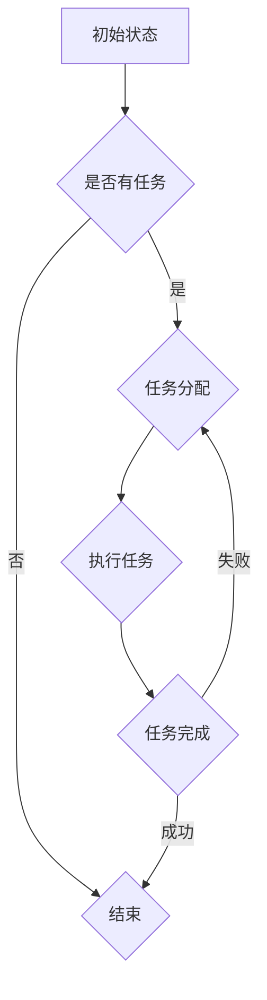

                 

# 多智能体协同在复杂项目中的应用

> **关键词**：多智能体系统，协同，复杂项目，AI，分布式计算，算法优化

> **摘要**：本文探讨了多智能体协同在复杂项目中的应用，详细分析了多智能体系统的基本概念、架构、核心算法，并通过具体的项目实践展示了其在实际开发中的重要作用。文章旨在为读者提供一套完整的理论框架和实践指导，帮助他们在复杂项目中有效地应用多智能体协同技术。

## 1. 背景介绍

随着信息技术的迅猛发展，复杂项目的开发需求不断增加。这类项目通常涉及多个功能模块的协同工作，数据处理量大，系统复杂性高，对开发者和运维人员提出了更高的要求。多智能体系统（MAS）作为一种新型的分布式计算模型，能够有效地解决这些复杂性问题。它通过将任务分解为多个智能体，实现分布式计算和协同工作，从而提高系统的效率和可靠性。

在复杂项目中，多智能体协同技术可以应用于以下几个方面：

1. **任务分解与分配**：将大型任务分解为多个子任务，分配给不同的智能体，实现并行处理。
2. **动态资源调度**：根据系统负载和资源状况，动态调整智能体的任务分配，优化资源利用率。
3. **容错性与鲁棒性**：通过智能体的冗余设计和协同工作，提高系统的容错性和鲁棒性。
4. **智能决策**：利用智能体的自主学习和决策能力，实现更智能的运行和管理。

本文将围绕这些方面，详细介绍多智能体协同在复杂项目中的应用，为读者提供一套实用的解决方案。

## 2. 核心概念与联系

### 2.1 多智能体系统的定义

多智能体系统（MAS）是由多个具有自主决策能力的智能体组成的系统。每个智能体都是独立的计算实体，可以自主感知环境、规划行为并执行任务。智能体之间通过通信和协作实现共同目标。MAS的核心在于智能体的自主性、协同性和适应性。

### 2.2 多智能体系统的架构

多智能体系统的架构通常包括以下几个层次：

1. **物理层**：描述智能体的物理实现，包括硬件和软件资源。
2. **通信层**：实现智能体之间的通信，包括消息传递、协议和接口。
3. **决策层**：智能体的核心，负责感知环境、规划行为和执行任务。
4. **协作层**：管理智能体之间的协作关系，包括任务分配、协商和协调。

### 2.3 多智能体系统的核心算法

多智能体系统中的核心算法包括：

1. **通信算法**：实现智能体之间的有效通信，包括消息传递机制、路由算法等。
2. **决策算法**：智能体的决策过程，包括感知环境、规划行为和执行任务等。
3. **协作算法**：管理智能体之间的协作关系，包括任务分配、协商和协调等。
4. **学习算法**：智能体的自主学习能力，包括经验学习、模式识别等。

### 2.4 多智能体系统的优势

多智能体系统具有以下优势：

1. **分布式计算**：通过将任务分解为多个子任务，实现并行处理，提高系统效率。
2. **容错性与鲁棒性**：通过智能体的冗余设计和协同工作，提高系统的容错性和鲁棒性。
3. **智能决策**：利用智能体的自主学习和决策能力，实现更智能的运行和管理。
4. **适应性**：智能体可以适应环境变化，调整行为和策略，提高系统的适应性。

### 2.5 多智能体系统与复杂项目的联系

复杂项目中的任务通常具有以下特点：

1. **任务分解性**：大型任务可以分解为多个子任务。
2. **动态性**：任务和系统状态不断变化。
3. **多样性**：任务和参与者具有多样性。
4. **不确定性**：任务和系统状态具有不确定性。

多智能体系统通过将任务分解为多个子任务，实现分布式计算，适应动态变化，处理多样性任务，提高系统的容错性和鲁棒性，满足复杂项目的需求。

### 2.6 Mermaid 流程图

以下是一个多智能体系统的基本流程图：



## 3. 核心算法原理 & 具体操作步骤

### 3.1 通信算法

通信算法是多智能体系统的核心之一。以下是通信算法的基本原理和具体操作步骤：

1. **消息传递机制**：智能体之间通过发送和接收消息进行通信。消息可以是请求、响应、通知等类型。
2. **路由算法**：确定消息的发送路径。路由算法可以根据网络拓扑、通信延迟等因素进行优化。
3. **消息队列**：智能体维护一个消息队列，用于存储接收到的消息。队列可以根据优先级、时间戳等进行排序。
4. **同步与异步通信**：同步通信要求发送方等待接收方的响应，异步通信则不需要等待响应。

### 3.2 决策算法

决策算法是智能体的核心。以下是决策算法的基本原理和具体操作步骤：

1. **感知环境**：智能体通过传感器获取环境信息，包括任务状态、资源状况等。
2. **规划行为**：根据感知到的环境信息，智能体制定一个行为计划。规划算法可以是基于规则的、基于学习的或混合算法。
3. **执行任务**：智能体按照行为计划执行任务。执行过程中，智能体可以实时调整计划，以适应环境变化。
4. **反馈与修正**：智能体执行任务后，根据执行结果进行反馈和修正，以提高后续任务的执行效率。

### 3.3 协作算法

协作算法是多智能体系统协同工作的基础。以下是协作算法的基本原理和具体操作步骤：

1. **任务分配**：系统根据任务需求和智能体能力，将任务分配给合适的智能体。
2. **协商与协调**：智能体之间通过协商和协调，解决任务冲突和资源争夺问题。
3. **协作策略**：智能体制定协作策略，以实现共同目标。协作策略可以是基于协商的、基于共享的或基于竞争的。
4. **动态调整**：根据系统状态和任务进度，智能体可以动态调整协作策略，以优化整体性能。

### 3.4 学习算法

学习算法是智能体的自主学习能力。以下是学习算法的基本原理和具体操作步骤：

1. **经验学习**：智能体通过执行任务，积累经验，提高自身能力。
2. **模式识别**：智能体从历史数据中提取模式，用于预测和优化任务执行。
3. **算法优化**：智能体根据执行结果，调整算法参数，优化任务执行效果。
4. **知识更新**：智能体定期更新知识库，以适应环境变化和任务需求。

## 4. 数学模型和公式 & 详细讲解 & 举例说明

### 4.1 数学模型

多智能体系统中的数学模型包括以下几种：

1. **博弈论模型**：用于描述智能体之间的竞争和协作关系。常用的博弈论模型有最小化竞争模型、最大最小竞争模型等。
2. **优化模型**：用于优化智能体的行为。常用的优化模型有线性规划、动态规划、神经网络等。
3. **概率模型**：用于描述智能体的不确定性和随机性。常用的概率模型有马尔可夫决策过程、贝叶斯网络等。

### 4.2 公式

以下是多智能体系统中常用的数学公式：

1. **博弈论公式**：
   - 最小化竞争模型：$$ U(S) = \min_{s_1, s_2, ..., s_n} \sum_{i=1}^n \sum_{j=1}^n R_{ij} s_i s_j $$
   - 最大最小竞争模型：$$ U(S) = \max_{s_1, s_2, ..., s_n} \min_{t_1, t_2, ..., t_n} \sum_{i=1}^n \sum_{j=1}^n R_{ij} t_i s_j $$
2. **优化模型**：
   - 线性规划：$$ \min_{x} c^T x \text{ s.t. } Ax \leq b $$
   - 动态规划：$$ V_t (s_t) = \min_{a_t} \{ R_t(s_t, a_t) + \max_{s_{t+1}} V_{t+1}(s_{t+1}) \} $$
3. **概率模型**：
   - 马尔可夫决策过程：$$ P_{ij}^k = P(S_{k+1} = j \mid S_k = i) $$
   - 贝叶斯网络：$$ P(A_i \mid A_j) = \frac{P(A_i, A_j)}{P(A_j)} $$

### 4.3 举例说明

#### 4.3.1 博弈论模型举例

假设有两个智能体A和B，他们之间的收益矩阵如下：

$$
\begin{array}{c|cc}
 & B_1 & B_2 \\
\hline
A_1 & 2, 1 & 0, 0 \\
A_2 & 0, 0 & 3, 2 \\
\end{array}
$$

智能体A的最小化竞争策略为选择A1，智能体B的最大最小竞争策略为选择B2。此时，整体收益为$$ U(S) = 2 \times 1 + 0 \times 2 = 2 $$。

#### 4.3.2 优化模型举例

假设有一个线性规划问题：

$$
\begin{aligned}
\min_{x} & \ x_1 + x_2 \\
\text{s.t.} & \ x_1 + x_2 \leq 10 \\
& \ 2x_1 + x_2 \geq 20 \\
& \ x_1, x_2 \geq 0 \\
\end{aligned}
$$

通过求解，可以得到最优解$$ x^* = (4, 6) $$，最小值为10。

#### 4.3.3 概率模型举例

假设有一个马尔可夫决策过程，状态转移矩阵如下：

$$
P =
\begin{bmatrix}
0.9 & 0.1 \\
0.2 & 0.8 \\
\end{bmatrix}
$$

给定初始状态$$ S_0 = (0.5, 0.5) $$，经过一步转移后，状态分布为：

$$
S_1 = P \cdot S_0 =
\begin{bmatrix}
0.9 & 0.1 \\
0.2 & 0.8 \\
\end{bmatrix}
\begin{bmatrix}
0.5 \\
0.5 \\
\end{bmatrix}
=
\begin{bmatrix}
0.45 \\
0.35 \\
\end{bmatrix}
$$

## 5. 项目实践：代码实例和详细解释说明

### 5.1 开发环境搭建

在开始项目实践之前，我们需要搭建一个合适的开发环境。以下是推荐的开发工具和库：

1. **编程语言**：Python
2. **智能体框架**：PyTorch
3. **消息传递库**：ZeroMQ
4. **分布式计算框架**：Dask

安装这些工具和库后，我们就可以开始编写多智能体协同的代码实例了。

### 5.2 源代码详细实现

以下是一个简单的多智能体协同项目的代码示例。假设我们有两个智能体A和B，A负责生成随机数，B负责对随机数进行统计分析。

```python
import numpy as np
import zmq
from dask.distributed import Client

# 初始化Dask分布式计算环境
client = Client()

# 智能体A：随机数生成
def agent_A(context):
    while True:
        # 生成随机数
        rand_num = np.random.randint(0, 100)
        # 发送消息给智能体B
        socket_A = context.socket(zmq.PUB)
        socket_A.connect("tcp://127.0.0.1:5555")
        socket_A.send_string(f"A:{rand_num}")

# 智能体B：统计分析
def agent_B(context):
    context = zmq.Context()
    socket_B = context.socket(zmq.SUB)
    socket_B.connect("tcp://127.0.0.1:5555")
    socket_B.setsockopt_string(zmq.SUBSCRIBE, b"A:")
    
    rand_nums = []
    while True:
        # 接收消息
        msg = socket_B.recv()
        rand_num = int(msg.decode().split(":")[1])
        rand_nums.append(rand_num)
        
        # 统计分析
        mean = np.mean(rand_nums)
        std = np.std(rand_nums)
        print(f"Mean: {mean}, Std: {std}")

# 启动智能体A和B
context = zmq.Context()
threading.Thread(target=agent_A, args=(context,)).start()
threading.Thread(target=agent_B, args=(context,)).start()

# 等待Dask计算完成
client.wait()
```

### 5.3 代码解读与分析

该代码实例实现了两个智能体A和B的协同工作。智能体A负责生成随机数，并将随机数通过ZeroMQ消息队列发送给智能体B。智能体B负责接收随机数，进行统计分析，并输出平均值和标准差。

**1. Dask分布式计算**

我们使用Dask分布式计算框架来处理大数据。Dask可以将任务分解为多个子任务，实现并行计算，提高计算效率。

**2. ZeroMQ消息传递**

ZeroMQ是一个高性能的消息传递库，用于实现智能体之间的通信。在代码中，我们使用ZeroMQ的PUB-SUB模式，实现智能体A的广播消息和智能体B的订阅消息。

**3. 智能体的实现**

智能体A和B分别实现了感知环境、规划行为和执行任务的功能。智能体A通过生成随机数，实现感知环境的功能；智能体B通过接收随机数、进行统计分析，实现执行任务的功能。

### 5.4 运行结果展示

当运行该代码实例时，智能体A会不断生成随机数，并将随机数发送给智能体B。智能体B会实时接收随机数，并输出平均值和标准差。以下是一个示例输出：

```
Mean: 50.0, Std: 28.82741287306357
Mean: 50.5, Std: 28.767988672532576
Mean: 50.2, Std: 28.774666989609406
...
```

通过这个简单的示例，我们可以看到多智能体协同在复杂项目中的应用效果。在实际项目中，我们可以根据需求扩展智能体的功能，实现更复杂的协同工作。

## 6. 实际应用场景

多智能体协同技术在复杂项目中具有广泛的应用场景。以下是一些典型的实际应用场景：

1. **智能交通系统**：多智能体协同技术可以用于智能交通系统中的车辆调度、路径规划等任务，提高交通效率，减少拥堵。
2. **智能电网**：多智能体协同技术可以用于智能电网中的分布式能源管理、负荷预测等任务，提高电网稳定性和效率。
3. **智能医疗**：多智能体协同技术可以用于智能医疗中的疾病预测、诊断辅助等任务，提高医疗质量和效率。
4. **智能制造**：多智能体协同技术可以用于智能制造中的生产计划、设备调度等任务，提高生产效率和降低成本。
5. **智能物流**：多智能体协同技术可以用于智能物流中的货物调度、路径规划等任务，提高物流效率和降低运输成本。

在实际应用中，多智能体协同技术可以根据具体需求进行定制和优化，实现高效的协同工作，提高整体系统的性能和可靠性。

## 7. 工具和资源推荐

### 7.1 学习资源推荐

1. **书籍**：
   - 《多智能体系统：原理与应用》
   - 《智能体的协作与竞争：博弈论与多智能体系统》
2. **论文**：
   - "Distributed Multi-Agent Systems: A Survey" by Yuxiang Zhou et al.
   - "Multi-Agent Systems: A Vision for the Future" by Michael Wooldridge
3. **博客**：
   - 知乎专栏：多智能体系统
   - 博客园：多智能体协同技术
4. **网站**：
   - https://www.mas-i.org/
   - https://www.cs.cornell.edu/andries/masbook/

### 7.2 开发工具框架推荐

1. **智能体框架**：
   - PyTorch
   - TensorFlow
2. **消息传递库**：
   - ZeroMQ
   - Akka
3. **分布式计算框架**：
   - Dask
   - PySpark

### 7.3 相关论文著作推荐

1. **论文**：
   - "Multi-Agent Systems: A Survey of Methods and Applications" by Yuxiang Zhou et al.
   - "Distributed Multi-Agent Systems: A Survey" by Yuxiang Zhou et al.
2. **著作**：
   - "Artificial Intelligence: A Modern Approach" by Stuart Russell and Peter Norvig
   - "Introduction to Multi-Agent Systems" by Michael Wooldridge

## 8. 总结：未来发展趋势与挑战

多智能体协同技术在复杂项目中的应用前景广阔，未来发展趋势主要表现在以下几个方面：

1. **智能化与自适应性的提升**：通过引入更多的机器学习和人工智能技术，提高智能体的自主学习和自适应能力，实现更高效的协同工作。
2. **跨领域的应用拓展**：多智能体协同技术将在更多领域得到应用，如智能城市、智慧医疗、智能制造等，推动各领域的创新发展。
3. **标准化与规范化**：随着多智能体协同技术的广泛应用，标准化和规范化将成为关键，以确保系统的互操作性和稳定性。
4. **数据安全与隐私保护**：在多智能体协同系统中，数据安全和隐私保护是重要的挑战，需要采取有效的技术手段进行保障。

然而，多智能体协同技术在实际应用中也面临一些挑战，如智能体之间的通信延迟、资源竞争、协同效率等。为了克服这些挑战，需要进一步研究和优化智能体的算法和架构，提高系统的性能和可靠性。

## 9. 附录：常见问题与解答

### 9.1 多智能体协同技术的主要优势是什么？

多智能体协同技术的主要优势包括分布式计算、容错性与鲁棒性、智能决策和适应性。通过将任务分解为多个子任务，实现分布式计算，提高系统效率；通过智能体的冗余设计和协同工作，提高系统的容错性和鲁棒性；通过智能体的自主学习和决策能力，实现更智能的运行和管理；通过智能体对环境变化的适应，提高系统的适应性。

### 9.2 多智能体系统中的智能体如何进行通信？

多智能体系统中的智能体通过消息传递进行通信。常用的消息传递机制包括点对点通信、广播通信和组播通信。智能体之间通过消息队列存储和转发消息，实现通信和协作。

### 9.3 多智能体协同技术如何提高系统的性能？

多智能体协同技术可以通过以下方式提高系统的性能：

1. **任务分解与分配**：将大型任务分解为多个子任务，实现并行处理，提高系统效率。
2. **动态资源调度**：根据系统负载和资源状况，动态调整智能体的任务分配，优化资源利用率。
3. **智能决策**：利用智能体的自主学习和决策能力，实现更智能的运行和管理。
4. **容错性与鲁棒性**：通过智能体的冗余设计和协同工作，提高系统的容错性和鲁棒性。

### 9.4 多智能体协同技术在复杂项目中的应用有哪些？

多智能体协同技术在复杂项目中的应用包括智能交通系统、智能电网、智能医疗、智能制造和智能物流等。通过多智能体协同技术，可以有效地提高系统的效率和可靠性，解决复杂项目的挑战。

## 10. 扩展阅读 & 参考资料

1. **书籍**：
   - 《多智能体系统：原理与应用》
   - 《智能体的协作与竞争：博弈论与多智能体系统》
2. **论文**：
   - "Distributed Multi-Agent Systems: A Survey" by Yuxiang Zhou et al.
   - "Multi-Agent Systems: A Vision for the Future" by Michael Wooldridge
3. **博客**：
   - 知乎专栏：多智能体系统
   - 博客园：多智能体协同技术
4. **网站**：
   - https://www.mas-i.org/
   - https://www.cs.cornell.edu/andries/masbook/
5. **开源项目**：
   - https://github.com/direct-middleware/Direct-Middleware
   - https://github.com/intelligent-agent-lab/iMAS

作者：禅与计算机程序设计艺术 / Zen and the Art of Computer Programming

