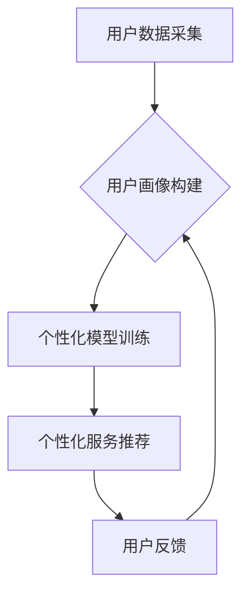

                 

## 个性化AI:满足不同用户需求的关键

> 关键词：个性化AI、用户需求、机器学习、推荐系统、自然语言处理、深度学习、模型定制

## 1. 背景介绍

人工智能（AI）正以惊人的速度发展，从自动驾驶到医疗诊断，AI技术正在改变着我们生活的方方面面。然而，现有的AI系统往往缺乏个性化，无法真正满足不同用户的独特需求。个性化AI的出现，旨在解决这一问题，通过理解用户的偏好、行为和上下文，提供更加精准、定制化的服务体验。

随着数据量的爆炸式增长和计算能力的提升，个性化AI技术有了更强大的基础。机器学习、深度学习等算法能够从海量数据中挖掘用户特征，构建个性化模型，从而实现对用户需求的精准预测和满足。

## 2. 核心概念与联系

个性化AI的核心概念是“用户中心”，即将用户的需求和体验放在首位，通过数据驱动和算法模型，为每个用户提供个性化的服务和内容。

**个性化AI的架构**



**核心概念解释:**

* **用户数据采集:** 从各种渠道收集用户数据，例如浏览历史、购买记录、社交行为、反馈意见等。
* **用户画像构建:** 利用机器学习算法对用户数据进行分析，构建用户画像，包括用户的兴趣爱好、偏好、行为模式等。
* **个性化模型训练:** 基于用户画像，训练个性化模型，例如推荐系统、内容过滤系统、对话系统等。
* **个性化服务推荐:** 根据用户的个性化模型，推荐个性化的服务和内容，例如商品推荐、新闻推荐、音乐推荐等。
* **用户反馈:** 收集用户对个性化服务的反馈，并将其反馈到用户画像构建环节，不断优化个性化模型。

## 3. 核心算法原理 & 具体操作步骤

### 3.1  算法原理概述

个性化AI的核心算法主要包括：

* **协同过滤:** 基于用户的相似性或物品的相似性进行推荐。
* **内容过滤:** 根据用户的兴趣爱好和物品的特征进行推荐。
* **深度学习:** 利用深度神经网络学习用户行为模式，进行更精准的个性化推荐。

### 3.2  算法步骤详解

以协同过滤算法为例，其具体操作步骤如下：

1. **数据预处理:** 收集用户评分数据，并进行数据清洗、缺失值处理等预处理工作。
2. **相似性计算:** 计算用户之间的相似度或物品之间的相似度，常用的方法包括余弦相似度、皮尔逊相关系数等。
3. **推荐生成:** 根据用户的相似用户或物品的相似物品，生成个性化推荐列表。

### 3.3  算法优缺点

**协同过滤算法:**

* **优点:** 可以发现隐含的用户偏好，推荐更精准的物品。
* **缺点:** 数据稀疏性问题，当用户评分数据较少时，算法效果会下降。

**内容过滤算法:**

* **优点:** 不需要用户评分数据，可以根据物品的特征进行推荐。
* **缺点:** 容易陷入“同质化推荐”问题，推荐的物品过于相似。

**深度学习算法:**

* **优点:** 可以学习更复杂的用户行为模式，推荐效果更精准。
* **缺点:** 需要大量的训练数据，训练成本较高。

### 3.4  算法应用领域

个性化AI算法广泛应用于以下领域:

* **电商推荐:** 推荐商品、优惠券、促销活动等。
* **内容推荐:** 推荐新闻、视频、音乐、书籍等。
* **社交推荐:** 推荐好友、群组、活动等。
* **个性化教育:** 根据学生的学习进度和能力，提供个性化的学习内容和辅导。
* **医疗诊断:** 根据患者的症状和病史，提供个性化的诊断建议。

## 4. 数学模型和公式 & 详细讲解 & 举例说明

### 4.1  数学模型构建

协同过滤算法的数学模型可以表示为用户-物品评分矩阵，其中每个元素代表用户对物品的评分。

**用户-物品评分矩阵:**

$$
R = \begin{bmatrix}
r_{11} & r_{12} & \cdots & r_{1m} \\
r_{21} & r_{22} & \cdots & r_{2m} \\
\vdots & \vdots & \ddots & \vdots \\
r_{n1} & r_{n2} & \cdots & r_{nm}
\end{bmatrix}
$$

其中：

* $r_{ij}$ 表示用户 $i$ 对物品 $j$ 的评分。
* $n$ 表示用户数量。
* $m$ 表示物品数量。

### 4.2  公式推导过程

协同过滤算法的目标是预测用户对物品的评分，常用的方法是基于用户的相似度或物品的相似度进行预测。

**基于用户的相似度预测:**

$$
\hat{r}_{ui} = \frac{\sum_{j \in N(u)} s_{uj} r_{uj}}{\sum_{j \in N(u)} s_{uj}}
$$

其中：

* $\hat{r}_{ui}$ 表示预测用户 $u$ 对物品 $i$ 的评分。
* $N(u)$ 表示与用户 $u$ 相似的用户集合。
* $s_{uj}$ 表示用户 $u$ 和用户 $j$ 的相似度。
* $r_{uj}$ 表示用户 $j$ 对物品 $i$ 的评分。

**基于物品的相似度预测:**

$$
\hat{r}_{ui} = \frac{\sum_{j \in S(i)} s_{ij} r_{uj}}{\sum_{j \in S(i)} s_{ij}}
$$

其中：

* $S(i)$ 表示与物品 $i$ 相似的物品集合。
* $s_{ij}$ 表示物品 $i$ 和物品 $j$ 的相似度。
* $r_{uj}$ 表示用户 $u$ 对物品 $j$ 的评分。

### 4.3  案例分析与讲解

假设有一个电商平台，用户对商品的评分数据如下：

$$
R = \begin{bmatrix}
5 & 4 & 3 & 2 \\
4 & 5 & 2 & 3 \\
3 & 2 & 5 & 4 \\
2 & 3 & 4 & 5
\end{bmatrix}
$$

其中，行表示用户，列表示商品。

我们可以使用协同过滤算法，计算用户之间的相似度，并预测用户对未评分商品的评分。例如，用户 1 和用户 3 的相似度较高，我们可以预测用户 1 对商品 4 的评分，参考用户 3 对商品 4 的评分。

## 5. 项目实践：代码实例和详细解释说明

### 5.1  开发环境搭建

* Python 3.x
* scikit-learn 库
* Pandas 库
* Matplotlib 库

### 5.2  源代码详细实现

```python
import pandas as pd
from sklearn.metrics.pairwise import cosine_similarity

# 加载用户评分数据
ratings = pd.read_csv('ratings.csv')

# 计算用户之间的余弦相似度
user_similarity = cosine_similarity(ratings)

# 预测用户对商品的评分
def predict_rating(user_id, item_id):
    # 获取用户相似用户
    similar_users = user_similarity[user_id].argsort()[:-10:-1]
    # 计算预测评分
    predicted_rating = 0
    for similar_user in similar_users:
        if ratings.loc[similar_user, item_id] is not None:
            predicted_rating += ratings.loc[similar_user, item_id] * user_similarity[user_id][similar_user]
    return predicted_rating / sum(user_similarity[user_id][similar_users])

# 预测用户 1 对商品 4 的评分
predicted_rating = predict_rating(0, 3)
print(f'预测用户 1 对商品 4 的评分: {predicted_rating}')
```

### 5.3  代码解读与分析

* 代码首先加载用户评分数据，并使用 scikit-learn 库的 cosine_similarity 函数计算用户之间的余弦相似度。
* 然后，定义了一个 predict_rating 函数，用于预测用户对商品的评分。该函数首先获取用户相似用户，然后根据用户的评分和相似度计算预测评分。
* 最后，代码演示了如何使用 predict_rating 函数预测用户 1 对商品 4 的评分。

### 5.4  运行结果展示

运行代码后，会输出预测用户 1 对商品 4 的评分。

## 6. 实际应用场景

个性化AI技术在各个领域都有着广泛的应用场景：

### 6.1  电商推荐

电商平台可以利用个性化AI技术，根据用户的浏览历史、购买记录、购物车内容等数据，推荐个性化的商品、优惠券、促销活动等，提高用户购物体验和转化率。

### 6.2  内容推荐

新闻网站、视频平台、音乐平台等，可以利用个性化AI技术，根据用户的兴趣爱好、阅读习惯、观看历史等数据，推荐个性化的新闻、视频、音乐等内容，提高用户粘性和活跃度。

### 6.3  社交推荐

社交平台可以利用个性化AI技术，根据用户的社交关系、兴趣爱好、行为模式等数据，推荐个性化的好友、群组、活动等，帮助用户拓展社交圈，提高用户参与度。

### 6.4  未来应用展望

随着人工智能技术的不断发展，个性化AI技术将应用于更多领域，例如：

* **个性化教育:** 根据学生的学习进度和能力，提供个性化的学习内容和辅导。
* **个性化医疗:** 根据患者的症状和病史，提供个性化的诊断建议和治疗方案。
* **个性化金融:** 根据用户的财务状况和风险偏好，提供个性化的理财建议和投资方案。

## 7. 工具和资源推荐

### 7.1  学习资源推荐

* **书籍:**
    * 《深度学习》
    * 《机器学习实战》
    * 《Python机器学习》
* **在线课程:**
    * Coursera: 深度学习
    * edX: 机器学习
    * Udacity: 

### 7.2  开发工具推荐

* **Python:** 
* **scikit-learn:** 机器学习库
* **TensorFlow:** 深度学习框架
* **PyTorch:** 深度学习框架

### 7.3  相关论文推荐

* **Collaborative Filtering for Implicit Feedback Datasets**
* **Deep Learning for Recommender Systems**
* **Personalized Recommendations Using Matrix Factorization Techniques**

## 8. 总结：未来发展趋势与挑战

### 8.1  研究成果总结

个性化AI技术取得了显著的成果，能够为用户提供更加精准、定制化的服务体验。

### 8.2  未来发展趋势

* **模型更加个性化:** 利用更先进的算法和技术，构建更加个性化的模型，能够更精准地理解用户的需求和偏好。
* **跨平台融合:** 个性化AI技术将跨越平台边界，为用户提供更加统一、连续的个性化体验。
* **解释性更强:** 个性化AI模型的解释性将更加强，能够帮助用户理解模型的推荐逻辑，提高用户信任度。

### 8.3  面临的挑战

* **数据隐私:** 个性化AI技术依赖于大量用户数据，如何保护用户隐私是一个重要的挑战。
* **算法公平性:** 个性化AI模型可能存在偏见，导致不公平的推荐结果，需要关注算法的公平性问题。
* **模型可解释性:** 个性化AI模型的复杂性使得其难以解释，需要提高模型的可解释性，帮助用户理解模型的推荐逻辑。

### 8.4  研究展望

未来，个性化AI技术将继续朝着更加智能、个性化、可解释的方向发展，为用户提供更加丰富、便捷、个性化的服务体验。

## 9. 附录：常见问题与解答

* **Q: 个性化AI技术与传统推荐系统有什么区别？**

**A:** 个性化AI技术利用机器学习和深度学习算法，能够从海量数据中挖掘用户特征，构建个性化模型，推荐更加精准的物品。而传统推荐系统通常基于规则或基于内容过滤，推荐效果相对较差。

* **Q: 个性化AI技术如何解决数据稀疏性问题？**

**A:** 

* 利用协同过滤算法，从用户之间的相似性或物品之间的相似性中挖掘隐含的特征。
* 利用深度学习算法，学习更复杂的用户行为模式，即使数据稀疏也能获得较好的推荐效果。
* 使用混合推荐模型，结合多种推荐算法，提高推荐效果。

* **Q: 个性化AI技术如何保证用户隐私？**

**A:** 

* 使用匿名化技术，对用户数据进行脱敏处理，保护用户隐私。
* 使用联邦学习技术，在不共享原始数据的情况下，训练个性化模型。
* 明确告知用户数据使用方式，并获得用户同意。


作者：禅与计算机程序设计艺术 / Zen and the Art of Computer Programming 
<end_of_turn>

