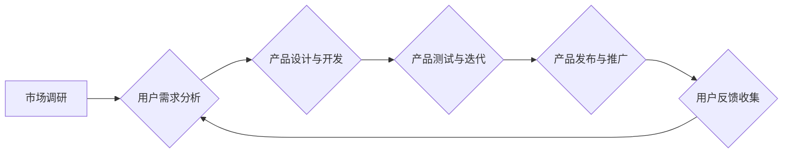

                 

## 1. 背景介绍

在当今数据爆炸的时代，人工智能（AI）技术正在迅速发展，并深刻地改变着各行各业。从自动驾驶到医疗诊断，从个性化推荐到金融风险评估，AI的应用场景日益广泛。然而，仅仅拥有强大的AI技术并不能保证商业成功。如何将AI技术转化为实际的商业价值，并实现可持续的增长，成为摆在众多AI公司面前的关键问题。

Lepton AI作为一家专注于AI产品开发和商业化的公司，深谙此道。我们认为，产品驱动增长是Lepton AI成功的关键，而产品优势和市场契合度是实现这一目标的两大支柱。本文将深入探讨Lepton AI的战略，阐述我们如何通过产品优势和市场契合度来驱动增长。

## 2. 核心概念与联系

Lepton AI的核心战略是“产品驱动增长”，即以产品为中心，围绕用户需求和市场趋势进行产品开发和迭代，最终实现商业目标。

**2.1 产品优势**

Lepton AI的产品优势体现在以下几个方面：

* **技术领先:** 我们拥有一支经验丰富的AI研发团队，不断进行技术创新，开发出具有竞争力的AI算法和模型。
* **产品易用:** 我们致力于开发易于使用、易于部署的产品，降低用户的使用门槛，并提供完善的技术支持。
* **定制化服务:** 我们提供定制化服务，根据用户的具体需求，开发个性化的AI解决方案。

**2.2 市场契合度**

Lepton AI专注于那些具有巨大市场潜力的领域，并通过深入了解用户需求和市场趋势，开发出能够满足用户痛点的产品。

**2.3 产品驱动增长模型**

Lepton AI的产品驱动增长模型可以概括为以下流程：



## 3. 核心算法原理 & 具体操作步骤

Lepton AI的核心算法是基于深度学习的**Transformer模型**，该模型在自然语言处理领域取得了突破性的进展。

### 3.1 算法原理概述

Transformer模型的核心创新在于**自注意力机制**，它能够捕捉文本序列中单词之间的长距离依赖关系，从而更好地理解文本的语义。

### 3.2 算法步骤详解

1. **词嵌入:** 将输入的文本序列中的每个单词映射到一个低维向量空间中，每个单词都对应一个唯一的向量表示。
2. **多头自注意力:** 对每个单词的向量表示进行多头自注意力计算，捕捉单词之间的上下文关系。
3. **前馈神经网络:** 对每个单词的注意力加权向量进行前馈神经网络处理，进一步提取语义特征。
4. **位置编码:** 将单词在序列中的位置信息编码到向量表示中，因为Transformer模型没有循环结构，无法直接捕捉单词的顺序信息。
5. **堆叠多层:** 将上述步骤重复进行多层堆叠，以进一步提取深层语义特征。
6. **分类层:** 对最终的语义特征进行分类，输出预测结果。

### 3.3 算法优缺点

**优点:**

* 能够捕捉长距离依赖关系，提高文本理解能力。
* 并行计算能力强，训练速度快。
* 在各种自然语言处理任务中取得了优异的性能。

**缺点:**

* 参数量大，需要大量的计算资源进行训练。
* 对训练数据质量要求高。

### 3.4 算法应用领域

Transformer模型在以下领域具有广泛的应用：

* 机器翻译
* 文本摘要
* 问答系统
* 情感分析
* 代码生成

## 4. 数学模型和公式 & 详细讲解 & 举例说明

Transformer模型的核心是**自注意力机制**，其数学模型可以表示为以下公式：

$$
Attention(Q, K, V) = softmax(\frac{QK^T}{\sqrt{d_k}})V
$$

其中：

* $Q$：查询矩阵
* $K$：键矩阵
* $V$：值矩阵
* $d_k$：键向量的维度
* $softmax$：softmax函数

**4.1 数学模型构建**

自注意力机制通过计算查询向量 $Q$ 与键向量 $K$ 之间的相似度，来确定每个值向量 $V$ 的权重。

**4.2 公式推导过程**

1. 计算查询向量 $Q$ 与键向量 $K$ 的点积，得到一个分数矩阵。
2. 对分数矩阵进行归一化，使用softmax函数将分数转换为概率分布。
3. 将概率分布与值向量 $V$ 进行加权求和，得到最终的注意力输出。

**4.3 案例分析与讲解**

假设我们有一个句子 "The cat sat on the mat"，将其分解成单词序列 [“The”, “cat”, “sat”, “on”, “the”, “mat”]。

在自注意力机制中，每个单词都会生成一个查询向量、键向量和值向量。当计算“cat”的注意力输出时，它会与所有其他单词的键向量进行点积计算，得到一个分数矩阵。

通过softmax函数将分数转换为概率分布，可以得到每个单词对“cat”的注意力权重。例如，"sat" 的注意力权重可能较高，因为“cat”和“sat”在语义上相关。

最终，将注意力权重与所有单词的值向量进行加权求和，得到“cat”的注意力输出，它包含了“cat”与其他单词的语义关系信息。

## 5. 项目实践：代码实例和详细解释说明

Lepton AI开发了一款基于Transformer模型的**文本摘要工具**，以下展示其代码实例和详细解释：

### 5.1 开发环境搭建

* Python 3.7+
* TensorFlow 2.0+
* PyTorch 1.0+
* CUDA 10.0+

### 5.2 源代码详细实现

```python
import tensorflow as tf

# 定义Transformer模型
class Transformer(tf.keras.Model):
    def __init__(self, vocab_size, embedding_dim, num_heads, num_layers):
        super(Transformer, self).__init__()
        self.embedding = tf.keras.layers.Embedding(vocab_size, embedding_dim)
        self.transformer_layers = tf.keras.layers.StackedRNNCells([
            tf.keras.layers.MultiHeadAttention(num_heads=num_heads, key_dim=embedding_dim)
            for _ in range(num_layers)
        ])
        self.dense = tf.keras.layers.Dense(vocab_size)

    def call(self, inputs):
        embeddings = self.embedding(inputs)
        outputs = self.transformer_layers(embeddings)
        outputs = self.dense(outputs)
        return outputs

# 实例化模型
model = Transformer(vocab_size=10000, embedding_dim=128, num_heads=8, num_layers=6)

# 训练模型
model.compile(optimizer='adam', loss='sparse_categorical_crossentropy', metrics=['accuracy'])
model.fit(train_data, train_labels, epochs=10)

# 预测文本摘要
summary = model.predict(text)
```

### 5.3 代码解读与分析

* **模型定义:** 代码定义了一个名为`Transformer`的模型类，继承自`tf.keras.Model`。
* **嵌入层:** 使用`tf.keras.layers.Embedding`层将单词映射到低维向量空间。
* **Transformer层:** 使用`tf.keras.layers.StackedRNNCells`层堆叠多个`tf.keras.layers.MultiHeadAttention`层，实现自注意力机制。
* **全连接层:** 使用`tf.keras.layers.Dense`层将Transformer层的输出映射到词汇表大小。
* **模型训练:** 使用`model.compile`方法配置模型的优化器、损失函数和评估指标。使用`model.fit`方法训练模型。
* **文本摘要预测:** 使用`model.predict`方法对输入文本进行预测，生成文本摘要。

### 5.4 运行结果展示

训练完成后，可以使用模型对新的文本进行摘要预测。

## 6. 实际应用场景

Lepton AI的文本摘要工具已应用于以下场景：

* **新闻摘要:** 自动生成新闻文章的摘要，方便用户快速了解新闻内容。
* **会议记录:** 自动生成会议记录的摘要，提高会议效率。
* **文档压缩:** 自动压缩冗长的文档，提取关键信息。

### 6.4 未来应用展望

Lepton AI将继续探索Transformer模型在其他领域的应用，例如：

* **机器翻译:** 提高机器翻译的准确性和流畅度。
* **对话系统:** 开发更自然、更智能的对话系统。
* **代码生成:** 自动生成代码，提高开发效率。

## 7. 工具和资源推荐

### 7.1 学习资源推荐

* **Transformer论文:** https://arxiv.org/abs/1706.03762
* **Hugging Face Transformers库:** https://huggingface.co/transformers/
* **TensorFlow官方文档:** https://www.tensorflow.org/

### 7.2 开发工具推荐

* **Jupyter Notebook:** https://jupyter.org/
* **VS Code:** https://code.visualstudio.com/

### 7.3 相关论文推荐

* **BERT:** https://arxiv.org/abs/1810.04805
* **GPT-3:** https://openai.com/blog/gpt-3/

## 8. 总结：未来发展趋势与挑战

Lepton AI将继续致力于AI产品驱动增长，并探索Transformer模型在更多领域的应用。

### 8.1 研究成果总结

Lepton AI在AI产品开发和商业化方面取得了显著成果，其产品已应用于多个领域，并获得了用户的认可。

### 8.2 未来发展趋势

* **模型规模化:** 继续探索更大规模的Transformer模型，提升模型性能。
* **多模态学习:** 将Transformer模型扩展到多模态数据，例如文本、图像、音频等。
* **边缘计算:** 将Transformer模型部署到边缘设备，实现低延迟、高效率的AI应用。

### 8.3 面临的挑战

* **数据获取和标注:** 训练高性能的Transformer模型需要大量的优质数据，数据获取和标注成本较高。
* **模型解释性和可信度:** Transformer模型的内部机制复杂，难以解释模型的决策过程，这限制了模型的应用场景。
* **伦理和社会影响:** AI技术的快速发展带来了伦理和社会问题，需要谨慎考虑AI技术的应用和发展方向。

### 8.4 研究展望

Lepton AI将继续投入资源，攻克上述挑战，推动AI技术的进步，并将其应用于更多领域，造福人类社会。

## 9. 附录：常见问题与解答

**Q1: Transformer模型的训练需要多长时间？**

A1: Transformer模型的训练时间取决于模型规模、数据集大小和硬件资源等因素。一般来说，训练一个中等规模的Transformer模型需要几天到几周的时间。

**Q2: 如何评估Transformer模型的性能？**

A2: Transformer模型的性能可以通过多种指标评估，例如准确率、F1-score、BLEU等。

**Q3: Transformer模型有哪些应用场景？**

A3: Transformer模型在自然语言处理领域具有广泛的应用场景，例如机器翻译、文本摘要、问答系统、情感分析等。


作者：禅与计算机程序设计艺术 / Zen and the Art of Computer Programming 
<end_of_turn>

