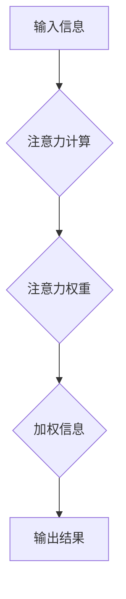

                 

## 人工智能在注意力资源分配中的角色

> 关键词：人工智能、注意力机制、资源分配、深度学习、强化学习、可解释性、效率

## 1. 背景介绍

在信息爆炸的时代，人类面临着海量信息的冲击。如何有效地筛选和处理信息，将注意力集中在最关键的信息上，成为一个至关重要的挑战。传统的信息处理方法往往依赖于人工筛选和排序，效率低下且难以应对信息量的快速增长。而人工智能（AI）技术的出现，为解决这一问题提供了新的思路。

注意力机制（Attention Mechanism）是近年来深度学习领域的一项重要突破，它能够模拟人类的注意力机制，学习识别和关注信息中的关键部分。注意力机制的应用已经取得了显著的成果，在自然语言处理、计算机视觉、机器翻译等领域展现出强大的能力。

然而，注意力机制本身也面临着资源分配的挑战。在处理复杂的任务时，注意力机制需要分配有限的计算资源到不同的信息部分，以获得最佳的性能。如何高效地分配注意力资源，是人工智能在注意力机制应用中的一个关键问题。

## 2. 核心概念与联系

### 2.1 注意力机制

注意力机制的核心思想是，在处理信息时，并非所有信息都具有相同的权重。一些信息可能更加重要，需要更多的关注，而一些信息则可以被忽略。注意力机制通过学习一个“注意力权重”，来分配不同的计算资源到不同的信息部分。

**注意力机制的流程图：**



### 2.2 资源分配

资源分配是指根据任务需求和资源限制，将有限的资源分配到不同的任务或模块。在人工智能领域，资源分配通常指计算资源、内存资源、存储资源等。

### 2.3 联系

注意力机制与资源分配密切相关。注意力机制通过学习注意力权重，实现对信息资源的分配。而资源分配则需要根据注意力机制的输出，决定如何分配计算资源、内存资源等。两者相互作用，共同完成信息处理的任务。

## 3. 核心算法原理 & 具体操作步骤

### 3.1 算法原理概述

注意力机制的算法原理主要基于深度学习，通过训练神经网络来学习注意力权重。常用的注意力机制算法包括：

* **自注意力机制（Self-Attention）:**  用于处理序列数据，例如文本，可以捕捉序列中不同元素之间的关系。
* **交叉注意力机制（Cross-Attention）:** 用于处理不同类型的序列数据，例如文本和图像，可以学习不同类型数据之间的关系。

这些算法通常使用矩阵运算和激活函数来计算注意力权重。

### 3.2 算法步骤详解

**自注意力机制的具体操作步骤：**

1. **输入序列:** 将输入序列表示为一个矩阵，其中每一行代表一个序列元素。
2. **查询、键、值矩阵:** 将输入序列分别转换为查询矩阵（Query）、键矩阵（Key）和值矩阵（Value）。
3. **注意力权重计算:** 计算查询矩阵与键矩阵之间的点积，然后通过softmax函数归一化得到注意力权重。
4. **加权求和:** 将注意力权重与值矩阵相乘，然后求和得到加权后的输出。

**交叉注意力机制的具体操作步骤:**

1. **输入序列:** 将两个输入序列分别表示为矩阵，例如文本序列和图像特征矩阵。
2. **查询、键、值矩阵:** 将两个输入序列分别转换为查询矩阵、键矩阵和值矩阵。
3. **注意力权重计算:** 计算查询矩阵与键矩阵之间的点积，然后通过softmax函数归一化得到注意力权重。
4. **加权求和:** 将注意力权重与值矩阵相乘，然后求和得到加权后的输出。

### 3.3 算法优缺点

**优点:**

* **能够捕捉长距离依赖关系:** 自注意力机制可以捕捉序列中不同元素之间的长距离依赖关系，这对于处理长文本或序列数据非常有效。
* **可解释性:** 注意力权重可以直观地反映模型对不同信息部分的关注程度，提高了模型的可解释性。

**缺点:**

* **计算复杂度高:** 注意力机制的计算复杂度较高，尤其是在处理长序列数据时。
* **参数量大:** 注意力机制通常需要大量的参数，这可能会导致模型过拟合。

### 3.4 算法应用领域

注意力机制在以下领域取得了广泛应用：

* **自然语言处理:** 机器翻译、文本摘要、问答系统、情感分析等。
* **计算机视觉:** 图像分类、目标检测、图像 captioning 等。
* **语音识别:** 语音转文本、语音合成等。

## 4. 数学模型和公式 & 详细讲解 & 举例说明

### 4.1 数学模型构建

**自注意力机制的数学模型:**

给定一个输入序列 $X = \{x_1, x_2, ..., x_n\}$, 其中 $x_i$ 是序列中的第 $i$ 个元素。

* **查询矩阵 (Query):** $Q = W_q X$
* **键矩阵 (Key):** $K = W_k X$
* **值矩阵 (Value):** $V = W_v X$

其中，$W_q$, $W_k$, $W_v$ 是学习到的权重矩阵。

**注意力权重计算:**

$Attention(Q, K, V) = softmax(\frac{Q K^T}{\sqrt{d_k}}) V$

其中，$d_k$ 是键矩阵的维度。

**加权求和:**

$Output = Attention(Q, K, V)$

### 4.2 公式推导过程

注意力权重计算公式的推导过程如下：

1. 计算查询矩阵 $Q$ 与键矩阵 $K$ 的点积，得到一个 $n \times n$ 的矩阵。
2. 对点积矩阵进行归一化，使用 softmax 函数将每个元素转换为概率分布。
3. 将归一化后的概率分布与值矩阵 $V$ 相乘，得到加权后的输出。

### 4.3 案例分析与讲解

**举例说明:**

假设我们有一个输入序列 $X = \{“我”, “喜欢”, “吃”, “苹果”\}$，其中每个单词都是一个向量。

1. 将输入序列转换为查询矩阵、键矩阵和值矩阵。
2. 计算查询矩阵与键矩阵的点积，得到一个 $4 \times 4$ 的矩阵。
3. 对点积矩阵进行 softmax 函数归一化，得到注意力权重矩阵。
4. 将注意力权重矩阵与值矩阵相乘，得到加权后的输出。

通过注意力权重矩阵，我们可以看到模型对哪些单词更加关注。例如，如果注意力权重矩阵中 “苹果” 的权重较高，则说明模型认为 “苹果” 是这个句子中最关键的信息。

## 5. 项目实践：代码实例和详细解释说明

### 5.1 开发环境搭建

* Python 3.6+
* TensorFlow 或 PyTorch 深度学习框架
* Jupyter Notebook 或 VS Code 开发环境

### 5.2 源代码详细实现

```python
import tensorflow as tf

# 定义自注意力机制
def self_attention(inputs, num_heads):
    # ... (代码实现)

# 定义模型
class AttentionModel(tf.keras.Model):
    def __init__(self, num_heads):
        super(AttentionModel, self).__init__()
        self.attention = self_attention(num_heads)

    def call(self, inputs):
        # ... (代码实现)

# 实例化模型
model = AttentionModel(num_heads=8)

# 训练模型
# ... (代码实现)
```

### 5.3 代码解读与分析

* `self_attention` 函数实现自注意力机制的计算过程。
* `AttentionModel` 类定义了一个包含自注意力机制的模型。
* `call` 方法定义了模型的输入和输出。
* 训练模型的过程需要使用训练数据和优化器。

### 5.4 运行结果展示

* 通过训练模型，可以得到注意力权重矩阵，分析模型对不同信息部分的关注程度。
* 可以使用评估指标，例如准确率、F1 分数等，来评估模型的性能。

## 6. 实际应用场景

### 6.1 机器翻译

注意力机制可以帮助机器翻译模型更好地捕捉源语言和目标语言之间的关系，提高翻译质量。

### 6.2 文本摘要

注意力机制可以帮助文本摘要模型识别文本中最关键的信息，生成更简洁、更准确的摘要。

### 6.3 问答系统

注意力机制可以帮助问答系统更好地理解问题和上下文，给出更准确的答案。

### 6.4 未来应用展望

* **个性化推荐:**  注意力机制可以帮助推荐系统更好地理解用户的偏好，提供更个性化的推荐。
* **医疗诊断:**  注意力机制可以帮助医疗诊断系统识别病人的关键症状，提高诊断准确率。
* **自动驾驶:**  注意力机制可以帮助自动驾驶系统更好地感知周围环境，提高驾驶安全性。

## 7. 工具和资源推荐

### 7.1 学习资源推荐

* **书籍:**
    * 《深度学习》 by Ian Goodfellow, Yoshua Bengio, and Aaron Courville
    * 《Attention Is All You Need》 by Vaswani et al.
* **在线课程:**
    * Coursera: Deep Learning Specialization
    * Udacity: Deep Learning Nanodegree

### 7.2 开发工具推荐

* **TensorFlow:**  https://www.tensorflow.org/
* **PyTorch:**  https://pytorch.org/

### 7.3 相关论文推荐

* **Attention Is All You Need:** https://arxiv.org/abs/1706.03762
* **BERT: Pre-training of Deep Bidirectional Transformers for Language Understanding:** https://arxiv.org/abs/1810.04805

## 8. 总结：未来发展趋势与挑战

### 8.1 研究成果总结

注意力机制在人工智能领域取得了显著的成果，在自然语言处理、计算机视觉等领域展现出强大的能力。

### 8.2 未来发展趋势

* **更有效的注意力机制:**  研究更有效的注意力机制，提高计算效率和模型性能。
* **可解释性增强:**  提高注意力机制的可解释性，帮助人类更好地理解模型的决策过程。
* **跨模态注意力:**  研究跨模态注意力机制，能够处理不同类型数据的融合。

### 8.3 面临的挑战

* **计算复杂度:**  注意力机制的计算复杂度较高，难以处理海量数据。
* **参数量大:**  注意力机制通常需要大量的参数，这可能会导致模型过拟合。
* **可解释性:**  注意力机制的决策过程相对复杂，难以解释模型的决策结果。

### 8.4 研究展望

未来，注意力机制的研究将继续深入，探索更有效的、更可解释的注意力机制，并将其应用于更多领域，推动人工智能技术的进步。

## 9. 附录：常见问题与解答

* **Q: 注意力机制与传统机器学习方法相比有什么优势？**

* **A:** 注意力机制能够捕捉长距离依赖关系，而传统机器学习方法难以做到这一点。注意力机制还具有可解释性，可以直观地反映模型对不同信息部分的关注程度。

* **Q: 注意力机制的计算复杂度如何解决？**

* **A:**  研究人员正在探索更有效的注意力机制，例如局部注意力机制，来降低计算复杂度。

* **Q: 如何提高注意力机制的可解释性？**

* **A:**  研究人员正在开发新的可解释性方法，例如注意力可视化，来帮助人类更好地理解注意力机制的决策过程。


作者：禅与计算机程序设计艺术 / Zen and the Art of Computer Programming 
<end_of_turn>

