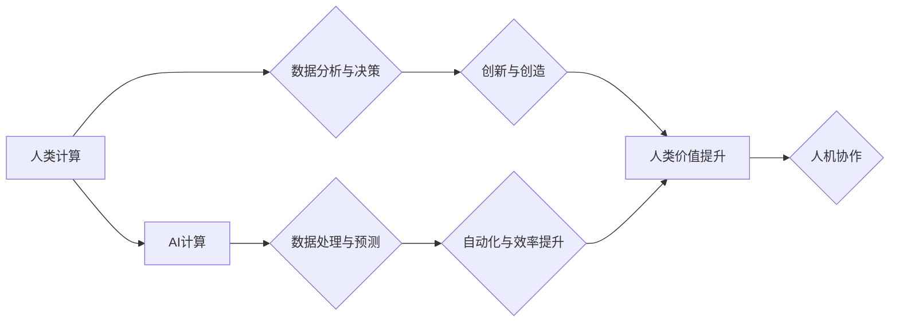

                 

## 人类计算：AI时代的未来就业前景与技能需求

> 关键词：人工智能、未来就业、技能需求、人类计算、自动化、数据分析、机器学习、深度学习、跨学科合作

## 1. 背景介绍

人工智能（AI）正以惊人的速度发展，其影响力正在深刻地改变着我们的世界。从自动驾驶汽车到个性化医疗，AI技术正在各个领域展现出强大的潜力。然而，这种快速发展也引发了人们对未来就业前景的担忧。一些人担心AI将取代人类工作，导致大量失业。

事实上，AI的发展既带来了机遇也带来了挑战。它将自动化许多重复性、低技能的工作，但也创造了大量新的工作岗位，需要具备更高水平的技能和知识。因此，了解AI时代未来就业前景和技能需求，对于个人和社会发展都至关重要。

## 2. 核心概念与联系

**2.1 人类计算**

人类计算是指人类利用其认知能力、创造力、判断力和解决问题的能力来完成计算任务。它强调人类在数据分析、决策制定、创新和创造方面独特的优势。

**2.2 AI计算**

AI计算是指利用人工智能算法和技术，例如机器学习、深度学习等，对数据进行处理、分析和学习，从而实现智能化决策和行为。它擅长处理大量数据、识别模式和进行预测。

**2.3 人机协作**

在AI时代，人类和AI将更加紧密地合作。人类将发挥其创造力和批判性思维能力，而AI将提供数据分析、自动化和效率提升等支持。这种协作模式将成为未来工作的主要形式。

**2.4  流程图**



## 3. 核心算法原理 & 具体操作步骤

**3.1 算法原理概述**

机器学习算法是AI的核心，它通过学习数据中的模式和规律，从而实现预测、分类和决策等功能。常见的机器学习算法包括：

* **监督学习:** 利用标记数据训练模型，例如分类和回归问题。
* **非监督学习:**  发现数据中的隐藏结构和模式，例如聚类和降维。
* **强化学习:**  通过试错学习，实现目标最大化的策略。

**3.2 算法步骤详解**

以监督学习为例，其基本步骤如下：

1. **数据收集和预处理:** 收集相关数据，并进行清洗、转换和特征工程等预处理工作。
2. **模型选择:** 根据具体问题选择合适的机器学习算法模型。
3. **模型训练:** 利用标记数据训练模型，调整模型参数，使其能够准确预测或分类。
4. **模型评估:** 使用测试数据评估模型的性能，例如准确率、召回率和F1-score等指标。
5. **模型部署:** 将训练好的模型部署到实际应用场景中，进行预测或分类。

**3.3 算法优缺点**

* **优点:** 能够自动学习数据模式，无需人工编程，具有强大的泛化能力。
* **缺点:** 需要大量数据进行训练，对数据质量要求高，解释性较差。

**3.4 算法应用领域**

机器学习算法广泛应用于各个领域，例如：

* **图像识别:** 人脸识别、物体检测、图像分类。
* **自然语言处理:** 文本分类、情感分析、机器翻译。
* **推荐系统:** 商品推荐、内容推荐、个性化服务。
* **金融领域:** 欺诈检测、风险评估、投资预测。

## 4. 数学模型和公式 & 详细讲解 & 举例说明

**4.1 数学模型构建**

机器学习算法通常基于数学模型，例如线性回归、逻辑回归、支持向量机等。这些模型通过数学公式来描述数据之间的关系。

**4.2 公式推导过程**

例如，线性回归模型的目标是找到一条直线，使得预测值与真实值之间的误差最小。其数学公式如下：

$$
y = w_0 + w_1x
$$

其中，$y$ 是预测值，$x$ 是输入特征，$w_0$ 和 $w_1$ 是模型参数。

通过最小化误差函数，例如均方误差，可以求解出最佳的模型参数。

**4.3 案例分析与讲解**

假设我们想要预测房价，输入特征包括房屋面积和房间数量。我们可以使用线性回归模型来建立预测模型。通过训练数据，我们可以得到最佳的模型参数，例如 $w_0 = 100000$ 和 $w_1 = 5000$。

因此，对于面积为100平方米，房间数量为3的房屋，我们可以预测其价格为：

$$
y = 100000 + 5000 * 3 = 115000
$$

## 5. 项目实践：代码实例和详细解释说明

**5.1 开发环境搭建**

可以使用Python语言和相关的机器学习库，例如scikit-learn，来实现机器学习项目。

**5.2 源代码详细实现**

```python
from sklearn.linear_model import LinearRegression
from sklearn.model_selection import train_test_split
import pandas as pd

# 加载数据
data = pd.read_csv('house_data.csv')

# 分割数据
X = data[['area', 'rooms']]
y = data['price']
X_train, X_test, y_train, y_test = train_test_split(X, y, test_size=0.2, random_state=42)

# 创建线性回归模型
model = LinearRegression()

# 训练模型
model.fit(X_train, y_train)

# 预测测试数据
y_pred = model.predict(X_test)

# 评估模型性能
from sklearn.metrics import mean_squared_error
mse = mean_squared_error(y_test, y_pred)
print(f'Mean Squared Error: {mse}')
```

**5.3 代码解读与分析**

这段代码首先加载房价数据，然后将数据分割为训练集和测试集。接着，创建线性回归模型并训练模型。最后，使用训练好的模型预测测试数据，并评估模型性能。

**5.4 运行结果展示**

运行代码后，会输出测试数据的均方误差，该值越小，模型性能越好。

## 6. 实际应用场景

**6.1 医疗诊断**

AI可以辅助医生进行疾病诊断，例如分析医学影像数据，识别肿瘤和其他病变。

**6.2 金融风险管理**

AI可以分析金融数据，识别欺诈行为和潜在的风险，帮助金融机构进行风险管理。

**6.3 自动驾驶**

AI是自动驾驶汽车的核心技术，它可以感知周围环境，做出驾驶决策。

**6.4 未来应用展望**

AI技术将继续发展，并应用于更多领域，例如个性化教育、智能家居、机器人等。

## 7. 工具和资源推荐

**7.1 学习资源推荐**

* **在线课程:** Coursera、edX、Udacity等平台提供丰富的AI课程。
* **书籍:** 《深度学习》、《机器学习实战》等书籍是学习AI的经典教材。
* **开源项目:** TensorFlow、PyTorch等开源项目提供了丰富的学习资源和实践案例。

**7.2 开发工具推荐**

* **Python:** Python是AI开发最常用的编程语言。
* **Jupyter Notebook:** Jupyter Notebook是一个交互式编程环境，方便进行AI开发和实验。
* **scikit-learn:** scikit-learn是一个Python机器学习库，提供了丰富的算法和工具。

**7.3 相关论文推荐**

* **《ImageNet Classification with Deep Convolutional Neural Networks》**
* **《Attention Is All You Need》**
* **《Generative Adversarial Networks》**

## 8. 总结：未来发展趋势与挑战

**8.1 研究成果总结**

近年来，AI技术取得了长足的进步，在各个领域都展现出强大的应用潜力。

**8.2 未来发展趋势**

* **模型更加强大:** AI模型将更加强大，能够处理更复杂的任务。
* **应用更加广泛:** AI将应用于更多领域，例如医疗、教育、金融等。
* **伦理问题更加突出:** AI的伦理问题将更加突出，需要社会共同探讨和解决。

**8.3 面临的挑战**

* **数据安全:** AI算法依赖于大量数据，数据安全问题需要得到重视。
* **算法解释性:** 许多AI算法的决策过程难以解释，需要提高算法的透明度。
* **人才短缺:** AI领域人才短缺是一个普遍问题，需要加强人才培养。

**8.4 研究展望**

未来，AI研究将更加注重模型的可解释性、安全性、鲁棒性和泛化能力。


## 9. 附录：常见问题与解答

**9.1  AI会不会取代人类工作？**

AI将自动化许多重复性、低技能的工作，但同时也创造了大量新的工作岗位，需要具备更高水平的技能和知识。

**9.2  如何学习AI技术？**

可以通过在线课程、书籍、开源项目等方式学习AI技术。

**9.3  AI技术有哪些伦理问题？**

AI技术的应用可能会带来一些伦理问题，例如算法偏见、隐私泄露、责任归属等。


作者：禅与计算机程序设计艺术 / Zen and the Art of Computer Programming 
<end_of_turn>

