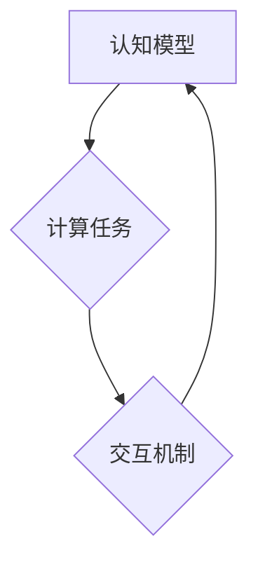

                 

## 人类计算：应用与案例分析

> 关键词： 人类计算、计算模型、认知科学、人工智能、神经网络、模拟仿真、应用案例

## 1. 背景介绍

人类计算，顾名思义，是指利用人类的认知能力进行计算的一种方式。它不同于传统计算机依靠逻辑运算和算法进行计算，而是借鉴人类的思维方式，将复杂问题分解成更易处理的子问题，并通过人类的判断、推理和决策来解决。近年来，随着人工智能和认知科学的快速发展，人类计算的概念逐渐受到重视，并被广泛应用于各个领域。

### 1.1 人类计算的起源与发展

人类计算的概念可以追溯到很久以前。早在19世纪，人们就尝试利用人类的计算能力来解决一些复杂的数学问题。例如，在19世纪初，英国数学家查尔斯·巴贝奇就设计了一种名为“分析机”的机械计算器，它可以利用人类的输入和操作来进行计算。

随着计算机技术的进步，人类计算逐渐被边缘化。然而，随着人工智能技术的出现，人类计算又重新回到了人们的视野。人工智能技术可以模拟人类的思维方式，并帮助人类进行更复杂的计算。

### 1.2 人类计算的优势与局限性

人类计算相对于传统计算机具有以下优势：

* **灵活性:** 人类可以根据具体情况灵活调整计算策略，并进行非结构化问题的处理。
* **创造力:** 人类拥有创造力和想象力，可以提出新的解决方案和思路。
* **理解能力:** 人类可以理解和解释计算结果，并将其应用于实际问题中。

然而，人类计算也存在一些局限性：

* **效率:** 人类计算的速度和准确性远不如传统计算机。
* **可重复性:** 人类计算的结果可能因人而异，难以保证可重复性。
* **规模:** 人类计算难以处理海量数据和复杂系统。

## 2. 核心概念与联系

人类计算的核心概念包括：

* **认知模型:** 模拟人类认知过程的模型，例如神经网络、专家系统等。
* **计算任务:** 需要人类参与解决的计算任务，例如图像识别、自然语言处理等。
* **交互机制:** 人类与计算系统之间进行交互的方式，例如语音识别、图形界面等。

这些概念相互关联，共同构成了人类计算的框架。



## 3. 核心算法原理 & 具体操作步骤

### 3.1 算法原理概述

人类计算算法通常基于认知科学和人工智能的原理，例如启发式搜索、模糊逻辑、机器学习等。这些算法旨在模拟人类的思维方式，通过启发式规则、经验知识和学习能力来解决问题。

### 3.2 算法步骤详解

人类计算算法的具体步骤通常包括以下几个阶段：

1. **问题建模:** 将实际问题转化为计算机可理解的形式。
2. **知识表示:** 将相关知识和规则表示为计算机可处理的数据结构。
3. **算法执行:** 利用人类计算算法对问题进行处理，并生成解决方案。
4. **结果解释:** 将计算结果解释为人类可理解的形式。

### 3.3 算法优缺点

人类计算算法的优点包括：

* **灵活性:** 可以处理非结构化问题和复杂场景。
* **鲁棒性:** 对数据噪声和不确定性具有较强的鲁棒性。
* **可解释性:** 计算过程和结果更容易被人类理解。

缺点包括：

* **效率:** 计算速度相对较慢，难以处理海量数据。
* **可重复性:** 结果可能因人而异，难以保证可重复性。
* **规模:** 难以处理规模庞大的复杂系统。

### 3.4 算法应用领域

人类计算算法广泛应用于以下领域：

* **医疗诊断:** 利用人类专家知识和机器学习算法辅助医生进行诊断。
* **金融风险管理:** 利用人类经验和数据分析技术评估金融风险。
* **法律决策:** 利用法律知识库和机器学习算法辅助律师进行法律分析和决策。
* **创意设计:** 利用人类的想象力和机器学习算法生成新的创意设计方案。

## 4. 数学模型和公式 & 详细讲解 & 举例说明

### 4.1 数学模型构建

人类计算的数学模型通常基于概率论、统计学和信息论等数学基础。例如，神经网络模型可以利用概率分布来表示神经元的激活状态，并通过梯度下降算法进行参数优化。

### 4.2 公式推导过程

例如，在神经网络模型中，激活函数的输出可以表示为：

$$
f(x) = \frac{1}{1 + e^{-x}}
$$

其中，$x$ 是神经元的输入值。该公式通过 sigmoid 函数将输入值映射到 0 到 1 之间，模拟神经元的激活程度。

### 4.3 案例分析与讲解

例如，在图像识别任务中，人类计算模型可以利用卷积神经网络（CNN）进行图像特征提取和分类。CNN 模型通过多个卷积层和池化层来提取图像的特征，并利用全连接层进行分类。

## 5. 项目实践：代码实例和详细解释说明

### 5.1 开发环境搭建

人类计算项目通常需要使用 Python 语言和相关的库，例如 TensorFlow、PyTorch 等。

### 5.2 源代码详细实现

以下是一个简单的图像分类示例代码，使用 TensorFlow 库实现：

```python
import tensorflow as tf

# 定义模型结构
model = tf.keras.models.Sequential([
  tf.keras.layers.Conv2D(32, (3, 3), activation='relu', input_shape=(28, 28, 1)),
  tf.keras.layers.MaxPooling2D((2, 2)),
  tf.keras.layers.Conv2D(64, (3, 3), activation='relu'),
  tf.keras.layers.MaxPooling2D((2, 2)),
  tf.keras.layers.Flatten(),
  tf.keras.layers.Dense(10, activation='softmax')
])

# 编译模型
model.compile(optimizer='adam',
              loss='sparse_categorical_crossentropy',
              metrics=['accuracy'])

# 训练模型
model.fit(x_train, y_train, epochs=5)

# 评估模型
loss, accuracy = model.evaluate(x_test, y_test)
print('Test loss:', loss)
print('Test accuracy:', accuracy)
```

### 5.3 代码解读与分析

该代码定义了一个简单的卷积神经网络模型，用于图像分类任务。模型包含两个卷积层、两个池化层、一个全连接层和一个 softmax 层。

* 卷积层和池化层用于提取图像特征。
* 全连接层用于分类。
* softmax 层将输出值映射到 0 到 1 之间，表示每个类别的概率。

### 5.4 运行结果展示

训练完成后，可以评估模型的性能，例如准确率。

## 6. 实际应用场景

### 6.1 人工智能客服

人类计算可以用于构建更智能的人工智能客服系统，例如通过自然语言处理技术理解用户的需求，并提供更精准的回复。

### 6.2 医疗诊断辅助

人类计算可以辅助医生进行医疗诊断，例如通过分析患者的病历、影像数据和实验室结果，提供诊断建议。

### 6.3 金融风险评估

人类计算可以用于评估金融风险，例如通过分析市场数据、客户信息和交易记录，识别潜在的风险。

### 6.4 未来应用展望

未来，人类计算将应用于更多领域，例如自动驾驶、机器人控制、个性化教育等。随着人工智能技术的不断发展，人类计算将发挥越来越重要的作用。

## 7. 工具和资源推荐

### 7.1 学习资源推荐

* **书籍:**
    * 《人工神经网络》
    * 《深度学习》
    * 《认知计算》
* **在线课程:**
    * Coursera 人工智能课程
    * edX 深度学习课程
    * Udacity 人工智能工程师课程

### 7.2 开发工具推荐

* **Python:** 人工智能开发的常用语言
* **TensorFlow:** 深度学习框架
* **PyTorch:** 深度学习框架
* **Keras:** 高级深度学习 API

### 7.3 相关论文推荐

* **《ImageNet Classification with Deep Convolutional Neural Networks》**
* **《Attention Is All You Need》**
* **《BERT: Pre-training of Deep Bidirectional Transformers for Language Understanding》**

## 8. 总结：未来发展趋势与挑战

### 8.1 研究成果总结

人类计算的研究取得了显著进展，例如在图像识别、自然语言处理、医疗诊断等领域取得了突破性成果。

### 8.2 未来发展趋势

未来，人类计算将朝着以下方向发展：

* **更智能的计算模型:** 开发更先进的人工智能算法，模拟人类的认知能力更准确地。
* **更广泛的应用场景:** 将人类计算应用于更多领域，例如自动驾驶、机器人控制、个性化教育等。
* **更有效的计算方法:** 研究更有效的计算方法，提高人类计算的效率和可扩展性。

### 8.3 面临的挑战

人类计算也面临一些挑战：

* **数据获取和标注:** 人类计算需要大量的数据进行训练，获取和标注高质量数据是一个难题。
* **算法解释性和可信度:** 人类计算算法的决策过程往往难以解释，这降低了算法的可信度。
* **伦理和社会影响:** 人类计算的应用可能带来一些伦理和社会问题，例如算法偏见、隐私泄露等。

### 8.4 研究展望

未来，需要进一步研究人类计算的理论基础、算法设计、应用场景和伦理问题，推动人类计算技术的发展和应用。

## 9. 附录：常见问题与解答

### 9.1 什么是人类计算？

人类计算是指利用人类的认知能力进行计算的一种方式。

### 9.2 人类计算与传统计算机有什么区别？

传统计算机依靠逻辑运算和算法进行计算，而人类计算则借鉴人类的思维方式，通过判断、推理和决策来解决问题。

### 9.3 人类计算有哪些应用场景？

人类计算应用于医疗诊断、金融风险管理、法律决策、创意设计等领域。

### 9.4 人类计算的未来发展趋势是什么？

未来，人类计算将朝着更智能、更广泛应用、更有效的方向发展。


作者：禅与计算机程序设计艺术 / Zen and the Art of Computer Programming 
<end_of_turn>

