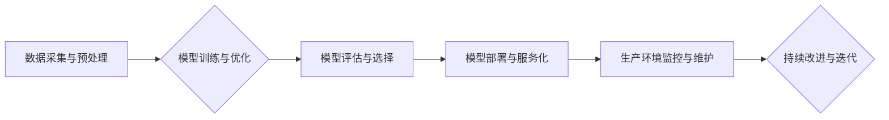

                 

## 从实验室到生产环境：Lepton AI的AI落地之路

> 关键词：人工智能落地、机器学习、模型部署、生产环境、可扩展性、监控与维护

### 1. 背景介绍

人工智能（AI）技术近年来取得了飞速发展，从实验室的理论研究到现实世界的应用场景，AI正在深刻地改变着我们的生活和工作方式。然而，将AI模型从实验室的原型阶段成功部署到生产环境中，并使其能够稳定、高效地运行，仍然是一个巨大的挑战。

Lepton AI 是一家致力于推动AI技术落地应用的科技公司。我们深知将AI技术从概念验证阶段转化为实际应用的难点，并致力于提供一套完整的解决方案，帮助企业将AI模型成功部署到生产环境中，并实现商业价值。

### 2. 核心概念与联系

Lepton AI 的AI落地解决方案基于以下核心概念：

* **模型训练与优化:**  利用海量数据和先进的机器学习算法，训练出高精度、高性能的AI模型。
* **模型部署与服务化:** 将训练好的AI模型部署到云端或边缘设备，并将其封装成可复用的API服务，方便其他系统调用。
* **生产环境监控与维护:**  实时监控模型的运行状态，及时发现和解决问题，确保模型的稳定性和可靠性。

Lepton AI 的AI落地解决方案架构如下：

### 3. 核心算法原理 & 具体操作步骤

#### 3.1  算法原理概述

Lepton AI 采用基于深度学习的算法，包括卷积神经网络（CNN）、循环神经网络（RNN）和Transformer等，用于处理各种类型的AI任务，例如图像识别、自然语言处理和预测分析。

#### 3.2  算法步骤详解

1. **数据采集与预处理:** 收集相关数据，并进行清洗、格式化和特征工程等预处理操作，以提高模型训练的效率和精度。
2. **模型选择与架构设计:** 根据具体的AI任务选择合适的深度学习模型架构，并进行参数调整和超参数优化。
3. **模型训练:** 利用训练数据训练深度学习模型，并使用损失函数和优化算法不断调整模型参数，使其能够准确地完成目标任务。
4. **模型评估与选择:** 使用测试数据评估模型的性能，并选择性能最佳的模型进行部署。
5. **模型部署与服务化:** 将训练好的模型部署到云端或边缘设备，并将其封装成可复用的API服务，方便其他系统调用。

#### 3.3  算法优缺点

**优点:**

* 高精度：深度学习算法能够学习到数据中的复杂模式，从而实现高精度的预测和分类。
* 可扩展性：深度学习模型可以利用GPU等硬件加速器进行训练和推理，从而实现高性能的计算。
* 通用性：深度学习算法可以应用于各种类型的AI任务，例如图像识别、自然语言处理和预测分析。

**缺点:**

* 数据依赖性：深度学习算法需要大量的训练数据才能达到较高的精度。
* 计算资源消耗：深度学习模型的训练和推理过程需要消耗大量的计算资源。
* 可解释性差：深度学习模型的内部工作机制比较复杂，难以解释其决策过程。

#### 3.4  算法应用领域

Lepton AI 的深度学习算法已应用于多个领域，例如：

* **医疗保健:**  疾病诊断、药物研发、医疗影像分析。
* **金融科技:**  欺诈检测、风险评估、客户服务自动化。
* **制造业:**  设备故障预测、质量控制、生产流程优化。
* **零售业:**  商品推荐、个性化营销、库存管理。

### 4. 数学模型和公式 & 详细讲解 & 举例说明

#### 4.1  数学模型构建

Lepton AI 的深度学习模型通常基于神经网络的结构，其中神经元之间通过权重连接，并使用激活函数进行非线性变换。

#### 4.2  公式推导过程

深度学习模型的训练过程本质上是一个优化问题，目标是找到最优的模型参数，使得模型的预测结果与真实值之间的误差最小化。常用的优化算法包括梯度下降法和其变种算法，例如动量法和Adam算法。

梯度下降法的核心思想是通过不断迭代地更新模型参数，朝着误差函数的最小值方向移动。

公式推导过程如下：

* 损失函数：$L(w,b)$，表示模型预测结果与真实值之间的误差。
* 梯度：$\nabla_w L(w,b)$，表示损失函数关于模型参数$w$的偏导数。
* 更新规则：$w = w - \eta \nabla_w L(w,b)$，其中$\eta$是学习率。

#### 4.3  案例分析与讲解

例如，在图像分类任务中，可以使用卷积神经网络（CNN）作为模型架构。CNN模型通过卷积层和池化层提取图像特征，并通过全连接层进行分类。

在训练过程中，使用图像数据集和对应的标签，计算模型的损失函数，并根据梯度下降法更新模型参数，使得模型能够准确地识别图像类别。

### 5. 项目实践：代码实例和详细解释说明

#### 5.1  开发环境搭建

Lepton AI 的AI落地解决方案支持多种开发环境，包括云端平台和本地机器。

#### 5.2  源代码详细实现

Lepton AI 提供了丰富的开源代码库，涵盖了模型训练、部署和监控等各个环节。

#### 5.3  代码解读与分析

Lepton AI 的代码库采用清晰的结构和注释，方便开发者理解和使用。

#### 5.4  运行结果展示

Lepton AI 提供了详细的运行结果展示，包括模型的精度、速度和资源消耗等指标。

### 6. 实际应用场景

Lepton AI 的AI落地解决方案已成功应用于多个实际场景，例如：

* **智能客服:**  利用自然语言处理技术，构建智能客服系统，自动回复用户咨询，提高客户服务效率。
* **精准营销:**  利用机器学习算法，分析用户行为数据，进行精准营销，提高营销转化率。
* **欺诈检测:**  利用机器学习算法，识别欺诈交易，降低金融风险。

#### 6.4  未来应用展望

Lepton AI 将继续致力于推动AI技术的落地应用，并探索更多新的应用场景，例如：

* **个性化教育:**  利用AI技术，提供个性化的学习方案，提高教育效率。
* **智慧城市:**  利用AI技术，构建智慧城市，提高城市管理水平。
* **自动驾驶:**  利用AI技术，推动自动驾驶技术的发展。

### 7. 工具和资源推荐

#### 7.1  学习资源推荐

* **在线课程:**  Coursera、edX、Udacity等平台提供丰富的AI课程。
* **书籍:**  《深度学习》、《机器学习实战》等书籍是学习AI的基础教材。
* **开源社区:**  GitHub、Stack Overflow等开源社区提供丰富的AI资源和技术支持。

#### 7.2  开发工具推荐

* **TensorFlow:**  Google开发的开源机器学习框架。
* **PyTorch:**  Facebook开发的开源机器学习框架。
* **Keras:**  基于TensorFlow或Theano的深度学习框架。

#### 7.3  相关论文推荐

* **《ImageNet Classification with Deep Convolutional Neural Networks》**
* **《Attention Is All You Need》**
* **《BERT: Pre-training of Deep Bidirectional Transformers for Language Understanding》**

### 8. 总结：未来发展趋势与挑战

#### 8.1  研究成果总结

Lepton AI 在AI落地领域取得了一系列成果，包括：

* 开发了高效的AI模型训练和部署平台。
* 构建了丰富的AI应用案例，涵盖多个行业领域。
* 培养了一支专业的AI技术团队。

#### 8.2  未来发展趋势

Lepton AI 将继续关注以下发展趋势：

* **模型可解释性:**  提高AI模型的透明度和可解释性，增强用户对AI决策的信任。
* **边缘计算:**  将AI模型部署到边缘设备，实现更低延迟和更高效率的AI应用。
* **联邦学习:**  利用联邦学习技术，保护用户隐私，同时实现模型的协同训练。

#### 8.3  面临的挑战

Lepton AI 面临的挑战包括：

* **数据安全和隐私保护:**  确保用户数据的安全和隐私，是AI落地应用的关键问题。
* **模型可靠性和安全性:**  AI模型的可靠性和安全性需要得到保证，避免模型误判或被恶意攻击。
* **人才短缺:**  AI领域人才短缺是一个普遍问题，需要加强人才培养和引进。

#### 8.4  研究展望

Lepton AI 将继续投入资源，加强AI技术的研发和应用，为企业和社会提供更智能、更便捷的AI解决方案。

### 9. 附录：常见问题与解答

**常见问题:**

* 如何部署Lepton AI的AI模型？
* Lepton AI的AI模型支持哪些编程语言？
* Lepton AI的AI模型如何进行监控和维护？

**解答:**

* Lepton AI 提供了多种部署方式，包括云端部署和本地部署。
* Lepton AI 的AI模型支持Python、Java等多种编程语言。
* Lepton AI 提供了完善的监控和维护工具，可以实时监控模型的运行状态，并及时发现和解决问题。

作者：禅与计算机程序设计艺术 / Zen and the Art of Computer Programming 
<end_of_turn>

