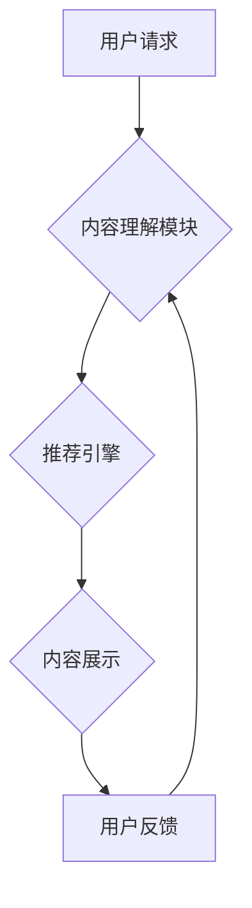

                 

## 从搜索到发现：DayDream要做内容电商

> 关键词：DayDream, 内容电商, 搜索引擎, 推荐系统, 深度学习, 自然语言处理, 图像识别, 多模态理解

### 1. 背景介绍

互联网的蓬勃发展催生了海量信息爆炸，用户在海量信息中寻找所需内容变得越来越困难。传统的搜索引擎主要依靠关键词匹配，难以满足用户对更精准、更智能化内容发现的需求。近年来，深度学习、自然语言处理等人工智能技术突飞猛进，为内容电商的未来发展提供了新的机遇。

DayDream，作为一家致力于人工智能技术应用的创新公司，旨在利用先进的 AI 技术，从传统的搜索引擎向更智能化的内容电商平台转型。DayDream的目标是帮助用户更轻松、更智能地发现和获取所需内容，并提供更丰富的用户体验。

### 2. 核心概念与联系

DayDream 的内容电商模式的核心概念是将搜索引擎与电商平台相结合，构建一个智能化的内容发现和消费平台。

**2.1  核心概念**

* **内容电商:** 将内容和商品相结合，提供用户更丰富的消费体验。
* **深度学习:** 利用多层神经网络，从海量数据中学习知识和模式，实现更精准的内容理解和推荐。
* **自然语言处理:** 处理和理解人类语言，实现更自然的用户交互和内容搜索。
* **图像识别:** 识别和理解图像内容，为用户提供更直观的搜索和发现体验。
* **多模态理解:** 融合文本、图像、音频等多种模态信息，实现更全面的内容理解和推荐。

**2.2  架构图**



### 3. 核心算法原理 & 具体操作步骤

**3.1  算法原理概述**

DayDream 的内容电商平台的核心算法是基于深度学习的推荐引擎。该推荐引擎通过分析用户行为、内容特征和上下文信息，为用户推荐最相关的商品和内容。

**3.2  算法步骤详解**

1. **数据收集和预处理:** 收集用户行为数据、商品信息、内容特征等数据，并进行清洗、转换和特征提取。
2. **模型训练:** 利用深度学习算法，例如深度神经网络、卷积神经网络等，训练推荐模型。
3. **推荐生成:** 根据用户的历史行为、当前上下文信息等，利用训练好的推荐模型生成推荐结果。
4. **结果展示:** 将推荐结果以用户友好的方式展示给用户，例如推荐列表、个性化页面等。
5. **用户反馈收集:** 收集用户的点击、购买、评价等反馈信息，并将其反馈到模型训练中，不断优化推荐效果。

**3.3  算法优缺点**

**优点:**

* **精准度高:** 基于深度学习的推荐引擎能够学习用户复杂的偏好，提供更精准的推荐结果。
* **个性化强:** 可以根据用户的不同特征和行为，提供个性化的推荐内容和商品。
* **可扩展性强:** 可以轻松扩展到新的内容和商品类别。

**缺点:**

* **数据依赖性强:** 需要大量的用户行为数据和内容特征数据进行训练。
* **训练成本高:** 训练深度学习模型需要大量的计算资源和时间。
* **解释性差:** 深度学习模型的决策过程较为复杂，难以解释推荐结果背后的原因。

**3.4  算法应用领域**

* 内容推荐: 推荐新闻、视频、音乐、书籍等内容。
* 商品推荐: 推荐电子产品、服装、食品等商品。
* 个性化服务: 提供个性化的新闻订阅、音乐播放列表、电影推荐等服务。

### 4. 数学模型和公式 & 详细讲解 & 举例说明

**4.1  数学模型构建**

DayDream 的推荐引擎采用基于矩阵分解的协同过滤模型。该模型将用户和商品表示为两个低维向量空间，通过计算用户向量和商品向量的内积来预测用户对商品的评分。

**4.2  公式推导过程**

设用户集合为U，商品集合为I，用户u对商品i的评分为r<sub>ui</sub>。协同过滤模型的目标是学习用户向量u和商品向量v，使得预测评分与实际评分尽可能接近。

预测评分：

$$
\hat{r}_{ui} = u^T v_i
$$

其中，u是用户u的向量，v<sub>i</sub>是商品i的向量，T表示向量点积。

损失函数：

$$
L = \sum_{u \in U, i \in I} (r_{ui} - \hat{r}_{ui})^2
$$

目标函数：

$$
\min_u, v_i L
$$

**4.3  案例分析与讲解**

假设有三个用户和三个商品，用户对商品的评分如下：

| 用户 | 商品1 | 商品2 | 商品3 |
|---|---|---|---|
| 用户1 | 5 | 3 | 4 |
| 用户2 | 4 | 5 | 2 |
| 用户3 | 3 | 2 | 5 |

通过训练协同过滤模型，可以学习到用户和商品的向量表示。例如，用户1的向量可能为[0.8, 0.5, 0.6]，商品1的向量可能为[0.7, 0.3, 0.5]。

根据公式，可以预测用户1对商品2的评分：

$$
\hat{r}_{12} = [0.8, 0.5, 0.6]^T [0.7, 0.3, 0.5] = 0.8*0.7 + 0.5*0.3 + 0.6*0.5 = 3.2
$$

### 5. 项目实践：代码实例和详细解释说明

**5.1  开发环境搭建**

DayDream 的内容电商平台可以使用 Python 语言和 TensorFlow 或 PyTorch 深度学习框架进行开发。需要安装以下软件：

* Python 3.x
* TensorFlow 或 PyTorch
* NumPy
* Pandas
* Scikit-learn

**5.2  源代码详细实现**

以下是一个基于 TensorFlow 的协同过滤推荐引擎的简单代码示例：

```python
import tensorflow as tf

# 定义用户和商品的维度
user_dim = 10
item_dim = 10

# 创建用户和商品的 embedding 层
user_embedding = tf.keras.layers.Embedding(input_dim=num_users, output_dim=user_dim)
item_embedding = tf.keras.layers.Embedding(input_dim=num_items, output_dim=item_dim)

# 定义预测评分的模型
def predict_rating(user_id, item_id):
  user_vector = user_embedding(tf.expand_dims(user_id, axis=0))
  item_vector = item_embedding(tf.expand_dims(item_id, axis=0))
  return tf.reduce_sum(user_vector * item_vector)

# 训练模型
# ...

# 生成推荐结果
user_id = 1
recommendations = predict_rating(user_id, tf.range(num_items))
```

**5.3  代码解读与分析**

* 代码首先定义了用户和商品的维度，并创建了用户和商品的 embedding 层。
* 然后定义了一个 predict_rating 函数，用于预测用户对商品的评分。该函数使用用户和商品的 embedding 向量进行点积运算，得到预测评分。
* 最后，代码展示了如何使用训练好的模型生成推荐结果。

**5.4  运行结果展示**

运行代码后，可以得到用户对不同商品的预测评分，并根据评分排序生成推荐结果。

### 6. 实际应用场景

DayDream 的内容电商平台可以应用于以下场景：

* **内容推荐:** 为用户推荐新闻、视频、音乐、书籍等内容。
* **商品推荐:** 为用户推荐电子产品、服装、食品等商品。
* **个性化服务:** 提供个性化的新闻订阅、音乐播放列表、电影推荐等服务。

**6.4  未来应用展望**

随着人工智能技术的不断发展，DayDream 的内容电商平台将不断完善和升级，未来将实现以下功能：

* **更精准的推荐:** 利用更先进的深度学习算法和多模态理解技术，实现更精准的推荐结果。
* **更丰富的交互体验:** 提供更丰富的用户交互方式，例如语音搜索、图像搜索等。
* **更智能化的服务:** 提供更智能化的服务，例如自动生成购物清单、个性化优惠活动等。

### 7. 工具和资源推荐

**7.1  学习资源推荐**

* **深度学习书籍:** 《深度学习》、《动手学深度学习》
* **在线课程:** Coursera、edX、Udacity 等平台的深度学习课程
* **开源项目:** TensorFlow、PyTorch 等深度学习框架的官方文档和示例代码

**7.2  开发工具推荐**

* **Python:** 作为深度学习开发的主要语言
* **TensorFlow 或 PyTorch:** 深度学习框架
* **Jupyter Notebook:** 用于代码编写和实验的交互式环境

**7.3  相关论文推荐**

* **协同过滤:** 《Collaborative Filtering: A User-Based Approach》
* **深度学习推荐:** 《Deep Learning for Recommender Systems》

### 8. 总结：未来发展趋势与挑战

**8.1  研究成果总结**

DayDream 的内容电商平台基于深度学习和协同过滤技术，实现了精准的推荐和个性化的用户体验。

**8.2  未来发展趋势**

未来，DayDream 的内容电商平台将朝着以下方向发展：

* **更精准的推荐:** 利用更先进的深度学习算法和多模态理解技术，实现更精准的推荐结果。
* **更丰富的交互体验:** 提供更丰富的用户交互方式，例如语音搜索、图像搜索等。
* **更智能化的服务:** 提供更智能化的服务，例如自动生成购物清单、个性化优惠活动等。

**8.3  面临的挑战**

DayDream 的内容电商平台也面临着一些挑战：

* **数据隐私:** 如何保护用户数据隐私，是内容电商平台面临的重要挑战。
* **算法公平性:** 如何避免算法产生偏见，确保推荐结果公平公正，也是需要解决的问题。
* **用户信任:** 如何建立用户的信任，是内容电商平台长期发展的关键。

**8.4  研究展望**

DayDream 将继续投入研发，不断提升平台的推荐精准度、用户体验和服务智能化，为用户提供更便捷、更智能的购物和内容发现体验。

### 9. 附录：常见问题与解答

**常见问题:**

* **如何保证推荐结果的准确性？**

DayDream 的推荐引擎基于深度学习算法，并不断学习用户行为和内容特征，以提高推荐结果的准确性。

* **如何保护用户数据隐私？**

DayDream 严格遵守数据隐私政策，并采取多种技术措施保护用户数据安全。

* **如何避免算法产生偏见？**

DayDream 致力于开发公平、透明的算法，并定期进行算法评估和优化，以避免算法产生偏见。


作者：禅与计算机程序设计艺术 / Zen and the Art of Computer Programming 
<end_of_turn>

