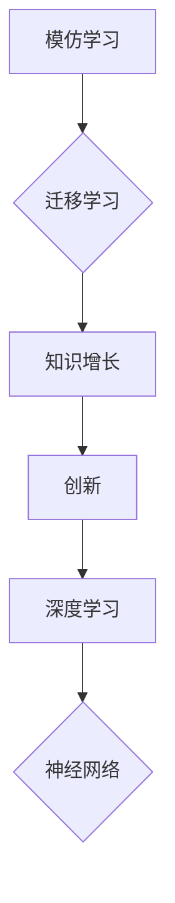

                 

## 从模仿到创新：人类知识增长的过程

> 关键词：人工智能、知识增长、模仿学习、迁移学习、创新、深度学习、神经网络

### 1. 背景介绍

人类文明的进步离不开知识的不断积累和创新。从远古人类学会使用工具，到现代人工智能的快速发展，知识的增长始终是推动社会进步的引擎。而知识的增长过程，本质上是一个从模仿到创新的演化过程。

早期人类通过模仿前辈的经验和行为，逐渐掌握了生存和生产的技能。随着认知能力的提升，人类开始对周围世界进行观察和思考，并尝试将已有的知识应用到新的场景中。这种从已知到未知的探索，正是知识创新的源泉。

如今，人工智能技术的发展为我们提供了新的视角去理解和模拟人类知识增长的过程。深度学习算法的出现，使得机器能够从海量数据中学习，并逐渐掌握人类的认知能力。然而，人工智能的模仿能力远远不及人类，真正的创新仍然是人类的专属。

### 2. 核心概念与联系

**2.1  模仿学习 (Imitation Learning)**

模仿学习是机器学习的一种范式，旨在通过模仿人类或其他代理的示范行为来学习新的技能或知识。

**2.2  迁移学习 (Transfer Learning)**

迁移学习是指利用已学习到的知识和经验来解决新的任务。它可以帮助机器更快地适应新的环境和挑战。

**2.3  创新 (Innovation)**

创新是指创造出新的想法、产品或服务，并将其付诸实践。它需要对现有知识进行整合和重构，并提出新的解决方案。

**2.4  知识增长 (Knowledge Growth)**

知识增长是指人类或机器通过学习、思考和实践不断积累和完善知识的过程。

**2.5  深度学习 (Deep Learning)**

深度学习是一种机器学习的子领域，利用多层神经网络来模拟人类的认知过程。

**2.6  神经网络 (Neural Network)**

神经网络是一种由相互连接的神经元组成的计算模型，能够学习和处理复杂的数据模式。

**核心概念与联系流程图:**



### 3. 核心算法原理 & 具体操作步骤

**3.1  算法原理概述**

模仿学习的核心原理是通过观察人类或其他代理的示范行为，学习其背后的决策规则和策略。

迁移学习的核心原理是利用已学习到的知识和经验来解决新的任务。它可以将已有的模型参数迁移到新的任务中，从而减少训练时间和数据需求。

**3.2  算法步骤详解**

**模仿学习算法步骤:**

1. 收集人类示范行为的数据集。
2. 选择合适的模仿学习算法，例如行为克隆或策略梯度。
3. 训练模型，使其能够模仿人类示范行为。
4. 评估模型的性能，并进行调整。

**迁移学习算法步骤:**

1. 在源任务上训练一个模型。
2. 将源任务模型的参数迁移到目标任务中。
3. 在目标任务上进行微调，以适应新的数据分布。
4. 评估模型的性能，并进行调整。

**3.3  算法优缺点**

**模仿学习算法:**

* **优点:** 可以学习到人类的复杂行为模式，无需明确的奖励函数。
* **缺点:** 需要大量的示范数据，容易受到示范数据的偏差影响。

**迁移学习算法:**

* **优点:** 可以减少训练时间和数据需求，提高模型的泛化能力。
* **缺点:** 需要找到合适的源任务和目标任务，否则迁移效果可能不佳。

**3.4  算法应用领域**

* **模仿学习:** 机器人控制、游戏 AI、自然语言处理等。
* **迁移学习:** 图像识别、语音识别、机器翻译等。

### 4. 数学模型和公式 & 详细讲解 & 举例说明

**4.1  数学模型构建**

模仿学习可以建模为一个强化学习问题，其中代理的目标是最大化奖励信号。

**4.2  公式推导过程**

假设代理的策略为π(a|s)，状态为s，动作为a，奖励为r。则代理的目标是最大化以下期望值:

$$
\max_{\pi} E_{\tau \sim \pi} \sum_{t=0}^{T} r_t
$$

其中，τ是轨迹，T是时间步长。

**4.3  案例分析与讲解**

例如，训练一个机器人学会抓取物体，我们可以使用模仿学习算法。

* **状态:** 机器人的关节角度、物体的位姿等。
* **动作:** 机器人关节的运动指令。
* **奖励:** 当机器人成功抓取物体时，奖励为正值；否则，奖励为负值。

通过观察人类抓取物体的示范视频，训练机器人模仿人类的动作，并根据奖励信号调整策略，最终机器人能够学会抓取物体。

### 5. 项目实践：代码实例和详细解释说明

**5.1  开发环境搭建**

* Python 3.7+
* TensorFlow 2.0+
* OpenAI Gym

**5.2  源代码详细实现**

```python
import tensorflow as tf
from tensorflow.keras.models import Sequential
from tensorflow.keras.layers import Dense, Flatten

# 定义模仿学习模型
model = Sequential()
model.add(Flatten(input_shape=(state_size,)))
model.add(Dense(hidden_size, activation='relu'))
model.add(Dense(action_size, activation='softmax'))

# 编译模型
model.compile(loss='categorical_crossentropy', optimizer='adam')

# 训练模型
model.fit(states, actions, epochs=100)

# 使用模型预测动作
predicted_action = model.predict(state)
```

**5.3  代码解读与分析**

* 该代码实现了一个简单的模仿学习模型，用于预测机器人动作。
* 模型输入是状态信息，输出是动作概率分布。
* 使用交叉熵损失函数和Adam优化器训练模型。

**5.4  运行结果展示**

训练完成后，可以将模型应用于新的状态输入，预测机器人动作。

### 6. 实际应用场景

* **机器人控制:** 训练机器人模仿人类操作工具或完成特定任务。
* **游戏 AI:** 训练游戏 AI 代理模仿人类玩家的策略。
* **自然语言处理:** 训练语言模型模仿人类的写作风格或对话方式。

**6.4  未来应用展望**

* **个性化学习:** 根据用户的学习风格和需求，定制个性化的学习路径。
* **自动代码生成:** 利用模仿学习算法，训练模型自动生成代码。
* **科学发现:** 利用模仿学习算法，帮助科学家发现新的科学规律。

### 7. 工具和资源推荐

**7.1  学习资源推荐**

* **书籍:**
    * 《Reinforcement Learning: An Introduction》 by Sutton and Barto
    * 《Deep Learning》 by Goodfellow, Bengio, and Courville
* **课程:**
    * Coursera: Reinforcement Learning Specialization
    * Udacity: Deep Learning Nanodegree

**7.2  开发工具推荐**

* **TensorFlow:** 开源深度学习框架。
* **PyTorch:** 开源深度学习框架。
* **OpenAI Gym:** 机器学习环境库。

**7.3  相关论文推荐**

* **Imitation Learning with Deep Reinforcement Learning** by Levine et al.
* **Deep Transfer Learning** by Pan and Yang
* **Generative Adversarial Networks** by Goodfellow et al.

### 8. 总结：未来发展趋势与挑战

**8.1  研究成果总结**

近年来，模仿学习和迁移学习取得了显著进展，为人工智能的知识增长提供了新的思路和方法。

**8.2  未来发展趋势**

* **更强大的模仿学习算法:** 能够学习到更复杂和细粒度的行为模式。
* **更有效的迁移学习方法:** 能够更好地利用源任务知识，提高目标任务的性能。
* **结合人类反馈的学习:** 能够更好地融合人类的知识和经验。

**8.3  面临的挑战**

* **数据获取和标注:** 高质量的示范数据是模仿学习的关键。
* **模型解释性和可控性:** 深度学习模型的决策过程往往难以解释，这限制了其在安全关键领域的应用。
* **伦理问题:** 人工智能的知识增长可能会带来伦理挑战，例如算法偏见和数据隐私。

**8.4  研究展望**

未来，人工智能的知识增长将朝着更智能、更安全、更可控的方向发展。

### 9. 附录：常见问题与解答

* **Q1: 模仿学习和监督学习有什么区别？**

* **A1:** 模仿学习的目标是学习人类的行为模式，而监督学习的目标是学习从标记数据中提取的规律。

* **Q2: 迁移学习可以应用于哪些领域？**

* **A2:** 迁移学习可以应用于图像识别、语音识别、机器翻译等多个领域。

* **Q3: 深度学习模型的决策过程难以解释，如何解决这个问题？**

* **A3:** 

目前，一些研究方法试图解释深度学习模型的决策过程，例如可解释机器学习 (XAI) 和神经网络可视化。


作者：禅与计算机程序设计艺术 / Zen and the Art of Computer Programming 
<end_of_turn>

