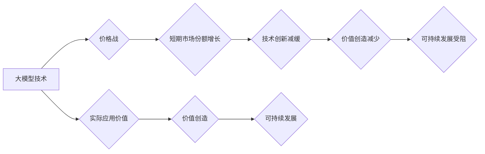

                 

## 价格战的无益：贾扬清的观点，大模型价格下降是趋势，但需聚焦实际问题

> 关键词：大模型、价格战、实际问题、价值创造、可持续发展、技术创新

### 1. 背景介绍

近年来，大模型技术蓬勃发展，涌现出一批强大的开源和商业化模型，如GPT-3、LaMDA、ERNIE 3.0等。这些模型在自然语言处理、图像生成、代码编写等领域展现出惊人的能力，引发了广泛的关注和讨论。与此同时，大模型的训练成本也越来越高，这使得价格成为一个重要的议题。

近期，大模型的价格战逐渐升级，一些公司开始大幅降低模型的访问价格，甚至提供免费试用。这引发了业界对大模型商业模式的思考，以及价格战对大模型发展的影响。

著名人工智能专家贾扬清在多次公开场合表达了对大模型价格战的担忧，他认为，单纯依靠价格战来推动大模型的发展是不可持续的，更重要的是关注大模型的实际应用价值和可持续发展。

### 2. 核心概念与联系

**2.1 大模型**

大模型是指参数量达到亿级或千亿级的深度学习模型，拥有强大的泛化能力和学习能力。

**2.2 价格战**

价格战是指企业通过降低产品价格来争夺市场份额的竞争策略。

**2.3 实际应用价值**

指大模型在实际应用场景中能够解决的问题、创造的价值和带来的效益。

**2.4 可持续发展**

指大模型技术能够长期发展，并为社会和经济带来持续的价值。

**2.5 价值创造**

指通过大模型技术解决实际问题，创造新的产品、服务或商业模式，从而产生经济效益和社会效益。

**Mermaid 流程图**



### 3. 核心算法原理 & 具体操作步骤

**3.1 算法原理概述**

大模型的训练主要基于深度学习算法，例如Transformer网络。Transformer网络通过自注意力机制学习文本的上下文关系，从而能够理解和生成更复杂的语言。

**3.2 算法步骤详解**

1. **数据预处理:** 将文本数据进行清洗、分词、标记等预处理操作，使其能够被模型理解。
2. **模型构建:** 根据深度学习算法，构建大模型的网络结构，并设定模型参数。
3. **模型训练:** 使用预处理后的数据训练模型，通过调整模型参数，使其能够准确地预测文本的下一个词。
4. **模型评估:** 使用测试数据评估模型的性能，例如准确率、困惑度等指标。
5. **模型部署:** 将训练好的模型部署到服务器上，供用户访问和使用。

**3.3 算法优缺点**

**优点:**

* 强大的泛化能力和学习能力，能够处理复杂的任务。
* 能够学习文本的上下文关系，生成更自然流畅的文本。

**缺点:**

* 训练成本高，需要大量的计算资源和数据。
* 模型参数量大，部署和推理需要较高的硬件要求。

**3.4 算法应用领域**

* 自然语言处理：文本分类、情感分析、机器翻译、对话系统等。
* 图像生成：图像识别、图像分类、图像生成等。
* 代码编写：代码生成、代码理解、代码修复等。

### 4. 数学模型和公式 & 详细讲解 & 举例说明

**4.1 数学模型构建**

大模型的训练过程可以看作是一个优化问题，目标是找到最优的模型参数，使得模型在训练数据上的损失函数最小。

损失函数通常采用交叉熵损失函数，用于衡量模型预测结果与真实结果之间的差异。

**4.2 公式推导过程**

假设模型的输出为 $y_i$，真实标签为 $t_i$，则交叉熵损失函数可以表示为：

$$
L = -\sum_{i=1}^{N} t_i \log y_i
$$

其中，$N$ 为样本数量。

**4.3 案例分析与讲解**

例如，在机器翻译任务中，模型的输出为翻译后的文本，真实标签为源语言文本。通过最小化交叉熵损失函数，模型可以学习到将源语言文本翻译成目标语言文本的映射关系。

### 5. 项目实践：代码实例和详细解释说明

**5.1 开发环境搭建**

使用Python语言和深度学习框架TensorFlow或PyTorch进行大模型开发。

**5.2 源代码详细实现**

```python
# 使用TensorFlow构建一个简单的Transformer模型
import tensorflow as tf

# 定义Transformer模型
class Transformer(tf.keras.Model):
    def __init__(self, vocab_size, embedding_dim, num_heads, num_layers):
        super(Transformer, self).__init__()
        self.embedding = tf.keras.layers.Embedding(vocab_size, embedding_dim)
        self.transformer_layers = tf.keras.layers.StackedRNNCells([
            tf.keras.layers.MultiHeadAttention(num_heads=num_heads, key_dim=embedding_dim)
            for _ in range(num_layers)
        ])
        self.fc = tf.keras.layers.Dense(vocab_size)

    def call(self, inputs):
        x = self.embedding(inputs)
        x = self.transformer_layers(x)
        x = self.fc(x)
        return x

# 实例化模型
model = Transformer(vocab_size=10000, embedding_dim=128, num_heads=8, num_layers=6)

# 训练模型
model.compile(optimizer='adam', loss='sparse_categorical_crossentropy', metrics=['accuracy'])
model.fit(train_data, train_labels, epochs=10)
```

**5.3 代码解读与分析**

这段代码展示了如何使用TensorFlow构建一个简单的Transformer模型。模型包含嵌入层、多头注意力层和全连接层。训练过程使用交叉熵损失函数和Adam优化器。

**5.4 运行结果展示**

训练完成后，可以使用测试数据评估模型的性能，例如准确率、困惑度等指标。

### 6. 实际应用场景

**6.1 自然语言处理**

* **文本分类:** 将文本分类到不同的类别，例如情感分析、主题分类等。
* **机器翻译:** 将文本从一种语言翻译成另一种语言。
* **对话系统:** 开发能够与人类进行自然对话的聊天机器人。

**6.2 图像生成**

* **图像识别:** 将图像识别为特定的物体或场景。
* **图像分类:** 将图像分类到不同的类别，例如动物、植物、人脸等。
* **图像生成:** 根据文本描述生成图像。

**6.3 代码编写**

* **代码生成:** 根据自然语言描述生成代码。
* **代码理解:** 理解代码的功能和逻辑。
* **代码修复:** 自动修复代码中的错误。

**6.4 未来应用展望**

大模型技术在未来将应用于更广泛的领域，例如医疗、教育、金融等。

### 7. 工具和资源推荐

**7.1 学习资源推荐**

* **书籍:**
    * 《深度学习》
    * 《自然语言处理》
* **在线课程:**
    * Coursera
    * edX
* **博客:**
    * TensorFlow Blog
    * PyTorch Blog

**7.2 开发工具推荐**

* **深度学习框架:** TensorFlow, PyTorch
* **编程语言:** Python
* **云计算平台:** AWS, Google Cloud, Azure

**7.3 相关论文推荐**

* **Attention Is All You Need**
* **BERT: Pre-training of Deep Bidirectional Transformers for Language Understanding**
* **GPT-3: Language Models are Few-Shot Learners**

### 8. 总结：未来发展趋势与挑战

**8.1 研究成果总结**

近年来，大模型技术取得了显著的进展，在多个领域展现出强大的应用潜力。

**8.2 未来发展趋势**

* **模型规模的进一步扩大:** 随着计算资源的不断提升，大模型的规模将继续扩大，从而提升模型的性能。
* **模型训练成本的降低:** 研究人员将探索新的训练方法和算法，降低大模型的训练成本。
* **模型的泛化能力和鲁棒性提升:** 研究人员将致力于提升大模型的泛化能力和鲁棒性，使其能够更好地应对实际应用中的挑战。

**8.3 面临的挑战**

* **数据获取和标注:** 大模型的训练需要大量的训练数据，而获取和标注高质量的数据是一个挑战。
* **计算资源需求:** 大模型的训练需要大量的计算资源，这对于资源有限的机构和个人来说是一个障碍。
* **模型解释性和可控性:** 大模型的决策过程往往难以解释，这对于一些安全敏感的应用场景来说是一个挑战。

**8.4 研究展望**

未来，大模型技术将继续朝着更强大、更智能、更安全的方向发展。研究人员将继续探索新的模型架构、训练方法和应用场景，推动大模型技术在各个领域的广泛应用。

### 9. 附录：常见问题与解答

**9.1 如何选择合适的深度学习框架？**

TensorFlow和PyTorch是目前最流行的深度学习框架，选择哪个框架取决于个人喜好和项目需求。

**9.2 如何获取大模型的训练数据？**

一些公开数据集可以用于训练大模型，例如Wikipedia、Common Crawl等。

**9.3 如何部署大模型？**

可以使用云计算平台或本地服务器部署大模型。


作者：禅与计算机程序设计艺术 / Zen and the Art of Computer Programming 
<end_of_turn>

