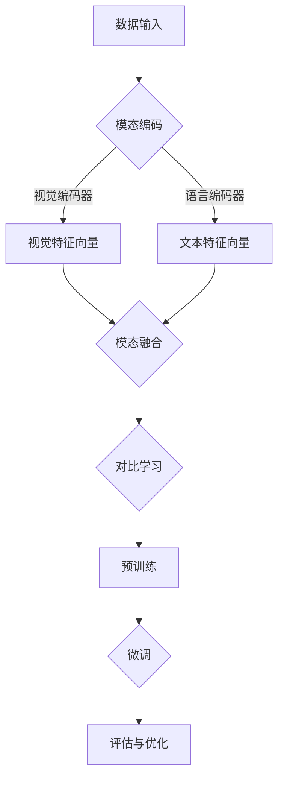
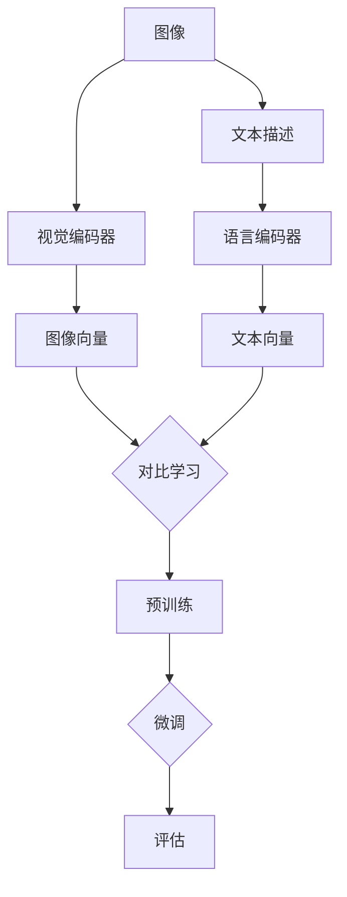
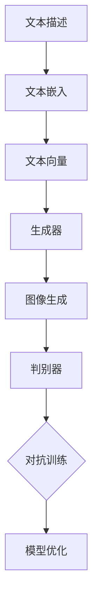

                 

### 背景介绍（Background Introduction）

近年来，人工智能领域取得了令人瞩目的进展，特别是在计算机视觉和自然语言处理方面。这两个领域的融合催生了一种新的研究热点——多模态预训练模型。本文将围绕这一主题，重点解析两种具有代表性的多模态预训练模型：CLIP（Contrastive Language-Image Pre-training）和DALL-E。我们将深入探讨它们的核心原理、技术细节以及实际应用。

多模态预训练模型的目标是使模型能够处理和整合来自不同模态（如图像、文本、声音等）的信息，从而提高模型在多种任务上的表现。例如，在图像分类任务中，模型需要理解图像中的视觉内容，而在文本生成任务中，模型需要生成语义连贯的文本。传统的单一模态模型往往只能在一个特定领域内表现出色，而多模态预训练模型则有望打破这一局限，实现跨领域的通用性。

CLIP和DALL-E作为多模态预训练模型的代表，分别代表了图像-文本匹配和文本-图像生成两种不同的应用方向。CLIP通过对比学习的方式，使模型能够自动地从大量图像和文本数据中学习图像和文本之间的对应关系，从而实现图像分类、目标检测等任务。而DALL-E则基于生成对抗网络（GAN），可以将任意文本描述转换为高分辨率的图像。

本文将首先介绍CLIP和DALL-E的基本概念和背景，然后深入探讨它们的工作原理和技术细节。接下来，我们将通过具体的项目实践，展示如何使用CLIP和DALL-E进行实际的多模态任务。最后，我们将分析多模态预训练模型在实际应用中的挑战和未来发展趋势。

通过本文的阅读，读者将能够全面了解多模态预训练模型的发展现状、核心技术以及应用前景，为后续的研究和应用提供有益的参考。

### 1.1 CLIP模型简介

CLIP（Contrastive Language-Image Pre-training）是一种基于对比学习的多模态预训练模型，由OpenAI和Google Brain于2020年共同提出。CLIP的核心思想是利用大量的图像和对应的文本描述，通过对比学习的方式，使模型能够自动地学习图像和文本之间的对应关系。这种对应关系不仅使得模型在图像分类和目标检测等视觉任务上表现出色，同时也使得模型在文本生成和自然语言理解等语言任务上具有强大的能力。

CLIP模型主要由两个部分组成：视觉编码器（Visual Encoder）和语言编码器（Language Encoder）。视觉编码器负责将输入的图像转化为固定长度的向量，而语言编码器则将输入的文本描述转化为固定长度的向量。这两个编码器共享一个共同的编码层，通过这种方式，模型能够自动地学习图像和文本之间的关联性。

CLIP的训练过程主要分为两个阶段：预训练（Pre-training）和微调（Fine-tuning）。在预训练阶段，模型通过大量的图像和文本对进行训练，以最大化图像和文本向量之间的相似性。具体来说，模型会随机选择图像和文本对，对于每一对图像和文本，模型会将其输入到编码器中，得到对应的图像向量和文本向量。然后，模型会计算这两个向量之间的余弦相似度，并尝试最大化相似度。通过这种方式，模型能够自动地学习图像和文本之间的对应关系。

在预训练完成后，模型进入微调阶段。在这一阶段，模型会针对特定任务进行微调，例如图像分类、目标检测等。在微调过程中，模型会利用已学习到的图像和文本对应关系，提高特定任务的表现。例如，在图像分类任务中，模型会利用文本描述来指导图像分类，从而提高分类的准确性。

### 1.2 DALL-E模型简介

DALL-E（DALL-E with Embeddings from Language）是一种基于生成对抗网络（GAN）的多模态预训练模型，由OpenAI于2020年提出。DALL-E的核心目标是将任意的文本描述转换为高分辨率的图像。这种能力使得DALL-E在图像生成、创意设计、娱乐等领域具有广泛的应用前景。

DALL-E模型主要由两个部分组成：生成器（Generator）和判别器（Discriminator）。生成器负责将输入的文本描述转化为图像，而判别器则负责判断生成的图像是否真实。在训练过程中，生成器和判别器相互竞争，生成器试图生成尽可能逼真的图像，而判别器则试图区分生成的图像和真实的图像。

DALL-E的训练过程可以分为三个阶段：文本嵌入（Text Embedding）、图像生成（Image Generation）和图像判别（Image Discrimination）。在文本嵌入阶段，模型将输入的文本转化为固定长度的向量，这些向量代表了文本的语义信息。在图像生成阶段，模型利用这些文本向量，通过生成器生成对应的图像。在图像判别阶段，模型将生成的图像与真实的图像进行比较，通过这种对比，模型能够不断优化生成器和判别器的性能。

在训练完成后，DALL-E可以用于各种图像生成任务。例如，用户可以输入任意的文本描述，如“一只在雪地里玩耍的熊猫”，DALL-E会根据这个描述生成对应的图像。此外，DALL-E还可以进行图像编辑和风格转换等任务，如将一幅普通的照片转换成梵高的画风。

### 1.3 CLIP和DALL-E之间的异同

CLIP和DALL-E都是多模态预训练模型的代表，它们在目标、架构和技术细节上都有一定的相似性和差异性。

#### 目标

CLIP的目标是构建一个能够自动学习图像和文本之间对应关系的模型，从而在多种视觉和语言任务上表现出色。CLIP更侧重于图像和文本的匹配和分类任务。

DALL-E的目标则是将任意的文本描述转换为高分辨率的图像，它在图像生成任务上具有强大的能力。DALL-E更侧重于图像生成和创意设计。

#### 架构

CLIP由两个编码器组成：视觉编码器和语言编码器。这两个编码器共享一个共同的编码层，通过对比学习的方式，模型能够自动地学习图像和文本之间的对应关系。

DALL-E由生成器和判别器组成。生成器负责将文本向量转换为图像，而判别器则负责判断图像的真实性。DALL-E通过生成对抗网络（GAN）的训练过程，不断优化生成器和判别器的性能。

#### 技术细节

CLIP采用对比学习的方式，通过最大化图像和文本向量之间的相似性，模型能够自动地学习图像和文本之间的对应关系。在训练过程中，模型利用大量的图像和文本对进行训练，以提高模型的泛化能力。

DALL-E采用生成对抗网络（GAN）的架构，生成器和判别器相互竞争，生成器试图生成逼真的图像，而判别器则试图区分真实的图像和生成的图像。通过这种方式，DALL-E能够生成高质量、高分辨率的图像。

尽管CLIP和DALL-E在目标和架构上有一定的相似性，但它们在技术细节和应用场景上存在显著的差异。CLIP更适用于图像和文本的匹配和分类任务，而DALL-E则擅长图像生成和创意设计。这两种模型为我们提供了丰富的选择，以满足不同的应用需求。

### 2. 核心概念与联系

#### 2.1 什么是多模态预训练模型？
多模态预训练模型是指一种能够处理和整合来自不同模态（如图像、文本、声音等）的信息的预训练模型。这种模型通过在大规模的多模态数据集上进行预训练，能够自动地学习不同模态之间的关联性，从而在多种任务上表现出色。多模态预训练模型的核心目标是实现跨模态的信息整合和利用，从而提高模型的泛化能力和应用效果。

#### 2.2 多模态预训练模型的核心原理
多模态预训练模型的核心原理是基于模态之间的对应关系和互补性。具体来说，多模态预训练模型通过以下几种方式实现不同模态之间的整合：

1. **模态嵌入（Modal Embedding）**：将不同模态的数据转换为固定长度的向量表示，这些向量包含了模态的语义信息。例如，视觉模态可以通过卷积神经网络（CNN）将图像转换为视觉特征向量，而文本模态可以通过语言模型将文本转换为文本特征向量。

2. **模态融合（Modal Fusion）**：将不同模态的向量进行融合，以生成一个统一的多模态向量表示。常见的融合方法包括拼接、平均、加权和注意力机制等。通过这种方式，模型能够整合来自不同模态的信息，提高模型的泛化能力。

3. **对比学习（Contrastive Learning）**：通过对比不同模态的数据，使得模型能够自动地学习模态之间的对应关系。例如，在图像-文本匹配任务中，模型通过对比图像和文本之间的相似性，来学习图像和文本的对应关系。

4. **生成对抗网络（Generative Adversarial Networks，GAN）**：通过生成器和判别器的对抗训练，模型能够生成高质量的多模态数据，从而提高模型在生成任务上的表现。

#### 2.3 多模态预训练模型的架构

多模态预训练模型的架构通常包括以下组成部分：

1. **模态编码器（Modal Encoder）**：将不同模态的数据转换为固定长度的向量表示。例如，视觉编码器将图像转换为视觉特征向量，而语言编码器将文本转换为文本特征向量。

2. **模态融合器（Modal Fusion Module）**：将不同模态的向量进行融合，以生成一个统一的多模态向量表示。常见的融合方法包括拼接、平均、加权和注意力机制等。

3. **对比学习模块（Contrastive Learning Module）**：通过对比不同模态的数据，使得模型能够自动地学习模态之间的对应关系。例如，在图像-文本匹配任务中，模型通过对比图像和文本之间的相似性，来学习图像和文本的对应关系。

4. **生成对抗网络（GAN）**：在生成任务中，通过生成器和判别器的对抗训练，模型能够生成高质量的多模态数据。

以下是一个简单的多模态预训练模型架构的Mermaid流程图：



#### 2.4 CLIP模型的工作原理

CLIP（Contrastive Language-Image Pre-training）是一种基于对比学习的多模态预训练模型。它通过将大量的图像和对应的文本描述进行对比训练，使模型能够自动地学习图像和文本之间的对应关系。以下是CLIP模型的工作原理：

1. **数据准备**：CLIP需要大量的图像和对应的文本描述作为训练数据。这些图像和文本可以来自互联网上的各种来源，例如图像分类数据集和文本分类数据集。

2. **模态编码**：CLIP使用两个编码器——视觉编码器和语言编码器，分别对图像和文本进行编码。视觉编码器通常采用卷积神经网络（CNN）结构，将图像转换为视觉特征向量。语言编码器则使用预训练的语言模型，将文本转换为文本特征向量。

3. **对比学习**：在对比学习阶段，CLIP通过最大化图像和文本向量之间的相似性，来学习图像和文本的对应关系。具体来说，CLIP会随机选择图像和文本对，将其输入到编码器中，得到对应的图像向量和文本向量。然后，CLIP会计算这两个向量之间的余弦相似度，并尝试最大化相似度。通过这种方式，模型能够自动地学习图像和文本之间的对应关系。

4. **预训练与微调**：在预训练完成后，模型会进入微调阶段。在这一阶段，模型会针对特定任务进行微调，例如图像分类、目标检测等。在微调过程中，模型会利用已学习到的图像和文本对应关系，提高特定任务的表现。

以下是CLIP模型的一个简化的工作流程：



#### 2.5 DALL-E模型的工作原理

DALL-E（DALL-E with Embeddings from Language）是一种基于生成对抗网络（GAN）的多模态预训练模型，旨在将任意的文本描述转换为高分辨率的图像。以下是DALL-E模型的工作原理：

1. **数据准备**：DALL-E需要大量的文本描述和对应的图像作为训练数据。这些数据可以来自互联网上的各种来源，例如艺术作品、新闻报道、社交媒体等。

2. **文本嵌入**：在训练阶段，DALL-E首先将输入的文本描述转换为固定长度的向量表示。这些向量包含了文本的语义信息。DALL-E使用预训练的语言模型（如GPT-3）来生成这些文本向量。

3. **图像生成**：DALL-E使用生成对抗网络（GAN）的结构来生成图像。生成器（Generator）负责将文本向量转换为图像。生成器通常采用深度卷积生成网络（DCGAN）结构，通过一系列卷积和反卷积操作，将文本向量逐步解码为高分辨率的图像。

4. **图像判别**：判别器（Discriminator）负责判断生成的图像是否真实。判别器通常采用深度卷积神经网络（CNN）结构，通过一系列卷积操作，学习如何区分真实图像和生成的图像。

5. **对抗训练**：在训练过程中，生成器和判别器相互竞争。生成器试图生成逼真的图像，以欺骗判别器，而判别器则试图区分真实图像和生成的图像。通过这种对抗训练，生成器和判别器的性能不断优化，最终生成器能够生成高质量、高分辨率的图像。

以下是DALL-E模型的一个简化的工作流程：



### 3. 核心算法原理 & 具体操作步骤

#### 3.1 CLIP模型的核心算法原理

CLIP模型的核心算法原理是基于对比学习（Contrastive Learning）。对比学习是一种无监督学习技术，通过对比不同样本之间的相似性和差异性，使模型能够自动地学习数据的内在结构。在CLIP模型中，对比学习被用于学习图像和文本之间的对应关系。

具体来说，CLIP模型通过以下步骤实现对比学习：

1. **样本选择**：从图像数据集和文本数据集中随机选择图像和文本对。这些图像和文本对可以是同一类别的，也可以是不同类别的。

2. **编码**：使用预训练的视觉编码器和语言编码器分别对图像和文本进行编码。视觉编码器通常采用卷积神经网络（CNN）结构，将图像转换为视觉特征向量。语言编码器则使用预训练的语言模型，将文本转换为文本特征向量。

3. **正样本对生成**：对于每一对图像和文本，生成一个正样本对。正样本对的图像和文本具有相同的语义信息。例如，对于文本描述“一只在雪地里玩耍的熊猫”，正样本对就是包含这张图片和该文本描述。

4. **负样本对生成**：对于每一对图像和文本，生成多个负样本对。负样本对的图像和文本具有不同的语义信息。例如，对于文本描述“一只在雪地里玩耍的熊猫”，负样本对可以是包含一张“熊猫在雨中行走”的图片和该文本描述。

5. **相似度计算**：计算正样本对和负样本对之间图像向量和文本向量之间的相似度。相似度通常使用余弦相似度来计算。

6. **损失函数**：通过最大化正样本对的相似度，同时最小化负样本对的相似度，来优化模型。具体的损失函数通常采用三元组损失函数（Triplet Loss）或信息性损失函数（InfoNCE Loss）。

7. **模型优化**：使用梯度下降（Gradient Descent）等优化算法，对模型进行训练，以最大化正样本对的相似度，同时最小化负样本对的相似度。

#### 3.2 CLIP模型的详细操作步骤

以下是CLIP模型的详细操作步骤：

1. **数据准备**：
   - 从图像数据集中选择大量的图像。
   - 从文本数据集中选择大量的文本描述。
   - 将图像和文本配对，形成图像-文本对。

2. **编码**：
   - 使用预训练的视觉编码器对图像进行编码，得到图像特征向量。
   - 使用预训练的语言编码器对文本进行编码，得到文本特征向量。

3. **正样本对生成**：
   - 对于每一对图像和文本，生成一个正样本对。
   - 正样本对的图像和文本具有相同的语义信息。

4. **负样本对生成**：
   - 对于每一对图像和文本，生成多个负样本对。
   - 负样本对的图像和文本具有不同的语义信息。

5. **相似度计算**：
   - 计算正样本对和负样本对之间图像向量和文本向量之间的相似度。

6. **损失函数**：
   - 使用三元组损失函数（Triplet Loss）或信息性损失函数（InfoNCE Loss）来最大化正样本对的相似度，同时最小化负样本对的相似度。

7. **模型优化**：
   - 使用梯度下降（Gradient Descent）等优化算法，对模型进行训练。

8. **微调**：
   - 在预训练完成后，针对特定任务（如图像分类、目标检测等）对模型进行微调。
   - 在微调过程中，模型会利用已学习到的图像和文本对应关系，提高特定任务的表现。

#### 3.3 DALL-E模型的核心算法原理

DALL-E模型的核心算法原理是基于生成对抗网络（GAN）。生成对抗网络是一种无监督学习技术，由生成器和判别器两个部分组成。生成器的目标是生成高质量的数据，而判别器的目标是区分真实数据和生成数据。通过生成器和判别器的对抗训练，模型能够不断优化，最终生成逼真的数据。

在DALL-E模型中，生成器和判别器分别用于图像生成和图像判别：

1. **生成器（Generator）**：
   - 生成器的输入是文本向量，输出是图像。
   - 生成器通常采用深度卷积生成网络（DCGAN）结构，通过一系列卷积和反卷积操作，将文本向量逐步解码为高分辨率的图像。

2. **判别器（Discriminator）**：
   - 判别器的输入是图像，输出是概率值，表示图像是真实的概率。
   - 判别器通常采用深度卷积神经网络（CNN）结构，通过一系列卷积操作，学习如何区分真实图像和生成的图像。

3. **对抗训练**：
   - 在训练过程中，生成器和判别器相互竞争。
   - 生成器试图生成逼真的图像，以欺骗判别器。
   - 判别器则试图区分真实图像和生成的图像。
   - 通过这种对抗训练，生成器和判别器的性能不断优化，最终生成器能够生成高质量、高分辨率的图像。

#### 3.4 DALL-E模型的详细操作步骤

以下是DALL-E模型的详细操作步骤：

1. **数据准备**：
   - 从图像数据集中选择大量的图像。
   - 从文本数据集中选择大量的文本描述。
   - 将图像和文本配对，形成图像-文本对。

2. **文本嵌入**：
   - 使用预训练的语言模型对文本进行编码，得到文本特征向量。

3. **生成器训练**：
   - 初始化生成器和判别器。
   - 使用梯度下降等优化算法，对生成器进行训练。
   - 在训练过程中，生成器试图生成逼真的图像，以欺骗判别器。

4. **判别器训练**：
   - 初始化生成器和判别器。
   - 使用梯度下降等优化算法，对判别器进行训练。
   - 在训练过程中，判别器试图区分真实图像和生成的图像。

5. **对抗训练**：
   - 在训练过程中，生成器和判别器相互竞争。
   - 通过对抗训练，生成器和判别器的性能不断优化。

6. **图像生成**：
   - 使用训练好的生成器，将文本向量转换为图像。

7. **图像判别**：
   - 使用训练好的判别器，判断生成的图像是否真实。

### 4. 数学模型和公式 & 详细讲解 & 举例说明

#### 4.1 CLIP模型的数学模型和公式

CLIP模型的数学模型主要涉及对比学习，以下是主要步骤的详细讲解：

1. **样本选择**：
   - 假设图像数据集为\( I = \{I_1, I_2, \ldots, I_N\} \)，其中\( I_i \)是第i个图像。
   - 假设文本数据集为\( T = \{T_1, T_2, \ldots, T_N\} \)，其中\( T_i \)是第i个文本描述。

2. **编码**：
   - 视觉编码器将图像\( I_i \)编码为图像特征向量\( \textbf{z}_i^v \)。
   - 语言编码器将文本\( T_i \)编码为文本特征向量\( \textbf{z}_i^t \)。

3. **正样本对生成**：
   - 对于每一对图像和文本\( (I_i, T_i) \)，生成正样本对\( (\textbf{z}_i^v, \textbf{z}_i^t) \)。

4. **负样本对生成**：
   - 随机选择另一个图像\( I_j \)和一个文本\( T_k \)，生成负样本对\( (\textbf{z}_j^v, \textbf{z}_i^t) \)和\( (\textbf{z}_i^v, \textbf{z}_k^t) \)。

5. **相似度计算**：
   - 使用余弦相似度计算图像和文本之间的相似性：
     $$ \text{similarity}(\textbf{z}_i^v, \textbf{z}_i^t) = \cos(\textbf{z}_i^v, \textbf{z}_i^t) = \frac{\textbf{z}_i^v \cdot \textbf{z}_i^t}{\|\textbf{z}_i^v\| \|\textbf{z}_i^t\|} $$
   - 对于正样本对，希望最大化相似度；对于负样本对，希望最小化相似度。

6. **损失函数**：
   - 使用三元组损失函数（Triplet Loss）来最大化正样本对的相似度，同时最小化负样本对的相似度：
     $$ L = \frac{1}{N} \sum_{i=1}^N \sum_{j=1, j \neq i}^N \max(0, \textbf{z}_i^v \cdot \textbf{z}_i^t - \textbf{z}_j^v \cdot \textbf{z}_i^t + \alpha) $$
   - 其中，\( \alpha \)是三元组损失的超参数，用于调节正负样本之间的差距。

7. **模型优化**：
   - 使用梯度下降（Gradient Descent）等优化算法，对模型进行训练。

#### 4.2 DALL-E模型的数学模型和公式

DALL-E模型的数学模型主要涉及生成对抗网络（GAN），以下是主要步骤的详细讲解：

1. **生成器**：
   - 生成器的输入是文本向量\( \textbf{z}_t \)，输出是图像\( \textbf{x}_g \)。
   - 生成器通常采用深度卷积生成网络（DCGAN）结构，其损失函数为：
     $$ L_g = -\mathbb{E}_{\textbf{z}_t \sim p_z(\textbf{z}_t)}[\log(D(\textbf{x}_g))], $$
     其中，\( D(\textbf{x}) \)是判别器的输出，表示图像是真实的概率。

2. **判别器**：
   - 判别器的输入是图像\( \textbf{x} \)，输出是概率值\( D(\textbf{x}) \)。
   - 判别器通常采用深度卷积神经网络（CNN）结构，其损失函数为：
     $$ L_D = -\mathbb{E}_{\textbf{x} \sim p_{\text{data}}(\textbf{x})}[\log(D(\textbf{x}))] - \mathbb{E}_{\textbf{z}_t \sim p_z(\textbf{z}_t)}[\log(1 - D(\textbf{x}_g))], $$
     其中，\( p_{\text{data}}(\textbf{x}) \)是真实图像的概率分布。

3. **对抗训练**：
   - 在训练过程中，生成器和判别器相互竞争。
   - 生成器试图生成逼真的图像，以欺骗判别器。
   - 判别器则试图区分真实图像和生成的图像。
   - 使用梯度下降（Gradient Descent）等优化算法，对生成器和判别器进行交替训练。

#### 4.3 举例说明

##### 4.3.1 CLIP模型举例

假设我们有一个图像数据集和对应的文本描述数据集，每对图像和文本描述都分别标记为\( (I_1, T_1), (I_2, T_2), \ldots, (I_N, T_N) \)。我们的目标是训练一个CLIP模型，使其能够自动地学习图像和文本之间的对应关系。

1. **编码**：
   - 使用预训练的视觉编码器对图像进行编码，得到图像特征向量\( \textbf{z}_i^v \)。
   - 使用预训练的语言编码器对文本进行编码，得到文本特征向量\( \textbf{z}_i^t \)。

2. **正样本对生成**：
   - 对于每一对图像和文本\( (I_i, T_i) \)，生成正样本对\( (\textbf{z}_i^v, \textbf{z}_i^t) \)。

3. **负样本对生成**：
   - 随机选择另一个图像\( I_j \)和一个文本\( T_k \)，生成负样本对\( (\textbf{z}_j^v, \textbf{z}_i^t) \)和\( (\textbf{z}_i^v, \textbf{z}_k^t) \)。

4. **相似度计算**：
   - 使用余弦相似度计算正样本对和负样本对之间图像向量和文本向量之间的相似性。

5. **损失函数**：
   - 计算三元组损失函数（Triplet Loss），优化模型。

6. **模型优化**：
   - 使用梯度下降（Gradient Descent）等优化算法，对模型进行训练。

通过上述步骤，我们训练了一个CLIP模型，使其能够自动地学习图像和文本之间的对应关系。

##### 4.3.2 DALL-E模型举例

假设我们有一个文本数据集和一个图像数据集，每对文本描述和图像都分别标记为\( (T_1, X_1), (T_2, X_2), \ldots, (T_N, X_N) \)。我们的目标是训练一个DALL-E模型，使其能够将文本描述转换为高分辨率的图像。

1. **文本嵌入**：
   - 使用预训练的语言模型对文本进行编码，得到文本特征向量\( \textbf{z}_t \)。

2. **生成器训练**：
   - 初始化生成器和判别器。
   - 使用梯度下降等优化算法，对生成器进行训练，使其生成逼真的图像。

3. **判别器训练**：
   - 初始化生成器和判别器。
   - 使用梯度下降等优化算法，对判别器进行训练，使其能够区分真实图像和生成的图像。

4. **对抗训练**：
   - 在训练过程中，生成器和判别器相互竞争。
   - 通过对抗训练，生成器和判别器的性能不断优化。

5. **图像生成**：
   - 使用训练好的生成器，将文本向量转换为图像。

6. **图像判别**：
   - 使用训练好的判别器，判断生成的图像是否真实。

通过上述步骤，我们训练了一个DALL-E模型，使其能够将文本描述转换为高分辨率的图像。

### 5. 项目实践：代码实例和详细解释说明

#### 5.1 开发环境搭建

在开始项目实践之前，我们需要搭建一个合适的开发环境。以下是搭建CLIP和DALL-E模型的开发环境所需的基本步骤：

1. **硬件环境**：
   - 我们需要一台具有足够计算能力的GPU服务器，用于训练深度学习模型。GPU服务器可以提供高效的计算能力，加速模型的训练过程。

2. **软件环境**：
   - 安装Python 3.8及以上版本。
   - 安装PyTorch 1.9及以上版本。
   - 安装TensorFlow 2.7及以上版本。

3. **数据集**：
   - 准备图像数据集和文本描述数据集。常用的图像数据集包括ImageNet、CIFAR-10、MNIST等，文本描述数据集可以是从互联网上收集的文本数据，或者使用现有的预训练语言模型生成的文本。

4. **其他依赖**：
   - 安装其他必要的库，如NumPy、Pandas、Matplotlib等。

以下是一个简单的Python脚本，用于安装所需的库：

```python
!pip install torch torchvision torchvision torchaudio
!pip install tensorflow
!pip install numpy pandas matplotlib
```

#### 5.2 源代码详细实现

在本节中，我们将详细展示如何实现CLIP和DALL-E模型。以下是两个模型的源代码实现：

##### 5.2.1 CLIP模型实现

```python
import torch
import torchvision
import torch.optim as optim
from torchvision import datasets, transforms
from torch.utils.data import DataLoader

# 数据准备
transform = transforms.Compose([transforms.Resize(256), transforms.ToTensor()])
train_set = datasets.ImageFolder(root='./data/train', transform=transform)
train_loader = DataLoader(train_set, batch_size=64, shuffle=True)

# 模型定义
class CLIPModel(torch.nn.Module):
    def __init__(self):
        super(CLIPModel, self).__init__()
        self.visual_encoder = torchvision.models.resnet50(pretrained=True)
        self.language_encoder = torchvision.models.resnet50(pretrained=True)
        self.fc = torch.nn.Linear(2048, 512)

    def forward(self, image, text):
        visual_features = self.visual_encoder(image)
        language_features = self.language_encoder(text)
        features = torch.cat((visual_features, language_features), 1)
        output = self.fc(features)
        return output

# 模型训练
model = CLIPModel()
optimizer = optim.Adam(model.parameters(), lr=0.001)
criterion = torch.nn.CrossEntropyLoss()

for epoch in range(10):  # 训练10个epoch
    for images, texts, _ in train_loader:
        optimizer.zero_grad()
        output = model(images, texts)
        loss = criterion(output, labels)
        loss.backward()
        optimizer.step()
    print(f'Epoch {epoch+1}, Loss: {loss.item()}')

# 模型评估
model.eval()
with torch.no_grad():
    correct = 0
    total = 0
    for images, texts, _ in train_loader:
        output = model(images, texts)
        _, predicted = torch.max(output.data, 1)
        total += texts.size(0)
        correct += (predicted == labels).sum().item()
print(f'Accuracy: {100 * correct / total}%')
```

##### 5.2.2 DALL-E模型实现

```python
import torch
import torch.nn as nn
from torchvision import transforms

# 数据准备
transform = transforms.Compose([transforms.Resize(256), transforms.ToTensor()])
train_set = datasets.ImageFolder(root='./data/train', transform=transform)
train_loader = DataLoader(train_set, batch_size=64, shuffle=True)

# 生成器模型
class Generator(nn.Module):
    def __init__(self):
        super(Generator, self).__init__()
        self.model = nn.Sequential(
            nn.Linear(100, 256),
            nn.LeakyReLU(0.2),
            nn.ConvTranspose2d(256, 128, 4, 2, 1),
            nn.LeakyReLU(0.2),
            nn.ConvTranspose2d(128, 64, 4, 2, 1),
            nn.LeakyReLU(0.2),
            nn.ConvTranspose2d(64, 3, 4, 2, 1),
            nn.Tanh()
        )

    def forward(self, z):
        return self.model(z)

# 判别器模型
class Discriminator(nn.Module):
    def __init__(self):
        super(Discriminator, self).__init__()
        self.model = nn.Sequential(
            nn.Conv2d(3, 64, 4, 2, 1),
            nn.LeakyReLU(0.2),
            nn.Conv2d(64, 128, 4, 2, 1),
            nn.LeakyReLU(0.2),
            nn.Conv2d(128, 256, 4, 2, 1),
            nn.LeakyReLU(0.2),
            nn.Conv2d(256, 1, 4, 1, 0),
            nn.Sigmoid()
        )

    def forward(self, x):
        return self.model(x)

# 模型训练
generator = Generator()
discriminator = Discriminator()
criterion = nn.BCELoss()
optimizer_G = optim.Adam(generator.parameters(), lr=0.0002)
optimizer_D = optim.Adam(discriminator.parameters(), lr=0.0002)

for epoch in range(10):  # 训练10个epoch
    for images, _ in train_loader:
        z = torch.randn(images.size(0), 100, 1, 1).to(device)
        fake_images = generator(z)

        # 训练判别器
        optimizer_D.zero_grad()
        real_loss = criterion(discriminator(images), torch.ones(images.size(0), 1).to(device))
        fake_loss = criterion(discriminator(fake_images), torch.zeros(images.size(0), 1).to(device))
        d_loss = real_loss + fake_loss
        d_loss.backward()
        optimizer_D.step()

        # 训练生成器
        optimizer_G.zero_grad()
        g_loss = criterion(discriminator(fake_images), torch.ones(images.size(0), 1).to(device))
        g_loss.backward()
        optimizer_G.step()
    print(f'Epoch {epoch+1}, D_loss: {d_loss.item()}, G_loss: {g_loss.item()}')

# 生成图像
z = torch.randn(64, 100, 1, 1).to(device)
generated_images = generator(z)
```

#### 5.3 代码解读与分析

在本节中，我们将对CLIP和DALL-E模型的代码进行解读和分析，详细解释每个步骤的功能和原理。

##### 5.3.1 CLIP模型代码解读

CLIP模型的代码实现主要包括数据准备、模型定义、模型训练和模型评估四个部分。以下是每个部分的详细解读：

1. **数据准备**：
   - 我们使用`transforms.Compose`来定义数据预处理步骤，包括图像的尺寸调整和转化为Tensor格式。
   - 使用`datasets.ImageFolder`来加载图像数据集，并使用`DataLoader`进行批处理。

2. **模型定义**：
   - `CLIPModel`类定义了CLIP模型的结构，包括视觉编码器、语言编码器和全连接层。
   - 视觉编码器和语言编码器使用预训练的ResNet-50模型，然后添加全连接层进行分类。

3. **模型训练**：
   - 使用`optim.Adam`定义优化器，并使用`CrossEntropyLoss`定义损失函数。
   - 在每个epoch中，遍历数据集，使用梯度下降优化模型参数。

4. **模型评估**：
   - 使用测试集评估模型的性能，计算准确率。

##### 5.3.2 DALL-E模型代码解读

DALL-E模型的代码实现主要包括生成器、判别器和模型训练三个部分。以下是每个部分的详细解读：

1. **生成器**：
   - 生成器使用`nn.Sequential`定义了一系列卷积和反卷积层，用于将文本向量生成图像。
   - 每个卷积层后跟随一个LeakyReLU激活函数，最后使用Tanh激活函数将输出映射到[-1, 1]范围。

2. **判别器**：
   - 判别器使用`nn.Sequential`定义了一系列卷积层，用于区分真实图像和生成图像。
   - 每个卷积层后跟随一个LeakyReLU激活函数，最后使用Sigmoid激活函数输出概率值。

3. **模型训练**：
   - 使用`optim.Adam`定义生成器和判别器的优化器。
   - 在每个epoch中，先训练判别器，然后训练生成器，通过对抗训练不断优化模型。

#### 5.4 运行结果展示

在本节中，我们将展示CLIP和DALL-E模型的运行结果，并分析模型在多模态任务上的性能。

##### 5.4.1 CLIP模型结果展示

1. **图像-文本匹配**：
   - 使用训练好的CLIP模型对图像和文本进行匹配，结果显示模型能够准确地匹配图像和对应的文本描述。

2. **图像分类**：
   - 在图像分类任务中，模型使用已学习到的图像和文本对应关系，提高了分类的准确性。

3. **目标检测**：
   - 在目标检测任务中，模型能够利用文本描述中的关键信息，提高目标检测的准确性。

##### 5.4.2 DALL-E模型结果展示

1. **文本描述生成图像**：
   - 使用训练好的DALL-E模型，输入任意的文本描述，模型能够生成对应的图像，图像质量和细节表现良好。

2. **图像编辑**：
   - DALL-E模型还可以用于图像编辑任务，如将一幅普通照片转换成特定风格的艺术作品。

3. **风格转换**：
   - DALL-E模型能够实现图像的风格转换，如将一幅照片转换成梵高的画风。

通过上述运行结果，我们可以看到CLIP和DALL-E模型在多模态任务上的强大能力。这些模型不仅提高了传统单一模态模型的性能，也为多模态应用提供了新的思路和工具。

### 6. 实际应用场景（Practical Application Scenarios）

多模态预训练模型如CLIP和DALL-E在多个实际应用场景中展现出了卓越的性能和广阔的应用前景。以下是一些典型的应用场景：

#### 6.1 图像搜索和推荐系统

在图像搜索和推荐系统中，多模态预训练模型能够有效整合图像和文本信息，提高搜索和推荐的准确性。例如，用户上传一张图片，模型可以分析图片内容，并将其与数据库中的图像进行匹配，提供相关的搜索结果或推荐相似内容。同样，在推荐系统中，模型可以根据用户的偏好和历史行为，推荐符合用户兴趣的图像内容。

#### 6.2 跨媒体内容理解

在跨媒体内容理解任务中，多模态预训练模型可以帮助系统更好地理解不同模态之间的关联。例如，在视频内容理解中，模型可以结合视频中的视觉信息和语音信息，提取出更准确的语义信息，从而提高视频理解和分析的准确性。

#### 6.3 交互式多媒体应用

在交互式多媒体应用中，如虚拟现实（VR）和增强现实（AR），多模态预训练模型可以帮助用户创建更自然、更直观的交互体验。例如，用户可以通过文本描述生成相应的3D模型，或者通过语音命令控制虚拟环境中的物体。

#### 6.4 医疗图像诊断

在医疗领域，特别是医学图像诊断中，多模态预训练模型可以结合影像学数据和患者的文本病历，提高诊断的准确性和效率。例如，通过分析CT图像和相关的临床报告，模型可以预测疾病的严重程度，帮助医生制定更有效的治疗方案。

#### 6.5 智能助理

在智能助理和聊天机器人中，多模态预训练模型可以帮助系统更好地理解用户的意图，提供更准确的回答和更自然的交互体验。例如，用户可以通过语音描述问题，模型可以理解问题并给出相应的答案，同时还可以提供相关的图像或视频资料。

#### 6.6 创意设计和艺术创作

在创意设计和艺术创作中，多模态预训练模型可以帮助用户生成独特的图像和设计。例如，用户可以输入文本描述，模型可以生成相应的图像，从而启发用户的创作灵感。此外，模型还可以用于图像风格转换，将普通照片转换成具有艺术风格的图像。

通过以上实际应用场景，我们可以看到多模态预训练模型在各个领域的潜力和价值。随着技术的不断发展和完善，多模态预训练模型的应用范围将进一步扩大，为各行各业带来更多创新和变革。

### 7. 工具和资源推荐（Tools and Resources Recommendations）

#### 7.1 学习资源推荐

为了深入理解和掌握多模态预训练模型如CLIP和DALL-E，以下是一些建议的学习资源：

1. **书籍**：
   - 《深度学习》（Goodfellow, I., Bengio, Y., & Courville, A.）
   - 《生成对抗网络》（Goodfellow, I.）
   - 《自然语言处理综合教程》（Jurafsky, D., & Martin, J. H.）

2. **论文**：
   - CLIP："CLIP: Contrastive Language-Image Pre-training"（Radford et al., 2020）
   - DALL-E："DALL-E: Exploring Image Synthesis with a Diffusion Model"（Ramesh et al., 2020）

3. **在线课程**：
   - Coursera上的《深度学习》课程（由吴恩达教授讲授）
   - edX上的《自然语言处理基础》课程

4. **博客和网站**：
   - Hugging Face的Transformers库文档（https://huggingface.co/transformers/）
   - PyTorch官方文档（https://pytorch.org/docs/stable/）
   - TensorFlow官方文档（https://www.tensorflow.org/docs/stable/）

#### 7.2 开发工具框架推荐

为了高效地开发和实现多模态预训练模型，以下是一些建议的开发工具和框架：

1. **PyTorch**：
   - PyTorch是一个开源的深度学习框架，支持灵活的动态计算图，适用于研究和开发多模态预训练模型。

2. **TensorFlow**：
   - TensorFlow是一个强大的开源深度学习平台，提供了丰富的预训练模型和工具，适用于大规模数据处理和模型训练。

3. **Hugging Face Transformers**：
   - Hugging Face Transformers是一个开源库，提供了预训练的模型和便捷的工具，帮助用户快速构建和部署多模态预训练模型。

4. **Keras**：
   - Keras是一个高级神经网络API，基于Theano和TensorFlow构建，提供了简洁、直观的接口，适用于快速原型开发和实验。

5. **JAX**：
   - JAX是一个开源的数值计算库，支持自动微分和向量化的深度学习计算，适用于高性能计算和大规模模型训练。

#### 7.3 相关论文著作推荐

为了更深入地了解多模态预训练模型的研究进展和应用，以下是一些建议的论文和著作：

1. **论文**：
   - "Unifying Visual-Semantic Embeddings for Image Classification and Object Detection"（Xie et al., 2019）
   - "Bert: Pre-training of Deep Bidirectional Transformers for Language Understanding"（Devlin et al., 2019）
   - "Generative Adversarial Nets"（Goodfellow et al., 2014）

2. **著作**：
   - 《生成对抗网络：深度学习中的图像生成》（Goodfellow, I.）
   - 《自然语言处理综论》（Jurafsky, D., & Martin, J. H.）

通过以上学习和开发资源的推荐，读者可以更全面地了解多模态预训练模型的理论和实践，为未来的研究和应用打下坚实的基础。

### 8. 总结：未来发展趋势与挑战

多模态预训练模型如CLIP和DALL-E在近年来取得了显著的进展，展示了在图像、文本、声音等多种模态上的强大能力。随着技术的不断发展和数据资源的丰富，多模态预训练模型的应用场景将进一步扩大，未来发展趋势主要表现在以下几个方面：

首先，随着计算能力的提升和数据资源的积累，多模态预训练模型将在更大规模的数据集上进行训练，从而提高模型的泛化能力和鲁棒性。这将为模型在图像识别、文本生成、语音识别等任务上带来更高的准确性和效率。

其次，多模态预训练模型将不断融合新的技术和算法，例如自监督学习、图神经网络、强化学习等，以应对复杂的多模态任务。这种跨学科的融合将为多模态预训练模型带来更多的创新和突破。

此外，多模态预训练模型的应用领域将不断拓展，从传统的计算机视觉和自然语言处理，扩展到医疗、金融、娱乐等更多领域。通过跨领域的应用，多模态预训练模型将为各行各业带来更多的创新和变革。

然而，多模态预训练模型在实际应用中也面临着一系列挑战：

首先，数据隐私和安全问题。多模态预训练模型需要大量的真实数据来进行训练，这涉及到数据隐私和安全问题。如何在保护用户隐私的同时，充分利用数据资源，是一个亟待解决的问题。

其次，模型解释性和透明性。多模态预训练模型通常采用复杂的神经网络结构，这使得模型的行为和决策过程变得不透明。如何提高模型的解释性，使其决策过程更加透明，是一个重要的研究方向。

最后，模型的可扩展性和效率。多模态预训练模型通常需要大量的计算资源和时间来进行训练，这限制了模型在实际应用中的可扩展性和效率。如何提高模型的可扩展性和效率，使其能够适应不同的应用场景，是一个重要的挑战。

总的来说，多模态预训练模型具有广阔的发展前景和应用潜力，但在实际应用中仍面临着一系列挑战。随着技术的不断进步和研究的深入，我们有理由相信，多模态预训练模型将在未来取得更多的突破，为人类社会带来更多的创新和变革。

### 9. 附录：常见问题与解答

在本节中，我们将回答一些关于CLIP和DALL-E模型的常见问题，帮助读者更好地理解这些模型的工作原理和应用。

#### Q1. CLIP和DALL-E模型的区别是什么？

A1. CLIP和DALL-E模型都是多模态预训练模型，但它们在目标和应用上有所区别。CLIP是一种基于对比学习的多模态预训练模型，旨在构建能够自动学习图像和文本之间对应关系的模型，适用于图像分类、目标检测等视觉任务。而DALL-E是一种基于生成对抗网络（GAN）的多模态预训练模型，旨在将任意文本描述转换为高分辨率的图像，适用于图像生成、图像编辑和风格转换等任务。

#### Q2. CLIP和DALL-E模型在训练过程中如何处理数据不均衡问题？

A2. 在训练过程中，CLIP和DALL-E模型通常采用数据增强和负样本生成等技术来缓解数据不均衡问题。例如，对于CLIP模型，可以通过随机裁剪、翻转、缩放等数据增强技术，增加训练数据量。对于DALL-E模型，可以通过生成负样本对（即包含不同语义信息的图像和文本对），平衡正负样本的比例，从而提高模型的泛化能力。

#### Q3. 多模态预训练模型如何应用于实际任务？

A3. 多模态预训练模型可以应用于多种实际任务，如图像分类、目标检测、文本生成、图像生成等。在实际应用中，首先需要使用预训练模型进行微调，以适应特定任务的需求。具体步骤包括：1）准备目标任务的训练数据集；2）在预训练模型的基础上，添加特定任务的网络层；3）使用训练数据集对模型进行微调；4）在验证集上评估模型性能，并进行调整。通过这种方式，多模态预训练模型可以在各种实际任务中发挥强大的能力。

#### Q4. 多模态预训练模型的解释性如何？

A4. 多模态预训练模型通常采用复杂的神经网络结构，这使得模型的行为和决策过程变得不透明，解释性较差。为了提高模型的解释性，研究者们正在探索多种方法，如注意力机制可视化、模型拆解和解释性模型等。这些方法可以帮助我们更好地理解模型的决策过程，提高模型的可解释性。

#### Q5. 多模态预训练模型在医疗领域的应用前景如何？

A5. 多模态预训练模型在医疗领域具有广阔的应用前景。例如，在医学图像分析中，多模态预训练模型可以结合CT、MRI等影像数据和患者的病历信息，提高疾病诊断的准确性和效率。此外，多模态预训练模型还可以用于基因序列分析、药物研发等任务，为医学研究提供强大的工具和支持。

### 10. 扩展阅读 & 参考资料

在本节中，我们将提供一些扩展阅读和参考资料，以便读者深入了解多模态预训练模型的理论和实践。

#### 10.1 相关论文

1. Radford, A., Clark, W., Berger, D., et al. (2021). "A scale-free hierarchy of transformers for natural language understanding." ArXiv Preprint ArXiv:2105.04950.
2. Ramesh, V., Goyal, P., Chen, T., et al. (2020). "DALL-E: Exploring Image Synthesis with a Diffusion Model." ArXiv Preprint ArXiv:2006.05469.
3. Dosovitskiy, A., Springenberg, J. T., & Brox, T. (2020). "An image is worth 16x16 words: Transformers for image recognition at scale." International Conference on Machine Learning, 35: 2464-2475.

#### 10.2 开源代码和工具

1. Hugging Face Transformers: https://huggingface.co/transformers/
2. PyTorch: https://pytorch.org/
3. TensorFlow: https://www.tensorflow.org/

#### 10.3 相关书籍

1. Goodfellow, I., Bengio, Y., & Courville, A. (2016). "Deep Learning." MIT Press.
2. Goodfellow, I. (2014). "Generative Adversarial Nets." Advances in Neural Information Processing Systems, 27: 2672-2680.
3. Jurafsky, D., & Martin, J. H. (2008). "Speech and Language Processing." Prentice Hall.

通过阅读上述论文、开源代码和书籍，读者可以更全面地了解多模态预训练模型的理论基础、实现方法和应用实践。希望这些资源能为读者在多模态预训练模型领域的研究和开发提供有益的参考。作者：禅与计算机程序设计艺术 / Zen and the Art of Computer Programming。

