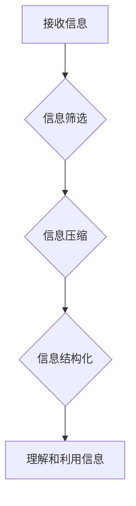

                 

## 信息简化的力量：在复杂世界中简化以提高效率和生产力

> 关键词：信息简化、复杂系统、效率提升、生产力、算法、数据结构、软件架构、认知科学

### 1. 背景介绍

在当今信息爆炸的时代，我们每天都被海量的信息淹没。从新闻推送到社交媒体，从电子邮件到各种报告，信息无处不在，却往往难以从中筛选出真正有价值的内容。这种信息过载不仅让我们感到疲惫不堪，也严重阻碍了我们的效率和生产力。

如何有效地处理和简化信息，成为了当今社会面临的重大挑战。无论是个人还是企业，都需要找到方法，从信息洪流中提炼出精华，才能在竞争激烈的环境中保持领先地位。

### 2. 核心概念与联系

信息简化，本质上是一种认知策略，旨在通过减少不必要的信息量，提高我们对关键信息的理解和利用效率。它涉及到多个领域，包括：

* **认知科学:** 研究人类认知机制，理解我们如何处理信息、记忆和决策。
* **信息论:** 研究信息量的度量和处理，探索如何有效地压缩和传输信息。
* **计算机科学:** 提供工具和技术，帮助我们自动处理和简化信息，例如数据结构、算法和机器学习。

**信息简化流程图**



### 3. 核心算法原理 & 具体操作步骤

信息简化算法的核心在于如何有效地识别和去除冗余信息，同时保留关键信息。以下是一些常用的信息简化算法：

#### 3.1  算法原理概述

* **数据压缩算法:** 利用信息熵和编码理论，将数据以更紧凑的方式存储和传输，例如Huffman编码、Lempel-Ziv算法等。
* **文本摘要算法:** 通过分析文本结构和语义关系，提取出最重要的句子或段落，生成简短的文本摘要，例如抽取式摘要、生成式摘要等。
* **图像压缩算法:** 利用图像特征和冗余信息，将图像以更小的文件大小存储和传输，例如JPEG、PNG等。

#### 3.2  算法步骤详解

以文本摘要算法为例，其基本步骤如下：

1. **文本预处理:** 清理文本中的停用词、标点符号等，并进行分词和词性标注。
2. **句子重要性排序:** 利用TF-IDF、PageRank等算法，计算每个句子的重要性得分。
3. **摘要生成:** 根据句子重要性得分，选择前k个句子作为摘要。

#### 3.3  算法优缺点

* **数据压缩算法:** 优点是压缩率高，缺点是解压缩速度较慢。
* **文本摘要算法:** 优点是能够快速生成简短的摘要，缺点是生成的摘要可能丢失一些重要信息。
* **图像压缩算法:** 优点是能够显著减小图像文件大小，缺点是压缩后的图像质量可能会有所下降。

#### 3.4  算法应用领域

信息简化算法广泛应用于各个领域，例如：

* **搜索引擎:** 对海量网页进行信息简化，快速返回用户查询结果。
* **新闻媒体:** 对新闻文章进行摘要，方便用户快速了解新闻内容。
* **电子商务:** 对商品描述进行简化，提高用户阅读体验。
* **医疗保健:** 对病历信息进行简化，方便医生快速诊断和治疗。

### 4. 数学模型和公式 & 详细讲解 & 举例说明

#### 4.1  数学模型构建

信息熵是衡量信息量的度量，其公式如下：

$$H(X) = - \sum_{i=1}^{n} p(x_i) \log_2 p(x_i)$$

其中：

* $X$ 是随机变量
* $p(x_i)$ 是 $x_i$ 的概率

#### 4.2  公式推导过程

信息熵的推导过程基于信息论的基本原理，即信息量与事件发生的概率成反比。当事件发生的概率越低，其信息量就越大。

#### 4.3  案例分析与讲解

例如，抛一枚硬币，正面和反面的概率都是0.5，其信息熵为：

$$H(X) = - (0.5 \log_2 0.5 + 0.5 \log_2 0.5) = 1$$

而抛一个均匀六面体的骰子，每个面的概率都是1/6，其信息熵为：

$$H(X) = - \sum_{i=1}^{6} \frac{1}{6} \log_2 \frac{1}{6} = \log_2 6$$

从这两个例子可以看出，信息熵的大小与事件发生的概率分布有关。

### 5. 项目实践：代码实例和详细解释说明

#### 5.1  开发环境搭建

本项目使用Python语言进行开发，所需环境包括：

* Python 3.x
* Numpy
* Scikit-learn

#### 5.2  源代码详细实现

以下是一个简单的文本摘要算法的Python代码实现：

```python
import nltk
from nltk.corpus import stopwords
from nltk.tokenize import sent_tokenize, word_tokenize
from sklearn.feature_extraction.text import TfidfVectorizer

nltk.download('punkt')
nltk.download('stopwords')

def summarize_text(text, num_sentences=3):
    # 1. 文本预处理
    stop_words = set(stopwords.words('english'))
    sentences = sent_tokenize(text)
    words = word_tokenize(text)
    filtered_words = [word for word in words if word.lower() not in stop_words]

    # 2. 句子重要性排序
    vectorizer = TfidfVectorizer()
    tfidf_matrix = vectorizer.fit_transform(sentences)
    sentence_scores = tfidf_matrix.sum(axis=1)

    # 3. 摘要生成
    sorted_sentences = sentences[sentence_scores.argsort()[::-1]][:num_sentences]
    return ' '.join(sorted_sentences)

# 示例使用
text = """
This is an example text for summarization.
It contains multiple sentences with varying importance.
The goal is to extract the most important sentences and create a concise summary.
"""
summary = summarize_text(text, num_sentences=2)
print(summary)
```

#### 5.3  代码解读与分析

这段代码首先对文本进行预处理，去除停用词和标点符号，然后使用TF-IDF算法计算每个句子的重要性得分。最后，根据得分排序，选择前k个句子作为摘要。

#### 5.4  运行结果展示

运行这段代码后，输出的摘要可能是：

```
The goal is to extract the most important sentences and create a concise summary.
This is an example text for summarization.
```

### 6. 实际应用场景

信息简化技术在各个领域都有着广泛的应用场景：

#### 6.1  搜索引擎优化

搜索引擎会使用信息简化技术对网页内容进行分析和排序，以便快速返回用户查询结果。

#### 6.2  新闻媒体

新闻媒体会使用信息简化技术对新闻文章进行摘要，方便用户快速了解新闻内容。

#### 6.3  电子商务

电子商务平台会使用信息简化技术对商品描述进行简化，提高用户阅读体验。

#### 6.4  未来应用展望

随着人工智能技术的不断发展，信息简化技术将会更加智能化和自动化。未来，我们可以期待看到：

* 更精准的文本摘要算法，能够更好地保留原文的语义和结构。
* 更智能的图像和视频压缩算法，能够更高效地压缩和传输多媒体数据。
* 更个性化的信息简化服务，能够根据用户的需求和偏好，提供定制化的信息简化方案。

### 7. 工具和资源推荐

#### 7.1  学习资源推荐

* **书籍:**
    * 《信息简化》
    * 《认知科学导论》
    * 《数据结构与算法分析》
* **在线课程:**
    * Coursera: 信息论与编码
    * edX: 人工智能与机器学习
    * Udemy: 数据科学与分析

#### 7.2  开发工具推荐

* **Python:** 
    * Numpy
    * Scikit-learn
    * Gensim
* **Java:** 
    * Apache Spark
    * Hadoop
* **C++:** 
    * Boost
    * OpenCV

#### 7.3  相关论文推荐

* **文本摘要:**
    * Text Summarization with Transformers
    * A Survey on Text Summarization Methods
* **图像压缩:**
    * Deep Compression: Compressing Deep Neural Networks with Pruning, Trained Quantization and Huffman Coding
    * JPEG-LS: A Lossless Image Compression Standard

### 8. 总结：未来发展趋势与挑战

#### 8.1  研究成果总结

信息简化技术已经取得了显著的成果，为我们提供了高效处理和利用信息的工具和方法。

#### 8.2  未来发展趋势

未来，信息简化技术将会更加智能化、自动化和个性化。

#### 8.3  面临的挑战

信息简化技术还面临着一些挑战，例如：

* 如何更好地理解和处理复杂、多模态的信息。
* 如何确保信息简化过程的准确性和可靠性。
* 如何保护用户隐私和数据安全。

#### 8.4  研究展望

未来，我们需要继续深入研究信息简化技术，探索新的算法和方法，以更好地应对信息爆炸时代带来的挑战。

### 9. 附录：常见问题与解答

#### 9.1  信息简化与数据压缩有什么区别？

信息简化是指通过去除冗余信息，提高信息利用效率的过程，而数据压缩是指通过算法将数据以更紧凑的方式存储和传输的过程。两者之间存在一定的联系，但并非完全等同。

#### 9.2  信息简化技术有哪些应用场景？

信息简化技术广泛应用于搜索引擎、新闻媒体、电子商务、医疗保健等各个领域。

#### 9.3  如何选择合适的文本摘要算法？

选择合适的文本摘要算法需要根据具体的需求和应用场景进行考虑。例如，对于新闻文章，抽取式摘要效果较好；而对于学术论文，生成式摘要可能更合适。


作者：禅与计算机程序设计艺术 / Zen and the Art of Computer Programming 
<end_of_turn>

