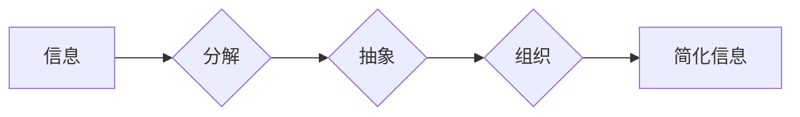

                 

## 信息简化的艺术与实践：在混乱中找到简单，在复杂中建立秩序

> 关键词：信息简化、算法设计、数据结构、复杂系统、软件架构、代码可读性、软件工程

### 1. 背景介绍

在当今信息爆炸的时代，我们被海量数据和复杂系统所包围。从庞大的互联网网络到复杂的软件应用程序，从基因组测序到金融市场预测，无处不在的信息繁杂和复杂性给我们的理解和处理带来了巨大挑战。如何有效地简化信息，从中提取本质，建立清晰的秩序，是当今科技领域面临的重大课题。

信息简化并非简单地减少信息量，而是要通过合理的分析、抽象和组织，将信息转化为易于理解、记忆和应用的形式。它涉及到多个层面，包括算法设计、数据结构、软件架构、代码可读性等。

### 2. 核心概念与联系

信息简化的核心在于将复杂的信息分解成更小的、更易于处理的单元，并建立起清晰的逻辑关系。

**2.1 信息分解**

将复杂的信息分解成更小的单元，可以采用多种方法，例如：

* **层次分解:** 将信息按照层级结构进行分解，从宏观到微观，逐步深入。
* **功能分解:** 将信息按照功能模块进行分解，每个模块负责特定的功能。
* **数据结构:** 使用合适的的数据结构来组织和存储信息，例如树形结构、图结构、列表等。

**2.2 逻辑关系**

建立清晰的逻辑关系是信息简化的关键。可以使用以下方法来表示信息之间的关系：

* **流程图:** 使用流程图来描述信息处理的步骤和逻辑关系。
* **数据流图:** 使用数据流图来描述数据在系统中的流动和处理过程。
* **关系数据库:** 使用关系数据库来存储和管理信息，并定义数据之间的关系。

**2.3 Mermaid 流程图**



### 3. 核心算法原理 & 具体操作步骤

**3.1 算法原理概述**

信息简化算法的核心是通过高效的算法来处理和压缩信息，使其更易于理解和应用。常见的算法包括：

* **数据压缩算法:** 例如Huffman编码、Lempel-Ziv算法等，可以将冗余信息压缩，减少存储空间和传输时间。
* **信息提取算法:** 例如文本分类、主题提取、关键词抽取等，可以从海量文本数据中提取关键信息，帮助用户快速了解信息内容。
* **数据聚类算法:** 例如K-means聚类、层次聚类等，可以将相似的数据点聚类在一起，发现数据中的潜在结构和模式。

**3.2 算法步骤详解**

以数据压缩算法为例，其基本步骤如下：

1. **统计信息频率:** 对待压缩的信息进行统计，记录每个符号或字符出现的频率。
2. **构建编码表:** 根据符号或字符的频率，构建一个编码表，将高频符号或字符分配更短的编码，低频符号或字符分配更长的编码。
3. **编码信息:** 使用编码表将原始信息编码成压缩后的数据。
4. **解码信息:** 使用相同的编码表将压缩后的数据解码回原始信息。

**3.3 算法优缺点**

不同的算法具有不同的优缺点，需要根据具体应用场景选择合适的算法。例如，Huffman编码具有较高的压缩率，但编码和解码过程相对复杂；Lempel-Ziv算法则具有较快的编码和解码速度，但压缩率相对较低。

**3.4 算法应用领域**

信息简化算法广泛应用于各个领域，例如：

* **数据存储和传输:** 压缩算法可以减少数据存储空间和传输时间，提高数据处理效率。
* **文本处理:** 信息提取算法可以帮助用户快速了解文本内容，例如新闻摘要、邮件分类等。
* **图像处理:** 图像压缩算法可以减少图像文件大小，方便图像存储和传输。
* **机器学习:** 数据聚类算法可以帮助机器学习模型发现数据中的潜在结构和模式，提高模型的预测精度。

### 4. 数学模型和公式 & 详细讲解 & 举例说明

**4.1 数学模型构建**

信息简化可以抽象为一个数学模型，其中信息量作为核心变量。信息量通常用香农熵来衡量，公式如下：

$$H(X) = - \sum_{i=1}^{n} p(x_i) \log_2 p(x_i)$$

其中：

* $X$ 是随机变量，代表信息源。
* $x_i$ 是 $X$ 的取值。
* $p(x_i)$ 是 $x_i$ 的概率。

香农熵越大，信息量越大，信息越复杂。

**4.2 公式推导过程**

香农熵的推导过程基于信息论的基本原理，即信息量的度量应该满足以下条件：

* **非负性:** 信息量不应为负值。
* **可加性:** 两个独立事件的信息量之和等于两个事件的信息量之和。
* **连续性:** 信息量应该是一个连续的函数。

基于这些条件，香农熵的公式可以推导出来。

**4.3 案例分析与讲解**

假设有一个随机变量 $X$，其取值有两种情况：正面 $(H)$ 和反面 $(T)$，概率分别为 $0.5$ 和 $0.5$。则其香农熵为：

$$H(X) = - (0.5 \log_2 0.5 + 0.5 \log_2 0.5) = 1$$

这表明正面和反面的信息量相等，总的信息量为 1。

### 5. 项目实践：代码实例和详细解释说明

**5.1 开发环境搭建**

本项目使用 Python 语言进行开发，需要安装 Python 3.x 及相关库，例如 NumPy、Pandas 等。

**5.2 源代码详细实现**

```python
import numpy as np

def huffman_encode(text):
    # 统计字符频率
    freq = {}
    for char in text:
        if char in freq:
            freq[char] += 1
        else:
            freq[char] = 1

    # 建立编码表
    codes = {}
    for char, freq in freq.items():
        codes[char] = bin(freq)[2:].zfill(8)

    # 编码信息
    encoded_text = ''.join([codes[char] for char in text])

    return encoded_text, codes

# 示例代码
text = "hello world"
encoded_text, codes = huffman_encode(text)
print("编码后的文本:", encoded_text)
print("编码表:", codes)
```

**5.3 代码解读与分析**

该代码实现了一个简单的 Huffman 编码算法。

1. 首先统计文本中每个字符出现的频率。
2. 然后根据字符频率构建一个编码表，将高频字符分配更短的编码，低频字符分配更长的编码。
3. 最后使用编码表将文本编码成压缩后的数据。

**5.4 运行结果展示**

运行该代码后，会输出编码后的文本和编码表。

### 6. 实际应用场景

信息简化技术广泛应用于各个领域，例如：

* **数据压缩:** 在网络传输、文件存储等场景中，使用压缩算法可以减少数据量，提高效率。
* **文本分析:** 在搜索引擎、机器翻译等场景中，信息提取算法可以帮助用户快速理解文本内容。
* **图像处理:** 在图像压缩、图像识别等场景中，信息简化技术可以提高图像处理效率。
* **机器学习:** 在数据预处理、特征提取等场景中，信息简化技术可以帮助机器学习模型更好地学习数据。

**6.4 未来应用展望**

随着信息量的不断增长，信息简化技术将变得越来越重要。未来，信息简化技术可能会在以下方面得到进一步发展：

* **更智能的算法:** 开发更智能、更高效的信息简化算法，能够更好地处理复杂的信息。
* **更广泛的应用:** 将信息简化技术应用到更多领域，例如医疗、教育、金融等。
* **更个性化的信息简化:** 根据用户的需求和偏好，提供个性化的信息简化服务。

### 7. 工具和资源推荐

**7.1 学习资源推荐**

* **书籍:**
    * 《信息论基础》
    * 《数据压缩》
    * 《算法导论》
* **在线课程:**
    * Coursera 上的《信息论》课程
    * edX 上的《数据压缩》课程

**7.2 开发工具推荐**

* **Python:** 广泛用于数据处理和算法开发。
* **NumPy:** 用于数值计算和数组操作。
* **Pandas:** 用于数据分析和处理。
* **Scikit-learn:** 用于机器学习算法开发。

**7.3 相关论文推荐**

* **Shannon, C. E. (1948). A mathematical theory of communication.**
* **Knuth, D. E. (1973). The art of computer programming, volume 1: Fundamental algorithms.**
* **Cover, T. M., & Thomas, J. A. (2006). Elements of information theory.**

### 8. 总结：未来发展趋势与挑战

**8.1 研究成果总结**

信息简化技术已经取得了显著的成果，在数据压缩、文本分析、图像处理等领域得到了广泛应用。

**8.2 未来发展趋势**

未来，信息简化技术将朝着以下方向发展：

* **更智能的算法:** 开发更智能、更高效的信息简化算法，能够更好地处理复杂的信息。
* **更广泛的应用:** 将信息简化技术应用到更多领域，例如医疗、教育、金融等。
* **更个性化的信息简化:** 根据用户的需求和偏好，提供个性化的信息简化服务。

**8.3 面临的挑战**

信息简化技术也面临着一些挑战：

* **复杂性:** 复杂的信息系统难以简化，需要开发更强大的算法和模型。
* **可解释性:** 一些信息简化算法过于复杂，难以解释其工作原理，这可能会影响其应用。
* **隐私保护:** 信息简化过程中可能会涉及到敏感信息，需要考虑隐私保护问题。

**8.4 研究展望**

未来，我们需要继续探索新的信息简化算法和技术，并将其应用到更多领域，以帮助我们更好地理解和处理信息，构建更智能、更美好的未来。


### 9. 附录：常见问题与解答

**9.1 如何选择合适的算法？**

选择合适的算法需要根据具体应用场景和数据特点进行考虑。例如，如果需要压缩文本数据，可以考虑使用 Huffman 编码或 Lempel-Ziv 算法；如果需要提取文本中的关键词，可以考虑使用 TF-IDF 或 LDA 算法。

**9.2 信息简化会丢失信息吗？**

信息简化本身不会丢失信息，但可能会丢失一些细节信息。例如，使用压缩算法可以减少数据量，但可能会丢失一些原始数据的细节。

**9.3 信息简化技术有哪些应用场景？**

信息简化技术广泛应用于各个领域，例如数据压缩、文本分析、图像处理、机器学习等。

作者：禅与计算机程序设计艺术 / Zen and the Art of Computer Programming 


<end_of_turn>

