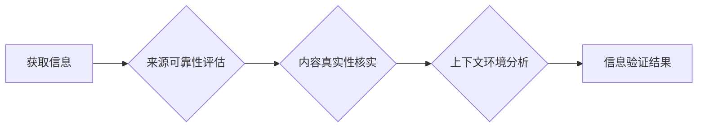

                 

## 信息验证和批判性思考技能：在假新闻、错误信息和媒体操纵时代导航

> 关键词：信息验证、批判性思考、假新闻、错误信息、媒体操纵、深度学习、自然语言处理

### 1. 背景介绍

在当今信息爆炸的时代，我们每天都被来自互联网、社交媒体和传统媒体的海量信息淹没。这些信息来源多样，内容真假参半，如何有效地辨别真伪，形成独立的判断，已成为每个人都必须面对的挑战。

假新闻、错误信息和媒体操纵现象日益猖獗，它们不仅扰乱了社会秩序，也对个人认知和决策造成了严重影响。面对这种信息环境，我们迫切需要掌握信息验证和批判性思考的技能，才能在信息洪流中保持清醒的头脑，做出明智的选择。

### 2. 核心概念与联系

**2.1 信息验证**

信息验证是指通过多种手段和方法，对信息的真实性、准确性和可靠性进行评估的过程。它涉及到对信息来源、内容本身、上下文环境等多方面的分析和判断。

**2.2 关键概念：**

* **来源可靠性:**  评估信息来源的信誉度、专业性、客观性等因素。
* **内容真实性:**  核实信息内容的准确性、完整性和一致性，并与其他可靠来源进行对比。
* **上下文环境:**  了解信息发布的时间、地点、目的以及相关背景信息，以避免误解和曲解。

**2.3 核心流程图:**



**2.4 关键技术:**

* **自然语言处理 (NLP):**  用于分析和理解文本信息，识别情感倾向、事实关系等。
* **机器学习 (ML):**  用于训练模型，识别假新闻、谣言和虚假信息。
* **知识图谱 (KG):**  用于存储和组织知识，帮助用户快速查找相关信息并进行关联分析。

**2.5 联系:**

信息验证和批判性思考技能相互关联，共同构成了应对信息时代挑战的有效武器。批判性思考能力可以帮助我们更好地理解信息，识别潜在的偏差和误导，从而进行更准确的判断。而信息验证技能则为批判性思考提供了必要的工具和方法，让我们能够更有效地评估信息的真实性和可靠性。

### 3. 核心算法原理 & 具体操作步骤

**3.1 算法原理概述**

信息验证算法通常基于机器学习和自然语言处理技术，通过训练模型识别和分类不同类型的信息。常见的算法包括：

* **支持向量机 (SVM):**  用于分类任务，识别假新闻和真实新闻。
* **随机森林 (RF):**  用于分类和回归任务，预测信息的真实性。
* **深度学习 (DL):**  用于复杂的信息识别和分析，例如识别谣言和合成媒体。

**3.2 算法步骤详解**

1. **数据收集和预处理:**  收集大量真实和虚假信息的样本数据，并进行清洗、格式化和标注。
2. **特征提取:**  从文本数据中提取特征，例如词汇、语法结构、情感倾向、网络链接等。
3. **模型训练:**  使用训练数据训练机器学习模型，学习识别信息的真实性和可靠性。
4. **模型评估:**  使用测试数据评估模型的性能，例如准确率、召回率、F1-score等。
5. **模型部署:**  将训练好的模型部署到实际应用场景中，用于识别和分类新的信息。

**3.3 算法优缺点**

* **优点:**  自动化信息验证，提高效率和准确性。
* **缺点:**  模型训练需要大量数据，容易受到数据偏差的影响。

**3.4 算法应用领域**

* **新闻媒体:**  识别假新闻和谣言，维护新闻的真实性和可靠性。
* **社交媒体:**  过滤有害信息，防止网络暴力和虚假信息传播。
* **搜索引擎:**  提高搜索结果的准确性和可靠性，避免用户误信虚假信息。
* **教育领域:**  帮助学生识别和批判性思考信息，培养信息素养。

### 4. 数学模型和公式 & 详细讲解 & 举例说明

**4.1 数学模型构建**

信息验证算法通常使用概率模型来表示信息的真实性和可靠性。例如，可以使用贝叶斯定理来计算给定特定特征的信息真实性的概率。

**4.2 公式推导过程**

贝叶斯定理公式如下:

$$P(A|B) = \frac{P(B|A)P(A)}{P(B)}$$

其中:

* $P(A|B)$ 是事件 A 在事件 B 发生条件下的概率。
* $P(B|A)$ 是事件 B 在事件 A 发生条件下的概率。
* $P(A)$ 是事件 A 发生的概率。
* $P(B)$ 是事件 B 发生的概率。

**4.3 案例分析与讲解**

假设我们有一个信息，其特征包括“来源可靠”、“内容一致性”和“情感倾向”。我们可以使用贝叶斯定理来计算该信息真实性的概率。

* $P(真实|特征)$ 是信息真实性的概率，给定其特征。
* $P(特征|真实)$ 是给定信息真实的情况下，其特征出现的概率。
* $P(真实)$ 是信息真实发生的概率。
* $P(特征)$ 是信息特征出现的概率。

通过收集相关数据，我们可以估计以上概率值，并使用贝叶斯定理计算出信息真实性的概率。

### 5. 项目实践：代码实例和详细解释说明

**5.1 开发环境搭建**

* Python 3.x
* TensorFlow 或 PyTorch 深度学习框架
* NLTK 自然语言处理库
* Scikit-learn 机器学习库

**5.2 源代码详细实现**

```python
import tensorflow as tf

# 定义模型结构
model = tf.keras.models.Sequential([
    tf.keras.layers.Embedding(input_dim=vocab_size, output_dim=embedding_dim),
    tf.keras.layers.LSTM(units=128),
    tf.keras.layers.Dense(units=1, activation='sigmoid')
])

# 编译模型
model.compile(optimizer='adam', loss='binary_crossentropy', metrics=['accuracy'])

# 训练模型
model.fit(x_train, y_train, epochs=10, batch_size=32)

# 评估模型
loss, accuracy = model.evaluate(x_test, y_test)
print('Loss:', loss)
print('Accuracy:', accuracy)
```

**5.3 代码解读与分析**

* 该代码示例使用 TensorFlow 框架构建了一个深度学习模型，用于识别信息真实性。
* 模型结构包括嵌入层、LSTM 层和全连接层。
* 嵌入层将单词转换为向量表示。
* LSTM 层用于捕捉文本序列中的长距离依赖关系。
* 全连接层用于分类信息为真实或虚假。
* 模型使用 Adam 优化器、二元交叉熵损失函数和准确率作为评估指标。

**5.4 运行结果展示**

训练完成后，模型可以用于预测新的信息真实性。

### 6. 实际应用场景

**6.1 新闻媒体**

* 自动识别假新闻和谣言，提高新闻的真实性和可靠性。
* 帮助记者进行事实核查，避免传播错误信息。
* 为读者提供信息来源和真实性评估，增强信息辨别能力。

**6.2 社交媒体**

* 过滤有害信息，防止网络暴力和虚假信息传播。
* 识别和标记虚假账户和机器人，维护平台的生态环境。
* 为用户提供信息来源和真实性评估，帮助用户做出明智的选择。

**6.3 搜索引擎**

* 提高搜索结果的准确性和可靠性，避免用户误信虚假信息。
* 为用户提供信息来源和真实性评估，帮助用户辨别信息真伪。
* 识别和过滤恶意网站和钓鱼链接，保护用户安全。

**6.4 教育领域**

* 帮助学生识别和批判性思考信息，培养信息素养。
* 为教师提供工具和资源，帮助他们开展信息鉴别教育。
* 促进学生对信息来源、内容真实性和上下文环境的理解。

**6.5 未来应用展望**

随着人工智能技术的不断发展，信息验证技术将更加智能化、自动化和个性化。未来，我们可以期待：

* 更准确、更可靠的信息验证模型。
* 更广泛的应用场景，例如医疗、金融、法律等领域。
* 更人性化的交互方式，例如语音识别、图像识别等。

### 7. 工具和资源推荐

**7.1 学习资源推荐**

* **书籍:**
    * 《信息验证：在假新闻时代导航》
    * 《批判性思维：如何有效地思考和解决问题》
* **在线课程:**
    * Coursera: “信息素养”
    * edX: “批判性思维”

**7.2 开发工具推荐**

* **Python:**  用于开发信息验证算法。
* **TensorFlow/PyTorch:**  用于构建深度学习模型。
* **NLTK:**  用于自然语言处理任务。
* **Scikit-learn:**  用于机器学习任务。

**7.3 相关论文推荐**

* “Detecting Fake News Using Deep Learning”
* “A Survey on Fake News Detection”

### 8. 总结：未来发展趋势与挑战

**8.1 研究成果总结**

信息验证技术取得了显著进展，能够识别和分类多种类型的信息，例如假新闻、谣言、合成媒体等。

**8.2 未来发展趋势**

* **更准确、更可靠的模型:**  通过改进算法、增加训练数据和探索新的模型架构，提高信息验证的准确性和可靠性。
* **更广泛的应用场景:**  将信息验证技术应用到更多领域，例如医疗、金融、法律等，帮助人们更好地应对信息时代挑战。
* **更人性化的交互方式:**  开发更易于使用的信息验证工具，例如语音识别、图像识别等，让更多人能够受益于信息验证技术。

**8.3 面临的挑战**

* **数据偏差:**  训练数据可能存在偏差，导致模型识别效果不佳。
* **对抗性攻击:**  攻击者可能设计对抗性样本，绕过模型的识别机制。
* **伦理问题:**  信息验证技术可能被滥用，例如用于审查言论自由或操纵舆论。

**8.4 研究展望**

未来研究方向包括：

* 开发更鲁棒、更抗干扰的信息验证模型。
* 研究信息验证的伦理问题，确保技术应用的安全性与可控性。
* 探索信息验证与其他技术的融合，例如区块链、人工智能等，构建更完善的信息生态系统。

### 9. 附录：常见问题与解答

**9.1 如何判断信息的真实性？**

* 评估信息来源的可靠性。
* 核实信息内容的准确性和一致性。
* 分析信息发布的时间、地点、目的和背景信息。
* 使用信息验证工具进行辅助判断。

**9.2 如何避免被假新闻和错误信息误导？**

* 保持批判性思维，不要轻易相信所有信息。
* 多方核实信息，从不同来源获取信息。
* 关注信息来源的真实性，避免相信不可靠的来源。
* 了解信息传播的机制，识别潜在的操纵和误导。

**9.3 如何培养信息素养？**

* 阅读高质量的书籍和文章，提升阅读理解能力。
* 学习批判性思维方法，学会分析和判断信息。
* 使用信息验证工具，提高信息辨别能力。
* 关注信息安全和隐私保护，避免信息泄露和滥用。


作者：禅与计算机程序设计艺术 / Zen and the Art of Computer Programming 
<end_of_turn>

