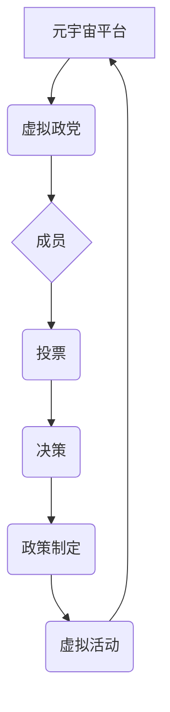

                 

## 元宇宙政党:虚拟世界的政治组织新形式

> 关键词：元宇宙、虚拟世界、政治组织、政党、去中心化自治组织(DAO)、区块链、数字身份、虚拟治理

## 1. 背景介绍

元宇宙概念的兴起，为人类社会带来了前所未有的虚拟世界体验。在这个虚拟世界中，人们可以自由地创建、交互、参与，构建全新的社会关系和生活方式。随着元宇宙技术的不断发展，虚拟世界将越来越接近现实世界，其社会影响力也将日益凸显。

传统政治组织在现实世界中发挥着重要的作用，但它们在元宇宙环境中面临着新的挑战和机遇。元宇宙的去中心化、虚拟化和全球化特性，为传统的政治组织模式带来了颠覆性的变革。

## 2. 核心概念与联系

### 2.1 元宇宙

元宇宙是一个由虚拟现实、增强现实和互联网技术融合而成的沉浸式虚拟世界。它是一个持久、共享、由用户创建和参与的虚拟环境，用户可以在其中创建虚拟身份、拥有虚拟财产、参与虚拟活动，并与其他用户进行交互。

### 2.2 虚拟政党

虚拟政党是指在元宇宙环境中组织起来的政治组织。它们利用元宇宙的特性，构建虚拟的政治平台，进行政治活动、组织选举、制定政策、参与决策等。

### 2.3 去中心化自治组织(DAO)

DAO是一种基于区块链技术的去中心化组织，其决策权分散在所有成员手中。DAO的成员可以通过投票机制参与组织的治理，并根据预先设定的规则自动执行决策。

### 2.4 核心概念联系

元宇宙政党可以借鉴DAO的去中心化治理模式，构建更加透明、公平、高效的政治组织。

**元宇宙政党架构**



## 3. 核心算法原理 & 具体操作步骤

### 3.1 算法原理概述

元宇宙政党的核心算法原理主要包括：

* **身份认证和管理**: 利用区块链技术实现用户身份的唯一认证和管理，确保投票的真实性和有效性。
* **投票机制**: 设计合理的投票机制，例如基于权益的投票、阈值投票等，确保投票结果的公正性和可信度。
* **决策执行**: 利用智能合约自动执行决策，确保决策的透明性和可追溯性。

### 3.2 算法步骤详解

1. **用户注册**: 用户在元宇宙平台上注册，并通过身份验证系统完成身份认证。
2. **加入政党**: 用户可以选择加入特定的虚拟政党，并获得相应的政治权利和义务。
3. **参与投票**: 当政党需要进行决策时，成员可以通过投票机制参与决策。
4. **决策执行**: 投票结果根据预设规则进行统计，并由智能合约自动执行决策。
5. **政策制定**: 政党根据成员的投票结果和社会需求，制定相应的政策方案。
6. **虚拟活动**: 政党在元宇宙平台上组织各种虚拟活动，例如演讲、辩论、论坛等，与成员和公众进行互动。

### 3.3 算法优缺点

**优点**:

* **去中心化**: 决策权分散在所有成员手中，避免了权力集中和腐败。
* **透明化**: 投票过程和决策结果公开透明，任何成员都可以随时查看。
* **高效性**: 智能合约自动执行决策，提高了决策效率。
* **参与度**: 元宇宙环境的沉浸式体验，可以提高成员的参与度和政治意识。

**缺点**:

* **技术门槛**: 建立和维护元宇宙政党需要一定的技术能力和资源。
* **法律法规**: 元宇宙政党的法律地位和监管机制尚不明确。
* **网络安全**: 元宇宙平台的安全性和稳定性是关键问题。
* **信息茧房**: 元宇宙环境可能导致信息茧房效应，影响成员的理性判断。

### 3.4 算法应用领域

元宇宙政党算法可以应用于以下领域:

* **政治决策**: 利用投票机制和智能合约，提高政治决策的透明度和效率。
* **公共服务**: 利用元宇宙平台，提供更加便捷高效的公共服务。
* **社区治理**: 利用去中心化自治组织模式，促进社区治理的民主化和参与度。
* **国际合作**: 利用元宇宙平台，搭建跨国合作的虚拟平台。

## 4. 数学模型和公式 & 详细讲解 & 举例说明

### 4.1 数学模型构建

元宇宙政党的决策机制可以建模为一个图论模型，其中：

* 节点代表政党成员或利益群体。
* 边代表成员之间的关系或意见一致性。

决策过程可以看作是图论网络中的信息传播过程，通过投票机制和智能合约，将成员的意见汇总并转化为决策结果。

### 4.2 公式推导过程

假设一个元宇宙政党有N个成员，每个成员对一个议题有不同的意见，可以用0到1的数值表示，其中0表示反对，1表示支持。

**投票结果计算公式**:

```latex
R = \sum_{i=1}^{N} x_i
```

其中：

* R表示投票结果，
* $x_i$表示第i个成员的意见数值。

**决策阈值**:

```latex
T = \frac{N}{2} + 1
```

其中：

* T表示决策阈值，
* N表示成员总数。

**决策结果**:

* 如果R >= T，则该议题通过。
* 如果R < T，则该议题未通过。

### 4.3 案例分析与讲解

假设一个元宇宙政党有10个成员，对一项政策有不同的意见，投票结果如下：

* 成员1: 0.8
* 成员2: 0.2
* 成员3: 0.9
* 成员4: 0.1
* 成员5: 0.7
* 成员6: 0.3
* 成员7: 0.6
* 成员8: 0.4
* 成员9: 0.5
* 成员10: 0.9

根据公式计算，投票结果R = 6.9，决策阈值T = 6。

由于R > T，因此该政策通过。

## 5. 项目实践：代码实例和详细解释说明

### 5.1 开发环境搭建

* **编程语言**: Solidity (用于智能合约开发)
* **区块链平台**: Ethereum (以太坊)
* **开发工具**: Remix IDE (智能合约开发环境)

### 5.2 源代码详细实现

```solidity
pragma solidity ^0.8.0;

contract VirtualParty {

    // 成员信息结构体
    struct Member {
        address addr;
        uint256 voteWeight;
    }

    // 投票结果存储
    mapping(bytes32 => uint256) public voteResults;

    // 成员列表
    Member[] public members;

    // 构造函数
    constructor() {
        // 初始化成员
        members.push(Member(msg.sender, 1));
    }

    // 加入政党
    function joinParty() public {
        // 检查是否已加入
        require(members.length == 0, "已加入政党");

        // 添加新成员
        members.push(Member(msg.sender, 1));
    }

    // 投票
    function castVote(bytes32 proposalId, uint256 vote) public {
        // 检查是否为成员
        require(isMember(msg.sender), "非政党成员");

        // 更新投票结果
        voteResults[proposalId] += vote;
    }

    // 检查是否为成员
    function isMember(address addr) public view returns (bool) {
        for (uint256 i = 0; i < members.length; i++) {
            if (members[i].addr == addr) {
                return true;
            }
        }
        return false;
    }

    // 获取投票结果
    function getVoteResult(bytes32 proposalId) public view returns (uint256) {
        return voteResults[proposalId];
    }
}
```

### 5.3 代码解读与分析

* **智能合约**: 使用Solidity语言编写，部署在以太坊区块链上。
* **成员管理**: 使用`Member`结构体存储成员信息，包括地址和投票权重。
* **投票机制**: 使用`voteResults`映射存储投票结果，`castVote`函数用于成员投票。
* **决策规则**: 可以根据投票结果和预设阈值，自动执行决策。

### 5.4 运行结果展示

部署合约后，可以通过Remix IDE或其他以太坊钱包工具，进行成员加入、投票和查看投票结果的操作。

## 6. 实际应用场景

### 6.1 元宇宙政党组织

* **虚拟社区治理**: 元宇宙政党可以帮助虚拟社区进行治理，例如制定社区规则、分配资源、解决冲突等。
* **虚拟利益集团**: 元宇宙政党可以代表特定利益群体，在元宇宙中进行政治活动和游说。
* **虚拟选举**: 元宇宙政党可以利用元宇宙平台进行虚拟选举，提高选举的透明度和参与度。

### 6.2 其他应用场景

* **跨国合作**: 元宇宙政党可以搭建跨国合作的虚拟平台，促进国际交流和合作。
* **教育培训**: 元宇宙政党可以利用元宇宙平台进行政治教育和培训，提高公民的政治素养。
* **文化传播**: 元宇宙政党可以利用元宇宙平台进行文化传播和交流，促进不同文化之间的理解和融合。

### 6.4 未来应用展望

随着元宇宙技术的不断发展，元宇宙政党将发挥越来越重要的作用，其应用场景也将更加广泛。未来，元宇宙政党可能：

* **更加智能化**: 利用人工智能技术，自动分析数据、预测趋势、制定决策。
* **更加去中心化**: 利用更先进的去中心化技术，进一步降低组织的中心化风险。
* **更加沉浸式**: 利用更先进的虚拟现实技术，打造更加沉浸式的虚拟政治体验。

## 7. 工具和资源推荐

### 7.1 学习资源推荐

* **书籍**: 《元宇宙：下一代互联网》
* **网站**: 元宇宙联盟 (https://metaversealliance.org/)
* **论坛**: 元宇宙社区 (https://www.metaversecommunity.org/)

### 7.2 开发工具推荐

* **Remix IDE**: https://remix.ethereum.org/
* **Truffle Suite**: https://trufflesuite.com/
* **Hardhat**: https://hardhat.org/

### 7.3 相关论文推荐

* **The Metaverse: A New Paradigm for Social Interaction and Collaboration**
* **Decentralized Autonomous Organizations: A Comprehensive Survey**

## 8. 总结：未来发展趋势与挑战

### 8.1 研究成果总结

元宇宙政党是一个新兴的概念，其核心算法原理和技术实现方案正在不断发展。元宇宙政党可以利用元宇宙的特性，构建更加透明、公平、高效的政治组织，并为虚拟世界提供新的治理模式。

### 8.2 未来发展趋势

元宇宙政党将朝着以下方向发展：

* **更加智能化**: 利用人工智能技术，自动分析数据、预测趋势、制定决策。
* **更加去中心化**: 利用更先进的去中心化技术，进一步降低组织的中心化风险。
* **更加沉浸式**: 利用更先进的虚拟现实技术，打造更加沉浸式的虚拟政治体验。

### 8.3 面临的挑战

元宇宙政党也面临着一些挑战：

* **技术门槛**: 建立和维护元宇宙政党需要一定的技术能力和资源。
* **法律法规**: 元宇宙政党的法律地位和监管机制尚不明确。
* **网络安全**: 元宇宙平台的安全性和稳定性是关键问题。
* **信息茧房**: 元宇宙环境可能导致信息茧房效应，影响成员的理性判断。

### 8.4 研究展望

未来，我们需要进一步研究元宇宙政党的算法原理、技术实现方案、法律法规和社会影响等方面，为元宇宙政党的健康发展提供理论支持和实践指导。

## 9. 附录：常见问题与解答

**Q1: 元宇宙政党和现实世界政党有什么区别？**

**A1**: 元宇宙政党和现实世界政党的主要区别在于：

* **组织形式**: 元宇宙政党是基于区块链技术的去中心化组织，而现实世界政党通常是中心化的组织。
* **成员身份**: 元宇宙政党成员的虚拟身份可以与现实世界身份分离，而现实世界政党成员的身份是基于现实世界的身份认证。
* **活动方式**: 元宇宙政党可以在虚拟世界中进行政治活动，而现实世界政党活动主要在现实世界进行。

**Q2: 元宇宙政党是否会取代现实世界政党？**

**A2**: 目前，元宇宙政党还处于发展初期，其与现实世界政党的竞争关系尚不明确。未来，元宇宙政党可能与现实世界政党共同存在，并相互补充。

**Q3: 元宇宙政党面临哪些风险？**

**A3**: 元宇宙政党面临的主要风险包括：

* **技术风险**: 元宇宙平台的安全性和稳定性是关键问题。
* **法律风险**: 元宇宙政党的法律地位和监管机制尚不明确。
* **社会风险**: 元宇宙政党可能导致信息茧房效应，影响成员的理性判断。


作者：禅与计算机程序设计艺术 / Zen and the Art of Computer Programming 
<end_of_turn>

