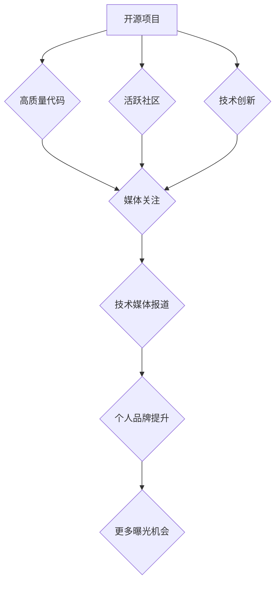

                 

## 利用开源影响力获得技术媒体曝光机会

> 关键词：开源、技术媒体、曝光机会、社区贡献、品牌建设、技术博客、GitHub、博客文章

## 1. 背景介绍

在当今科技日新月异的时代，技术人才的竞争日益激烈。想要脱颖而出，获得业界认可和职业发展机遇，除了扎实的技术能力外，还需要积极拓展个人品牌，提升自身影响力。开源项目成为了一个绝佳的平台，可以帮助技术人员展示实力、积累经验、建立人脉，并最终获得技术媒体的关注和曝光机会。

开源软件的本质是开放的代码和设计文档，任何人都可以自由地访问、修改和分发。参与开源项目不仅可以学习到优秀的代码实践和设计理念，还能与全球各地的开发者交流合作，共同推动技术进步。对于个人而言，开源贡献可以成为一份闪亮的简历，证明你的技术能力和团队合作精神，吸引潜在雇主和合作伙伴的注意。

## 2. 核心概念与联系

### 2.1 开源与技术媒体

开源项目和技术媒体之间存在着密切的联系。技术媒体通常会关注开源项目的发展动态、技术创新和社区活跃度，并通过文章、视频、播客等形式进行报道和宣传。开源项目本身也需要借助技术媒体的平台，扩大影响力，吸引更多开发者参与和贡献。

### 2.2 影响力传播机制

开源项目获得技术媒体曝光的机会，主要依赖于以下几个因素：

* **项目质量:**  优秀的代码质量、完善的设计文档和良好的用户体验，是吸引媒体关注的关键。
* **社区活跃度:**  活跃的社区意味着项目有生命力，开发者们积极参与讨论、贡献代码和解决问题，这会让媒体认为项目值得报道。
* **技术创新:**  项目引入新技术、解决行业痛点或提供独特解决方案，更容易引起媒体的兴趣。
* **个人品牌:**  参与开源项目的开发者，可以通过积极撰写博客文章、发表技术演讲、参与开源社区活动等方式，提升个人品牌影响力，从而间接获得媒体曝光机会。

### 2.3  影响力传播流程



## 3. 核心算法原理 & 具体操作步骤

### 3.1 算法原理概述

开源项目获得技术媒体曝光的本质是一个算法优化问题，需要通过不断迭代和改进，提高曝光率和影响力。

### 3.2 算法步骤详解

1. **项目定位:**  明确项目的目标用户、技术领域和核心价值，制定清晰的项目规划和路线图。
2. **代码质量:**  编写高质量、易于理解和维护的代码，并进行严格的代码审查和测试。
3. **文档完善:**  撰写详细的项目文档，包括设计说明、使用指南、API文档等，方便开发者理解和使用项目。
4. **社区建设:**  积极参与开源社区，与其他开发者交流合作，解决问题、提供支持和反馈。
5. **内容输出:**  撰写技术博客文章、发布视频教程、参与技术论坛讨论等，分享项目经验和技术知识，吸引媒体关注。
6. **媒体推广:**  主动联系技术媒体，介绍项目亮点和价值，争取获得报道机会。
7. **数据分析:**  跟踪项目数据，分析用户行为和媒体报道效果，不断优化项目策略和推广方式。

### 3.3 算法优缺点

* **优点:**  开源项目获得技术媒体曝光的算法，可以有效提升项目知名度、吸引开发者参与和贡献，最终推动项目发展。
* **缺点:**  该算法需要持续投入时间和精力，并需要不断学习和适应技术媒体的动态变化。

### 3.4 算法应用领域

该算法适用于所有开源项目，无论其规模大小、技术领域或目标用户。

## 4. 数学模型和公式 & 详细讲解 & 举例说明

### 4.1 数学模型构建

我们可以用一个简单的数学模型来描述开源项目获得技术媒体曝光的概率：

```latex
P(曝光) = f(Q, A, I, B)
```

其中：

*  $P(曝光)$:  开源项目获得技术媒体曝光的概率
*  $Q$:  项目代码质量
*  $A$:  项目社区活跃度
*  $I$:  项目技术创新程度
*  $B$:  参与者个人品牌影响力

### 4.2 公式推导过程

该模型的推导过程基于以下假设：

*  项目代码质量越高，媒体更愿意报道。
*  项目社区活跃度越高，媒体更倾向于关注。
*  项目技术创新程度越高，媒体报道的价值越大。
*  参与者个人品牌影响力越高，更容易获得媒体的青睐。

### 4.3 案例分析与讲解

假设有两个开源项目，A和B，它们的代码质量、社区活跃度、技术创新程度和参与者个人品牌影响力分别如下：

| 项目 | 代码质量 | 社区活跃度 | 技术创新程度 | 个人品牌影响力 |
|---|---|---|---|---|
| A | 高 | 中等 | 低 | 低 |
| B | 中等 | 高 | 高 | 高 |

根据公式，我们可以推断出：

*  项目B获得技术媒体曝光的概率远高于项目A。

因为项目B在代码质量、社区活跃度、技术创新程度和个人品牌影响力方面都优于项目A。

## 5. 项目实践：代码实例和详细解释说明

### 5.1 开发环境搭建

*  选择合适的编程语言和开发工具。
*  安装必要的软件包和依赖库。
*  配置版本控制系统，例如Git。

### 5.2 源代码详细实现

*  编写项目代码，遵循开源规范和最佳实践。
*  使用代码注释和文档，提高代码的可读性和维护性。
*  进行单元测试和集成测试，确保代码质量。

### 5.3 代码解读与分析

*  分析代码结构和设计模式，理解代码的功能和逻辑。
*  识别代码中的潜在问题和改进点。
*  撰写代码文档，解释代码的功能和使用方法。

### 5.4 运行结果展示

*  运行项目代码，验证其功能和性能。
*  收集运行结果数据，分析项目性能和效率。
*  发布项目运行结果，展示项目成果。

## 6. 实际应用场景

### 6.1 开源项目案例分析

*  分析成功获得技术媒体曝光的开源项目的案例，总结其经验和教训。
*  研究不同类型开源项目的媒体报道策略，找到适合自己的推广方法。

### 6.2 技术媒体报道分析

*  分析技术媒体对开源项目的报道内容和方式，了解媒体的关注点和需求。
*  根据媒体报道的特点，调整项目宣传策略，提高曝光率。

### 6.3 个人品牌建设

*  通过开源项目积累经验和贡献，提升个人技术能力和品牌影响力。
*  积极参与开源社区活动，建立人脉关系，扩大个人影响力。

### 6.4 未来应用展望

*  随着人工智能、大数据等技术的快速发展，开源项目将扮演越来越重要的角色。
*  技术媒体也将更加关注开源项目，为开发者提供更多曝光机会和合作平台。

## 7. 工具和资源推荐

### 7.1 学习资源推荐

*  在线学习平台：Coursera、edX、Udemy等
*  开源社区论坛：Stack Overflow、GitHub Discussions等
*  技术博客网站：Medium、Hacker News等

### 7.2 开发工具推荐

*  版本控制系统：Git、GitHub等
*  代码编辑器：VS Code、Atom、Sublime Text等
*  项目管理工具：Trello、Jira等

### 7.3 相关论文推荐

*  开源软件的社会影响
*  开源社区的组织结构和运作机制
*  开源项目成功因素分析

## 8. 总结：未来发展趋势与挑战

### 8.1 研究成果总结

*  开源项目获得技术媒体曝光的算法，可以有效提升项目知名度和影响力。
*  项目代码质量、社区活跃度、技术创新程度和参与者个人品牌影响力，都是影响曝光概率的关键因素。

### 8.2 未来发展趋势

*  开源项目将更加注重用户体验和商业价值。
*  技术媒体将更加关注开源项目的社会影响和创新能力。
*  开源社区将更加注重人才培养和知识共享。

### 8.3 面临的挑战

*  开源项目需要持续投入时间和精力，才能获得长期的成功。
*  技术媒体的报道环境日益竞争激烈，开源项目需要更加努力地争取曝光机会。
*  开源社区需要更加规范和完善的治理机制，才能更好地维护社区秩序和发展方向。

### 8.4 研究展望

*  深入研究开源项目获得技术媒体曝光的算法模型，并开发更有效的推广策略。
*  探索开源项目与商业模式的融合，推动开源项目的可持续发展。
*  研究开源社区的治理机制，构建更加健康的开源生态系统。

## 9. 附录：常见问题与解答

### 9.1 如何提高项目代码质量？

*  遵循代码规范和最佳实践。
*  进行代码审查和测试。
*  使用代码分析工具，识别潜在问题。

### 9.2 如何建立活跃的开源社区？

*  积极参与社区讨论，提供帮助和支持。
*  组织线上线下活动，促进社区互动。
*  建立清晰的社区规则和贡献指南。

### 9.3 如何获得技术媒体的报道？

*  撰写高质量的技术博客文章，分享项目经验和技术知识。
*  发布项目更新和公告，吸引媒体关注。
*  主动联系技术媒体，介绍项目亮点和价值。


作者：禅与计算机程序设计艺术 / Zen and the Art of Computer Programming 
<end_of_turn>

