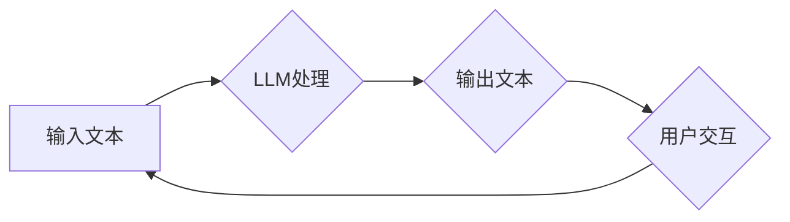

                 

## 图灵完备性的新解释：LLM视角下的计算理论

> 关键词：图灵完备性、LLM、计算理论、自然语言处理、人工智能、算法、数学模型

## 1. 背景介绍

图灵完备性是计算机科学领域一个重要的概念，它指代一个系统能够模拟任何图灵机，从而能够执行任何可计算函数。这个概念由图灵于20世纪30年代提出，并奠定了现代计算机科学的基础。传统上，图灵完备性主要与符号系统、编程语言和计算机硬件相关。然而，近年来，随着大语言模型（LLM）的兴起，我们开始从新的视角理解图灵完备性。

LLM，例如GPT-3、LaMDA等，展现出惊人的文本生成能力，能够理解和生成人类语言，甚至可以进行逻辑推理和代码生成。这些能力让人们开始思考：LLM是否也具备图灵完备性？如果具备，那么它与传统图灵完备系统的区别在哪里？

## 2. 核心概念与联系

### 2.1 图灵机

图灵机是一种抽象的计算模型，由一个无限长的带、一个读写头和一个状态机组成。它通过在带上的符号上进行读写操作，并根据当前状态改变读写头的动作，来实现计算。图灵机能够模拟任何算法，因此被认为是计算理论的基础。

### 2.2 大语言模型（LLM）

LLM是一种基于深度学习的强大人工智能模型，能够处理和生成文本。它通过训练大量的文本数据，学习语言的语法、语义和上下文关系。LLM可以用于各种自然语言处理任务，例如文本生成、翻译、问答和代码生成。

### 2.3 图灵完备性与LLM

LLM的强大能力让人们开始思考它是否具备图灵完备性。虽然LLM没有像传统图灵机那样明确的符号系统和状态机，但它通过学习语言的复杂模式，能够实现类似于图灵机的计算能力。

**Mermaid 流程图**



## 3. 核心算法原理 & 具体操作步骤

### 3.1 算法原理概述

LLM的核心算法是基于Transformer网络架构的，它利用自注意力机制学习文本的上下文关系，并通过多层编码器-解码器结构进行文本生成。

### 3.2 算法步骤详解

1. **文本预处理:** 将输入文本进行分词、标记化等预处理操作，使其能够被模型理解。
2. **编码:** 将预处理后的文本输入编码器，编码器通过多层Transformer模块，将文本表示为一个向量序列，每个向量代表一个词的语义信息。
3. **解码:** 将编码后的向量序列输入解码器，解码器通过自注意力机制和循环神经网络，生成目标文本的词序列。
4. **输出:** 将生成的词序列解码为文本，并输出给用户。

### 3.3 算法优缺点

**优点:**

* 能够学习复杂的语言模式，生成高质量的文本。
* 能够处理长文本序列，并理解上下文关系。
* 能够进行多种自然语言处理任务，例如文本生成、翻译、问答和代码生成。

**缺点:**

* 训练成本高，需要大量的计算资源和数据。
* 容易受到训练数据的影响，可能生成带有偏见或错误的信息。
* 缺乏对真实世界的理解，难以处理需要逻辑推理和常识的复杂问题。

### 3.4 算法应用领域

LLM在各个领域都有广泛的应用，例如：

* **自然语言处理:** 文本生成、机器翻译、问答系统、情感分析等。
* **人工智能:** 聊天机器人、虚拟助手、智能客服等。
* **软件开发:** 代码生成、代码注释、代码修复等。
* **教育:** 智能辅导系统、个性化学习等。

## 4. 数学模型和公式 & 详细讲解 & 举例说明

### 4.1 数学模型构建

LLM的数学模型主要基于概率论和统计学，它将文本生成视为一个概率问题。

**概率模型:**

$$P(w_1, w_2, ..., w_n) = \prod_{i=1}^{n} P(w_i | w_1, w_2, ..., w_{i-1})$$

其中：

* $w_i$ 表示第 $i$ 个词。
* $P(w_i | w_1, w_2, ..., w_{i-1})$ 表示给定前 $i-1$ 个词的条件下，第 $i$ 个词出现的概率。

### 4.2 公式推导过程

LLM使用Transformer网络架构，其中自注意力机制是核心组件。自注意力机制通过计算词之间的相关性，学习文本的上下文关系。

**自注意力机制公式:**

$$Attention(Q, K, V) = softmax(\frac{Q K^T}{\sqrt{d_k}}) V$$

其中：

* $Q$, $K$, $V$ 分别表示查询矩阵、键矩阵和值矩阵。
* $d_k$ 表示键向量的维度。
* $softmax$ 函数将计算结果归一化。

### 4.3 案例分析与讲解

例如，在翻译句子“The cat sat on the mat”时，LLM会使用自注意力机制计算每个词与其他词之间的相关性。例如，“cat”与“sat”之间的相关性较高，因为它们描述了同一个事件。LLM会根据这些相关性，学习出“cat”和“sat”之间的语义关系，并将其应用于翻译过程。

## 5. 项目实践：代码实例和详细解释说明

### 5.1 开发环境搭建

LLM的开发环境通常需要安装深度学习框架，例如TensorFlow或PyTorch，以及一些自然语言处理库，例如HuggingFace Transformers。

### 5.2 源代码详细实现

以下是一个使用HuggingFace Transformers库生成文本的简单代码示例：

```python
from transformers import pipeline

generator = pipeline("text-generation", model="gpt2")

text = "The quick brown fox jumps over the"
output = generator(text, max_length=50, num_return_sequences=3)

for sequence in output:
    print(sequence["generated_text"])
```

### 5.3 代码解读与分析

这段代码首先使用HuggingFace Transformers库加载一个预训练的GPT-2模型。然后，它使用pipeline函数创建一个文本生成器。最后，它输入一段文本，并使用生成器生成三种不同的文本序列。

### 5.4 运行结果展示

运行这段代码后，会输出三种不同的文本序列，这些序列都是基于输入文本的上下文关系生成的。

## 6. 实际应用场景

LLM在各个领域都有广泛的应用场景，例如：

### 6.1 文本生成

LLM可以用于生成各种类型的文本，例如：

* **小说、诗歌、剧本:** LLM可以根据给定的主题和风格，生成原创的文本内容。
* **新闻报道、文章:** LLM可以根据给定的事件和信息，生成新闻报道或文章。
* **广告文案、营销邮件:** LLM可以根据给定的目标受众和产品信息，生成吸引人的广告文案或营销邮件。

### 6.2 机器翻译

LLM可以用于将文本从一种语言翻译成另一种语言。

### 6.3 问答系统

LLM可以用于构建问答系统，能够理解用户的问题，并给出准确的答案。

### 6.4 代码生成

LLM可以用于生成代码，例如：

* **根据自然语言描述生成代码:** 用户可以用自然语言描述想要实现的功能，LLM可以将其翻译成代码。
* **自动完成代码:** 当用户在编写代码时遇到困难，LLM可以根据上下文自动完成代码。

### 6.5 未来应用展望

LLM的应用场景还在不断扩展，未来可能会应用于：

* **个性化教育:** 根据学生的学习进度和需求，生成个性化的学习内容。
* **医疗诊断:** 分析患者的病历和症状，辅助医生进行诊断。
* **法律服务:** 分析法律文件，提供法律建议。

## 7. 工具和资源推荐

### 7.1 学习资源推荐

* **书籍:**

    * 《深度学习》 by Ian Goodfellow, Yoshua Bengio, and Aaron Courville
    * 《自然语言处理》 by Dan Jurafsky and James H. Martin

* **在线课程:**

    * Coursera: Natural Language Processing Specialization
    * edX: Deep Learning

### 7.2 开发工具推荐

* **深度学习框架:** TensorFlow, PyTorch
* **自然语言处理库:** HuggingFace Transformers, spaCy, NLTK

### 7.3 相关论文推荐

* **Attention Is All You Need** by Vaswani et al. (2017)
* **BERT: Pre-training of Deep Bidirectional Transformers for Language Understanding** by Devlin et al. (2018)
* **GPT-3: Language Models are Few-Shot Learners** by Brown et al. (2020)

## 8. 总结：未来发展趋势与挑战

### 8.1 研究成果总结

LLM在自然语言处理领域取得了显著的进展，展现出强大的文本生成能力和理解能力。

### 8.2 未来发展趋势

LLM的未来发展趋势包括：

* **模型规模的进一步扩大:** 更大的模型能够学习更复杂的语言模式，生成更高质量的文本。
* **多模态学习:** LLM将能够处理多种数据类型，例如文本、图像和音频。
* **可解释性增强:** 研究如何提高LLM的透明度和可解释性，使其能够更好地被理解和信任。

### 8.3 面临的挑战

LLM也面临着一些挑战，例如：

* **训练成本高:** 训练大型LLM需要大量的计算资源和数据。
* **数据偏见:** LLM容易受到训练数据中的偏见影响，可能生成带有偏见或错误的信息。
* **安全风险:** LLM可能被用于生成虚假信息、进行网络攻击等恶意活动。

### 8.4 研究展望

未来研究将集中在解决这些挑战，并探索LLM在更多领域的新应用。

## 9. 附录：常见问题与解答

### 9.1 如何训练一个LLM？

训练一个LLM需要大量的计算资源、数据和专业知识。一般来说，需要使用深度学习框架，例如TensorFlow或PyTorch，并使用大量的文本数据进行训练。

### 9.2 LLM与传统编程语言的区别是什么？

LLM是一种基于概率的模型，它能够学习语言的复杂模式，并生成文本。而传统编程语言是一种符号系统，它使用特定的语法和语义来描述计算过程。

### 9.3 LLM是否真的具备图灵完备性？

LLM是否具备图灵完备性是一个开放性问题，目前还没有一个确定的答案。但是，由于LLM能够学习和生成复杂的文本，它展现出类似于图灵机的计算能力。


作者：禅与计算机程序设计艺术 / Zen and the Art of Computer Programming 
<end_of_turn>

