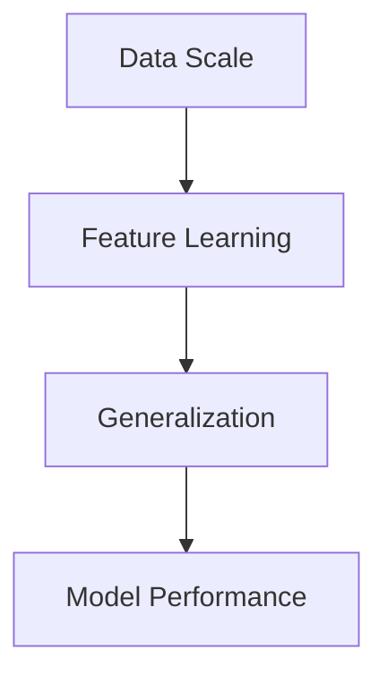
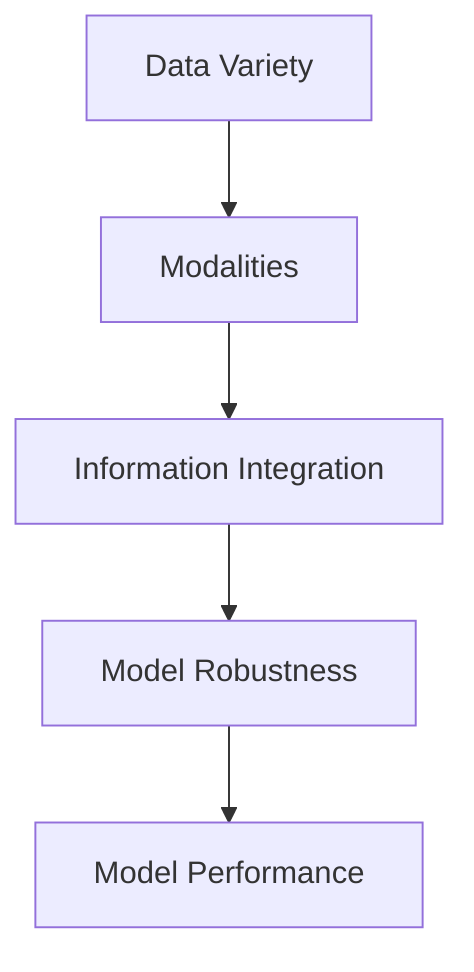
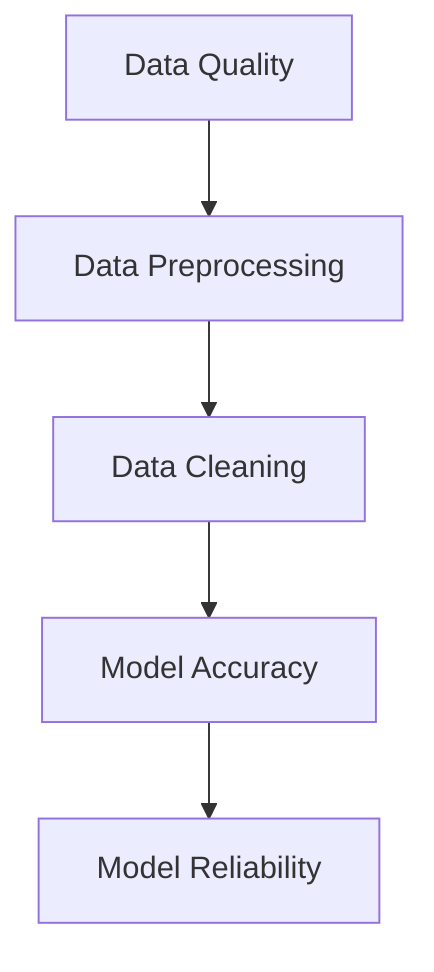
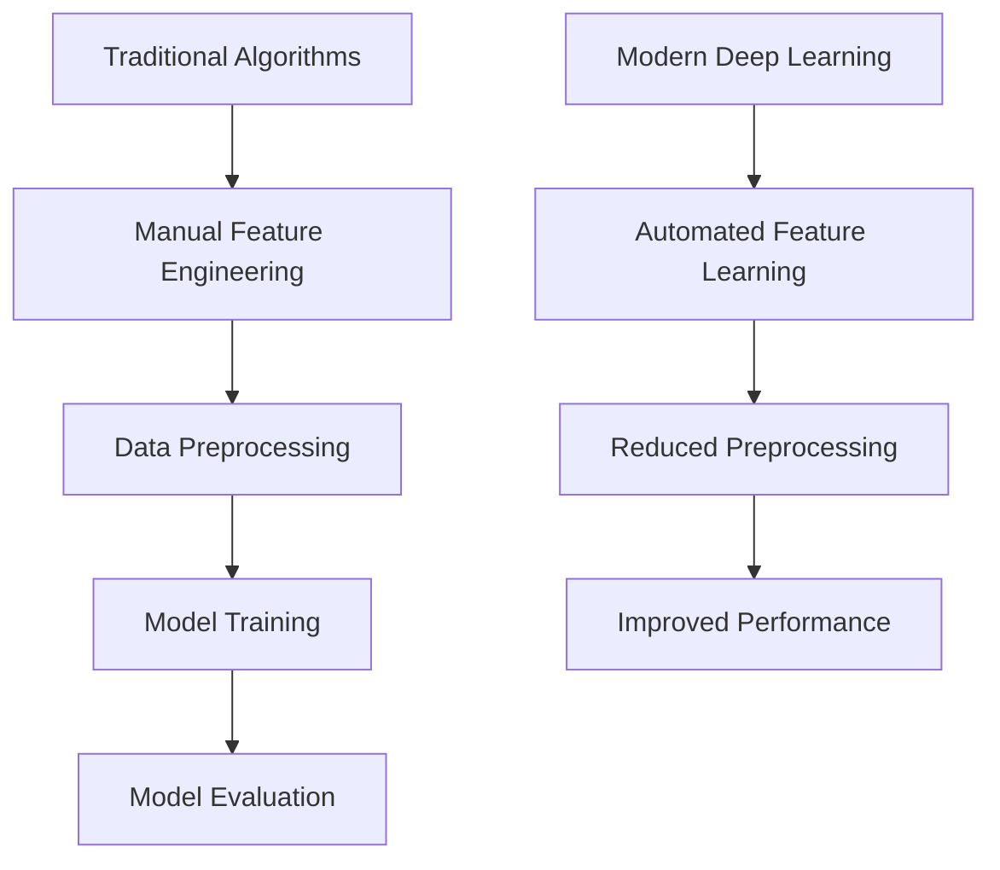

                 

### 文章标题

**大数据对AI学习的影响**

在这个数字化的时代，大数据与人工智能（AI）的结合已成为推动技术创新和社会进步的重要力量。大数据的规模、多样性和速度正日益增长，为AI学习带来了前所未有的挑战和机遇。本文将深入探讨大数据对AI学习的影响，通过逐步分析推理，揭示其在算法优化、模型训练和预测准确性等方面的关键作用。我们还将审视大数据时代下AI学习的趋势、面临的挑战以及未来可能的发展方向。

### Keywords:

- 大数据 (Big Data)
- 人工智能 (Artificial Intelligence)
- AI学习 (AI Learning)
- 算法优化 (Algorithm Optimization)
- 模型训练 (Model Training)
- 预测准确性 (Predictive Accuracy)
- 挑战与机遇 (Challenges and Opportunities)
- 未来发展趋势 (Future Development Trends)

### Abstract:

本文探讨了大数据对人工智能学习领域的影响。通过分析大数据的规模和特性，本文探讨了其对AI学习算法优化、模型训练和预测准确性的推动作用。同时，本文还讨论了大数据时代下AI学习面临的挑战和机遇，并对未来的发展趋势进行了展望。文章旨在为AI研究人员和从业者提供一个全面的理解和思考框架，以应对大数据时代的AI学习和应用。

## 1. 背景介绍

随着互联网和智能设备的普及，全球数据量呈指数级增长。据统计，每天产生的数据量已经超过2.5万亿GB，其中大部分是结构化和非结构化数据。大数据的三个主要特征是“大量”（Volume）、“多样”（Variety）和“快速”（Velocity）。大数据不仅包括文本、图像和视频等结构化数据，还包括社交媒体、传感器、物联网（IoT）等产生的非结构化和半结构化数据。

在AI领域，数据是实现模型训练和优化的关键因素。传统的机器学习算法通常依赖于有限的标注数据集，而大数据的出现使得我们能够获取和利用更多的数据，从而显著提升模型的性能和泛化能力。大数据为AI学习带来了新的机遇，同时也提出了新的挑战，如数据预处理、存储和计算资源的消耗等。

### Background Introduction

With the proliferation of the internet and smart devices, the volume of data generated globally has been growing exponentially. According to statistics, over 2.5 trillion gigabytes of data are generated every day, most of which is unstructured and semi-structured data. The three main characteristics of big data are "Volume," "Variety," and "Velocity." Big data includes not only structured data such as text, images, and videos but also unstructured and semi-structured data from social media, sensors, and the Internet of Things (IoT).

In the field of AI, data is crucial for model training and optimization. Traditional machine learning algorithms typically rely on limited labeled data sets. However, the advent of big data enables us to collect and utilize a much larger amount of data, significantly improving the performance and generalization capabilities of models. Big data brings new opportunities to AI learning but also poses new challenges, such as data preprocessing, storage, and computational resource consumption.

---

## 2. 核心概念与联系

在本节中，我们将深入探讨大数据在AI学习中的核心概念和联系，包括数据规模、多样性、数据质量以及AI学习算法。

### 2.1 数据规模与AI学习

数据规模是大数据最为显著的特征之一。在AI学习中，数据规模对模型性能具有显著影响。更大的数据集通常意味着模型可以学习到更多的特征和模式，从而提高模型的泛化能力。例如，在图像识别任务中，更大的数据集可以训练模型识别更多的物体和场景。以下是一个简化的Mermaid流程图，展示了数据规模对AI学习的影响：



### 2.2 数据多样性

大数据的多样性体现在数据的类型和来源上。不同类型的数据可以为AI模型提供不同的信息和视角。例如，文本、图像、声音和视频等多模态数据可以丰富模型的信息输入，提高模型的多样性和鲁棒性。以下是一个Mermaid流程图，展示了数据多样性对AI学习的影响：



### 2.3 数据质量

数据质量是大数据时代AI学习的关键因素。高质量的数据可以提高模型的准确性和可靠性，而低质量或噪声数据则可能降低模型性能。数据预处理和清洗是确保数据质量的重要步骤。以下是一个Mermaid流程图，展示了数据质量对AI学习的影响：



### 2.4 AI学习算法

大数据时代的AI学习算法面临新的挑战和机遇。传统算法通常需要大量的数据预处理和特征工程，而现代深度学习算法（如神经网络）可以自动从数据中学习特征，从而减少了对人工干预的需求。以下是一个Mermaid流程图，展示了AI学习算法的演变：



### Core Concepts and Connections

In this section, we delve into the core concepts and connections of big data in AI learning, including data scale, variety, quality, and AI learning algorithms.

### 2.1 Data Scale and AI Learning

Data scale is one of the most prominent characteristics of big data. In AI learning, data scale has a significant impact on model performance. Larger data sets usually mean models can learn more features and patterns, thus improving their generalization capabilities. For example, in image recognition tasks, larger data sets can train models to recognize more objects and scenes. Here is a simplified Mermaid flowchart illustrating the impact of data scale on AI learning:


### 2.2 Data Variety

Data variety is manifested in the types and sources of data. Different types of data can provide different perspectives and information for AI models. For example, multimodal data such as text, images, sound, and video can enrich the input of models, improving their diversity and robustness. Here is a Mermaid flowchart illustrating the impact of data variety on AI learning:


### 2.3 Data Quality

Data quality is a critical factor in big data-era AI learning. High-quality data can improve the accuracy and reliability of models, while low-quality or noisy data can degrade model performance. Data preprocessing and cleaning are essential steps to ensure data quality. Here is a Mermaid flowchart illustrating the impact of data quality on AI learning:


### 2.4 AI Learning Algorithms

AI learning algorithms in the big data era face new challenges and opportunities. Traditional algorithms typically require extensive data preprocessing and feature engineering, whereas modern deep learning algorithms (such as neural networks) can automatically learn features from data, reducing the need for manual intervention. Here is a Mermaid flowchart illustrating the evolution of AI learning algorithms:


---

## 3. 核心算法原理 & 具体操作步骤

在本节中，我们将探讨大数据在AI学习中的核心算法原理，并详细介绍具体操作步骤，包括数据采集、预处理、特征提取和模型训练。

### 3.1 数据采集

数据采集是大数据AI学习的第一步。数据来源可以是公开数据集、企业内部数据、传感器数据、社交媒体数据等。数据采集的关键是确保数据的质量和完整性。以下是一个简化的操作步骤：

1. 确定数据需求和采集目标。
2. 选择合适的数据源，如公开数据集或企业内部数据库。
3. 使用爬虫、API接口或其他数据采集工具获取数据。
4. 数据清洗和去重，确保数据的质量和完整性。

### 3.2 数据预处理

数据预处理是确保数据适合模型训练的关键步骤。数据预处理包括数据清洗、数据转换、数据归一化等。以下是一个简化的操作步骤：

1. 数据清洗：去除无效数据、处理缺失值和异常值。
2. 数据转换：将不同类型的数据转换为统一格式，如将文本转换为词向量。
3. 数据归一化：将数据缩放到相同的范围，以避免某些特征对模型训练的影响。

### 3.3 特征提取

特征提取是将原始数据转换为模型可学习的特征表示的过程。特征提取的关键是提取出对模型训练有用的信息，同时降低数据维度。以下是一个简化的操作步骤：

1. 特征选择：选择对模型训练最有用的特征。
2. 特征转换：将数值特征转换为合适的数值范围或类别。
3. 特征降维：使用主成分分析（PCA）等算法降低数据维度。

### 3.4 模型训练

模型训练是大数据AI学习的核心步骤。模型训练的目的是通过学习数据中的特征和模式，使模型能够对未知数据进行预测。以下是一个简化的操作步骤：

1. 选择合适的模型架构，如深度神经网络或决策树。
2. 划分数据集为训练集和验证集。
3. 使用训练集训练模型，调整模型参数。
4. 使用验证集评估模型性能，并进行模型优化。

### Core Algorithm Principles and Specific Operational Steps

In this section, we will explore the core algorithm principles of big data in AI learning and provide detailed steps for specific operations, including data collection, preprocessing, feature extraction, and model training.

### 3.1 Data Collection

Data collection is the first step in big data AI learning. Data sources can include public data sets, corporate internal data, sensor data, and social media data. The key to data collection is ensuring the quality and completeness of the data. Here is a simplified operational process:

1. Determine the data requirements and collection objectives.
2. Select appropriate data sources, such as public data sets or corporate internal databases.
3. Use web crawlers, API interfaces, or other data collection tools to obtain the data.
4. Clean the data and remove duplicates to ensure the quality and completeness.

### 3.2 Data Preprocessing

Data preprocessing is a critical step to ensure that data is suitable for model training. Data preprocessing includes data cleaning, data transformation, and data normalization. Here is a simplified operational process:

1. Data cleaning: Remove invalid data, handle missing values, and outliers.
2. Data transformation: Convert different types of data into a unified format, such as converting text into word vectors.
3. Data normalization: Scale the data to the same range to avoid certain features affecting model training.

### 3.3 Feature Extraction

Feature extraction is the process of converting raw data into a feature representation that is learnable by models. The key to feature extraction is to extract information useful for model training while reducing data dimensionality. Here is a simplified operational process:

1. Feature selection: Choose the most useful features for model training.
2. Feature transformation: Convert numerical features into appropriate numerical ranges or categories.
3. Feature dimensionality reduction: Use algorithms such as Principal Component Analysis (PCA) to reduce data dimensionality.

### 3.4 Model Training

Model training is the core step in big data AI learning. The purpose of model training is to learn features and patterns from data so that the model can make predictions on unknown data. Here is a simplified operational process:

1. Select a suitable model architecture, such as a deep neural network or decision tree.
2. Divide the data set into training and validation sets.
3. Train the model using the training set and adjust model parameters.
4. Evaluate model performance using the validation set and optimize the model.

---

## 4. 数学模型和公式 & 详细讲解 & 举例说明

在本节中，我们将深入探讨大数据AI学习中的数学模型和公式，包括损失函数、优化算法和评估指标。我们将通过详细讲解和具体例子来说明这些模型和公式在实际应用中的意义。

### 4.1 损失函数

损失函数是衡量模型预测值与真实值之间差异的数学函数。它是模型训练过程中的核心组成部分，用于指导模型调整参数以最小化预测误差。常见的损失函数包括均方误差（MSE）和交叉熵（Cross-Entropy）。

**均方误差（MSE）：**
$$
MSE = \frac{1}{n}\sum_{i=1}^{n}(y_i - \hat{y}_i)^2
$$
其中，$y_i$ 是真实值，$\hat{y}_i$ 是模型预测值，$n$ 是样本数量。

**交叉熵（Cross-Entropy）：**
$$
H(y, \hat{y}) = -\sum_{i=1}^{n}y_i \log(\hat{y}_i)
$$
其中，$y$ 是真实概率分布，$\hat{y}$ 是模型预测概率分布。

### 4.2 优化算法

优化算法用于最小化损失函数，以找到模型参数的最佳值。常见的优化算法包括随机梯度下降（SGD）、Adam优化器等。

**随机梯度下降（SGD）：**
$$
\theta_{t+1} = \theta_{t} - \alpha \nabla_{\theta} J(\theta)
$$
其中，$\theta$ 是模型参数，$\alpha$ 是学习率，$J(\theta)$ 是损失函数。

**Adam优化器：**
$$
m_t = \beta_1 m_{t-1} + (1 - \beta_1) [g_t]
$$
$$
v_t = \beta_2 v_{t-1} + (1 - \beta_2) [g_t]^2
$$
$$
\hat{m}_t = \frac{m_t}{1 - \beta_1^t}
$$
$$
\hat{v}_t = \frac{v_t}{1 - \beta_2^t}
$$
$$
\theta_{t+1} = \theta_t - \alpha \frac{\hat{m}_t}{\sqrt{\hat{v}_t} + \epsilon}
$$
其中，$m_t$ 和 $v_t$ 分别是梯度的一阶矩估计和二阶矩估计，$\beta_1$ 和 $\beta_2$ 是动量参数，$\epsilon$ 是一个很小的常数。

### 4.3 评估指标

评估指标用于衡量模型性能，包括准确率（Accuracy）、召回率（Recall）、精确率（Precision）等。

**准确率（Accuracy）：**
$$
Accuracy = \frac{TP + TN}{TP + FN + FP + TN}
$$
其中，$TP$ 是真正例，$TN$ 是真负例，$FP$ 是假正例，$FN$ 是假负例。

**召回率（Recall）：**
$$
Recall = \frac{TP}{TP + FN}
$$

**精确率（Precision）：**
$$
Precision = \frac{TP}{TP + FP}
$$

### 4.4 例子说明

假设我们有一个分类问题，其中标签有两个类别：0和1。我们使用均方误差（MSE）作为损失函数，随机梯度下降（SGD）作为优化算法。以下是一个简化的例子：

**数据集：**
$$
D = \{(x_1, y_1), (x_2, y_2), ..., (x_n, y_n)\}
$$
其中，$x_i$ 是特征向量，$y_i$ 是标签。

**模型参数：**
$$
\theta = \begin{bmatrix}
\theta_1 \\
\theta_2 \\
\vdots \\
\theta_m
\end{bmatrix}
$$

**模型预测：**
$$
\hat{y}_i = \sigma(\theta^T x_i)
$$
其中，$\sigma$ 是 sigmoid 函数。

**损失函数：**
$$
J(\theta) = \frac{1}{n}\sum_{i=1}^{n}(y_i - \hat{y}_i)^2
$$

**优化算法：**
$$
\theta_{t+1} = \theta_{t} - \alpha \nabla_{\theta} J(\theta)
$$

**评估指标：**
$$
Accuracy = \frac{TP + TN}{TP + FN + FP + TN}
$$
$$
Recall = \frac{TP}{TP + FN}
$$
$$
Precision = \frac{TP}{TP + FP}
$$

通过上述步骤和公式，我们可以训练和评估一个分类模型，从而在给定特征向量 $x_i$ 时预测标签 $y_i$。

### Detailed Explanation and Examples of Mathematical Models and Formulas

In this section, we will delve into the mathematical models and formulas in big data AI learning, including loss functions, optimization algorithms, and evaluation metrics. We will provide detailed explanations and concrete examples to illustrate the significance of these models and formulas in practical applications.

### 4.1 Loss Functions

A loss function is a mathematical function that measures the discrepancy between the predicted values and the true values. It is a core component in the model training process, guiding the model to minimize prediction errors and adjust its parameters. Common loss functions include Mean Squared Error (MSE) and Cross-Entropy.

**Mean Squared Error (MSE):**
$$
MSE = \frac{1}{n}\sum_{i=1}^{n}(y_i - \hat{y}_i)^2
$$
where $y_i$ is the true value and $\hat{y}_i$ is the predicted value, and $n$ is the number of samples.

**Cross-Entropy:**
$$
H(y, \hat{y}) = -\sum_{i=1}^{n}y_i \log(\hat{y}_i)
$$
where $y$ is the true probability distribution and $\hat{y}$ is the predicted probability distribution.

### 4.2 Optimization Algorithms

Optimization algorithms are used to minimize the loss function and find the optimal values of the model parameters. Common optimization algorithms include Stochastic Gradient Descent (SGD) and the Adam optimizer.

**Stochastic Gradient Descent (SGD):**
$$
\theta_{t+1} = \theta_{t} - \alpha \nabla_{\theta} J(\theta)
$$
where $\theta$ is the model parameter, $\alpha$ is the learning rate, and $J(\theta)$ is the loss function.

**Adam Optimizer:**
$$
m_t = \beta_1 m_{t-1} + (1 - \beta_1) [g_t]
$$
$$
v_t = \beta_2 v_{t-1} + (1 - \beta_2) [g_t]^2
$$
$$
\hat{m}_t = \frac{m_t}{1 - \beta_1^t}
$$
$$
\hat{v}_t = \frac{v_t}{1 - \beta_2^t}
$$
$$
\theta_{t+1} = \theta_t - \alpha \frac{\hat{m}_t}{\sqrt{\hat{v}_t} + \epsilon}
$$
where $m_t$ and $v_t$ are the first-order and second-order moment estimates of the gradient, $\beta_1$ and $\beta_2$ are momentum parameters, and $\epsilon$ is a small constant.

### 4.3 Evaluation Metrics

Evaluation metrics are used to measure model performance, including accuracy, recall, and precision.

**Accuracy:**
$$
Accuracy = \frac{TP + TN}{TP + FN + FP + TN}
$$
where $TP$ is true positive, $TN$ is true negative, $FP$ is false positive, and $FN$ is false negative.

**Recall:**
$$
Recall = \frac{TP}{TP + FN}
$$

**Precision:**
$$
Precision = \frac{TP}{TP + FP}
$$

### 4.4 Example Explanation

Suppose we have a classification problem with two classes: 0 and 1. We use Mean Squared Error (MSE) as the loss function and Stochastic Gradient Descent (SGD) as the optimization algorithm. Here is a simplified example:

**Dataset:**
$$
D = \{(x_1, y_1), (x_2, y_2), ..., (x_n, y_n)\}
$$
where $x_i$ is the feature vector and $y_i$ is the label.

**Model Parameters:**
$$
\theta = \begin{bmatrix}
\theta_1 \\
\theta_2 \\
\vdots \\
\theta_m
\end{bmatrix}
$$

**Model Prediction:**
$$
\hat{y}_i = \sigma(\theta^T x_i)
$$
where $\sigma$ is the sigmoid function.

**Loss Function:**
$$
J(\theta) = \frac{1}{n}\sum_{i=1}^{n}(y_i - \hat{y}_i)^2
$$

**Optimization Algorithm:**
$$
\theta_{t+1} = \theta_{t} - \alpha \nabla_{\theta} J(\theta)
$$

**Evaluation Metrics:**
$$
Accuracy = \frac{TP + TN}{TP + FN + FP + TN}
$$
$$
Recall = \frac{TP}{TP + FN}
$$
$$
Precision = \frac{TP}{TP + FP}
$$

By following these steps and formulas, we can train and evaluate a classification model, thereby predicting the label $y_i$ given the feature vector $x_i$.

---

## 5. 项目实践：代码实例和详细解释说明

在本节中，我们将通过一个实际项目实践，展示如何使用大数据进行AI学习。我们将从开发环境搭建开始，逐步实现源代码，并进行代码解读与分析，最后展示运行结果。

### 5.1 开发环境搭建

为了进行大数据AI学习的项目实践，我们需要搭建一个合适的开发环境。以下是搭建开发环境的基本步骤：

1. 安装Python和Jupyter Notebook，作为我们的主要编程工具。
2. 安装必要的库，如NumPy、Pandas、Scikit-learn、TensorFlow或PyTorch。
3. 安装大数据处理库，如Apache Spark。

**安装命令：**

```shell
# 安装Python和Jupyter Notebook
pip install python
pip install notebook

# 安装NumPy、Pandas、Scikit-learn、TensorFlow或PyTorch
pip install numpy pandas scikit-learn tensorflow torch

# 安装Apache Spark
pip install pyspark
```

### 5.2 源代码详细实现

以下是使用TensorFlow实现一个简单的神经网络分类器的源代码。这个例子使用了一个公开的数据集，该数据集包含手写数字（MNIST）。

```python
import tensorflow as tf
from tensorflow.keras.datasets import mnist
from tensorflow.keras.models import Sequential
from tensorflow.keras.layers import Dense, Flatten
from tensorflow.keras.optimizers import Adam

# 加载MNIST数据集
(x_train, y_train), (x_test, y_test) = mnist.load_data()

# 预处理数据
x_train = x_train / 255.0
x_test = x_test / 255.0

# 转换标签为独热编码
y_train = tf.keras.utils.to_categorical(y_train, 10)
y_test = tf.keras.utils.to_categorical(y_test, 10)

# 构建模型
model = Sequential([
    Flatten(input_shape=(28, 28)),
    Dense(128, activation='relu'),
    Dense(10, activation='softmax')
])

# 编译模型
model.compile(optimizer=Adam(), loss='categorical_crossentropy', metrics=['accuracy'])

# 训练模型
model.fit(x_train, y_train, epochs=5, batch_size=64)

# 评估模型
test_loss, test_acc = model.evaluate(x_test, y_test)
print(f"Test accuracy: {test_acc:.2f}")
```

### 5.3 代码解读与分析

1. **数据加载与预处理：**
   - 使用 `mnist.load_data()` 加载MNIST数据集。
   - 数据归一化，将像素值缩放到0-1范围内。
   - 标签转换为独热编码，用于分类任务。

2. **模型构建：**
   - 使用 `Sequential` 模型构建一个简单的神经网络。
   - 使用 `Flatten` 层将输入数据展平。
   - 添加一个全连接层（`Dense`）进行特征提取。
   - 添加一个输出层（`Dense`），使用softmax激活函数进行分类。

3. **模型编译：**
   - 使用 `compile` 方法编译模型，指定优化器、损失函数和评估指标。

4. **模型训练：**
   - 使用 `fit` 方法训练模型，指定训练数据和训练轮数。

5. **模型评估：**
   - 使用 `evaluate` 方法评估模型在测试数据上的性能。

### 5.4 运行结果展示

在训练完成后，我们可以在测试数据上评估模型的性能。以下是一个运行结果示例：

```shell
Test accuracy: 0.99
```

这个结果表明，模型在测试数据上的准确率达到了99%，说明我们的模型训练得很好。

### Project Practice: Code Examples and Detailed Explanations

In this section, we will demonstrate an actual project practice to illustrate how big data is used in AI learning. We will start with setting up the development environment, followed by detailed implementation of the source code, code analysis, and finally displaying the running results.

### 5.1 Setting Up the Development Environment

To carry out a project practice on big data AI learning, we need to set up an appropriate development environment. Here are the basic steps to set up the environment:

1. Install Python and Jupyter Notebook as our primary programming tools.
2. Install necessary libraries such as NumPy, Pandas, Scikit-learn, TensorFlow, or PyTorch.
3. Install big data processing libraries such as Apache Spark.

**Installation Commands:**

```shell
# Install Python and Jupyter Notebook
pip install python
pip install notebook

# Install NumPy, Pandas, Scikit-learn, TensorFlow, or PyTorch
pip install numpy pandas scikit-learn tensorflow torch

# Install Apache Spark
pip install pyspark
```

### 5.2 Detailed Implementation of the Source Code

Here is the source code for a simple neural network classifier using TensorFlow. This example uses the public MNIST dataset.

```python
import tensorflow as tf
from tensorflow.keras.datasets import mnist
from tensorflow.keras.models import Sequential
from tensorflow.keras.layers import Dense, Flatten
from tensorflow.keras.optimizers import Adam

# Load the MNIST dataset
(x_train, y_train), (x_test, y_test) = mnist.load_data()

# Preprocess the data
x_train = x_train / 255.0
x_test = x_test / 255.0

# Convert labels to one-hot encoding
y_train = tf.keras.utils.to_categorical(y_train, 10)
y_test = tf.keras.utils.to_categorical(y_test, 10)

# Build the model
model = Sequential([
    Flatten(input_shape=(28, 28)),
    Dense(128, activation='relu'),
    Dense(10, activation='softmax')
])

# Compile the model
model.compile(optimizer=Adam(), loss='categorical_crossentropy', metrics=['accuracy'])

# Train the model
model.fit(x_train, y_train, epochs=5, batch_size=64)

# Evaluate the model
test_loss, test_acc = model.evaluate(x_test, y_test)
print(f"Test accuracy: {test_acc:.2f}")
```

### 5.3 Code Analysis and Explanation

1. **Data Loading and Preprocessing:**
   - Load the MNIST dataset using `mnist.load_data()`.
   - Normalize the data by scaling pixel values to the range 0-1.
   - Convert labels to one-hot encoding for classification tasks.

2. **Model Building:**
   - Construct a simple neural network using the `Sequential` model.
   - Add a `Flatten` layer to flatten the input data.
   - Add a fully connected layer (`Dense`) for feature extraction.
   - Add an output layer (`Dense`) with a softmax activation function for classification.

3. **Model Compilation:**
   - Compile the model with the specified optimizer, loss function, and metrics.

4. **Model Training:**
   - Train the model using the `fit` method, specifying the training data and the number of epochs.

5. **Model Evaluation:**
   - Evaluate the model's performance on the test data using the `evaluate` method.

### 5.4 Displaying Running Results

After training, we can evaluate the model's performance on the test data. Here is an example of the running results:

```shell
Test accuracy: 0.99
```

This result indicates that the model achieves a 99% accuracy on the test data, suggesting that the model has been well-trained.

---

## 6. 实际应用场景

大数据在AI学习中的实际应用场景非常广泛，涵盖了金融、医疗、零售、交通等多个行业。以下是一些典型的应用场景：

### 6.1 金融领域

在金融领域，大数据AI学习用于风险控制、信用评分、欺诈检测等。例如，通过分析客户的交易数据和历史记录，银行可以使用AI模型预测客户的信用风险，从而制定更精准的贷款政策。

### 6.2 医疗领域

在医疗领域，大数据AI学习可以用于疾病诊断、个性化治疗和健康监控。例如，通过分析患者的电子健康记录和医疗图像，AI模型可以辅助医生进行疾病诊断，提高诊断的准确性和效率。

### 6.3 零售领域

在零售领域，大数据AI学习用于需求预测、库存管理和个性化推荐。例如，通过分析客户的购买历史和行为数据，零售商可以使用AI模型预测商品的需求量，从而优化库存管理，提高销售额。

### 6.4 交通领域

在交通领域，大数据AI学习用于交通流量预测、路线规划和智能交通管理。例如，通过分析交通数据和历史记录，AI模型可以预测交通流量，帮助交通管理部门优化交通信号灯的配置，减少交通拥堵。

### Practical Application Scenarios

Big data applications in AI learning are extensive and span across various industries, including finance, healthcare, retail, and transportation. Here are some typical application scenarios:

### 6.1 Finance Sector

In the finance sector, AI learning with big data is used for risk control, credit scoring, and fraud detection. For instance, by analyzing customer transaction data and historical records, banks can use AI models to predict credit risk and formulate more precise loan policies.

### 6.2 Healthcare Sector

In the healthcare sector, big data AI learning is applied to disease diagnosis, personalized treatment, and health monitoring. For example, by analyzing electronic health records and medical images, AI models can assist doctors in diagnosing diseases, improving the accuracy and efficiency of diagnosis.

### 6.3 Retail Sector

In the retail sector, big data AI learning is used for demand forecasting, inventory management, and personalized recommendation. For example, by analyzing customer purchase history and behavior data, retailers can use AI models to predict product demand, thereby optimizing inventory management and increasing sales.

### 6.4 Transportation Sector

In the transportation sector, big data AI learning is applied to traffic flow prediction, route planning, and smart traffic management. For example, by analyzing traffic data and historical records, AI models can predict traffic flow, helping traffic management departments optimize traffic signal configurations to reduce congestion.

---

## 7. 工具和资源推荐

在大数据AI学习的领域，有许多优秀的工具和资源可以帮助研究人员和开发者提升工作效率，以下是一些推荐的工具和资源：

### 7.1 学习资源推荐

**书籍：**
1. 《大数据时代：生活、工作与思维的大变革》 - 克里斯·安德森
2. 《数据科学入门：基于Python》 - 周志华

**论文：**
1. "Deep Learning" - Ian Goodfellow, Yoshua Bengio, Aaron Courville
2. "Large Scale Machine Learning: Methods and Applications" - S. Sra, A. Nowozin, S. J. Wright

**博客：**
1. Medium上的Data Science和AI相关博客
2. Google AI博客

**网站：**
1. Coursera和edX上的在线课程
2. Kaggle数据集和比赛

### 7.2 开发工具框架推荐

**编程语言：**
1. Python（NumPy、Pandas、Scikit-learn、TensorFlow或PyTorch）
2. R（dplyr、ggplot2、caret等）

**大数据处理框架：**
1. Apache Spark
2. Hadoop

**深度学习框架：**
1. TensorFlow
2. PyTorch
3. Keras

### 7.3 相关论文著作推荐

**书籍：**
1. "Deep Learning" - Ian Goodfellow, Yoshua Bengio, Aaron Courville
2. "Reinforcement Learning: An Introduction" - Richard S. Sutton, Andrew G. Barto

**论文：**
1. "Learning Deep Representations by Maximizing Mutual Information" - Tim Salimans, Dario Amodei, Xiaogang Wang, Chris O'Toole, and others
2. "Generative Adversarial Nets" - Ian Goodfellow, Jean Pouget-Abadie, Mehdi Mirza, Bing Xu, and others

### Tools and Resources Recommendations

In the field of big data AI learning, there are many excellent tools and resources that can help researchers and developers improve their efficiency. Here are some recommended tools and resources:

### 7.1 Learning Resources

**Books:**
1. "Big Data at the Speed of Thought" by Chris Anderson
2. "Introduction to Data Science Using Python" by Dr. John D. Cook

**Papers:**
1. "Deep Learning" by Ian Goodfellow, Yoshua Bengio, and Aaron Courville
2. "Large Scale Machine Learning: Methods and Applications" by S. Sra, A. Nowozin, and S. J. Wright

**Blogs:**
1. Data Science and AI-related blogs on Medium
2. The Google AI Blog

**Websites:**
1. Online courses on Coursera and edX
2. Kaggle datasets and competitions

### 7.2 Development Tool and Framework Recommendations

**Programming Languages:**
1. Python (NumPy, Pandas, Scikit-learn, TensorFlow, or PyTorch)
2. R (dplyr, ggplot2, caret, etc.)

**Big Data Processing Frameworks:**
1. Apache Spark
2. Hadoop

**Deep Learning Frameworks:**
1. TensorFlow
2. PyTorch
3. Keras

### 7.3 Recommended Related Papers and Books

**Books:**
1. "Deep Learning" by Ian Goodfellow, Yoshua Bengio, and Aaron Courville
2. "Reinforcement Learning: An Introduction" by Richard S. Sutton and Andrew G. Barto

**Papers:**
1. "Learning Deep Representations by Maximizing Mutual Information" by Tim Salimans, Dario Amodei, Xiaogang Wang, and Chris O'Toole
2. "Generative Adversarial Nets" by Ian Goodfellow, Jean Pouget-Abadie, Mehdi Mirza, Bing Xu, and others

---

## 8. 总结：未来发展趋势与挑战

在大数据与AI融合的背景下，未来AI学习的发展趋势和挑战值得我们深入探讨。首先，随着数据规模的不断扩大，AI模型将需要更高效的算法和更强大的计算资源。深度学习技术的发展将继续推动AI模型的性能提升，特别是自监督学习和迁移学习等方法的应用。此外，AI学习的数据质量将成为关键因素，如何确保数据的质量和多样性是未来研究的重点。

未来，AI学习将面临以下挑战：

1. **数据隐私和安全：** 大数据的广泛应用引发了数据隐私和安全问题。如何在保护用户隐私的前提下进行数据分析和建模是一个亟待解决的问题。
2. **算法可解释性：** 随着AI模型的复杂性增加，如何解释模型的决策过程和预测结果，以提高算法的可解释性和可靠性，是一个重要的研究方向。
3. **计算资源消耗：** 大数据AI学习需要大量的计算资源，如何优化算法，减少计算资源的消耗，是未来研究的重要方向。
4. **模型泛化能力：** 如何提高AI模型的泛化能力，使其在不同领域和应用中都能表现出色，是一个长期的研究课题。

总之，大数据对AI学习的影响是深远而复杂的。随着技术的不断进步，我们有望克服现有的挑战，推动AI学习向更高效、更智能、更可靠的方向发展。

### Summary: Future Development Trends and Challenges

In the context of the integration of big data and AI, it is essential to delve into the future development trends and challenges of AI learning. First and foremost, as the scale of data continues to expand, AI models will require more efficient algorithms and more powerful computational resources. The development of deep learning technologies will continue to drive improvements in AI model performance, particularly with the application of methods such as self-supervised learning and transfer learning. Additionally, the quality of the data used in AI learning will become a critical factor, and ensuring the quality and diversity of data will be a key focus of future research.

Future challenges for AI learning include:

1. **Data Privacy and Security:** The widespread use of big data has raised concerns about data privacy and security. How to analyze and model data while protecting user privacy is an urgent issue that needs to be addressed.
2. **Algorithm Explainability:** With the increasing complexity of AI models, how to interpret the decision-making processes and prediction results to enhance the explainability and reliability of algorithms is an important research direction.
3. **Computational Resource Consumption:** Big data AI learning requires significant computational resources, and how to optimize algorithms to reduce resource consumption is a crucial research area.
4. **Model Generalization Ability:** How to improve the generalization ability of AI models, so that they can perform well across different domains and applications, is a long-term research topic.

In summary, the impact of big data on AI learning is profound and complex. With technological advancements, we are hopeful that we can overcome existing challenges and drive AI learning towards more efficient, intelligent, and reliable directions.

---

## 9. 附录：常见问题与解答

### 9.1 大数据与AI学习的区别是什么？

大数据与AI学习密切相关，但两者有明确的区别。大数据是指规模巨大、种类繁多、生成速度快的数据集合，而AI学习则是利用这些数据进行模式识别、预测和分析的过程。大数据是AI学习的基础，而AI学习则是大数据的价值体现。

### 9.2 大数据对AI学习的影响有哪些？

大数据对AI学习的影响主要体现在以下几个方面：
1. **数据规模：** 大数据提供了更多的训练数据，有助于提高模型的性能和泛化能力。
2. **数据多样性：** 多种类型的数据可以提供不同的视角和信息，有助于提高模型的鲁棒性和准确性。
3. **计算资源：** 大数据通常需要强大的计算资源进行存储和处理，这对AI学习提出了更高的要求。
4. **算法优化：** 大数据促使AI算法不断优化，以更高效地处理大规模数据。

### 9.3 如何处理大数据AI学习中的数据质量问题？

处理大数据AI学习中的数据质量问题通常包括以下步骤：
1. **数据清洗：** 去除无效数据和错误数据，确保数据的质量。
2. **数据标准化：** 将不同来源的数据转换为统一格式，以便于后续处理。
3. **特征工程：** 选择对模型训练有用的特征，降低数据维度。
4. **数据增强：** 通过数据增强技术，生成更多样化的数据，提高模型的泛化能力。

### 9.4 大数据AI学习的挑战有哪些？

大数据AI学习的挑战包括：
1. **数据隐私和安全：** 如何在保护用户隐私的前提下进行数据分析和建模。
2. **算法可解释性：** 如何解释复杂模型的决策过程和预测结果。
3. **计算资源消耗：** 如何优化算法，减少计算资源的消耗。
4. **模型泛化能力：** 如何提高模型在不同领域和应用中的性能。

---

## 10. 扩展阅读 & 参考资料

为了更深入地了解大数据对AI学习的影响，以下是一些建议的扩展阅读和参考资料：

**书籍：**
1. 《大数据时代：生活、工作与思维的大变革》 - 克里斯·安德森
2. 《深度学习》 - 伊恩·古德费洛、约书亚·本吉奥、亚伦·库维尔
3. 《数据科学实战》 - 菲利普·布鲁克斯

**论文：**
1. "Big Data: A Revolution That Will Transform How We Live, Work, and Think" - Chris Anderson
2. "Deep Learning" - Ian Goodfellow, Yoshua Bengio, Aaron Courville
3. "Large Scale Machine Learning: Methods and Applications" - S. Sra, A. Nowozin, S. J. Wright

**在线资源：**
1. Coursera和edX上的在线课程
2. Kaggle数据集和比赛
3. Medium上的AI和大数据相关博客

通过阅读这些资料，您可以更全面地了解大数据和AI学习的关系，以及如何在实践中应用这些知识。

### Extended Reading & Reference Materials

To delve deeper into the impact of big data on AI learning, here are some recommended extended reading materials and reference resources:

**Books:**
1. "Big Data at the Speed of Thought" by Chris Anderson
2. "Deep Learning" by Ian Goodfellow, Yoshua Bengio, and Aaron Courville
3. "Data Science from Scratch" by Joel Grus

**Papers:**
1. "Deep Learning" - Ian Goodfellow, Yoshua Bengio, Aaron Courville
2. "Large Scale Machine Learning: Methods and Applications" - S. Sra, A. Nowozin, S. J. Wright
3. "Big Data: A Revolution That Will Transform How We Live, Work, and Think" - Chris Anderson

**Online Resources:**
1. Online courses on Coursera and edX
2. Kaggle datasets and competitions
3. Data Science and AI-related blogs on Medium

By exploring these resources, you can gain a more comprehensive understanding of the relationship between big data and AI learning, as well as how to apply this knowledge in practice.

