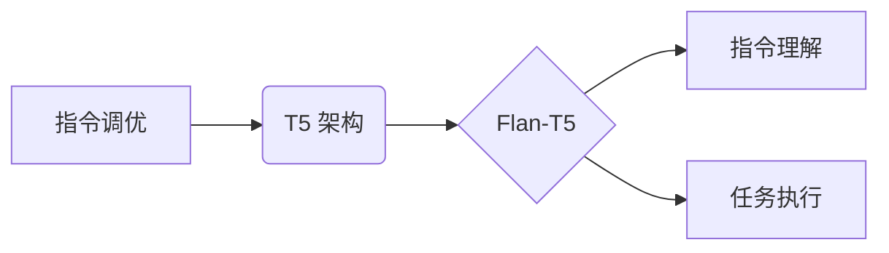

                 

## 基于Flan-T5的大模型指令调优推荐方法

> 关键词：Flan-T5, 指令调优, 大模型, 自然语言处理, 迁移学习,  文本生成

## 1. 背景介绍

近年来，大型语言模型（LLM）在自然语言处理（NLP）领域取得了显著进展，展现出强大的文本生成、翻译、问答等能力。然而，现有的LLM通常需要大量的特定任务数据进行微调，这对于资源有限的场景来说成本高昂且效率低下。指令调优是一种新的训练方法，旨在通过学习一系列文本指令和对应的输出，使模型能够理解和执行各种任务，从而降低对特定任务数据依赖的程度。

Flan-T5 是 Google AI 团队开发的一种基于 T5 架构的指令调优模型，它通过在大量指令-响应对数据上进行训练，学习了丰富的指令理解和执行能力。Flan-T5 在多个 NLP 任务上表现出色，并展现出良好的泛化能力，为指令调优领域提供了重要的参考。

## 2. 核心概念与联系

### 2.1 指令调优

指令调优是一种通过学习文本指令和对应的输出，使模型能够理解和执行各种任务的训练方法。它与传统的监督学习不同，不需要为每个任务单独收集大量标注数据。

指令调优的核心思想是将任务描述为文本指令，并将模型的输出作为指令的响应。通过学习大量的指令-响应对，模型能够学习到指令的语义和任务的执行方式。

### 2.2 T5 架构

T5（Text-to-Text Transfer Transformer）是一种基于 Transformer 架构的文本到文本的编码器-解码器模型。它将所有 NLP 任务都统一转换为文本到文本的格式，例如文本分类、机器翻译、问答等。

T5 的优势在于其强大的文本表示能力和可迁移性。由于它采用 Transformer 架构，能够捕捉长距离依赖关系，并通过预训练在大量文本数据上学习丰富的语义表示。

### 2.3 Flan-T5

Flan-T5 是基于 T5 架构的指令调优模型。它通过在 Google 收集的指令-响应对数据集上进行训练，学习了丰富的指令理解和执行能力。

Flan-T5 的特点在于：

* **指令多样性:** 训练数据包含各种类型的指令，涵盖了多个 NLP 任务。
* **响应多样性:** 每个指令可能有多种可能的响应，模型需要学习到不同的响应策略。
* **零样本学习:** Flan-T5 可以执行从未见过的任务，只要提供相应的指令。

**核心概念与联系流程图:**



## 3. 核心算法原理 & 具体操作步骤

### 3.1 算法原理概述

Flan-T5 的核心算法原理是基于 Transformer 架构的文本到文本的编码器-解码器模型。它将指令和响应都表示为文本序列，并使用 Transformer 网络进行编码和解码。

训练过程是通过最小化指令-响应对之间的损失函数来进行的。损失函数通常是交叉熵损失，它衡量模型预测的响应与真实响应之间的差异。

### 3.2 算法步骤详解

1. **数据预处理:** 将指令-响应对数据进行预处理，例如分词、词嵌入等。
2. **模型构建:** 使用 T5 架构构建编码器-解码器模型。
3. **模型训练:** 使用指令-响应对数据训练模型，最小化损失函数。
4. **模型评估:** 在测试集上评估模型的性能，例如准确率、BLEU 等。
5. **模型部署:** 将训练好的模型部署到实际应用场景中。

### 3.3 算法优缺点

**优点:**

* **泛化能力强:** 通过学习大量的指令-响应对，模型能够泛化到从未见过的任务。
* **零样本学习:** 可以执行从未见过的任务，只要提供相应的指令。
* **可迁移性强:** 可以将预训练的模型迁移到不同的任务和领域。

**缺点:**

* **训练数据量大:** 需要大量的指令-响应对数据进行训练。
* **训练时间长:** 训练大型模型需要大量的计算资源和时间。
* **指令设计复杂:** 需要精心设计指令，才能使模型能够正确理解和执行任务。

### 3.4 算法应用领域

指令调优技术在多个 NLP 领域都有广泛的应用，例如：

* **文本生成:** 可以生成各种类型的文本，例如文章、故事、诗歌等。
* **对话系统:** 可以构建更自然、更智能的对话系统。
* **问答系统:** 可以构建更准确、更全面的问答系统。
* **代码生成:** 可以生成代码，辅助程序员开发。

## 4. 数学模型和公式 & 详细讲解 & 举例说明

### 4.1 数学模型构建

Flan-T5 的数学模型构建基于 Transformer 架构，其核心是编码器和解码器两个部分。

* **编码器:** 用于将指令序列编码为一个固定长度的向量表示。
* **解码器:** 用于根据编码后的指令向量生成响应序列。

编码器和解码器都由多层 Transformer 块组成，每个 Transformer 块包含自注意力机制和前馈神经网络。

### 4.2 公式推导过程

由于篇幅限制，这里只列举 Transformer 块中的自注意力机制的计算公式：

$$
Attention(Q, K, V) = softmax(\frac{QK^T}{\sqrt{d_k}})V
$$

其中：

* $Q$：查询矩阵
* $K$：键矩阵
* $V$：值矩阵
* $d_k$：键向量的维度
* $softmax$：softmax 函数

### 4.3 案例分析与讲解

假设我们有一个指令 "翻译 'Hello world' 到西班牙语"，Flan-T5 的编码器会将指令序列编码为一个向量表示，解码器会根据这个向量表示生成响应序列 "Hola mundo"。

## 5. 项目实践：代码实例和详细解释说明

### 5.1 开发环境搭建

* Python 3.7+
* PyTorch 1.7+
* Transformers 库

### 5.2 源代码详细实现

由于篇幅限制，这里只提供代码片段示例：

```python
from transformers import T5ForConditionalGeneration, T5Tokenizer

# 加载预训练模型和词典
model_name = "google/flan-t5-base"
tokenizer = T5Tokenizer.from_pretrained(model_name)
model = T5ForConditionalGeneration.from_pretrained(model_name)

# 定义输入指令
input_text = "翻译 'Hello world' 到西班牙语"

# 将指令转换为模型输入格式
inputs = tokenizer(input_text, return_tensors="pt")

# 生成响应序列
outputs = model.generate(**inputs)

# 将响应序列转换为文本
response_text = tokenizer.decode(outputs[0], skip_special_tokens=True)

# 打印响应文本
print(response_text)
```

### 5.3 代码解读与分析

* 代码首先加载预训练的 Flan-T5 模型和词典。
* 然后定义输入指令，并将其转换为模型输入格式。
* 使用模型的 `generate` 方法生成响应序列。
* 最后将响应序列转换为文本并打印输出。

### 5.4 运行结果展示

运行上述代码，模型将输出响应文本 "Hola mundo"。

## 6. 实际应用场景

Flan-T5 在多个实际应用场景中展现出强大的性能，例如：

* **聊天机器人:** 可以构建更自然、更智能的聊天机器人，能够理解用户的指令并提供相应的回复。
* **文本摘要:** 可以自动生成文本摘要，提取文本的关键信息。
* **机器翻译:** 可以实现高质量的机器翻译，将文本从一种语言翻译成另一种语言。

### 6.4 未来应用展望

随着指令调优技术的不断发展，Flan-T5 在未来将有更广泛的应用场景，例如：

* **代码生成:** 可以帮助程序员自动生成代码，提高开发效率。
* **数据分析:** 可以帮助分析师自动提取数据中的关键信息，进行数据分析和挖掘。
* **个性化教育:** 可以根据学生的学习情况，提供个性化的学习内容和辅导。

## 7. 工具和资源推荐

### 7.1 学习资源推荐

* **论文:**

    * "Flan-T5: Instructions Follow Fine-Tuning"
    * "T5: Text-to-Text Transfer Transformer"

* **博客:**

    * Google AI Blog
    * Hugging Face Blog

### 7.2 开发工具推荐

* **Transformers 库:** https://huggingface.co/docs/transformers/index
* **PyTorch:** https://pytorch.org/

### 7.3 相关论文推荐

* "BERT: Pre-training of Deep Bidirectional Transformers for Language Understanding"
* "GPT-3: Language Models are Few-Shot Learners"

## 8. 总结：未来发展趋势与挑战

### 8.1 研究成果总结

Flan-T5 的研究成果表明，指令调优技术能够有效地提高大型语言模型的泛化能力和零样本学习能力。它为 NLP 领域的发展提供了新的思路和方法。

### 8.2 未来发展趋势

* **更强大的模型:** 未来将会有更强大的指令调优模型，能够处理更复杂的任务。
* **更丰富的指令数据:** 随着指令数据量的增加，模型的性能将进一步提升。
* **更有效的训练方法:** 将会有更有效的训练方法，能够更快、更有效地训练指令调优模型。

### 8.3 面临的挑战

* **指令设计:** 设计高质量的指令仍然是一个挑战，需要深入理解任务的语义和执行方式。
* **数据偏见:** 指令数据可能存在偏见，这会导致模型的输出结果也存在偏见。
* **安全问题:** 指令调优模型可能被用于恶意目的，例如生成虚假信息或进行攻击。

### 8.4 研究展望

未来研究将集中在以下几个方面：

* **探索更有效的指令设计方法。**
* **开发更 robust 的指令调优模型，能够抵抗数据偏见和恶意攻击。**
* **将指令调优技术应用到更多实际场景中。**

## 9. 附录：常见问题与解答

* **Q: 如何评估指令调优模型的性能？**

    A: 指令调优模型的性能通常使用准确率、BLEU 等指标进行评估。

* **Q: 如何训练指令调优模型？**

    A: 训练指令调优模型需要大量的指令-响应对数据，可以使用监督学习的方法进行训练。

* **Q: 指令调优模型的应用场景有哪些？**

    A: 指令调优模型可以应用于文本生成、对话系统、问答系统、代码生成等多个领域。


作者：禅与计算机程序设计艺术 / Zen and the Art of Computer Programming 
<end_of_turn>

