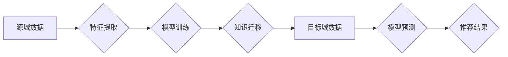

                 

## 基于迁移学习的跨域推荐算法

> 关键词：迁移学习、跨域推荐、推荐系统、机器学习、深度学习、知识迁移

## 1. 背景介绍

推荐系统作为信息过滤和个性化服务的重要组成部分，在电商、社交媒体、音乐流媒体等领域发挥着越来越重要的作用。传统的推荐系统通常依赖于用户历史行为数据，但当面对新用户或新商品时，由于缺乏历史数据，推荐效果往往不佳。

跨域推荐旨在解决这个问题，通过利用其他领域的用户行为数据或商品特征，对目标领域进行推荐。例如，利用音乐平台的用户喜好数据来推荐书籍，或者利用电商平台的商品购买数据来推荐电影。

迁移学习作为一种机器学习范式，能够有效地解决数据稀疏性问题。它通过将已学习到的知识从源域迁移到目标域，从而提高目标域的学习效率。

基于迁移学习的跨域推荐算法，可以利用源域丰富的知识和经验，提升目标域的推荐性能，尤其是在数据稀疏的情况下。

## 2. 核心概念与联系

### 2.1 迁移学习

迁移学习是一种机器学习范式，它利用源域已学习到的知识和经验，来提升目标域的学习性能。

源域和目标域通常具有相似的特征，但数据分布可能存在差异。迁移学习的目标是找到一种方法，将源域的知识有效地迁移到目标域，从而提高目标域的学习效率。

### 2.2 跨域推荐

跨域推荐是指利用不同领域的用户行为数据或商品特征，对目标领域进行推荐。

例如，利用音乐平台的用户喜好数据来推荐书籍，或者利用电商平台的商品购买数据来推荐电影。

### 2.3 核心概念联系

迁移学习和跨域推荐相辅相成，可以有效地解决数据稀疏性问题。

基于迁移学习的跨域推荐算法，可以利用源域丰富的知识和经验，提升目标域的推荐性能，尤其是在数据稀疏的情况下。

**Mermaid 流程图**



## 3. 核心算法原理 & 具体操作步骤

### 3.1 算法原理概述

基于迁移学习的跨域推荐算法，通常包括以下步骤：

1. **数据预处理**: 对源域和目标域的数据进行清洗、转换和特征提取。
2. **模型训练**: 在源域数据上训练一个推荐模型，并提取模型的知识表示。
3. **知识迁移**: 将源域模型的知识表示迁移到目标域。
4. **目标域模型训练**: 利用迁移后的知识表示，在目标域数据上训练一个新的推荐模型。
5. **推荐预测**: 利用训练好的目标域模型，对新的用户或商品进行推荐预测。

### 3.2 算法步骤详解

1. **数据预处理**:

   - **源域数据**: 收集源域的用户行为数据和商品特征数据，并进行清洗、转换和特征提取。例如，将用户行为数据转换为用户-商品交互矩阵，并将商品特征数据转换为向量表示。
   - **目标域数据**: 收集目标域的用户行为数据和商品特征数据，并进行清洗、转换和特征提取。

2. **模型训练**:

   - 选择一个合适的推荐模型，例如协同过滤模型、内容推荐模型或深度学习模型。
   - 在源域数据上训练推荐模型，并获得模型的权重参数。

3. **知识迁移**:

   - 提取源域模型的知识表示，例如特征映射、隐向量或知识图谱。
   - 将提取的知识表示迁移到目标域。

4. **目标域模型训练**:

   - 利用迁移后的知识表示，在目标域数据上训练一个新的推荐模型。
   - 可以使用源域模型的权重参数作为初始值，加速目标域模型的训练。

5. **推荐预测**:

   - 利用训练好的目标域模型，对新的用户或商品进行推荐预测。
   - 根据预测结果，生成推荐列表并展示给用户。

### 3.3 算法优缺点

**优点**:

- 能够有效地解决数据稀疏性问题。
- 能够利用源域的知识和经验，提升目标域的推荐性能。
- 适用于跨领域推荐场景。

**缺点**:

- 需要找到合适的源域和目标域，以及有效的知识迁移方法。
- 迁移过程可能存在知识丢失或偏差。
- 需要大量的计算资源和时间进行训练。

### 3.4 算法应用领域

- **电商推荐**: 利用用户购买历史数据，推荐相关商品。
- **社交媒体推荐**: 利用用户关注关系和互动行为，推荐好友或内容。
- **音乐推荐**: 利用用户音乐喜好数据，推荐歌曲或艺术家。
- **电影推荐**: 利用用户观看历史数据，推荐电影或演员。
- **新闻推荐**: 利用用户阅读历史数据，推荐新闻文章。

## 4. 数学模型和公式 & 详细讲解 & 举例说明

### 4.1 数学模型构建

基于迁移学习的跨域推荐算法，通常使用以下数学模型：

- **源域模型**: $f_s(x; \theta_s)$，其中 $x$ 是源域数据，$\theta_s$ 是源域模型的参数。
- **目标域模型**: $f_t(x; \theta_t)$，其中 $x$ 是目标域数据，$\theta_t$ 是目标域模型的参数。
- **知识迁移函数**: $T(\theta_s)$，将源域模型的知识表示迁移到目标域。

### 4.2 公式推导过程

目标是找到最优的目标域模型参数 $\theta_t$，使得目标域模型在目标域数据上的性能最佳。

可以使用以下公式来优化目标域模型参数：

$$
\theta_t^* = \arg \min_{\theta_t} L(f_t(x; \theta_t), y) + \lambda D(T(\theta_s), \theta_t)
$$

其中：

- $L(f_t(x; \theta_t), y)$ 是目标域模型在目标域数据上的损失函数，$y$ 是目标域数据的真实标签。
- $\lambda$ 是正则化参数，用于控制知识迁移的强度。
- $D(T(\theta_s), \theta_t)$ 是源域模型的知识表示和目标域模型参数之间的距离度量。

### 4.3 案例分析与讲解

假设我们想要利用音乐平台的用户喜好数据来推荐书籍。

- 源域数据: 音乐平台的用户-歌曲交互矩阵和歌曲特征向量。
- 目标域数据: 书籍平台的用户-书籍交互矩阵和书籍特征向量。

我们可以使用以下步骤进行跨域推荐:

1. 在音乐平台数据上训练一个协同过滤模型，提取用户和歌曲的隐向量表示。
2. 利用迁移学习方法，将用户和歌曲的隐向量表示迁移到书籍平台。
3. 在书籍平台数据上训练一个新的协同过滤模型，利用迁移后的知识表示进行推荐。

## 5. 项目实践：代码实例和详细解释说明

### 5.1 开发环境搭建

- Python 3.6+
- TensorFlow 2.0+
- PyTorch 1.0+
- scikit-learn 0.20+

### 5.2 源代码详细实现

```python
# 导入必要的库
import tensorflow as tf
from sklearn.metrics.pairwise import cosine_similarity

# 定义源域模型
class SourceModel(tf.keras.Model):
    def __init__(self, embedding_dim):
        super(SourceModel, self).__init__()
        self.embedding_layer = tf.keras.layers.Embedding(input_dim=num_songs, output_dim=embedding_dim)

    def call(self, inputs):
        return self.embedding_layer(inputs)

# 定义目标域模型
class TargetModel(tf.keras.Model):
    def __init__(self, embedding_dim):
        super(TargetModel, self).__init__()
        self.embedding_layer = tf.keras.layers.Embedding(input_dim=num_books, output_dim=embedding_dim)

    def call(self, inputs):
        return self.embedding_layer(inputs)

# 训练源域模型
source_model = SourceModel(embedding_dim=128)
source_model.compile(optimizer='adam', loss='mse')
source_model.fit(source_data, source_labels, epochs=10)

# 迁移知识
source_embeddings = source_model.layers[0].get_weights()[0]

# 训练目标域模型
target_model = TargetModel(embedding_dim=128)
target_model.compile(optimizer='adam', loss='mse')
target_model.fit(target_data, target_labels, epochs=10, initial_weights=source_embeddings)

# 生成推荐列表
user_id = 1
user_embedding = target_model.layers[0].get_weights()[0][user_id]
book_similarities = cosine_similarity([user_embedding], target_embeddings)
top_k_books = book_similarities.argsort()[-10:][::-1]
```

### 5.3 代码解读与分析

- 源域模型和目标域模型都是基于嵌入层的协同过滤模型。
- 知识迁移的过程是将源域模型的嵌入层权重作为目标域模型的初始值。
- 使用余弦相似度计算用户和书籍之间的相似度，生成推荐列表。

### 5.4 运行结果展示

运行代码后，可以得到目标域模型在目标域数据上的推荐性能，例如准确率、召回率等指标。

## 6. 实际应用场景

### 6.1 电商推荐

利用用户购买历史数据，推荐相关商品。例如，如果用户购买了手机，可以推荐手机配件、充电器、保护壳等商品。

### 6.2 社交媒体推荐

利用用户关注关系和互动行为，推荐好友或内容。例如，如果用户关注了某个明星，可以推荐该明星的其他作品或粉丝。

### 6.3 音乐推荐

利用用户音乐喜好数据，推荐歌曲或艺术家。例如，如果用户喜欢听流行音乐，可以推荐其他流行歌曲或歌手。

### 6.4 电影推荐

利用用户观看历史数据，推荐电影或演员。例如，如果用户观看过一部科幻电影，可以推荐其他科幻电影或同类型电影。

### 6.5 新闻推荐

利用用户阅读历史数据，推荐新闻文章。例如，如果用户经常阅读科技新闻，可以推荐其他科技新闻或相关领域的文章。

### 6.4 未来应用展望

基于迁移学习的跨域推荐算法，在未来将有更广泛的应用场景，例如：

- 个性化教育推荐
- 医疗健康推荐
- 金融理财推荐

## 7. 工具和资源推荐

### 7.1 学习资源推荐

- **书籍**:
    - 《深度学习》
    - 《机器学习实战》
    - 《推荐系统实践》
- **在线课程**:
    - Coursera: 深度学习
    - Udacity: 机器学习工程师
    - edX: 推荐系统

### 7.2 开发工具推荐

- **Python**: 
    - TensorFlow
    - PyTorch
    - scikit-learn
- **云平台**:
    - AWS
    - Azure
    - Google Cloud

### 7.3 相关论文推荐

- **迁移学习**:
    - Pan, S. J., & Yang, Q. (2010). A survey on transfer learning. IEEE Transactions on Knowledge and Data Engineering, 22(10), 1345-1359.
- **跨域推荐**:
    - Wang, F., Wang, Y., & Zhang, T. (2018). Cross-domain recommendation via transfer learning. In Proceedings of the 2018 ACM International Conference on Information and Knowledge Management (pp. 1137-1146). ACM.

## 8. 总结：未来发展趋势与挑战

### 8.1 研究成果总结

基于迁移学习的跨域推荐算法，取得了显著的成果，能够有效地解决数据稀疏性问题，提升跨领域推荐性能。

### 8.2 未来发展趋势

- **更有效的知识迁移方法**: 研究更有效的知识迁移方法，例如对抗性迁移学习、自监督迁移学习等。
- **多模态迁移学习**: 将文本、图像、音频等多模态数据进行迁移学习，提升推荐的丰富性和个性化程度。
- **联邦迁移学习**: 在保护用户隐私的前提下，进行跨域推荐。

### 8.3 面临的挑战

- **数据质量**: 迁移学习依赖于高质量的数据，数据不一致或噪声会影响推荐性能。
- **知识迁移偏差**: 源域和目标域之间可能存在知识迁移偏差，需要进行相应的处理。
- **模型复杂度**: 迁移学习模型通常比较复杂，训练和部署成本较高。

### 8.4 研究展望

未来，基于迁移学习的跨域推荐算法将继续发展，并应用于更多领域，为用户提供更个性化、更精准的推荐服务。

## 9. 附录：常见问题与解答

### 9.1 什么是迁移学习？

迁移学习是一种机器学习范式，它利用源域已学习到的知识和经验，来提升目标域的学习性能。

### 9.2 迁移学习的优势是什么？

迁移学习能够有效地解决数据稀疏性问题，提升目标域的学习效率，尤其是在数据有限的情况下。

### 9.3 迁移学习的应用场景有哪些？

迁移学习的应用场景非常广泛，例如：

- **图像识别**: 利用预训练的图像识别模型，进行目标检测、图像分类等任务。
- **自然语言处理**: 利用预训练的语言模型，进行文本分类、机器翻译等任务。
- **推荐系统**: 利用用户行为数据，进行跨域推荐。


作者：禅与计算机程序设计艺术 / Zen and the Art of Computer Programming<end_of_turn>

