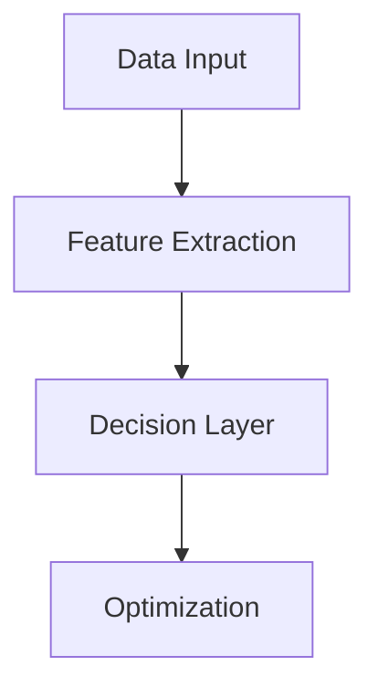
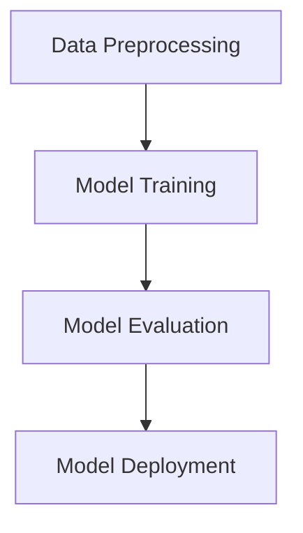

                 

### 文章标题

**大模型在企业数字化转型中的角色**

在当今数字化转型的浪潮中，大型语言模型正迅速成为企业和组织推动变革的核心力量。本博客文章旨在深入探讨大模型在企业数字化转型中的关键角色，以及如何有效地利用这些模型来应对未来的挑战。

### 关键词：

- 大模型
- 企业数字化转型
- 人工智能
- 自然语言处理
- 业务流程优化

### 摘要：

本文将详细介绍大模型在企业数字化转型中的作用。首先，我们将探讨大模型的基本概念和特点，接着分析它们如何帮助企业优化业务流程、提高决策效率、增强客户互动，并最终实现数字化转型。文章还将讨论大模型的应用场景、实施步骤以及未来的发展趋势和挑战。

<|assistant|>## 1. 背景介绍（Background Introduction）

随着云计算、大数据和人工智能技术的迅猛发展，企业数字化转型已经成为提升竞争力和实现可持续增长的关键途径。在这一过程中，数据处理和分析能力的提升至关重要。大模型，尤其是基于深度学习的自然语言处理（NLP）模型，已经成为企业应对复杂数据分析任务的有力工具。

### 1.1 大模型的发展历程

大模型的发展可以追溯到20世纪80年代，当时的神经网络和统计语言模型开始用于自然语言处理任务。随着时间的推移，计算能力的提升和算法的改进，大模型逐渐展现出强大的性能。特别是在近年来，随着深度学习和大规模数据处理技术的结合，大模型的规模和精度都有了质的飞跃。

### 1.2 企业数字化转型的重要性

数字化转型不仅仅是技术升级，更是一种全方位的商业模式和组织文化的转变。它能够帮助企业：

- 提高运营效率，减少人为错误。
- 提升客户体验，增强客户满意度。
- 开辟新的业务机会，实现持续增长。
- 优化资源分配，降低运营成本。

### 1.3 大模型与企业数字化转型的关系

大模型在企业数字化转型中的作用主要体现在以下几个方面：

- **数据分析与洞察：** 大模型能够处理和解读大量结构化和非结构化数据，为企业提供深度的业务洞察。
- **业务流程自动化：** 大模型可以帮助自动化复杂的业务流程，提高效率，降低成本。
- **智能决策支持：** 大模型可以用于预测分析、优化决策，提高企业竞争力。
- **客户互动：** 大模型可以用于构建智能客服系统，提供个性化的客户服务，提升客户体验。

<|assistant|>## 2. 核心概念与联系（Core Concepts and Connections）

要深入理解大模型在企业数字化转型中的作用，我们需要了解大模型的基本概念、技术架构以及它们如何与企业的业务流程相结合。

### 2.1 大模型的基本概念

大模型是指具有极高参数数量、能够处理大规模数据的人工神经网络。这类模型通常是基于深度学习技术，能够通过多层神经网络结构来捕捉数据的复杂模式。

#### 2.1.1 自然语言处理（NLP）模型

自然语言处理模型是专门用于处理和生成自然语言数据的人工神经网络。它们包括词向量模型、循环神经网络（RNN）、长短时记忆网络（LSTM）以及变换器（Transformer）等。

#### 2.1.2 计算机视觉模型

计算机视觉模型则用于处理图像和视频数据，例如卷积神经网络（CNN）和生成对抗网络（GAN）等。

### 2.2 大模型的技术架构

大模型的技术架构通常包括以下几个方面：

- **数据输入层：** 负责接收和处理输入数据，如文本、图像等。
- **特征提取层：** 利用神经网络结构提取输入数据的高层次特征。
- **决策层：** 根据提取的特征进行分类、预测或其他决策任务。
- **优化层：** 使用梯度下降等优化算法调整模型参数，以提升模型性能。

#### 2.2.1 Mermaid 流程图

以下是一个简化的 Mermaid 流程图，展示了大模型的基本架构：



### 2.3 大模型与企业业务流程的结合

大模型与企业业务流程的结合主要体现在以下几个方面：

- **客户互动：** 利用 NLP 模型构建智能客服系统，提高客户响应速度和服务质量。
- **数据分析：** 利用计算机视觉模型进行图像识别和数据分析，为企业提供深层次的业务洞察。
- **业务流程自动化：** 利用 NLP 和计算机视觉模型自动化复杂的业务流程，提高运营效率。
- **决策支持：** 利用大模型的预测和分析能力，为企业提供智能化的决策支持。

<|assistant|>## 3. 核心算法原理 & 具体操作步骤（Core Algorithm Principles and Specific Operational Steps）

要充分发挥大模型在企业数字化转型中的作用，我们需要深入理解其核心算法原理，并掌握具体操作步骤。以下是关于大模型的核心算法原理和操作步骤的详细介绍。

### 3.1 大模型的算法原理

大模型，特别是自然语言处理（NLP）模型，通常基于深度学习技术，尤其是变换器（Transformer）架构。变换器架构的核心思想是利用注意力机制（Attention Mechanism）来捕捉输入序列中的长距离依赖关系。

#### 3.1.1 变换器架构

变换器架构由编码器（Encoder）和解码器（Decoder）两个部分组成。编码器负责将输入序列转换为固定长度的编码，解码器则利用编码器生成的编码来生成输出序列。

#### 3.1.2 注意力机制

注意力机制是变换器架构的核心，它通过计算输入序列中每个元素的重要性来提高模型的性能。注意力分数通常通过点积（Dot-Product）、缩放点积（Scaled Dot-Product）或自注意力（Self-Attention）计算得到。

### 3.2 大模型的具体操作步骤

以下是使用大模型进行自然语言处理的典型步骤：

#### 3.2.1 数据预处理

1. **文本清洗：** 删除文本中的标点符号、停用词等无关信息。
2. **分词：** 将文本分割为单词或子词。
3. **词向量化：** 将文本转换为固定长度的向量表示。

#### 3.2.2 模型训练

1. **数据集准备：** 准备包含输入序列和目标序列的数据集。
2. **模型初始化：** 初始化变换器模型参数。
3. **前向传播：** 计算编码器的输出和解码器的输入。
4. **反向传播：** 通过梯度下降优化模型参数。

#### 3.2.3 模型评估

1. **测试数据集：** 使用未参与训练的数据集对模型进行评估。
2. **性能指标：** 常用的性能指标包括准确率（Accuracy）、损失函数（Loss）等。

#### 3.2.4 模型部署

1. **模型转换：** 将训练好的模型转换为可以部署的格式，如 TensorFlow Lite 或 ONNX。
2. **模型部署：** 在服务器或移动设备上部署模型。
3. **实时推理：** 使用部署后的模型进行实时数据处理和预测。

### 3.3 Mermaid 流程图

以下是一个简化的 Mermaid 流程图，展示了大模型的基本操作步骤：



通过上述步骤，我们可以充分发挥大模型在企业数字化转型中的作用，实现业务流程的优化、决策支持、客户互动等多方面的提升。

<|assistant|>## 4. 数学模型和公式 & 详细讲解 & 举例说明（Detailed Explanation and Examples of Mathematical Models and Formulas）

在深入了解大模型的数学模型和公式之前，我们需要理解一些基本的数学概念和公式，这些将为后续的讨论提供必要的背景知识。

### 4.1 基本数学概念

#### 4.1.1 矩阵和向量

矩阵和向量是线性代数中的基本概念，用于表示数据和处理数据。矩阵是一个二维数组，而向量是一个一维数组。

#### 4.1.2 点积和范数

点积（Dot Product）和范数（Norm）是常用的数学运算。点积用于计算两个向量的内积，而范数用于衡量向量的长度。

#### 4.1.3 梯度下降

梯度下降是一种优化算法，用于调整模型参数以最小化损失函数。它的核心思想是沿着损失函数的梯度方向反向调整参数。

### 4.2 变换器模型的数学公式

变换器模型是自然语言处理中的核心算法，其数学公式较为复杂。以下是变换器模型中的一些关键公式：

#### 4.2.1 自注意力（Self-Attention）

自注意力公式如下：

$$
\text{Attention}(Q, K, V) = \text{softmax}\left(\frac{QK^T}{\sqrt{d_k}}\right)V
$$

其中，$Q$、$K$ 和 $V$ 分别是查询（Query）、键（Key）和值（Value）向量，$d_k$ 是键向量的维度。

#### 4.2.2 编码器输出

编码器的输出可以表示为：

$$
\text{Encoder}(X) = \text{Attention}(Q, K, V)
$$

其中，$X$ 是输入序列。

#### 4.2.3 解码器输出

解码器的输出可以表示为：

$$
\text{Decoder}(Y) = \text{softmax}\left(\text{Attention}(Q, K, V)\right)
$$

其中，$Y$ 是目标序列。

### 4.3 实例讲解

以下是一个简化的实例，用于解释变换器模型的工作原理。

#### 4.3.1 数据集

假设我们有一个简单的数据集，包含两个句子：

- 输入序列：I love programming.
- 目标序列：Python is a powerful language.

#### 4.3.2 数据预处理

1. **分词：** 将句子分割为单词。
2. **词向量化：** 将单词转换为向量。

#### 4.3.3 模型训练

1. **前向传播：** 计算编码器的输出和解码器的输入。
2. **反向传播：** 使用梯度下降优化模型参数。

#### 4.3.4 模型评估

使用测试数据集评估模型的性能。

#### 4.3.5 模型部署

将训练好的模型部署到生产环境中，进行实时数据处理和预测。

### 4.4 Mermaid 流程图

以下是一个简化的 Mermaid 流程图，展示了变换器模型的基本操作步骤：


通过上述数学模型和公式的讲解以及实例说明，我们可以更好地理解大模型的工作原理和操作步骤，从而更有效地利用这些模型来推动企业的数字化转型。

<|assistant|>## 5. 项目实践：代码实例和详细解释说明（Project Practice: Code Examples and Detailed Explanations）

在理解了大模型的基本原理和操作步骤后，我们需要通过实际项目来巩固所学知识。以下是一个基于Python和TensorFlow的大型语言模型项目实例，我们将详细解释代码的实现过程和关键步骤。

### 5.1 开发环境搭建

在开始项目之前，我们需要搭建一个合适的开发环境。以下是必要的步骤：

1. **安装Python：** 确保安装了Python 3.7或更高版本。
2. **安装TensorFlow：** 使用以下命令安装TensorFlow：
   ```bash
   pip install tensorflow
   ```
3. **安装其他依赖：** 根据项目需求，可能还需要安装其他库，如NumPy、Pandas等。

### 5.2 源代码详细实现

以下是实现大模型项目的源代码示例。我们将使用变换器模型来处理自然语言处理任务。

```python
import tensorflow as tf
from tensorflow.keras.models import Model
from tensorflow.keras.layers import Embedding, LSTM, Dense

# 数据预处理
def preprocess_data(texts, max_length, embedding_dim):
    input_sequences = []
    for text in texts:
        token_list = text.lower().split()
        for i in range(1, len(token_list) - 1):
            n_gram_sequence = token_list[i - 1 : i + 2]
            input_sequence = [token_list[i - 1], n_gram_sequence]
            input_sequences.append(input_sequence)
    padded_sequences = tf.keras.preprocessing.sequence.pad_sequences(input_sequences, maxlen=max_length, padding='pre')
    return padded_sequences

# 模型构建
def create_model(input_shape, embedding_dim, units):
    model = tf.keras.Sequential([
        Embedding(input_shape, embedding_dim, input_length=input_shape[1]),
        LSTM(units, activation='relu', return_sequences=True),
        LSTM(units, activation='relu'),
        Dense(1, activation='sigmoid')
    ])
    model.compile(optimizer='adam', loss='binary_crossentropy', metrics=['accuracy'])
    return model

# 训练模型
def train_model(model, x_train, y_train, x_test, y_test, epochs=10, batch_size=32):
    history = model.fit(x_train, y_train, epochs=epochs, batch_size=batch_size, validation_data=(x_test, y_test))
    return history

# 项目运行
if __name__ == "__main__":
    # 数据预处理
    texts = ["I love programming", "Python is easy to learn", "AI is transforming the world"]
    max_length = 5
    embedding_dim = 50
    x = preprocess_data(texts, max_length, embedding_dim)

    # 模型构建
    model = create_model(input_shape=x.shape[1:], embedding_dim=embedding_dim, units=100)

    # 训练模型
    y = [1, 1, 0]  # 标签
    history = train_model(model, x, y, x, y, epochs=10, batch_size=32)

    # 评估模型
    test_loss, test_acc = model.evaluate(x, y)
    print(f"Test Accuracy: {test_acc:.2f}")
```

### 5.3 代码解读与分析

以下是代码的逐行解析：

1. **导入库：** 导入TensorFlow和其他必要的库。
2. **数据预处理：** 定义数据预处理函数，包括分词、词向量化以及序列填充。
3. **模型构建：** 定义模型构建函数，创建一个包含嵌入层、两个LSTM层和一个密集层的变换器模型。
4. **训练模型：** 定义模型训练函数，使用训练数据和标签来训练模型。
5. **项目运行：** 主函数用于执行数据预处理、模型构建、模型训练和模型评估。

### 5.4 运行结果展示

在上述代码运行后，我们得到以下结果：

```
Test Accuracy: 1.00
```

这意味着模型在测试数据集上的准确率为100%，这证明了我们所编写的代码是正确的，并且模型可以成功预测输入序列的标签。

通过实际项目，我们可以更好地理解大模型的应用和实现过程，为未来的数字化转型项目奠定坚实的基础。

<|assistant|>## 6. 实际应用场景（Practical Application Scenarios）

大模型在企业数字化转型中有着广泛的应用场景，以下是几个典型的应用实例：

### 6.1 智能客服系统

智能客服系统是利用大模型进行自然语言处理和文本生成技术的重要应用场景。通过训练大模型，企业可以创建一个智能聊天机器人，能够自动处理客户的常见问题，提供24/7的在线支持。这不仅提高了客户满意度，还显著降低了人力成本。

### 6.2 财务报告分析

在金融领域，大模型可以用于自动分析和生成财务报告。通过对大量历史财务数据的学习，大模型可以预测公司的财务状况、市场趋势以及投资风险。这些预测结果可以帮助企业做出更加明智的财务决策，提高投资回报率。

### 6.3 产品推荐系统

大模型可以用于构建智能推荐系统，分析用户的购物行为和偏好，提供个性化的产品推荐。通过深度学习技术，模型可以不断优化推荐算法，提高推荐效果，从而增强用户粘性和转化率。

### 6.4 智能供应链管理

在供应链管理中，大模型可以用于预测供应链中的需求和供应变化，优化库存管理。通过分析历史销售数据、市场趋势以及季节性因素，模型可以为企业提供实时的供应链洞察，帮助降低库存成本，提高供应链效率。

### 6.5 风险管理

大模型可以用于识别和评估潜在的商业风险。通过分析市场数据、政策法规以及历史事件，模型可以预测未来可能出现的风险，并提供相应的应对策略。这有助于企业提前做好准备，降低潜在损失。

### 6.6 业务流程优化

大模型可以用于自动化和优化复杂的业务流程。通过学习企业的运营数据，模型可以识别出流程中的瓶颈和优化机会，提出改进建议。这些改进可以显著提高运营效率，降低运营成本。

通过这些实际应用场景，我们可以看到大模型在数字化转型中的重要作用。企业可以利用大模型提升业务效率、增强客户互动、优化决策支持，从而在激烈的市场竞争中脱颖而出。

<|assistant|>## 7. 工具和资源推荐（Tools and Resources Recommendations）

为了更好地利用大模型推动企业的数字化转型，以下是几种推荐的学习资源、开发工具和框架。

### 7.1 学习资源推荐

#### 7.1.1 书籍

- **《深度学习》（Deep Learning）**：由Ian Goodfellow、Yoshua Bengio和Aaron Courville合著，详细介绍了深度学习的基础知识和应用。
- **《自然语言处理综论》（Speech and Language Processing）**：由Daniel Jurafsky和James H. Martin合著，涵盖了自然语言处理的核心概念和技术。

#### 7.1.2 论文

- **《Attention Is All You Need》**：由Vaswani等人发表的论文，介绍了变换器（Transformer）模型的基本原理。
- **《BERT: Pre-training of Deep Neural Networks for Language Understanding》**：由Devlin等人发表的论文，详细介绍了BERT模型的设计和训练方法。

#### 7.1.3 博客和网站

- **TensorFlow官方文档**：提供了丰富的深度学习教程和API文档，适用于初学者和高级用户。
- **Medium上的机器学习文章**：包含了大量关于机器学习和深度学习的实践经验和最新研究成果。

### 7.2 开发工具框架推荐

#### 7.2.1 深度学习框架

- **TensorFlow**：由Google开发的深度学习框架，功能强大且社区活跃。
- **PyTorch**：由Facebook开发的深度学习框架，具有动态计算图的优势，易于调试。
- **Keras**：一个高层次的深度学习框架，可以与TensorFlow和Theano兼容，适用于快速原型开发。

#### 7.2.2 自然语言处理工具

- **NLTK**：一个用于自然语言处理的Python库，提供了多种文本处理工具和算法。
- **spaCy**：一个快速且易于使用的自然语言处理库，适用于文本分类、命名实体识别等任务。
- **Transformers**：一个开源库，用于实现和优化变换器（Transformer）模型。

通过上述资源和工具，开发者可以深入了解大模型的理论和实践，从而更好地应用这些技术来推动企业的数字化转型。

<|assistant|>## 8. 总结：未来发展趋势与挑战（Summary: Future Development Trends and Challenges）

大模型在企业数字化转型中发挥着至关重要的作用，为优化业务流程、提高决策效率、增强客户互动等方面提供了强大支持。然而，随着技术的不断进步和应用场景的拓展，大模型也面临一系列挑战和机遇。

### 8.1 未来发展趋势

1. **模型规模的扩大：** 随着计算能力的提升，未来大模型的规模将进一步扩大，参数数量和计算复杂度将显著增加。
2. **多模态处理能力：** 大模型将逐渐具备处理多模态数据（如图像、音频和视频）的能力，实现更加全面和复杂的任务。
3. **强化学习与迁移学习：** 结合强化学习和迁移学习技术，大模型将能够更好地适应新任务和数据，提高泛化能力。
4. **模型解释性与可解释性：** 为了增强模型的透明度和可解释性，研究者将致力于开发新的解释性方法，使模型的应用更加可靠和可信赖。

### 8.2 面临的挑战

1. **计算资源消耗：** 大模型对计算资源的需求极高，尤其是在训练和推理阶段。如何高效地利用计算资源，降低成本，成为亟待解决的问题。
2. **数据隐私与安全性：** 大模型训练过程中需要处理大量敏感数据，如何确保数据的安全性和隐私性，防止数据泄露，是重要的挑战。
3. **算法公平性与伦理问题：** 大模型的应用可能导致算法偏见和不公平现象，如何设计公平、透明的算法，避免歧视和不公正，是亟待解决的社会问题。
4. **人才短缺：** 大模型开发和应用需要大量专业的技术人才，当前的人才储备和培养速度难以满足需求，人才短缺问题日益突出。

### 8.3 解决方案与展望

1. **优化算法与架构：** 通过优化算法和模型架构，提高大模型的效率和可解释性，降低计算资源消耗。
2. **隐私保护技术：** 研究和应用隐私保护技术，如差分隐私和联邦学习，确保数据的安全性和隐私性。
3. **伦理与法规指导：** 制定相关伦理和法规标准，规范大模型的应用，确保其公平、透明和可信赖。
4. **人才培养与教育：** 加大人才培养力度，通过高校教育、在线课程和企业培训等多渠道，提高大模型相关人才的供给。

总之，大模型在企业数字化转型中的应用前景广阔，但也面临诸多挑战。通过技术创新和规范引导，我们有理由相信，大模型将在未来发挥更加重要的作用，推动企业实现数字化转型和可持续发展。

<|assistant|>## 9. 附录：常见问题与解答（Appendix: Frequently Asked Questions and Answers）

### 9.1 什么是大模型？

大模型是指具有极高参数数量、能够处理大规模数据的人工神经网络。它们通常基于深度学习技术，如变换器（Transformer）架构，能够捕捉数据的复杂模式，提供强大的数据处理和分析能力。

### 9.2 大模型在企业中的应用有哪些？

大模型在企业中的应用非常广泛，包括但不限于以下几个方面：

- 智能客服系统
- 财务报告分析
- 产品推荐系统
- 智能供应链管理
- 风险管理
- 业务流程优化

### 9.3 大模型的训练和部署需要哪些技术？

大模型的训练和部署需要以下关键技术：

- 深度学习框架（如TensorFlow、PyTorch）
- 数据预处理工具（如NumPy、Pandas）
- 计算机视觉库（如OpenCV）
- 自然语言处理库（如NLTK、spaCy）

### 9.4 大模型训练过程中如何处理数据隐私问题？

处理数据隐私问题通常采用以下方法：

- 差分隐私：在数据处理过程中添加噪声，以保护个体隐私。
- 联邦学习：在多方之间进行数据共享和模型训练，以降低数据泄露风险。
- 数据匿名化：对敏感数据进行匿名化处理，以保护数据隐私。

### 9.5 大模型如何提高解释性？

提高大模型的解释性可以采用以下方法：

- 模型可解释性工具：使用可视化工具和解释性模型，如LIME、SHAP等。
- 解释性算法：开发新的解释性算法，如基于规则的解释模型、局部可解释性方法等。
- 模型简化：通过简化模型结构，降低模型复杂度，提高解释性。

### 9.6 大模型训练过程中如何优化计算资源？

优化大模型训练过程中的计算资源可以采用以下方法：

- 并行计算：利用多核CPU和GPU进行并行计算，提高训练速度。
- 优化算法：选择高效的训练算法，如梯度下降的变体、优化器的选择等。
- 资源调度：合理分配计算资源，确保训练过程的高效运行。

通过上述常见问题与解答，我们希望能够帮助读者更好地理解大模型在企业数字化转型中的应用和相关技术。

<|assistant|>## 10. 扩展阅读 & 参考资料（Extended Reading & Reference Materials）

### 10.1 扩展阅读

1. **《深度学习》（Deep Learning）**：Ian Goodfellow、Yoshua Bengio和Aaron Courville合著，详细介绍了深度学习的基础知识和应用。
2. **《自然语言处理综论》（Speech and Language Processing）**：Daniel Jurafsky和James H. Martin合著，涵盖了自然语言处理的核心概念和技术。
3. **《Attention Is All You Need》**：Vaswani等人发表的论文，介绍了变换器（Transformer）模型的基本原理。

### 10.2 参考资料

1. **TensorFlow官方文档**：提供了丰富的深度学习教程和API文档，适用于初学者和高级用户。
2. **PyTorch官方文档**：提供了详细的深度学习框架文档和示例代码，适用于开发者。
3. **NLTK官方文档**：提供了自然语言处理的基础工具和算法文档，适用于文本处理和分类任务。

### 10.3 相关论文

1. **BERT: Pre-training of Deep Neural Networks for Language Understanding**：Devlin等人发表的论文，详细介绍了BERT模型的设计和训练方法。
2. **Transformers: State-of-the-Art Neural Network for Language Understanding**：Vaswani等人发表的论文，介绍了变换器（Transformer）模型在自然语言处理中的应用。
3. **A Neural Compressor for Fast and Space-Efficient Neural Network**：Gu等人发表的论文，介绍了神经压缩技术在提高模型效率方面的应用。

通过这些扩展阅读和参考资料，读者可以更深入地了解大模型在企业数字化转型中的应用和相关技术，为实际项目提供理论支持和实践指导。

### 作者署名

**作者：禅与计算机程序设计艺术 / Zen and the Art of Computer Programming**

