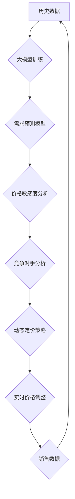

                 

## 大模型在动态定价中的应用

> 关键词：大模型、动态定价、机器学习、预测模型、价格优化、需求预测、市场分析、算法

## 1. 背景介绍

在当今数据爆炸的时代，企业面临着越来越复杂的市场环境和竞争压力。传统的定价策略往往难以适应瞬息万变的市场需求，导致定价决策缺乏灵活性，无法最大化利润。动态定价，即根据实时市场数据和用户行为进行价格调整，逐渐成为企业优化定价策略的重要手段。

大模型，作为近年来人工智能领域取得的重大突破，拥有强大的数据处理和模式识别能力，为动态定价提供了新的可能性。大模型可以学习海量历史数据，识别复杂的市场趋势和用户偏好，并根据这些 insights 建立精准的预测模型，从而帮助企业制定更灵活、更有效的动态定价策略。

## 2. 核心概念与联系

### 2.1 动态定价的概念

动态定价是指根据实时市场信息和用户行为，对商品或服务的定价进行动态调整的策略。其核心目标是根据市场供需关系、竞争对手价格、用户需求等因素，实时优化价格，以最大化利润。

### 2.2 大模型的概念

大模型是指参数规模庞大、训练数据海量的人工智能模型。它们通常基于 Transformer 架构，拥有强大的语言理解和生成能力，能够处理复杂的任务，例如文本分类、机器翻译、代码生成等。

### 2.3 动态定价与大模型的联系

大模型可以为动态定价提供以下关键支持：

* **需求预测:** 大模型可以学习历史销售数据、市场趋势、用户行为等信息，构建精准的需求预测模型，帮助企业预测未来产品的需求量。
* **价格敏感度分析:** 大模型可以分析用户对不同价格点反应的敏感度，帮助企业确定最佳的定价策略。
* **竞争对手分析:** 大模型可以收集和分析竞争对手的定价策略，帮助企业制定更具竞争力的价格。
* **个性化定价:** 大模型可以根据用户的个人特征、购买历史、行为偏好等信息，提供个性化的价格推荐。

**Mermaid 流程图**



## 3. 核心算法原理 & 具体操作步骤

### 3.1 算法原理概述

大模型在动态定价中的应用主要基于以下核心算法：

* **机器学习算法:** 用于训练预测模型，例如线性回归、逻辑回归、决策树、支持向量机、神经网络等。
* **时间序列分析算法:** 用于分析历史数据中的时间趋势，预测未来需求。
* **优化算法:** 用于根据预测结果和市场条件，优化定价策略。

### 3.2 算法步骤详解

1. **数据收集:** 收集历史销售数据、市场价格数据、用户行为数据等相关信息。
2. **数据预处理:** 对收集到的数据进行清洗、转换、特征工程等处理，使其适合模型训练。
3. **模型训练:** 使用机器学习算法训练预测模型，例如需求预测模型、价格敏感度分析模型等。
4. **模型评估:** 使用测试数据评估模型的性能，并进行模型调优。
5. **定价策略制定:** 根据预测结果和市场条件，制定动态定价策略，例如根据需求量调整价格、根据竞争对手价格进行调整等。
6. **实时价格调整:** 实时监控市场数据和用户行为，根据动态定价策略进行价格调整。
7. **效果评估:** 定期评估动态定价策略的效果，并进行策略优化。

### 3.3 算法优缺点

**优点:**

* **精准预测:** 大模型可以学习复杂的市场趋势和用户偏好，提供更精准的需求预测和价格敏感度分析。
* **灵活性强:** 动态定价策略可以根据实时市场变化进行调整，提高企业的适应能力。
* **利润最大化:** 通过优化定价策略，可以最大化企业的利润。

**缺点:**

* **数据依赖:** 大模型的性能依赖于训练数据的质量和数量。
* **计算资源消耗:** 训练大模型需要大量的计算资源。
* **解释性差:** 大模型的决策过程往往难以解释，这可能导致企业难以理解和信任模型的预测结果。

### 3.4 算法应用领域

大模型在动态定价中的应用领域广泛，包括：

* **电商平台:** 根据商品需求、用户行为、竞争对手价格等因素，动态调整商品价格。
* **旅游行业:** 根据航班、酒店、旅游线路的供需情况，动态调整价格。
* **金融行业:** 根据市场利率、汇率、风险偏好等因素，动态调整贷款利率、保险费率等。
* **能源行业:** 根据能源供需情况、天气预报等因素，动态调整能源价格。

## 4. 数学模型和公式 & 详细讲解 & 举例说明

### 4.1 数学模型构建

动态定价模型通常基于以下数学模型：

* **需求预测模型:** 使用回归分析、时间序列分析等方法，建立预测未来需求量的模型。
* **价格敏感度模型:** 使用弹性分析、logit 模型等方法，分析用户对不同价格点反应的敏感度。
* **利润最大化模型:** 使用优化算法，根据需求预测、价格敏感度分析等信息，优化定价策略以最大化利润。

### 4.2 公式推导过程

**需求预测模型:**

假设需求量 $Q$ 与价格 $P$ 之间存在线性关系，则可以建立以下需求预测模型:

$$Q = a - bP$$

其中，$a$ 是需求量在价格为0时的水平，$b$ 是价格对需求量的敏感度。

**价格敏感度模型:**

价格弹性 $E$ 定义为价格变化对需求量变化的百分比比值:

$$E = \frac{\% \Delta Q}{\% \Delta P}$$

根据价格弹性，可以判断用户对价格的敏感度。

* 当 $E > 1$ 时，需求量对价格变化较为敏感，称为弹性需求。
* 当 $E < 1$ 时，需求量对价格变化不敏感，称为非弹性需求。
* 当 $E = 1$ 时，需求量对价格变化敏感度为1，称为单位弹性需求。

**利润最大化模型:**

企业利润 $π$ 可以表示为：

$$π = P \cdot Q - C$$

其中，$C$ 是生产成本。

通过优化 $P$ 和 $Q$ 的关系，可以最大化利润。

### 4.3 案例分析与讲解

假设一家电商平台销售一款商品，其历史销售数据如下：

| 价格 (元) | 销量 (件) |
|---|---|
| 100 | 1000 |
| 90 | 1200 |
| 80 | 1500 |
| 70 | 1800 |

可以使用线性回归模型建立需求预测模型，并根据价格弹性分析用户对价格的敏感度。

通过分析模型结果，可以制定动态定价策略，例如根据销量变化调整价格，以最大化利润。

## 5. 项目实践：代码实例和详细解释说明

### 5.1 开发环境搭建

* Python 3.x
* TensorFlow 或 PyTorch
* Jupyter Notebook 或 VS Code

### 5.2 源代码详细实现

```python
import pandas as pd
from sklearn.linear_model import LinearRegression

# 载入历史销售数据
data = pd.read_csv('sales_data.csv')

# 将价格作为自变量，销量作为因变量
X = data[['Price']]
y = data['Sales']

# 创建线性回归模型
model = LinearRegression()

# 训练模型
model.fit(X, y)

# 预测未来销量
future_price = 60
future_sales = model.predict([[future_price]])

# 打印预测结果
print(f'未来价格为 {future_price} 元时，预计销量为 {future_sales[0]} 件')
```

### 5.3 代码解读与分析

* 首先，使用 pandas 库读取历史销售数据。
* 然后，将价格作为自变量，销量作为因变量，并创建线性回归模型。
* 使用 `model.fit()` 方法训练模型，使其能够学习价格与销量的关系。
* 最后，使用 `model.predict()` 方法预测未来销量。

### 5.4 运行结果展示

运行上述代码后，将输出未来价格为 60 元时，预计销量的预测结果。

## 6. 实际应用场景

### 6.1 电商平台

电商平台可以根据商品的实时库存、用户浏览量、竞争对手价格等信息，动态调整商品价格，以提高转化率和利润。

### 6.2 旅游行业

旅游平台可以根据航班、酒店、旅游线路的供需情况，以及用户预订偏好，动态调整价格，以优化资源配置和提高收益。

### 6.3 金融行业

金融机构可以根据市场利率、汇率、风险偏好等因素，动态调整贷款利率、保险费率等，以降低风险和提高盈利能力。

### 6.4 未来应用展望

随着大模型技术的不断发展，动态定价将在更多领域得到应用，例如：

* **个性化定价:** 根据用户的个人特征、购买历史、行为偏好等信息，提供个性化的价格推荐。
* **动态广告投放:** 根据用户的兴趣爱好、浏览行为等信息，动态调整广告价格，提高广告投放效率。
* **智能合约:** 利用智能合约技术，实现自动化的动态定价机制。

## 7. 工具和资源推荐

### 7.1 学习资源推荐

* **书籍:**
    * 《深度学习》
    * 《自然语言处理》
    * 《机器学习实战》
* **在线课程:**
    * Coursera
    * edX
    * Udacity

### 7.2 开发工具推荐

* **Python:** 
    * TensorFlow
    * PyTorch
    * scikit-learn
* **云平台:**
    * AWS
    * Azure
    * Google Cloud

### 7.3 相关论文推荐

* **Attention Is All You Need:** https://arxiv.org/abs/1706.03762
* **BERT: Pre-training of Deep Bidirectional Transformers for Language Understanding:** https://arxiv.org/abs/1810.04805
* **Generative Pre-trained Transformer 3 (GPT-3):** https://openai.com/blog/gpt-3/

## 8. 总结：未来发展趋势与挑战

### 8.1 研究成果总结

大模型在动态定价领域取得了显著的成果，能够提供更精准的预测和更灵活的策略，帮助企业提高利润和竞争力。

### 8.2 未来发展趋势

* **模型规模和能力的提升:** 未来大模型的规模和能力将进一步提升，能够处理更复杂的数据和任务。
* **解释性模型的开发:** 研究更具解释性的动态定价模型，帮助企业更好地理解模型的决策过程。
* **个性化定价的应用:** 利用大模型技术，实现更精准的个性化定价，满足不同用户的需求。

### 8.3 面临的挑战

* **数据质量和隐私问题:** 大模型的性能依赖于训练数据的质量，而数据隐私问题也需要得到妥善解决。
* **计算资源消耗:** 训练大模型需要大量的计算资源，这对于中小企业来说可能是一个挑战。
* **模型可解释性和信任度:** 大模型的决策过程往往难以解释，这可能导致企业难以理解和信任模型的预测结果。

### 8.4 研究展望

未来研究将重点关注以下几个方面:

* 开发更鲁棒、更可解释的动态定价模型。
* 研究大模型在动态定价中的伦理和社会影响。
* 探索大模型与其他技术的结合，例如区块链技术、物联网技术等，以实现更智能、更安全的动态定价机制。

## 9. 附录：常见问题与解答

**Q1: 大模型的训练需要多少数据？**

A1: 大模型的训练数据量通常非常庞大，可能需要数百万甚至数十亿条数据。

**Q2: 大模型的训练需要多少计算资源？**

A2: 大模型的训练需要大量的计算资源，通常需要使用高性能计算集群。

**Q3: 大模型的预测结果是否准确？**

A3: 大模型的预测结果的准确性取决于训练数据的质量和模型的复杂度。

**Q4: 如何评估大模型的性能？**

A4: 可以使用各种指标来评估大模型的性能，例如准确率、召回率、F1-score等。

**Q5: 大模型的应用场景有哪些？**

A5: 大模型的应用场景非常广泛，包括自然语言处理、计算机视觉、语音识别、机器翻译等。


作者：禅与计算机程序设计艺术 / Zen and the Art of Computer Programming 
<end_of_turn>

