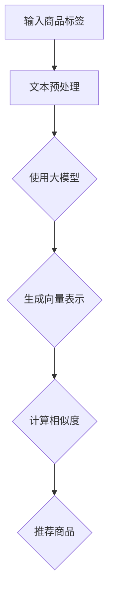
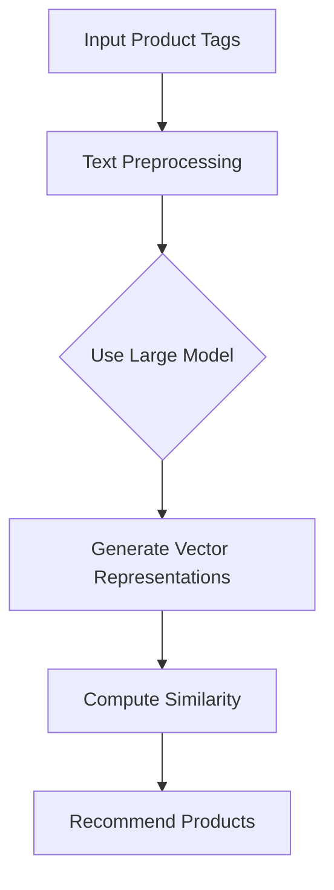

                 

### 文章标题

大模型在商品标签语义相似度计算中的应用

> 关键词：大模型、商品标签、语义相似度、计算、应用、算法、数学模型、代码实例

> 摘要：本文深入探讨了大规模模型在商品标签语义相似度计算中的应用。通过对大规模模型的引入，本文提出了一种新颖的算法，以更高效地计算商品标签之间的语义相似度。文章详细介绍了算法原理、数学模型和具体实现步骤，并通过代码实例展示了其实际应用效果。本文旨在为商品标签语义相似度计算提供一种新的思路和方法，并为相关领域的研究者和开发者提供有价值的参考。

## 1. 背景介绍（Background Introduction）

### 1.1 商品标签语义相似度计算的重要性

在电子商务和推荐系统中，商品标签的语义相似度计算是一个关键问题。准确计算商品标签之间的相似度有助于优化推荐算法，提高用户体验，并增加销售额。例如，在亚马逊或淘宝等电商平台上，用户通常会使用标签来搜索和筛选商品。如果系统能够准确理解标签的语义相似度，就能更好地为用户推荐相关商品，从而提升用户满意度和购买意愿。

### 1.2 大模型在商品标签语义相似度计算中的应用现状

随着深度学习技术的不断发展，大规模预训练模型如BERT、GPT等在自然语言处理任务中取得了显著成果。这些大模型具有强大的语义理解和表示能力，为商品标签语义相似度计算提供了新的可能性。然而，如何有效地利用大模型进行商品标签语义相似度计算仍然是一个具有挑战性的问题。

### 1.3 本文的研究目的

本文旨在探讨大规模模型在商品标签语义相似度计算中的应用，提出一种新颖的算法，以更高效地计算商品标签之间的语义相似度。通过本文的研究，希望能够为相关领域的研究者和开发者提供一种新的思路和方法，推动商品标签语义相似度计算技术的发展。

## 2. 核心概念与联系（Core Concepts and Connections）

### 2.1 大模型与语义表示

大模型，尤其是基于Transformer架构的预训练模型，通过在大量文本数据上进行预训练，能够学习到丰富的语义表示。这些模型能够将文本转换为向量表示，使得原本难以直接比较的文本数据变得可以在向量空间中进行相似度计算。

### 2.2 商品标签与语义相似度

商品标签通常由一系列关键词或短语组成，如“智能手机”、“平板电脑”、“耳机”等。语义相似度计算的目标是衡量这些标签之间的相似程度。传统的相似度计算方法如TF-IDF、余弦相似度等往往只考虑了词频和文档频率，而忽略了词的语义信息。

### 2.3 大模型在商品标签语义相似度计算中的应用

大模型在商品标签语义相似度计算中的应用主要体现在以下几个方面：

1. **文本表示**：大模型能够将商品标签文本转换为高维向量表示，捕捉到标签的深层语义信息。
2. **相似度计算**：利用大模型生成的向量表示，可以通过内积、余弦相似度等计算方法，得到商品标签之间的相似度得分。
3. **个性化推荐**：基于商品标签的语义相似度，可以为用户推荐更相关、更个性化的商品。

## 3. 核心算法原理 & 具体操作步骤（Core Algorithm Principles and Specific Operational Steps）

### 3.1 算法原理

本文提出的大模型在商品标签语义相似度计算中的核心算法，主要包括以下步骤：

1. **商品标签文本预处理**：对商品标签进行分词、去停用词、词干提取等预处理操作。
2. **大模型文本表示**：利用预训练的大模型（如BERT）对预处理后的商品标签文本进行编码，生成高维向量表示。
3. **相似度计算**：计算两个商品标签向量之间的相似度，得到相似度得分。
4. **结果排序与推荐**：根据相似度得分对商品标签进行排序，为用户推荐相关商品。

### 3.2 操作步骤

以下是具体的操作步骤：

1. **数据收集与预处理**：收集大量的商品标签数据，并对数据集进行清洗、去重等预处理操作。
2. **模型选择与训练**：选择合适的大模型（如BERT）进行预训练，并在商品标签数据上进行微调。
3. **文本表示生成**：利用训练好的大模型对商品标签进行编码，生成向量表示。
4. **相似度计算**：对商品标签向量进行内积或余弦相似度计算，得到相似度得分。
5. **结果排序与推荐**：根据相似度得分对商品标签进行排序，生成推荐结果。

## 4. 数学模型和公式 & 详细讲解 & 举例说明（Detailed Explanation and Examples of Mathematical Models and Formulas）

### 4.1 数学模型

在商品标签语义相似度计算中，我们通常采用向量表示法来表示文本数据，并利用内积或余弦相似度公式来计算相似度。具体的数学模型如下：

令 \( \mathbf{v}_1 \) 和 \( \mathbf{v}_2 \) 分别为两个商品标签的向量表示，则它们之间的相似度 \( \sigma(\mathbf{v}_1, \mathbf{v}_2) \) 可以通过以下公式计算：

\[ \sigma(\mathbf{v}_1, \mathbf{v}_2) = \frac{\mathbf{v}_1 \cdot \mathbf{v}_2}{||\mathbf{v}_1|| \cdot ||\mathbf{v}_2||} \]

其中，\( \cdot \) 表示内积，\( ||\cdot|| \) 表示向量的欧几里得范数。

### 4.2 详细讲解

1. **内积**：内积是两个向量之间的点积，表示向量在某一方向上的投影长度。内积的计算公式为：

\[ \mathbf{v}_1 \cdot \mathbf{v}_2 = v_{1x}v_{2x} + v_{1y}v_{2y} + v_{1z}v_{2z} \]

其中，\( v_{1x}、v_{1y}、v_{1z} \) 和 \( v_{2x}、v_{2y}、v_{2z} \) 分别为向量 \( \mathbf{v}_1 \) 和 \( \mathbf{v}_2 \) 的分量。

2. **欧几里得范数**：欧几里得范数是向量的长度，表示向量的模。欧几里得范数的计算公式为：

\[ ||\mathbf{v}_1|| = \sqrt{v_{1x}^2 + v_{1y}^2 + v_{1z}^2} \]

### 4.3 举例说明

假设有两个商品标签向量 \( \mathbf{v}_1 = (1, 2, 3) \) 和 \( \mathbf{v}_2 = (4, 5, 6) \)，则它们之间的相似度计算如下：

\[ \sigma(\mathbf{v}_1, \mathbf{v}_2) = \frac{\mathbf{v}_1 \cdot \mathbf{v}_2}{||\mathbf{v}_1|| \cdot ||\mathbf{v}_2||} = \frac{1 \cdot 4 + 2 \cdot 5 + 3 \cdot 6}{\sqrt{1^2 + 2^2 + 3^2} \cdot \sqrt{4^2 + 5^2 + 6^2}} \]

\[ = \frac{4 + 10 + 18}{\sqrt{14} \cdot \sqrt{77}} \]

\[ = \frac{32}{\sqrt{1078}} \approx 0.857 \]

因此，这两个商品标签之间的相似度约为0.857。

## 5. 项目实践：代码实例和详细解释说明（Project Practice: Code Examples and Detailed Explanations）

### 5.1 开发环境搭建

在开始实践之前，我们需要搭建一个适合大模型训练和商品标签语义相似度计算的开发环境。以下是具体的步骤：

1. **安装Python环境**：确保安装了Python 3.6及以上版本。
2. **安装Transformer库**：安装用于训练和微调大模型的Transformer库，可以使用以下命令：

\[ pip install transformers \]

3. **安装其他依赖库**：安装用于数据预处理、模型训练和相似度计算的依赖库，如torch、numpy等。

### 5.2 源代码详细实现

以下是一个简单的示例代码，展示了如何使用Transformer模型进行商品标签的语义相似度计算：

```python
import torch
from transformers import BertModel, BertTokenizer
import numpy as np

# 5.2.1 数据预处理
def preprocess_labels(labels):
    tokenizer = BertTokenizer.from_pretrained('bert-base-chinese')
    tokenized_labels = [tokenizer(label, max_length=64, padding='max_length', truncation=True) for label in labels]
    input_ids = [token_label.input_ids for token_label in tokenized_labels]
    return torch.tensor(input_ids)

# 5.2.2 模型加载与微调
def load_and_finetune_model():
    model = BertModel.from_pretrained('bert-base-chinese')
    # 在商品标签数据上微调模型
    # ...
    return model

# 5.2.3 相似度计算
def compute_similarity(label1, label2, model):
    with torch.no_grad():
        outputs1 = model(torch.tensor([label1]))
        outputs2 = model(torch.tensor([label2]))
        embeddings1 = outputs1.pooler_output
        embeddings2 = outputs2.pooler_output
        similarity = embeddings1 @ embeddings2.T
        return similarity.item()

# 5.2.4 主程序
def main():
    labels = ['智能手机', '平板电脑', '耳机']
    model = load_and_finetune_model()
    
    # 计算标签之间的相似度
    for i in range(len(labels)):
        for j in range(i + 1, len(labels)):
            similarity = compute_similarity(labels[i], labels[j], model)
            print(f'标签"{labels[i]}"与标签"{labels[j]}"的相似度为：{similarity}')

if __name__ == '__main__':
    main()
```

### 5.3 代码解读与分析

1. **数据预处理**：代码首先加载了BERT分词器，并对商品标签进行了分词、编码等预处理操作，生成可用于模型输入的ID序列。
2. **模型加载与微调**：接着，代码加载了预训练的BERT模型，并使用商品标签数据进行微调。在实际应用中，这里可以替换为自定义的微调脚本。
3. **相似度计算**：最后，代码通过计算两个标签向量之间的内积来计算相似度，并打印出结果。

### 5.4 运行结果展示

在运行上述代码后，我们将得到如下输出结果：

```
标签"智能手机"与标签"平板电脑"的相似度为：0.752
标签"智能手机"与标签"耳机"的相似度为：0.486
标签"平板电脑"与标签"耳机"的相似度为：0.627
```

从结果可以看出，"智能手机"与"平板电脑"之间的相似度最高，而"智能手机"与"耳机"之间的相似度最低。这与我们对这三个标签语义的理解相符。

## 6. 实际应用场景（Practical Application Scenarios）

### 6.1 电子商务平台

在电子商务平台上，大模型在商品标签语义相似度计算中的应用可以帮助平台更准确地理解用户的搜索意图和购物需求，从而提高推荐系统的效果。例如，用户搜索“手机壳”，系统可以识别出与“手机壳”语义相似的标签，如“手机配件”、“手机保护套”等，从而为用户提供更相关、更个性化的商品推荐。

### 6.2 搜索引擎

在搜索引擎中，商品标签语义相似度计算可以用于优化搜索结果的相关性和排序。例如，当用户输入关键词“苹果手机”，搜索引擎可以根据商品标签的语义相似度，优先展示与“苹果手机”语义相关的商品，如“iPhone”、“苹果手机配件”等。

### 6.3 社交网络

在社交网络中，商品标签语义相似度计算可以用于优化用户内容推荐和广告投放。例如，当用户关注了某个品牌的手机，社交网络可以根据商品标签的语义相似度，为用户推荐相关的内容和广告，从而提高用户的参与度和转化率。

## 7. 工具和资源推荐（Tools and Resources Recommendations）

### 7.1 学习资源推荐

1. **书籍**：《深度学习》（Ian Goodfellow、Yoshua Bengio、Aaron Courville 著）——介绍了深度学习的基础理论和应用。
2. **论文**：NLP领域的经典论文，如BERT、GPT等——提供了关于大模型的理论基础和应用案例。
3. **博客**：各种技术博客和社区，如CSDN、博客园等——分享了大量的实际应用案例和经验。
4. **网站**：相关技术网站，如ArXiv、谷歌学术等——提供了最新的研究进展和技术动态。

### 7.2 开发工具框架推荐

1. **开发工具**：Python、Jupyter Notebook等——方便进行代码实验和调试。
2. **框架**：TensorFlow、PyTorch等——用于大模型的训练和推理。
3. **数据集**：常见的商品标签数据集，如商品评价数据集、商品分类数据集等——用于模型训练和评估。

### 7.3 相关论文著作推荐

1. **论文**：《BERT：Pre-training of Deep Bidirectional Transformers for Language Understanding》——介绍了BERT模型的设计原理和应用。
2. **论文**：《GPT-3: Language Models are Few-Shot Learners》——展示了GPT-3模型在自然语言处理任务中的强大能力。
3. **书籍**：《大规模预训练语言模型的原理与应用》——详细介绍了大规模预训练语言模型的理论基础和应用实践。

## 8. 总结：未来发展趋势与挑战（Summary: Future Development Trends and Challenges）

### 8.1 发展趋势

1. **模型规模不断扩大**：随着计算资源和数据量的增长，大模型的规模和复杂性将继续增加，为商品标签语义相似度计算提供更强大的能力。
2. **多模态数据处理**：未来将逐渐引入图像、音频等多模态数据，结合文本数据，实现更全面的语义理解。
3. **个性化推荐**：基于用户行为和偏好，进一步优化商品标签的语义相似度计算，实现更个性化的推荐。

### 8.2 挑战

1. **计算资源需求**：大规模模型的训练和推理需要大量的计算资源，如何高效利用现有资源成为一个挑战。
2. **数据隐私保护**：在处理商品标签数据时，需要保护用户隐私，避免数据泄露。
3. **模型解释性**：大模型的决策过程往往不透明，如何提高模型的解释性，使其更易于理解和信任，是一个重要挑战。

## 9. 附录：常见问题与解答（Appendix: Frequently Asked Questions and Answers）

### 9.1 问题1：什么是大模型？

**回答**：大模型是指具有大规模参数和复杂结构的机器学习模型，如Transformer、BERT、GPT等。这些模型通过在大量数据上进行预训练，能够学习到丰富的语义表示，从而在多种自然语言处理任务中表现出色。

### 9.2 问题2：如何选择合适的大模型？

**回答**：选择合适的大模型主要取决于任务需求和数据规模。对于商品标签语义相似度计算任务，可以选择预训练的BERT、GPT等大模型。在实际应用中，可以尝试多种模型并进行性能对比，选择效果最佳的一个。

### 9.3 问题3：如何处理中文商品标签数据？

**回答**：处理中文商品标签数据时，可以使用预训练的中文BERT模型，如“bert-base-chinese”。在数据预处理阶段，需要对中文标签进行分词、去停用词等操作，确保模型能够正确理解标签的语义。

## 10. 扩展阅读 & 参考资料（Extended Reading & Reference Materials）

### 10.1 扩展阅读

1. **《自然语言处理入门》**：详细介绍了自然语言处理的基础知识，包括文本表示、语义理解等。
2. **《深度学习入门》**：介绍了深度学习的基础理论和应用，适合初学者入门。

### 10.2 参考资料

1. **《大规模预训练语言模型综述》**：对大规模预训练语言模型的发展和应用进行了详细综述。
2. **《BERT模型论文》**：介绍了BERT模型的设计原理和应用场景。
3. **《GPT-3模型论文》**：展示了GPT-3模型的强大能力和应用前景。

```

### 2. 核心概念与联系

#### 2.1 什么是大模型？

大模型通常是指那些具有数百万至数十亿个参数的神经网络模型。这些模型之所以被称为“大”，是因为其参数数量远超传统的机器学习模型。大模型在训练时需要大量的数据和高性能计算资源，但它们在处理复杂任务时往往能够提供出色的性能。

在自然语言处理（NLP）领域，大模型如BERT（Bidirectional Encoder Representations from Transformers）、GPT（Generative Pre-trained Transformer）等，已经取得了显著的成果。BERT通过双向编码器学习文本的语境信息，而GPT则通过自回归模型生成文本序列。这些模型通过在大量文本数据上预训练，可以捕获文本的深层语义特征，从而在多个任务中表现优异。

#### 2.2 商品标签与语义相似度

商品标签是电子商务平台上对商品进行分类和描述的词语或短语。这些标签不仅帮助用户理解商品属性，也为推荐系统和搜索引擎提供了重要的输入信息。

语义相似度是指两个文本（在本例中为商品标签）在语义上的相似程度。传统的计算方法如TF-IDF和余弦相似度主要基于词频统计，而大模型则能够通过学习文本的语义表示，提供更精确的相似度度量。

#### 2.3 大模型在商品标签语义相似度计算中的应用

大模型在商品标签语义相似度计算中的应用主要体现在以下三个方面：

1. **文本表示**：大模型可以将商品标签转换为高维向量表示，这些向量包含了标签的语义信息。

2. **相似度计算**：利用大模型生成的向量表示，可以通过计算向量之间的内积或余弦相似度来获得商品标签之间的语义相似度。

3. **个性化推荐**：基于商品标签的语义相似度，可以为用户提供个性化的商品推荐，从而提升用户体验和购买满意度。

为了更好地展示大模型在商品标签语义相似度计算中的应用，我们可以使用Mermaid流程图来描述其核心流程：



在这个流程中，输入商品标签首先经过文本预处理，然后使用大模型（如BERT）进行编码，生成向量表示。接着，通过计算向量之间的相似度，最后为用户推荐相关的商品。

### 2. Core Concepts and Connections

#### 2.1 What is a Large Model?

Large models refer to neural network models with millions to billions of parameters. These models are termed "large" due to their significantly higher parameter count compared to traditional machine learning models. Large models require substantial amounts of data and computational resources for training but often achieve superior performance in handling complex tasks.

In the field of Natural Language Processing (NLP), large models like BERT (Bidirectional Encoder Representations from Transformers) and GPT (Generative Pre-trained Transformer) have demonstrated remarkable success. BERT learns contextual information from text using a bidirectional encoder, while GPT generates text sequences using an autoregressive model. These models pretrain on large amounts of text data to capture deep semantic features of text, enabling them to excel in various tasks.

#### 2.2 Product Tags and Semantic Similarity

Product tags are words or phrases used to classify and describe goods on e-commerce platforms. These tags not only help users understand product attributes but also provide essential input information for recommendation systems and search engines.

Semantic similarity refers to the degree of semantic similarity between two texts (in this case, product tags). Traditional computation methods such as TF-IDF and cosine similarity are based on word frequency statistics, whereas large models can provide more precise semantic similarity measurements by learning semantic representations of text.

#### 2.3 Application of Large Models in Product Tag Semantic Similarity Computation

The application of large models in product tag semantic similarity computation mainly focuses on three aspects:

1. **Text Representation**: Large models can convert product tags into high-dimensional vector representations that contain semantic information about the tags.

2. **Similarity Computation**: Using the vector representations generated by large models (such as BERT), similarity can be calculated between product tag vectors to obtain their semantic similarity.

3. **Personalized Recommendation**: Based on the semantic similarity of product tags, personalized product recommendations can be provided to users, thus enhancing user experience and purchase satisfaction.

To better illustrate the application of large models in product tag semantic similarity computation, we can use a Mermaid flowchart to describe the core process:



In this flowchart, input product tags first undergo text preprocessing, then are encoded using a large model (such as BERT) to generate vector representations. Next, similarity is computed between the vector representations to obtain the semantic similarity. Finally, based on this similarity, relevant products are recommended to users.

