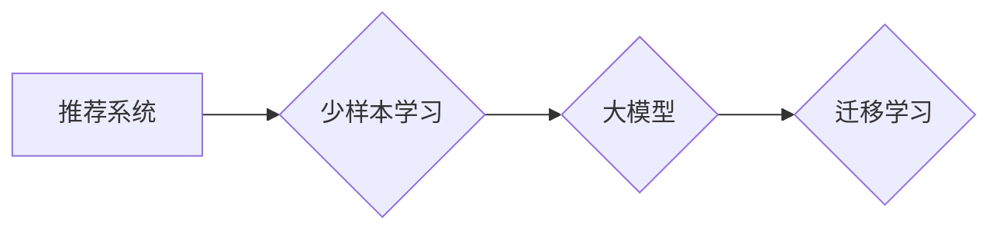

                 

## 大模型在推荐系统中的少样本学习应用

> 关键词：大模型、少样本学习、推荐系统、迁移学习、微调、冷启动问题

## 1. 背景介绍

推荐系统作为互联网时代的核心技术之一，旨在根据用户的历史行为、偏好和上下文信息，精准推荐用户感兴趣的内容或商品。传统的推荐系统通常依赖海量用户数据进行训练，然而，在实际应用中，许多场景面临着数据稀缺的挑战，例如新用户、新商品、新类别等。

少样本学习 (Few-Shot Learning) 作为一种新兴的机器学习范式，旨在通过少量样本数据训练模型，有效解决数据稀缺问题。近年来，大模型 (Large Language Model, LLM) 的快速发展为少样本学习带来了新的机遇。大模型拥有强大的泛化能力和表示学习能力，能够从少量样本中学习到丰富的知识和模式，从而在推荐系统中实现高效的少样本学习。

## 2. 核心概念与联系

### 2.1  推荐系统

推荐系统旨在预测用户对特定物品的兴趣或偏好，并根据预测结果推荐相关物品。常见的推荐系统类型包括：

* **基于内容的推荐:** 根据物品的特征和用户历史行为进行推荐。
* **基于协同过滤的推荐:** 基于用户之间的相似性或物品之间的相似性进行推荐。
* **混合推荐:** 结合多种推荐算法进行推荐。

### 2.2  少样本学习

少样本学习是指在训练数据量非常少的情况下，仍然能够训练出高性能的机器学习模型。与传统的监督学习相比，少样本学习更加注重模型的泛化能力和对新数据的适应性。

### 2.3  大模型

大模型是指参数量巨大、训练数据量庞大的深度学习模型。大模型通常具有强大的表示学习能力和泛化能力，能够在各种自然语言处理任务中取得优异的性能。

### 2.4  迁移学习

迁移学习是一种机器学习范式，旨在利用预训练模型在源任务上的知识，迁移到目标任务中进行训练。在推荐系统中，可以利用大模型在其他领域的预训练知识，进行少样本学习。

**核心概念与联系流程图:**



## 3. 核心算法原理 & 具体操作步骤

### 3.1  算法原理概述

大模型在推荐系统中的少样本学习主要基于迁移学习的思想。具体来说，可以将大模型预训练在海量文本数据上，学习到丰富的语义表示和知识。然后，将预训练的大模型微调到特定推荐任务上，利用少量样本数据进行训练，从而实现高效的少样本学习。

### 3.2  算法步骤详解

1. **预训练大模型:** 在海量文本数据上预训练大模型，例如BERT、RoBERTa、GPT等。
2. **特征提取:** 将用户和物品的文本信息输入预训练的大模型，提取其语义表示。
3. **微调模型:** 将预训练的大模型微调到特定推荐任务上，例如点击预测、排序预测等。
4. **预测推荐:** 利用微调后的模型，对新用户和新物品进行推荐。

### 3.3  算法优缺点

**优点:**

* **高效利用数据:** 能够有效利用少量样本数据进行训练，降低数据收集和标注成本。
* **提升推荐精度:** 大模型的强大表示能力和泛化能力，能够提升推荐精度的。
* **降低冷启动问题:** 能够有效解决新用户、新商品的冷启动问题。

**缺点:**

* **计算资源需求高:** 预训练大模型和微调过程需要大量的计算资源。
* **模型复杂度高:** 大模型的复杂性也带来模型训练和部署的挑战。

### 3.4  算法应用领域

大模型在推荐系统中的少样本学习应用广泛，例如：

* **电商推荐:** 推荐商品、优惠券、促销活动等。
* **内容推荐:** 推荐新闻、视频、文章等。
* **社交推荐:** 推荐好友、群组、话题等。

## 4. 数学模型和公式 & 详细讲解 & 举例说明

### 4.1  数学模型构建

在少样本学习场景下，推荐系统通常采用基于用户的协同过滤模型，例如基于用户的矩阵分解模型。

**用户-物品交互矩阵:**

设用户集合为U，物品集合为I，用户-物品交互矩阵为R，其中R(u,i)表示用户u对物品i的交互行为，例如评分、点击等。

**矩阵分解模型:**

将用户-物品交互矩阵R分解为两个低维矩阵P和Q，其中P为用户特征矩阵，Q为物品特征矩阵。

$$R \approx P Q^T$$

其中，P(u,:)表示用户u的特征向量，Q(i,:)表示物品i的特征向量。

### 4.2  公式推导过程

目标函数通常采用最小化预测误差和正则化项的组合，例如：

$$L = \frac{1}{2} \sum_{u \in U, i \in I} (R(u,i) - P(u,:) Q(i,:))^2 + \lambda (||P||_F^2 + ||Q||_F^2)$$

其中，λ为正则化参数，||P||_F^2和||Q||_F^2分别表示P和Q的Frobenius范数。

### 4.3  案例分析与讲解

假设有一个电商平台，用户集合U包含1000个用户，物品集合I包含10000个商品。用户-物品交互矩阵R是一个稀疏矩阵，其中只有部分用户对部分商品进行了交互。

利用大模型进行少样本学习，可以将预训练的大模型微调到矩阵分解模型中，学习到用户和物品的特征表示。

例如，可以将用户的商品评论文本作为输入，提取其语义表示，作为用户特征P的一部分。

## 5. 项目实践：代码实例和详细解释说明

### 5.1  开发环境搭建

* Python 3.7+
* PyTorch 1.7+
* Transformers 4.0+

### 5.2  源代码详细实现

```python
import torch
from torch import nn
from transformers import BertModel

class Recommender(nn.Module):
    def __init__(self, bert_model_name, embedding_dim, num_users, num_items):
        super(Recommender, self).__init__()
        self.bert = BertModel.from_pretrained(bert_model_name)
        self.embedding_dim = embedding_dim
        self.user_embedding = nn.Embedding(num_users, embedding_dim)
        self.item_embedding = nn.Embedding(num_items, embedding_dim)

    def forward(self, user_ids, item_ids):
        user_embeddings = self.user_embedding(user_ids)
        item_embeddings = self.item_embedding(item_ids)
        # 使用预训练BERT模型提取文本特征
        bert_outputs = self.bert(input_ids=user_ids)
        user_bert_embeddings = bert_outputs.last_hidden_state[:, 0, :]
        bert_outputs = self.bert(input_ids=item_ids)
        item_bert_embeddings = bert_outputs.last_hidden_state[:, 0, :]
        # 将BERT特征与词嵌入融合
        user_embeddings = torch.cat((user_embeddings, user_bert_embeddings), dim=1)
        item_embeddings = torch.cat((item_embeddings, item_bert_embeddings), dim=1)
        # 计算用户-物品相似度
        similarity = torch.matmul(user_embeddings, item_embeddings.T)
        return similarity

# 实例化模型
model = Recommender(bert_model_name='bert-base-uncased', embedding_dim=128, num_users=1000, num_items=10000)

# 训练模型
# ...

# 预测推荐
user_id = 123
item_ids = torch.tensor([456, 789, 1011])
similarity = model(user_id, item_ids)
```

### 5.3  代码解读与分析

* 代码首先定义了一个`Recommender`类，用于构建推荐模型。
* 模型使用预训练的BERT模型提取用户和物品的文本特征，并将BERT特征与词嵌入融合。
* 然后，模型计算用户-物品的相似度，并返回相似度矩阵。
* 代码示例仅展示了模型的结构和基本使用方法，实际训练和部署需要根据具体场景进行调整。

### 5.4  运行结果展示

运行结果展示通常包括以下内容：

* **推荐列表:** 模型预测的用户对特定物品的兴趣排序。
* **推荐精度:** 使用标准指标，例如NDCG、MAP等，评估推荐精度的。
* **用户反馈:** 收集用户对推荐结果的反馈，例如点击率、转化率等。

## 6. 实际应用场景

### 6.1  电商推荐

大模型在电商推荐中的应用场景广泛，例如：

* **商品推荐:** 根据用户的浏览历史、购买记录、购物车内容等，推荐相关的商品。
* **优惠券推荐:** 根据用户的消费习惯和偏好，推荐合适的优惠券。
* **促销活动推荐:** 根据用户的兴趣和需求，推荐相关的促销活动。

### 6.2  内容推荐

大模型在内容推荐中的应用场景包括：

* **新闻推荐:** 根据用户的阅读历史、关注领域等，推荐相关的新闻。
* **视频推荐:** 根据用户的观看历史、兴趣标签等，推荐相关的视频。
* **文章推荐:** 根据用户的阅读习惯、兴趣爱好等，推荐相关的文章。

### 6.3  社交推荐

大模型在社交推荐中的应用场景包括：

* **好友推荐:** 根据用户的兴趣爱好、社交关系等，推荐潜在的好友。
* **群组推荐:** 根据用户的兴趣爱好、社交关系等，推荐相关的群组。
* **话题推荐:** 根据用户的兴趣爱好、社交关系等，推荐相关的热门话题。

### 6.4  未来应用展望

大模型在推荐系统中的少样本学习应用前景广阔，未来可能在以下方面得到进一步发展：

* **更强大的模型:** 随着大模型技术的不断发展，预训练模型的规模和能力将进一步提升，从而带来更精准的推荐结果。
* **更个性化的推荐:** 大模型能够学习到用户的细粒度特征，从而实现更个性化的推荐。
* **跨模态推荐:** 大模型能够处理多种模态的数据，例如文本、图像、音频等，从而实现跨模态的推荐。

## 7. 工具和资源推荐

### 7.1  学习资源推荐

* **论文:**
    * Few-Shot Learning with Large Language Models
    * BERT: Pre-training of Deep Bidirectional Transformers for Language Understanding
* **博客:**
    * The Illustrated Transformer
    * Hugging Face Blog
* **课程:**
    * Deep Learning Specialization (Coursera)
    * Natural Language Processing with Deep Learning (Stanford)

### 7.2  开发工具推荐

* **PyTorch:** 深度学习框架
* **Transformers:** 预训练模型库
* **Hugging Face:** 预训练模型平台

### 7.3  相关论文推荐

* Few-Shot Learning with Large Language Models
* BERT: Pre-training of Deep Bidirectional Transformers for Language Understanding
* XLNet: Generalized Autoregressive Pretraining for Language Understanding

## 8. 总结：未来发展趋势与挑战

### 8.1  研究成果总结

大模型在推荐系统中的少样本学习取得了显著的成果，能够有效解决数据稀缺问题，提升推荐精度。

### 8.2  未来发展趋势

未来，大模型在推荐系统中的少样本学习将朝着以下方向发展：

* **模型规模和能力提升:** 预训练模型的规模和能力将进一步提升，带来更精准的推荐结果。
* **个性化推荐增强:** 大模型能够学习到用户的细粒度特征，实现更个性化的推荐。
* **跨模态推荐发展:** 大模型能够处理多种模态的数据，实现跨模态的推荐。

### 8.3  面临的挑战

大模型在推荐系统中的少样本学习也面临一些挑战：

* **计算资源需求高:** 预训练大模型和微调过程需要大量的计算资源。
* **模型复杂度高:** 大模型的复杂性也带来模型训练和部署的挑战。
* **数据隐私和安全:** 大模型的训练需要大量用户数据，如何保护用户数据隐私和安全是一个重要问题。

### 8.4  研究展望

未来，需要进一步研究以下问题：

* 如何更有效地利用少样本数据进行大模型训练？
* 如何降低大模型训练和部署的成本？
* 如何更好地保护用户数据隐私和安全？


## 9. 附录：常见问题与解答

**Q1: 大模型的少样本学习与传统推荐系统的区别是什么？**

**A1:** 传统推荐系统通常依赖海量用户数据进行训练，而大模型的少样本学习能够有效利用少量样本数据进行训练，降低数据收集和标注成本。

**Q2: 大模型的少样本学习有哪些应用场景？**

**A2:** 大模型的少样本学习应用场景广泛，例如电商推荐、内容推荐、社交推荐等。

**Q3: 如何评估大模型在推荐系统中的少样本学习效果？**

**A3:** 可以使用标准指标，例如NDCG、MAP等，评估推荐精度的。

**作者：禅与计算机程序设计艺术 / Zen and the Art of Computer Programming**<end_of_turn>

