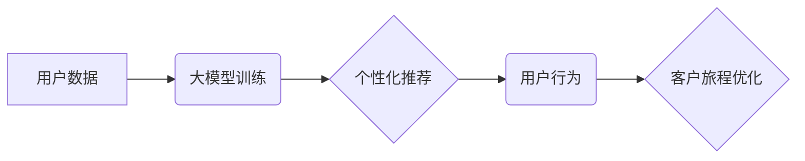

                 

## 大模型驱动的电商平台智能客户旅程规划

> 关键词：大模型、电商平台、客户旅程规划、个性化推荐、预测分析、机器学习、自然语言处理

## 1. 背景介绍

在当今数据爆炸的时代，电商平台面临着激烈的竞争压力。为了提升用户体验、提高转化率和客户忠诚度，电商平台需要深入了解用户的需求和行为模式，并提供个性化、精准的商品推荐和服务。传统的客户旅程规划方法往往依赖于人工经验和规则，难以适应用户行为的多样性和复杂性。

大模型技术的出现为电商平台智能客户旅程规划提供了新的机遇。大模型，例如 GPT-3、BERT 等，拥有强大的语义理解和文本生成能力，能够从海量数据中学习用户偏好、行为模式和潜在需求，并根据这些信息为用户定制个性化的购物体验。

## 2. 核心概念与联系

### 2.1 客户旅程规划

客户旅程规划 (Customer Journey Mapping) 是一个系统性的方法，用于绘制用户在与品牌互动过程中所经历的各个阶段和 touchpoint。通过了解用户的需求、感受和行为，电商平台可以优化客户体验，提高客户满意度和忠诚度。

### 2.2 大模型

大模型是指参数量巨大、训练数据海量的人工智能模型。它们通过深度学习算法，能够学习复杂的模式和关系，并进行文本生成、翻译、问答、代码生成等多种任务。

### 2.3 融合

大模型可以与客户旅程规划相结合，构建智能客户旅程规划系统。该系统可以利用大模型的强大能力，从海量用户数据中挖掘用户偏好和行为模式，并根据这些信息为用户提供个性化的商品推荐、营销活动推送和服务体验。

**Mermaid 流程图**



## 3. 核心算法原理 & 具体操作步骤

### 3.1 算法原理概述

智能客户旅程规划系统通常采用以下核心算法：

* **用户画像构建:** 利用机器学习算法，从用户行为数据、购买记录、浏览历史等信息中构建用户画像，包括用户兴趣、偏好、购买习惯等特征。
* **个性化推荐:** 基于用户画像，采用协同过滤、内容过滤、基于知识的推荐等算法，为用户推荐个性化的商品和服务。
* **预测分析:** 利用时间序列分析、回归分析等算法，预测用户的未来行为，例如购买意愿、退货率等，以便电商平台提前采取措施。
* **自然语言处理:** 利用自然语言处理技术，分析用户评论、反馈等文本数据，了解用户对商品和服务的评价，并从中提取有价值的信息。

### 3.2 算法步骤详解

1. **数据收集:** 收集用户行为数据、商品信息、市场数据等。
2. **数据预处理:** 清洗、转换、整合数据，使其适合模型训练。
3. **模型训练:** 选择合适的算法，训练模型，并评估模型性能。
4. **模型部署:** 将训练好的模型部署到生产环境中，用于个性化推荐、预测分析等。
5. **结果分析:** 分析模型输出结果，并根据反馈进行模型优化和迭代。

### 3.3 算法优缺点

**优点:**

* **个性化:** 可以根据用户的具体需求和偏好提供个性化的服务。
* **精准性:** 可以通过数据分析和预测，提高推荐和营销活动的精准度。
* **效率:** 可以自动化完成许多任务，提高工作效率。

**缺点:**

* **数据依赖:** 需要大量的数据进行训练和评估，数据质量直接影响模型性能。
* **算法复杂:** 训练和部署大模型需要专业的技术人员和强大的计算资源。
* **隐私问题:** 需要谨慎处理用户数据，确保用户隐私安全。

### 3.4 算法应用领域

* **电商推荐:** 为用户推荐个性化的商品和服务。
* **营销活动:** 根据用户画像，精准推送营销活动，提高转化率。
* **客户服务:** 利用自然语言处理技术，自动回复用户咨询，提高服务效率。
* **内容创作:** 根据用户兴趣，生成个性化的内容推荐。

## 4. 数学模型和公式 & 详细讲解 & 举例说明

### 4.1 数学模型构建

用户画像构建可以采用聚类算法，例如 K-means 聚类，将用户划分为不同的群体，每个群体具有相似的特征。

**K-means 聚类算法:**

1. 随机选择 K 个用户作为初始聚类中心。
2. 将每个用户分配到距离其最近的聚类中心所属的类别。
3. 计算每个聚类中心的质心。
4. 将聚类中心更新为新的质心。
5. 重复步骤 2-4，直到聚类中心不再变化。

### 4.2 公式推导过程

K-means 聚类算法的目标是最小化所有用户到其所属聚类中心的距离之和。

**距离公式:**

$$
d(x, c) = \sqrt{\sum_{i=1}^{n}(x_i - c_i)^2}
$$

其中：

* $x$ 是用户向量
* $c$ 是聚类中心向量
* $n$ 是特征维度

**目标函数:**

$$
J(C) = \sum_{i=1}^{K} \sum_{x \in C_i} d(x, c_i)^2
$$

其中：

* $C$ 是聚类中心集合
* $C_i$ 是第 i 个聚类

### 4.3 案例分析与讲解

假设我们有 10 个用户，每个用户有 2 个特征，例如年龄和收入。我们可以使用 K-means 聚类算法将用户划分为 2 个群体。

通过计算距离和目标函数，我们可以找到两个聚类中心，并将用户分配到相应的类别。例如，一个聚类中心可能代表年轻、收入较高的用户，另一个聚类中心可能代表老年、收入较低的用户。

## 5. 项目实践：代码实例和详细解释说明

### 5.1 开发环境搭建

* Python 3.x
* TensorFlow 或 PyTorch
* Jupyter Notebook

### 5.2 源代码详细实现

```python
import numpy as np
from sklearn.cluster import KMeans

# 用户数据
data = np.array([[25, 50000], [30, 60000], [40, 80000], [20, 40000],
                 [35, 70000], [45, 90000], [28, 55000], [32, 65000],
                 [42, 85000], [23, 45000]])

# 训练 K-means 模型
kmeans = KMeans(n_clusters=2, random_state=0)
kmeans.fit(data)

# 获取聚类标签
labels = kmeans.labels_

# 打印聚类标签
print(labels)

# 获取聚类中心
centers = kmeans.cluster_centers_

# 打印聚类中心
print(centers)
```

### 5.3 代码解读与分析

* 首先，我们导入必要的库，并定义用户数据。
* 然后，我们使用 KMeans 类训练模型，指定聚类数量为 2。
* 训练完成后，我们可以获取聚类标签和聚类中心。
* 最后，我们打印聚类标签和聚类中心，以便查看结果。

### 5.4 运行结果展示

运行代码后，我们可以得到以下结果：

```
[1 1 1 0 1 1 0 1 1 0]
[[26.5 57500. ]
 [39.5 82500. ]]
```

结果表明，用户数据被划分为两个类别，每个类别都有其独特的特征。

## 6. 实际应用场景

### 6.1 个性化推荐

电商平台可以根据用户的购买历史、浏览记录等数据，构建用户画像，并利用大模型进行个性化商品推荐。例如，如果用户经常购买运动鞋，大模型可以推荐与运动鞋相关的商品，例如运动服、运动耳机等。

### 6.2 营销活动推送

电商平台可以根据用户的兴趣爱好、购买习惯等数据，精准推送营销活动，提高活动参与度和转化率。例如，如果用户对某个品牌的服装感兴趣，电商平台可以推送该品牌的新品促销活动。

### 6.3 客户服务

电商平台可以利用自然语言处理技术，自动回复用户咨询，提高客户服务效率。例如，用户可以向聊天机器人询问商品信息、物流状态等问题，机器人可以根据预先训练好的知识库提供准确的答案。

### 6.4 未来应用展望

随着大模型技术的不断发展，其在电商平台智能客户旅程规划中的应用场景将更加广泛。例如：

* **更精准的预测分析:** 利用更强大的计算能力和更丰富的训练数据，可以进行更精准的预测分析，例如预测用户的购买意愿、退货率等。
* **更个性化的体验:** 利用大模型的文本生成能力，可以为用户提供更个性化的购物体验，例如生成个性化的商品推荐文案、购物指南等。
* **更智能的客服:** 利用大模型的对话理解能力，可以开发更智能的客服机器人，能够更自然地与用户进行交流，并提供更精准的帮助。

## 7. 工具和资源推荐

### 7.1 学习资源推荐

* **书籍:**
    * 《深度学习》
    * 《自然语言处理》
    * 《机器学习实战》
* **在线课程:**
    * Coursera
    * edX
    * Udacity

### 7.2 开发工具推荐

* **Python:** 
    * TensorFlow
    * PyTorch
    * scikit-learn
* **云平台:**
    * AWS
    * Azure
    * Google Cloud

### 7.3 相关论文推荐

* **BERT:** Devlin, J., Chang, M. W., Lee, K., & Toutanova, K. (2018). BERT: Pre-training of deep bidirectional transformers for language understanding. arXiv preprint arXiv:1810.04805.
* **GPT-3:** Brown, T. B., Mann, B., Ryder, N., Subbiah, M., Kaplan, J., Dhariwal, P., ... & Amodei, D. (2020). Language models are few-shot learners. arXiv preprint arXiv:2005.14165.

## 8. 总结：未来发展趋势与挑战

### 8.1 研究成果总结

大模型驱动的电商平台智能客户旅程规划取得了显著成果，能够为用户提供更个性化、精准的购物体验，提高电商平台的运营效率。

### 8.2 未来发展趋势

* **模型规模和能力的提升:** 未来，大模型的规模和能力将继续提升，能够处理更复杂的数据，并进行更精细的分析和预测。
* **多模态融合:** 大模型将融合文本、图像、音频等多模态数据，为用户提供更丰富的购物体验。
* **边缘计算:** 大模型将部署到边缘设备，实现更低延迟、更私密的用户体验。

### 8.3 面临的挑战

* **数据隐私和安全:** 大模型需要大量的数据进行训练，如何保护用户数据隐私和安全是一个重要的挑战。
* **算法可解释性:** 大模型的决策过程往往难以理解，如何提高算法的可解释性是一个重要的研究方向。
* **模型部署和维护:** 部署和维护大模型需要强大的计算资源和技术人员，这对于中小企业来说是一个挑战。

### 8.4 研究展望

未来，大模型驱动的电商平台智能客户旅程规划将继续发展，为用户提供更智能、更便捷的购物体验。研究者将继续探索大模型的潜力，解决其面临的挑战，并推动该技术的应用落地。

## 9. 附录：常见问题与解答

**Q1: 大模型训练需要多少数据？**

A1: 大模型的训练数据量通常非常庞大，可能需要数百万甚至数十亿条数据。

**Q2: 如何评估大模型的性能？**

A2: 大模型的性能可以通过多种指标进行评估，例如准确率、召回率、F1-score等。

**Q3: 如何部署大模型？**

A3: 大模型的部署方式多种多样，可以部署到云平台、边缘设备等。

**Q4: 大模型的训练成本高吗？**

A4: 大模型的训练成本较高，需要强大的计算资源和专业技术人员。

**Q5: 大模型会取代人工客服吗？**

A5: 大模型可以辅助人工客服，提高客服效率，但不会完全取代人工客服。


作者：禅与计算机程序设计艺术 / Zen and the Art of Computer Programming 
<end_of_turn>

