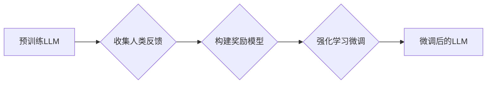

                 

## 大语言模型微调II：强化学习在LLM中的应用（RLHF、PPO、DPO）

> 关键词：大语言模型、微调、强化学习、RLHF、PPO、DPO、文本生成、对话系统

## 1. 背景介绍

大语言模型（LLM）在自然语言处理领域取得了显著的进展，展现出强大的文本生成、翻译、摘要等能力。然而，现有的预训练模型往往在特定任务或领域表现欠佳，需要进行针对性的微调以提升性能。传统微调方法主要依赖于监督学习，需要大量标注数据，成本高昂且效率低。

强化学习（RL）作为一种新的机器学习范式，通过与环境交互学习最优策略，逐渐受到人们的关注。RL在LLM微调领域展现出巨大的潜力，能够有效地解决监督学习的局限性，并提升模型在复杂任务上的表现。

## 2. 核心概念与联系

**2.1 强化学习 (Reinforcement Learning)**

强化学习是一种基于交互学习的机器学习方法。在RL中，一个智能体（agent）与一个环境（environment）交互，通过执行动作（action）来感知环境的变化，并获得奖励（reward）。智能体的目标是学习一个策略（policy），使得在与环境交互的过程中获得最大的总奖励。

**2.2  RLHF (Reinforcement Learning from Human Feedback)**

RLHF是一种将人类反馈融入强化学习的策略，旨在训练模型生成更符合人类期望的输出。RLHF通常包含以下步骤：

1. **收集人类反馈:**  人类评估模型生成的文本，并提供反馈，例如评分、排名或修改建议。
2. **构建奖励模型:** 使用收集到的反馈数据训练一个奖励模型，该模型能够预测人类对模型输出的偏好。
3. **强化学习微调:** 使用奖励模型作为奖励函数，通过强化学习算法微调预训练的LLM，使其生成更符合人类偏好的文本。

**2.3 PPO (Proximal Policy Optimization)**

PPO是一种基于策略梯度的强化学习算法，在训练过程中通过限制策略更新的幅度来保证稳定性。PPO的优势在于其易于实现、训练稳定且效果良好。

**2.4 DPO (Deep Proximal Policy Optimization)**

DPO是PPO的一种改进版本，通过使用深度神经网络来近似策略函数，能够更好地处理复杂的任务。DPO在训练过程中引入了额外的正则化项，进一步提高了训练的稳定性。

**2.5 流程图**



## 3. 核心算法原理 & 具体操作步骤

### 3.1 算法原理概述

RLHF、PPO和DPO都是基于强化学习的微调方法，其核心思想是通过与环境交互学习最优策略，使得模型生成更符合人类期望的文本。

* RLHF将人类反馈融入到强化学习的训练过程中，通过奖励模型引导模型学习生成更符合人类偏好的文本。
* PPO和DPO都是基于策略梯度的强化学习算法，通过优化策略函数来提高模型的性能。

### 3.2 算法步骤详解

**3.2.1 RLHF**

1. **数据收集:** 收集人类对模型输出的反馈数据，例如评分、排名或修改建议。
2. **奖励模型训练:** 使用收集到的反馈数据训练一个奖励模型，该模型能够预测人类对模型输出的偏好。
3. **策略微调:** 使用奖励模型作为奖励函数，通过强化学习算法（例如PPO或DPO）微调预训练的LLM，使其生成更符合人类偏好的文本。

**3.2.2 PPO**

1. **策略网络初始化:** 初始化一个策略网络，该网络能够根据输入文本生成输出文本。
2. **数据采样:** 从训练数据中采样输入文本和对应的目标文本。
3. **策略评估:** 使用策略网络生成输出文本，并计算其与目标文本之间的损失函数值。
4. **策略更新:** 使用策略梯度算法更新策略网络的参数，使得损失函数值最小化。
5. **重复步骤2-4:** 重复上述步骤，直到策略网络收敛。

**3.2.3 DPO**

DPO与PPO类似，但它使用深度神经网络来近似策略函数，并引入了额外的正则化项来提高训练的稳定性。

### 3.3 算法优缺点

**RLHF**

* **优点:** 可以有效地利用人类反馈，训练出更符合人类期望的模型。
* **缺点:** 需要收集大量的人类反馈数据，成本较高。

**PPO**

* **优点:** 训练稳定、效果良好。
* **缺点:** 对于复杂的任务，可能需要较长的训练时间。

**DPO**

* **优点:** 能够更好地处理复杂的任务，训练更稳定。
* **缺点:** 训练复杂度更高，需要更多的计算资源。

### 3.4 算法应用领域

RLHF、PPO和DPO在以下领域具有广泛的应用前景：

* **对话系统:** 训练更自然、更流畅的对话系统。
* **文本生成:** 生成更符合人类语义和风格的文本，例如小说、诗歌、新闻报道等。
* **机器翻译:** 提高机器翻译的准确性和流畅度。
* **代码生成:** 自动生成代码，提高开发效率。

## 4. 数学模型和公式 & 详细讲解 & 举例说明

### 4.1 数学模型构建

**4.1.1 奖励模型**

奖励模型通常使用神经网络来近似，其输入是模型生成的文本，输出是人类对该文本的偏好评分。

**4.1.2 策略网络**

策略网络通常使用神经网络来近似，其输入是输入文本，输出是生成下一个文本的概率分布。

**4.1.3 状态空间和动作空间**

在RL中，状态空间表示模型当前的上下文信息，动作空间表示模型可以执行的行动，例如生成下一个单词。

### 4.2 公式推导过程

**4.2.1 策略梯度算法**

策略梯度算法的目标是最大化策略网络的期望奖励。其核心公式如下：

$$
\theta_{t+1} = \theta_t + \alpha \nabla_{\theta} J(\theta)
$$

其中：

* $\theta$ 是策略网络的参数。
* $\alpha$ 是学习率。
* $J(\theta)$ 是策略网络的期望奖励函数。

**4.2.2 PPO算法**

PPO算法通过限制策略更新的幅度来保证训练的稳定性。其核心公式如下：

$$
\theta_{t+1} = \theta_t + \alpha \min(r, \frac{1}{\epsilon}) \nabla_{\theta} A(\theta)
$$

其中：

* $r$ 是一个惩罚因子，用于限制策略更新的幅度。
* $\epsilon$ 是一个小的常数。
* $A(\theta)$ 是策略网络的优势函数。

### 4.3 案例分析与讲解

**4.3.1 文本生成任务**

假设我们使用RLHF微调一个LLM，使其能够生成更符合人类风格的诗歌。

1. **数据收集:** 收集人类对不同诗歌风格的评价数据。
2. **奖励模型训练:** 使用收集到的数据训练一个奖励模型，该模型能够预测人类对诗歌风格的偏好。
3. **策略微调:** 使用奖励模型作为奖励函数，通过强化学习算法微调预训练的LLM，使其生成更符合人类偏好的诗歌。

**4.3.2 对话系统任务**

假设我们使用PPO微调一个LLM，使其能够进行更自然流畅的对话。

1. **数据采样:** 从对话数据集中采样对话片段。
2. **策略评估:** 使用策略网络生成对话回复，并计算其与目标回复之间的损失函数值。
3. **策略更新:** 使用策略梯度算法更新策略网络的参数，使得损失函数值最小化。

## 5. 项目实践：代码实例和详细解释说明

### 5.1 开发环境搭建

* Python 3.7+
* PyTorch 或 TensorFlow
* 其他依赖库：transformers, gym, stable-baselines3

### 5.2 源代码详细实现

```python
# 使用transformers库加载预训练的LLM模型
from transformers import AutoModelForCausalLM, AutoTokenizer

model_name = "gpt2"
tokenizer = AutoTokenizer.from_pretrained(model_name)
model = AutoModelForCausalLM.from_pretrained(model_name)

# 定义奖励模型
class RewardModel(nn.Module):
    # ...

# 定义策略网络
class PolicyNetwork(nn.Module):
    # ...

# 使用stable-baselines3库训练PPO模型
from stable_baselines3 import PPO

# 创建PPO训练环境
env = ...

# 创建PPO模型
model = PPO("MlpPolicy", env, verbose=1)

# 训练模型
model.learn(total_timesteps=10000)

# 保存模型
model.save("ppo_model")
```

### 5.3 代码解读与分析

* 代码首先使用transformers库加载预训练的LLM模型。
* 然后定义奖励模型和策略网络。
* 使用stable-baselines3库训练PPO模型，并定义训练环境。
* 最后训练模型并保存模型。

### 5.4 运行结果展示

训练完成后，可以使用训练好的模型生成文本，并与人类评价进行比较。

## 6. 实际应用场景

**6.1 文本生成**

RLHF微调的LLM可以用于生成各种类型的文本，例如小说、诗歌、新闻报道、代码等。

**6.2 对话系统**

RLHF和PPO微调的LLM可以用于构建更自然、更流畅的对话系统，例如聊天机器人、虚拟助手等。

**6.3 机器翻译**

RLHF微调的LLM可以用于提高机器翻译的准确性和流畅度。

**6.4 其他应用场景**

RLHF和PPO微调的LLM还可以应用于其他领域，例如问答系统、文本摘要、情感分析等。

### 6.4 未来应用展望

随着强化学习技术的不断发展，RLHF、PPO和DPO等方法将在LLM微调领域发挥越来越重要的作用。未来，我们可以期待看到更强大的LLM模型，能够更好地理解和生成人类语言，并应用于更广泛的领域。

## 7. 工具和资源推荐

### 7.1 学习资源推荐

* **强化学习入门书籍:**

    * Reinforcement Learning: An Introduction by Sutton and Barto
    * Deep Reinforcement Learning Hands-On by Maxim Lapan

* **在线课程:**

    * Deep Reinforcement Learning Specialization by DeepLearning.AI
    * Reinforcement Learning by David Silver

### 7.2 开发工具推荐

* **PyTorch:** https://pytorch.org/
* **TensorFlow:** https://www.tensorflow.org/
* **stable-baselines3:** https://stable-baselines3.readthedocs.io/en/master/

### 7.3 相关论文推荐

* **Proximal Policy Optimization Algorithms** by Schulman et al. (2017)
* **Language Models are Few-Shot Learners** by Brown et al. (2020)
* **Reinforcement Learning from Human Feedback** by Amodei et al. (2021)

## 8. 总结：未来发展趋势与挑战

### 8.1 研究成果总结

RLHF、PPO和DPO等方法为LLM微调提供了新的思路和方法，取得了显著的成果。这些方法能够有效地利用人类反馈，训练出更符合人类期望的模型，并应用于各种实际场景。

### 8.2 未来发展趋势

* **更有效的RL算法:** 研究更有效的RL算法，例如基于模型的RL算法，能够更好地处理复杂的任务。
* **更强大的奖励模型:** 研究更强大的奖励模型，能够更准确地预测人类偏好。
* **多模态RL:** 将RL应用于多模态LLM，例如文本-图像、文本-音频等。

### 8.3 面临的挑战

* **数据效率:** RL算法通常需要大量的训练数据，而收集高质量的人类反馈数据成本较高。
* **安全性和可解释性:** RL训练的模型可能存在安全性和可解释性问题，需要进一步研究解决这些问题。
* **伦理问题:** RL训练的模型可能存在伦理问题，例如偏见、歧视等，需要制定相应的伦理规范。

### 8.4 研究展望

未来，RL在LLM微调领域将继续发挥重要作用，并推动LLM技术的发展。研究者们将继续探索更有效的RL算法、更强大的奖励模型和更安全的训练方法，以解决上述挑战，并推动LLM技术向更智能、更安全、更可解释的方向发展。

## 9. 附录：常见问题与解答

**9.1 RLHF和监督学习相比有什么优势？**

RLHF能够利用人类反馈，训练出更符合人类期望的模型，而监督学习需要大量标注数据，成本较高。

**9.2 PPO和DPO有什么区别？**

PPO和DPO都是基于策略梯度的强化学习算法，但DPO使用深度神经网络来近似策略函数，并引入了额外的正则化项，能够更好地处理复杂的任务。

**9.3 如何评估RL训练的模型性能？**

可以使用各种指标来评估RL训练的模型性能，例如奖励函数值、困惑度、BLEU分数等。

**9.4 RL训练的模型是否安全可靠？**

RL训练的模型可能存在安全性和可解释性问题，需要进一步研究解决这些问题。


作者：禅与计算机程序设计艺术 / Zen and the Art of Computer Programming<end_of_turn>

