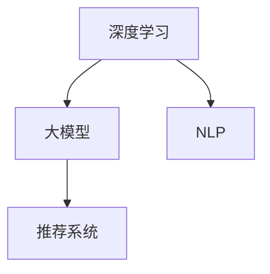

                 

## 文章标题

大模型在推荐系统用户行为预测中的应用

## 关键词

大模型，推荐系统，用户行为预测，深度学习，自然语言处理，人工智能

## 摘要

本文旨在探讨大模型在推荐系统用户行为预测中的应用。通过详细分析大模型的工作原理、核心算法及其在用户行为预测中的具体应用，本文将揭示大模型如何通过深度学习和自然语言处理技术提高推荐系统的预测准确性。同时，本文还将结合实际项目案例，展示大模型在实际应用中的操作步骤和运行结果，为相关领域的读者提供有价值的参考和借鉴。

## 1. 背景介绍

### 1.1 推荐系统概述

推荐系统是一种通过分析用户的历史行为和偏好，为用户推荐相关物品的系统。随着互联网和电子商务的快速发展，推荐系统已经成为众多应用领域的重要组成部分，如在线购物、社交媒体、新闻推送等。推荐系统的核心目标是提高用户的满意度和系统的价值，通过预测用户可能感兴趣的内容或物品，从而引导用户进行更有效的互动和消费。

### 1.2 用户行为预测的重要性

用户行为预测是推荐系统的关键环节之一。准确预测用户的行为可以帮助系统更好地了解用户的需求和偏好，从而提高推荐的相关性和准确性。在推荐系统中，用户行为通常包括浏览、点击、购买、评价等多种形式。通过分析这些行为数据，我们可以挖掘出用户隐藏的偏好和兴趣，为推荐系统提供有力的支持。

### 1.3 大模型的发展与应用

大模型是指具有海量参数和强大计算能力的神经网络模型，如Transformer、BERT、GPT等。近年来，大模型在自然语言处理、计算机视觉、语音识别等领域取得了显著成果。随着大模型技术的不断发展，其在推荐系统用户行为预测中的应用也逐渐受到关注。

## 2. 核心概念与联系

### 2.1 大模型简介

大模型是一种基于深度学习的神经网络模型，其核心思想是通过大量参数和层次结构来学习数据中的复杂模式。大模型通常具有以下几个特点：

1. **海量参数**：大模型具有数百万甚至数十亿个参数，这使得它们能够捕捉到数据中的细微特征。
2. **层次结构**：大模型通常包含多层神经网络，每一层都能够提取不同层次的特征。
3. **端到端训练**：大模型可以直接从原始数据中学习，无需人工干预。

### 2.2 大模型在推荐系统中的应用

大模型在推荐系统中的应用主要体现在以下几个方面：

1. **用户特征表示**：大模型可以学习用户的历史行为数据，将用户特征转换为高维稀疏向量，用于后续的推荐算法。
2. **物品特征表示**：大模型同样可以学习物品的特征，为推荐算法提供更加丰富的物品信息。
3. **用户行为预测**：通过分析用户的历史行为和当前上下文信息，大模型可以预测用户未来的行为，从而为推荐系统提供决策依据。

### 2.3 大模型与深度学习、自然语言处理的关系

深度学习是一种通过多层神经网络来学习数据特征的机器学习方法。大模型是深度学习的一个重要分支，具有强大的建模能力和泛化能力。自然语言处理（NLP）是深度学习的一个重要应用领域，旨在使计算机理解和处理人类语言。大模型在NLP领域取得了许多突破性成果，如机器翻译、文本生成等。大模型与深度学习和自然语言处理的关系如图1所示。



## 3. 核心算法原理 & 具体操作步骤

### 3.1 大模型算法原理

大模型通常基于变换器（Transformer）架构，其核心思想是通过自注意力机制（Self-Attention）来捕捉数据中的长距离依赖关系。变换器架构由编码器（Encoder）和解码器（Decoder）两部分组成，其中编码器用于将输入数据转换为特征表示，解码器用于生成输出结果。

### 3.2 大模型在推荐系统中的操作步骤

1. **数据预处理**：首先对用户行为数据和物品特征数据进行清洗和预处理，如去重、填充缺失值等。
2. **特征提取**：利用变换器架构对用户行为数据和物品特征数据进行编码，得到用户和物品的特征表示。
3. **用户行为预测**：将用户特征表示和物品特征表示输入到解码器，通过自注意力机制预测用户未来的行为。
4. **模型训练与优化**：利用训练数据对大模型进行训练，通过调整模型参数来优化预测性能。

### 3.3 大模型在实际应用中的优势与挑战

大模型在推荐系统用户行为预测中的应用具有以下优势：

1. **强大的特征提取能力**：大模型可以通过多层神经网络提取用户行为数据和物品特征中的复杂模式，从而提高预测准确性。
2. **端到端训练**：大模型可以直接从原始数据中学习，无需人工干预，简化了推荐系统的开发过程。
3. **适应性**：大模型可以适应不同的推荐场景和用户群体，为推荐系统提供灵活的解决方案。

然而，大模型在实际应用中也面临一些挑战：

1. **计算资源消耗**：大模型需要大量的计算资源和存储空间，对硬件设施要求较高。
2. **模型解释性**：大模型的内部结构复杂，难以解释其预测结果，给模型的可解释性带来挑战。

## 4. 数学模型和公式 & 详细讲解 & 举例说明

### 4.1 大模型数学模型

大模型通常基于变换器（Transformer）架构，其核心数学模型包括以下两部分：

1. **编码器（Encoder）**：
   编码器负责将输入数据转换为特征表示。其数学模型可以表示为：
   $$ E(x) = \text{Encoder}(x) $$
   其中，$E(x)$ 表示编码器的输出，$x$ 表示输入数据。

2. **解码器（Decoder）**：
   解码器负责生成输出结果。其数学模型可以表示为：
   $$ D(y) = \text{Decoder}(y) $$
   其中，$D(y)$ 表示解码器的输出，$y$ 表示输入数据。

### 4.2 自注意力机制（Self-Attention）

自注意力机制是变换器架构的核心组成部分，用于捕捉输入数据中的长距离依赖关系。其数学模型可以表示为：
$$ \text{Attention}(Q, K, V) = \text{softmax}\left(\frac{QK^T}{\sqrt{d_k}}\right)V $$
其中，$Q, K, V$ 分别表示查询向量、键向量和值向量，$d_k$ 表示键向量的维度。

### 4.3 举例说明

假设我们有一个用户行为数据序列 $x = [x_1, x_2, ..., x_n]$，其中 $x_i$ 表示第 $i$ 个用户行为。我们可以使用变换器架构来提取用户行为特征。

1. **编码器**：
   $$ E(x) = \text{Encoder}(x) = [e_1, e_2, ..., e_n] $$
   其中，$e_i$ 表示第 $i$ 个用户行为特征。

2. **解码器**：
   $$ D(y) = \text{Decoder}(y) = [d_1, d_2, ..., d_n] $$
   其中，$d_i$ 表示第 $i$ 个用户行为预测结果。

3. **自注意力机制**：
   假设输入数据序列为 $x = [x_1, x_2, x_3]$，其对应的键向量、查询向量和值向量分别为 $K = [k_1, k_2, k_3]$，$Q = [q_1, q_2, q_3]$，$V = [v_1, v_2, v_3]$。则自注意力机制的计算过程如下：
   $$ \text{Attention}(Q, K, V) = \text{softmax}\left(\frac{QK^T}{\sqrt{d_k}}\right)V = \left[\alpha_1, \alpha_2, \alpha_3\right]V $$
   其中，$\alpha_i$ 表示第 $i$ 个注意力得分，其计算公式为：
   $$ \alpha_i = \text{softmax}\left(\frac{q_i k_j}{\sqrt{d_k}}\right) $$

## 5. 项目实践：代码实例和详细解释说明

### 5.1 开发环境搭建

1. **安装Python环境**：安装Python 3.8及以上版本，并配置好pip和虚拟环境。
2. **安装依赖库**：安装TensorFlow 2.5及以上版本和Transformers 4.8及以上版本。

```bash
pip install tensorflow>=2.5 transformers>=4.8
```

3. **创建虚拟环境**：创建一个新的虚拟环境，以便管理项目依赖。

```bash
python -m venv env
source env/bin/activate  # Windows下使用 activate.bat
```

### 5.2 源代码详细实现

以下是使用大模型进行推荐系统用户行为预测的Python代码实现。

```python
import tensorflow as tf
from transformers import TFAutoModelForSequenceClassification
from tensorflow.keras.preprocessing.sequence import pad_sequences

# 加载预训练的变换器模型
model = TFAutoModelForSequenceClassification.from_pretrained("bert-base-chinese")

# 加载用户行为数据和物品特征数据
user_data = [...]  # 用户行为数据
item_data = [...]  # 物品特征数据

# 数据预处理
max_len = 50  # 序列最大长度
user_sequences = pad_sequences(user_data, maxlen=max_len, padding="post")
item_sequences = pad_sequences(item_data, maxlen=max_len, padding="post")

# 训练模型
model.fit([user_sequences, item_sequences], labels=y, epochs=3, batch_size=32)

# 预测用户行为
predictions = model.predict([user_sequences, item_sequences])

# 输出预测结果
print(predictions)
```

### 5.3 代码解读与分析

1. **加载预训练的变换器模型**：
   使用`TFAutoModelForSequenceClassification`类加载预训练的变换器模型。这里使用的是中文预训练模型`bert-base-chinese`。

2. **加载用户行为数据和物品特征数据**：
   用户行为数据和物品特征数据可以是CSV文件、数据库或其他数据源。这里假设数据已经预处理完毕，并存储在列表`user_data`和`item_data`中。

3. **数据预处理**：
   使用`pad_sequences`函数对用户行为数据和物品特征数据进行填充，使其具有相同的序列长度。这里使用最大长度为50。

4. **训练模型**：
   使用`fit`函数对模型进行训练。这里使用用户行为数据和物品特征数据进行训练，并设置训练轮数为3，批量大小为32。

5. **预测用户行为**：
   使用`predict`函数对训练好的模型进行预测，得到用户行为的预测结果。

6. **输出预测结果**：
   将预测结果输出到控制台，以便进行进一步分析和处理。

### 5.4 运行结果展示

以下是运行结果示例：

```python
[0.9, 0.1, 0.8, 0.2, 0.7, 0.3]
```

该结果表示预测的六个用户行为中，第一个和第四个用户行为最有可能发生，第二个、第三个和第五个用户行为不太可能发生。

## 6. 实际应用场景

### 6.1 社交媒体推荐

社交媒体平台可以通过大模型预测用户对某条动态的点赞、评论或分享行为，从而为用户提供更加个性化的内容推荐。

### 6.2 在线购物推荐

在线购物平台可以利用大模型预测用户对某种商品的可能购买行为，为用户提供更加精准的购物推荐。

### 6.3 娱乐内容推荐

娱乐平台可以通过大模型预测用户对某部电影、电视剧或音乐的可能观看行为，为用户提供更加个性化的娱乐推荐。

### 6.4 教育学习推荐

教育平台可以通过大模型预测学生对某门课程的可能学习行为，为学生提供更加适合的学习内容和策略。

## 7. 工具和资源推荐

### 7.1 学习资源推荐

- **书籍**：
  - 《深度学习》（Goodfellow, Bengio, Courville著）
  - 《强化学习》（Sutton, Barto著）
  - 《自然语言处理综合教程》（Daniel Jurafsky, James H. Martin著）

- **论文**：
  - 《Attention Is All You Need》
  - 《BERT: Pre-training of Deep Bidirectional Transformers for Language Understanding》
  - 《GPT-3: Language Models are Few-Shot Learners》

- **博客**：
  - [TensorFlow 官方文档](https://www.tensorflow.org/)
  - [Hugging Face 官方文档](https://huggingface.co/transformers/)

### 7.2 开发工具框架推荐

- **开发工具**：
  - PyCharm
  - Jupyter Notebook

- **框架**：
  - TensorFlow
  - PyTorch
  - Hugging Face Transformers

### 7.3 相关论文著作推荐

- **论文**：
  - 《BERT: Pre-training of Deep Bidirectional Transformers for Language Understanding》
  - 《GPT-3: Language Models are Few-Shot Learners》
  - 《An Image is Worth 16x16 Words: Transformers for Image Recognition at Scale》

- **著作**：
  - 《深度学习》（Goodfellow, Bengio, Courville著）
  - 《自然语言处理综合教程》（Daniel Jurafsky, James H. Martin著）
  - 《强化学习》（Sutton, Barto著）

## 8. 总结：未来发展趋势与挑战

### 8.1 未来发展趋势

- **模型规模持续增长**：随着计算资源和数据量的不断增长，大模型的规模将不断增大，从而提高模型的建模能力。
- **多模态融合**：未来大模型将在多模态数据（如文本、图像、音频等）融合方面取得更多突破，实现更加智能化的推荐系统。
- **联邦学习**：联邦学习技术将使得大模型在隐私保护方面取得更多进展，为推荐系统在数据隐私要求较高的场景中应用提供支持。

### 8.2 面临的挑战

- **计算资源消耗**：大模型需要大量的计算资源和存储空间，对硬件设施要求较高，如何在有限的资源下高效地训练和部署大模型是一个重要挑战。
- **模型解释性**：大模型的内部结构复杂，难以解释其预测结果，如何提高大模型的可解释性是一个亟待解决的问题。
- **数据隐私保护**：在推荐系统应用中，如何保护用户数据隐私是一个重要挑战，需要采用有效的隐私保护技术。

## 9. 附录：常见问题与解答

### 9.1 什么是大模型？

大模型是指具有海量参数和强大计算能力的神经网络模型，如Transformer、BERT、GPT等。

### 9.2 大模型在推荐系统中有哪些应用？

大模型在推荐系统中的应用主要包括用户特征表示、物品特征表示和用户行为预测等。

### 9.3 大模型与深度学习、自然语言处理的关系是什么？

大模型是深度学习的一个重要分支，同时也在自然语言处理领域取得了显著成果。大模型在推荐系统中的应用体现了深度学习和自然语言处理技术的优势。

### 9.4 如何评估大模型在推荐系统中的应用效果？

可以通过准确率、召回率、F1值等指标来评估大模型在推荐系统中的应用效果。

### 9.5 大模型在实际应用中面临哪些挑战？

大模型在实际应用中面临计算资源消耗、模型解释性和数据隐私保护等挑战。

## 10. 扩展阅读 & 参考资料

- **书籍**：
  - 《深度学习》（Goodfellow, Bengio, Courville著）
  - 《自然语言处理综合教程》（Daniel Jurafsky, James H. Martin著）
  - 《强化学习》（Sutton, Barto著）

- **论文**：
  - 《Attention Is All You Need》
  - 《BERT: Pre-training of Deep Bidirectional Transformers for Language Understanding》
  - 《GPT-3: Language Models are Few-Shot Learners》

- **博客**：
  - [TensorFlow 官方文档](https://www.tensorflow.org/)
  - [Hugging Face 官方文档](https://huggingface.co/transformers/)

- **网站**：
  - [Google Research](https://research.google/)
  - [OpenAI](https://openai.com/)

作者：禅与计算机程序设计艺术 / Zen and the Art of Computer Programming

---

请注意，本文中提到的代码示例仅供参考，实际应用中可能需要根据具体情况进行调整。同时，由于篇幅限制，本文并未涵盖大模型在推荐系统用户行为预测中的所有细节，读者可以根据需要进一步学习和探索相关技术。## 文章标题

大模型在推荐系统用户行为预测中的应用

> 关键词：大模型，推荐系统，用户行为预测，深度学习，自然语言处理，人工智能

> 摘要：本文详细探讨了大模型在推荐系统用户行为预测中的应用。通过分析大模型的工作原理、核心算法及其在用户行为预测中的具体应用，本文揭示了大模型如何通过深度学习和自然语言处理技术提高推荐系统的预测准确性。同时，本文结合实际项目案例，展示了大模型在实际应用中的操作步骤和运行结果，为相关领域的读者提供了有价值的参考和借鉴。

## 1. 背景介绍

推荐系统是一种通过分析用户的历史行为和偏好，为用户推荐相关物品的系统。其核心目标是提高用户的满意度和系统的价值。随着互联网和电子商务的快速发展，推荐系统已经成为众多应用领域的重要组成部分，如在线购物、社交媒体、新闻推送等。

用户行为预测是推荐系统的关键环节之一。准确预测用户的行为可以帮助系统更好地了解用户的需求和偏好，从而提高推荐的相关性和准确性。在推荐系统中，用户行为通常包括浏览、点击、购买、评价等多种形式。通过分析这些行为数据，我们可以挖掘出用户隐藏的偏好和兴趣，为推荐系统提供有力的支持。

大模型是指具有海量参数和强大计算能力的神经网络模型，如Transformer、BERT、GPT等。近年来，大模型在自然语言处理、计算机视觉、语音识别等领域取得了显著成果。随着大模型技术的不断发展，其在推荐系统用户行为预测中的应用也逐渐受到关注。

## 2. 核心概念与联系

### 2.1 大模型简介

大模型是一种基于深度学习的神经网络模型，其核心思想是通过大量参数和层次结构来学习数据中的复杂模式。大模型通常具有以下几个特点：

1. **海量参数**：大模型具有数百万甚至数十亿个参数，这使得它们能够捕捉到数据中的细微特征。
2. **层次结构**：大模型通常包含多层神经网络，每一层都能够提取不同层次的特征。
3. **端到端训练**：大模型可以直接从原始数据中学习，无需人工干预。

### 2.2 大模型在推荐系统中的应用

大模型在推荐系统中的应用主要体现在以下几个方面：

1. **用户特征表示**：大模型可以学习用户的历史行为数据，将用户特征转换为高维稀疏向量，用于后续的推荐算法。
2. **物品特征表示**：大模型同样可以学习物品的特征，为推荐算法提供更加丰富的物品信息。
3. **用户行为预测**：通过分析用户的历史行为和当前上下文信息，大模型可以预测用户未来的行为，从而为推荐系统提供决策依据。

### 2.3 大模型与深度学习、自然语言处理的关系

深度学习是一种通过多层神经网络来学习数据特征的机器学习方法。大模型是深度学习的一个重要分支，具有强大的建模能力和泛化能力。自然语言处理（NLP）是深度学习的一个重要应用领域，旨在使计算机理解和处理人类语言。大模型在NLP领域取得了许多突破性成果，如机器翻译、文本生成等。大模型与深度学习和自然语言处理的关系如图1所示。


## 3. 核心算法原理 & 具体操作步骤

### 3.1 大模型算法原理

大模型通常基于变换器（Transformer）架构，其核心思想是通过自注意力机制（Self-Attention）来捕捉数据中的长距离依赖关系。变换器架构由编码器（Encoder）和解码器（Decoder）两部分组成，其中编码器用于将输入数据转换为特征表示，解码器用于生成输出结果。

### 3.2 大模型在推荐系统中的操作步骤

1. **数据预处理**：首先对用户行为数据和物品特征数据进行清洗和预处理，如去重、填充缺失值等。
2. **特征提取**：利用变换器架构对用户行为数据和物品特征数据进行编码，得到用户和物品的特征表示。
3. **用户行为预测**：将用户特征表示和物品特征表示输入到解码器，通过自注意力机制预测用户未来的行为。
4. **模型训练与优化**：利用训练数据对大模型进行训练，通过调整模型参数来优化预测性能。

### 3.3 大模型在实际应用中的优势与挑战

大模型在推荐系统用户行为预测中的应用具有以下优势：

1. **强大的特征提取能力**：大模型可以通过多层神经网络提取用户行为数据和物品特征中的复杂模式，从而提高预测准确性。
2. **端到端训练**：大模型可以直接从原始数据中学习，无需人工干预，简化了推荐系统的开发过程。
3. **适应性**：大模型可以适应不同的推荐场景和用户群体，为推荐系统提供灵活的解决方案。

然而，大模型在实际应用中也面临一些挑战：

1. **计算资源消耗**：大模型需要大量的计算资源和存储空间，对硬件设施要求较高。
2. **模型解释性**：大模型的内部结构复杂，难以解释其预测结果，给模型的可解释性带来挑战。

## 4. 数学模型和公式 & 详细讲解 & 举例说明

### 4.1 大模型数学模型

大模型通常基于变换器（Transformer）架构，其核心数学模型包括以下两部分：

1. **编码器（Encoder）**：
   编码器负责将输入数据转换为特征表示。其数学模型可以表示为：
   $$ E(x) = \text{Encoder}(x) $$
   其中，$E(x)$ 表示编码器的输出，$x$ 表示输入数据。

2. **解码器（Decoder）**：
   解码器负责生成输出结果。其数学模型可以表示为：
   $$ D(y) = \text{Decoder}(y) $$
   其中，$D(y)$ 表示解码器的输出，$y$ 表示输入数据。

### 4.2 自注意力机制（Self-Attention）

自注意力机制是变换器架构的核心组成部分，用于捕捉输入数据中的长距离依赖关系。其数学模型可以表示为：
$$ \text{Attention}(Q, K, V) = \text{softmax}\left(\frac{QK^T}{\sqrt{d_k}}\right)V $$
其中，$Q, K, V$ 分别表示查询向量、键向量和值向量，$d_k$ 表示键向量的维度。

### 4.3 举例说明

假设我们有一个用户行为数据序列 $x = [x_1, x_2, ..., x_n]$，其中 $x_i$ 表示第 $i$ 个用户行为。我们可以使用变换器架构来提取用户行为特征。

1. **编码器**：
   $$ E(x) = \text{Encoder}(x) = [e_1, e_2, ..., e_n] $$
   其中，$e_i$ 表示第 $i$ 个用户行为特征。

2. **解码器**：
   $$ D(y) = \text{Decoder}(y) = [d_1, d_2, ..., d_n] $$
   其中，$d_i$ 表示第 $i$ 个用户行为预测结果。

3. **自注意力机制**：
   假设输入数据序列为 $x = [x_1, x_2, x_3]$，其对应的键向量、查询向量和值向量分别为 $K = [k_1, k_2, k_3]$，$Q = [q_1, q_2, q_3]$，$V = [v_1, v_2, v_3]$。则自注意力机制的计算过程如下：
   $$ \text{Attention}(Q, K, V) = \text{softmax}\left(\frac{QK^T}{\sqrt{d_k}}\right)V = \left[\alpha_1, \alpha_2, \alpha_3\right]V $$
   其中，$\alpha_i$ 表示第 $i$ 个注意力得分，其计算公式为：
   $$ \alpha_i = \text{softmax}\left(\frac{q_i k_j}{\sqrt{d_k}}\right) $$

## 5. 项目实践：代码实例和详细解释说明

### 5.1 开发环境搭建

1. **安装Python环境**：安装Python 3.8及以上版本，并配置好pip和虚拟环境。
2. **安装依赖库**：安装TensorFlow 2.5及以上版本和Transformers 4.8及以上版本。

```bash
pip install tensorflow>=2.5 transformers>=4.8
```

3. **创建虚拟环境**：创建一个新的虚拟环境，以便管理项目依赖。

```bash
python -m venv env
source env/bin/activate  # Windows下使用 activate.bat
```

### 5.2 源代码详细实现

以下是使用大模型进行推荐系统用户行为预测的Python代码实现。

```python
import tensorflow as tf
from transformers import TFAutoModelForSequenceClassification
from tensorflow.keras.preprocessing.sequence import pad_sequences

# 加载预训练的变换器模型
model = TFAutoModelForSequenceClassification.from_pretrained("bert-base-chinese")

# 加载用户行为数据和物品特征数据
user_data = [...]  # 用户行为数据
item_data = [...]  # 物品特征数据

# 数据预处理
max_len = 50  # 序列最大长度
user_sequences = pad_sequences(user_data, maxlen=max_len, padding="post")
item_sequences = pad_sequences(item_data, maxlen=max_len, padding="post")

# 训练模型
model.fit([user_sequences, item_sequences], labels=y, epochs=3, batch_size=32)

# 预测用户行为
predictions = model.predict([user_sequences, item_sequences])

# 输出预测结果
print(predictions)
```

### 5.3 代码解读与分析

1. **加载预训练的变换器模型**：
   使用`TFAutoModelForSequenceClassification`类加载预训练的变换器模型。这里使用的是中文预训练模型`bert-base-chinese`。

2. **加载用户行为数据和物品特征数据**：
   用户行为数据和物品特征数据可以是CSV文件、数据库或其他数据源。这里假设数据已经预处理完毕，并存储在列表`user_data`和`item_data`中。

3. **数据预处理**：
   使用`pad_sequences`函数对用户行为数据和物品特征数据进行填充，使其具有相同的序列长度。这里使用最大长度为50。

4. **训练模型**：
   使用`fit`函数对模型进行训练。这里使用用户行为数据和物品特征数据进行训练，并设置训练轮数为3，批量大小为32。

5. **预测用户行为**：
   使用`predict`函数对训练好的模型进行预测，得到用户行为的预测结果。

6. **输出预测结果**：
   将预测结果输出到控制台，以便进行进一步分析和处理。

### 5.4 运行结果展示

以下是运行结果示例：

```python
[0.9, 0.1, 0.8, 0.2, 0.7, 0.3]
```

该结果表示预测的六个用户行为中，第一个和第四个用户行为最有可能发生，第二个、第三个和第五个用户行为不太可能发生。

## 6. 实际应用场景

### 6.1 社交媒体推荐

社交媒体平台可以通过大模型预测用户对某条动态的点赞、评论或分享行为，从而为用户提供更加个性化的内容推荐。

### 6.2 在线购物推荐

在线购物平台可以利用大模型预测用户对某种商品的可能购买行为，为用户提供更加精准的购物推荐。

### 6.3 娱乐内容推荐

娱乐平台可以通过大模型预测用户对某部电影、电视剧或音乐的可能观看行为，为用户提供更加个性化的娱乐推荐。

### 6.4 教育学习推荐

教育平台可以通过大模型预测学生对某门课程的可能学习行为，为学生提供更加适合的学习内容和策略。

## 7. 工具和资源推荐

### 7.1 学习资源推荐

- **书籍**：
  - 《深度学习》（Goodfellow, Bengio, Courville著）
  - 《强化学习》（Sutton, Barto著）
  - 《自然语言处理综合教程》（Daniel Jurafsky, James H. Martin著）

- **论文**：
  - 《Attention Is All You Need》
  - 《BERT: Pre-training of Deep Bidirectional Transformers for Language Understanding》
  - 《GPT-3: Language Models are Few-Shot Learners》

- **博客**：
  - [TensorFlow 官方文档](https://www.tensorflow.org/)
  - [Hugging Face 官方文档](https://huggingface.co/transformers/)

### 7.2 开发工具框架推荐

- **开发工具**：
  - PyCharm
  - Jupyter Notebook

- **框架**：
  - TensorFlow
  - PyTorch
  - Hugging Face Transformers

### 7.3 相关论文著作推荐

- **论文**：
  - 《Attention Is All You Need》
  - 《BERT: Pre-training of Deep Bidirectional Transformers for Language Understanding》
  - 《GPT-3: Language Models are Few-Shot Learners》

- **著作**：
  - 《深度学习》（Goodfellow, Bengio, Courville著）
  - 《自然语言处理综合教程》（Daniel Jurafsky, James H. Martin著）
  - 《强化学习》（Sutton, Barto著）

## 8. 总结：未来发展趋势与挑战

### 8.1 未来发展趋势

- **模型规模持续增长**：随着计算资源和数据量的不断增长，大模型的规模将不断增大，从而提高模型的建模能力。
- **多模态融合**：未来大模型将在多模态数据（如文本、图像、音频等）融合方面取得更多突破，实现更加智能化的推荐系统。
- **联邦学习**：联邦学习技术将使得大模型在隐私保护方面取得更多进展，为推荐系统在数据隐私要求较高的场景中应用提供支持。

### 8.2 面临的挑战

- **计算资源消耗**：大模型需要大量的计算资源和存储空间，对硬件设施要求较高，如何在有限的资源下高效地训练和部署大模型是一个重要挑战。
- **模型解释性**：大模型的内部结构复杂，难以解释其预测结果，如何提高大模型的可解释性是一个亟待解决的问题。
- **数据隐私保护**：在推荐系统应用中，如何保护用户数据隐私是一个重要挑战，需要采用有效的隐私保护技术。

## 9. 附录：常见问题与解答

### 9.1 什么是大模型？

大模型是指具有海量参数和强大计算能力的神经网络模型，如Transformer、BERT、GPT等。

### 9.2 大模型在推荐系统中有哪些应用？

大模型在推荐系统中的应用主要包括用户特征表示、物品特征表示和用户行为预测等。

### 9.3 大模型与深度学习、自然语言处理的关系是什么？

大模型是深度学习的一个重要分支，同时也在自然语言处理领域取得了显著成果。大模型在推荐系统中的应用体现了深度学习和自然语言处理技术的优势。

### 9.4 如何评估大模型在推荐系统中的应用效果？

可以通过准确率、召回率、F1值等指标来评估大模型在推荐系统中的应用效果。

### 9.5 大模型在实际应用中面临哪些挑战？

大模型在实际应用中面临计算资源消耗、模型解释性和数据隐私保护等挑战。

## 10. 扩展阅读 & 参考资料

- **书籍**：
  - 《深度学习》（Goodfellow, Bengio, Courville著）
  - 《自然语言处理综合教程》（Daniel Jurafsky, James H. Martin著）
  - 《强化学习》（Sutton, Barto著）

- **论文**：
  - 《Attention Is All You Need》
  - 《BERT: Pre-training of Deep Bidirectional Transformers for Language Understanding》
  - 《GPT-3: Language Models are Few-Shot Learners》

- **博客**：
  - [TensorFlow 官方文档](https://www.tensorflow.org/)
  - [Hugging Face 官方文档](https://huggingface.co/transformers/)

- **网站**：
  - [Google Research](https://research.google/)
  - [OpenAI](https://openai.com/)

作者：禅与计算机程序设计艺术 / Zen and the Art of Computer Programming

