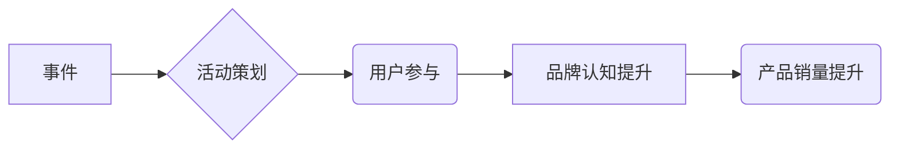

                 

## 如何利用事件营销推广知识付费产品

> 关键词：事件营销、知识付费、产品推广、用户增长、线上活动

### 1. 背景介绍

知识付费行业近年来发展迅速，涌现出众多优质的知识产品。然而，在竞争激烈的市场环境下，如何有效地推广知识付费产品，吸引用户付费成为众多创作者和平台面临的挑战。传统广告投放方式成本高、效果难以衡量，而事件营销作为一种新型的营销模式，凭借其互动性强、精准度高、传播力强的特点，逐渐成为知识付费产品推广的热门选择。

事件营销是指围绕特定事件或节日，策划和执行一系列营销活动，以吸引目标用户参与，提升品牌知名度和产品销量。对于知识付费产品而言，事件营销可以帮助创作者建立用户粘性，增强用户参与度，最终转化为付费用户。

### 2. 核心概念与联系

#### 2.1 事件营销的概念

事件营销是一种以事件为中心，通过策划和执行一系列活动，吸引目标用户参与，从而达到营销目标的营销策略。事件营销活动可以是线上线下结合，也可以是线上独有的活动。

#### 2.2 知识付费产品

知识付费产品是指以知识、技能、经验等为核心内容，通过线上平台进行销售和传播的付费产品。知识付费产品可以包括课程、直播、咨询、电子书等多种形式。

#### 2.3 事件营销与知识付费产品的关系

事件营销可以为知识付费产品提供一个有效的推广平台，帮助创作者吸引目标用户，提升产品知名度和销量。

**Mermaid 流程图**



### 3. 核心算法原理 & 具体操作步骤

#### 3.1 算法原理概述

事件营销推广知识付费产品的核心算法原理在于精准定位目标用户，并通过精心策划的活动，激发用户参与热情，最终引导用户付费购买知识产品。

#### 3.2 算法步骤详解

1. **目标用户分析:** 首先需要对目标用户进行深入分析，了解他们的兴趣爱好、需求痛点、消费习惯等信息。
2. **事件选择:** 选择与目标用户相关联的事件或节日，例如行业峰会、专业技能培训、兴趣爱好节日等。
3. **活动策划:** 根据目标用户和事件特点，策划一系列互动性强、趣味性高的活动，例如线上直播、线下研讨会、知识竞赛、优惠促销等。
4. **活动推广:** 利用多种线上线下渠道进行活动推广，例如社交媒体、搜索引擎、邮件营销、合作推广等。
5. **用户参与引导:** 在活动过程中，通过互动游戏、抽奖活动、知识问答等方式，引导用户积极参与，提升用户粘性。
6. **付费转化:** 在活动中，突出知识产品的价值，并提供优惠折扣等激励措施，引导用户付费购买知识产品。

#### 3.3 算法优缺点

**优点:**

* 精准定位目标用户，提高营销效率。
* 互动性强，增强用户参与度。
* 传播力强，扩大品牌影响力。

**缺点:**

* 活动策划需要投入大量时间和精力。
* 活动效果难以精准衡量。
* 需要不断创新活动形式，避免用户疲劳。

#### 3.4 算法应用领域

事件营销推广知识付费产品适用于各个领域，例如教育培训、科技创新、商业管理、个人成长等。

### 4. 数学模型和公式 & 详细讲解 & 举例说明

#### 4.1 数学模型构建

事件营销推广知识付费产品的数学模型可以采用用户增长模型，例如Gompertz模型，来预测用户增长趋势。

**Gompertz模型公式:**

$$
N(t) = K \cdot e^{-e^{-a(t-t_0)}}
$$

其中:

* $N(t)$:  t时刻的用户数量
* $K$: 用户增长上限
* $a$:  增长率
* $t_0$:  初始时间

#### 4.2 公式推导过程

Gompertz模型的推导过程较为复杂，涉及微积分和概率论等知识。

#### 4.3 案例分析与讲解

假设一个知识付费产品的目标用户数量为10000人，增长率为0.1，初始时间为0，则根据Gompertz模型公式，可以预测用户增长趋势。

### 5. 项目实践：代码实例和详细解释说明

#### 5.1 开发环境搭建

* Python 3.x
* Jupyter Notebook

#### 5.2 源代码详细实现

```python
import numpy as np
import matplotlib.pyplot as plt

def gompertz(K, a, t0, t):
  return K * np.exp(-np.exp(-a*(t-t0)))

# 设置参数
K = 10000  # 用户增长上限
a = 0.1  # 增长率
t0 = 0  # 初始时间
t = np.linspace(0, 30, 100)  # 时间范围

# 计算用户数量
N = gompertz(K, a, t0, t)

# 绘制用户增长曲线
plt.plot(t, N)
plt.xlabel('时间 (天)')
plt.ylabel('用户数量')
plt.title('Gompertz模型用户增长曲线')
plt.show()
```

#### 5.3 代码解读与分析

* 该代码首先定义了Gompertz模型的函数，并设置了用户增长上限、增长率和初始时间等参数。
* 然后，使用NumPy库生成时间范围，并调用Gompertz模型函数计算用户数量。
* 最后，使用Matplotlib库绘制用户增长曲线，直观地展示了用户增长趋势。

#### 5.4 运行结果展示

运行代码后，会生成一个用户增长曲线图，展示了用户数量随着时间的推移而增长趋势。

### 6. 实际应用场景

#### 6.1 线上直播活动

知识付费创作者可以利用直播平台举办线上直播活动，分享专业知识、解答用户疑问，并通过直播间的互动环节，引导用户购买知识产品。

#### 6.2 线下研讨会

知识付费创作者可以举办线下研讨会，邀请行业专家分享经验，并提供互动交流的机会，提升用户对知识产品的认知和信任度。

#### 6.3 知识竞赛

知识付费平台可以举办知识竞赛，吸引用户参与，并通过竞赛奖励，引导用户购买知识产品。

#### 6.4 未来应用展望

随着互联网技术的不断发展，事件营销推广知识付费产品的应用场景将更加丰富，例如虚拟现实、增强现实等新技术也将被应用于事件营销活动中，为用户提供更加沉浸式的体验。

### 7. 工具和资源推荐

#### 7.1 学习资源推荐

* 事件营销书籍：《事件营销实战》、《事件营销 bible》
* 事件营销博客：Event Marketing Institute、Eventbrite Blog

#### 7.2 开发工具推荐

* 直播平台：抖音、快手、B站
* 线下活动平台：会展平台、线下场地租赁平台

#### 7.3 相关论文推荐

* 《事件营销的理论与实践》
* 《事件营销在知识付费领域的应用研究》

### 8. 总结：未来发展趋势与挑战

#### 8.1 研究成果总结

事件营销推广知识付费产品是一种有效的营销策略，可以帮助创作者吸引目标用户，提升产品知名度和销量。

#### 8.2 未来发展趋势

* 事件营销将更加注重用户体验，提供更加个性化、互动化的活动。
* 事件营销将更加注重数据分析，利用数据驱动营销决策。
* 事件营销将更加注重跨平台整合，利用线上线下资源进行协同推广。

#### 8.3 面临的挑战

* 事件营销活动策划需要投入大量时间和精力。
* 事件营销效果难以精准衡量。
* 需要不断创新活动形式，避免用户疲劳。

#### 8.4 研究展望

未来研究可以更加深入地探讨事件营销推广知识付费产品的具体应用场景，以及如何利用新技术提升事件营销效果。

### 9. 附录：常见问题与解答

#### 9.1 如何选择合适的事件？

选择合适的事件需要根据目标用户和知识产品的特点进行分析，例如，如果目标用户是程序员，可以选择举办与编程相关的线上活动；如果目标用户是创业者，可以选择举办与创业相关的线下研讨会。

#### 9.2 如何设计吸引用户的活动？

活动设计需要注重互动性、趣味性和实用性，例如，可以设置知识竞赛、抽奖活动、互动游戏等环节，并提供有价值的知识和资源。

#### 9.3 如何衡量事件营销的效果？

可以根据事件营销目标设定相应的指标，例如，用户参与度、品牌认知度、产品销量等，并利用数据分析工具进行跟踪和评估。


作者：禅与计算机程序设计艺术 / Zen and the Art of Computer Programming 
<end_of_turn>

