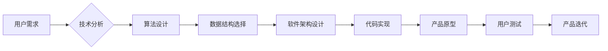

                 

## 如何利用技术能力进行产品设计

> 关键词：产品设计、技术能力、用户体验、算法、数学模型、代码实现、实际应用场景

## 1. 背景介绍

在当今以技术驱动为主的时代，产品设计不再仅仅局限于美学和用户界面，而是需要深度融合技术能力，以构建更智能、更便捷、更具用户体验的产品。技术能力为产品设计提供了强大的工具和手段，可以帮助设计师更好地理解用户需求，探索创新解决方案，并实现产品功能的精准化和高效化。

然而，并非所有设计师都具备扎实的技术背景。如何有效地利用技术能力进行产品设计，是许多设计师面临的挑战。本文将深入探讨如何将技术能力融入产品设计流程，并通过案例分析和代码实例，阐明技术能力在产品设计中的具体应用。

## 2. 核心概念与联系

产品设计与技术能力的结合，本质上是将用户需求与技术实现相融合的过程。

**用户需求**是产品设计的出发点，它反映了用户对产品的功能、体验和价值的期望。

**技术能力**则是实现用户需求的工具和手段，它包括算法、数据结构、软件架构、编程语言等方面的知识和技能。

两者之间存在着密切的联系，技术能力可以帮助设计师更好地理解用户需求，并找到最合适的解决方案。

**Mermaid 流程图：**



## 3. 核心算法原理 & 具体操作步骤

### 3.1  算法原理概述

算法是解决特定问题的指令序列，是技术能力的核心组成部分。在产品设计中，算法可以用于各种场景，例如：

* **推荐算法**: 根据用户的历史行为和偏好，推荐相关产品或内容。
* **搜索算法**: 帮助用户快速找到所需的信息。
* **排序算法**: 对数据进行排序，以便于用户浏览和理解。
* **路径规划算法**: 计算最优路径，例如导航应用中的路线规划。

### 3.2  算法步骤详解

以推荐算法为例，其基本步骤如下：

1. **数据收集**: 收集用户的行为数据，例如浏览历史、购买记录、评分等。
2. **数据预处理**: 对收集到的数据进行清洗、转换和特征提取。
3. **模型训练**: 使用机器学习算法，训练推荐模型。
4. **预测推荐**: 根据用户的特征和模型的预测结果，推荐相关产品或内容。
5. **评估效果**: 通过指标如点击率、转化率等，评估推荐算法的效果。

### 3.3  算法优缺点

**优点**:

* **个性化**: 可以根据用户的不同需求和偏好，提供个性化的推荐。
* **效率**: 可以自动完成大量的数据处理和分析，提高效率。
* **精准**: 可以根据用户的行为数据，预测用户的兴趣和需求，提供更精准的推荐。

**缺点**:

* **数据依赖**: 推荐算法需要大量的数据进行训练，否则效果会不佳。
* **算法复杂**: 训练和维护推荐算法需要一定的技术难度。
* **公平性**: 推荐算法可能会存在偏差，导致某些用户无法获得公平的推荐。

### 3.4  算法应用领域

推荐算法广泛应用于电商、社交媒体、音乐流媒体、视频平台等领域，例如：

* **电商**: 推荐商品、优惠券、促销活动。
* **社交媒体**: 推荐好友、群组、内容。
* **音乐流媒体**: 推荐歌曲、专辑、艺术家。
* **视频平台**: 推荐视频、电视剧、电影。

## 4. 数学模型和公式 & 详细讲解 & 举例说明

### 4.1  数学模型构建

在产品设计中，数学模型可以用来描述系统行为、预测用户行为、优化产品性能等。例如，我们可以使用贝叶斯网络来建模用户行为，使用线性回归来预测用户购买概率，使用优化算法来优化产品界面布局。

### 4.2  公式推导过程

以推荐算法为例，我们可以使用协同过滤算法来构建推荐模型。协同过滤算法基于用户的历史行为数据，预测用户对某项物品的评分或偏好。

**公式**:

$$
r_{ui} = \mu_u + \mu_i + \sum_{j \in N(u)} \frac{sim(u, j) \cdot (r_{uj} - \mu_j)}{\sqrt{\sum_{k \in N(u)} sim(u, k)^2}}
$$

其中：

* $r_{ui}$: 用户 $u$ 对物品 $i$ 的评分或偏好。
* $\mu_u$: 用户 $u$ 的平均评分。
* $\mu_i$: 物品 $i$ 的平均评分。
* $sim(u, j)$: 用户 $u$ 和用户 $j$ 之间的相似度。
* $N(u)$: 用户 $u$ 评分过的物品集合。

### 4.3  案例分析与讲解

假设我们有一个电商平台，用户 $A$ 和用户 $B$ 都购买了商品 $X$ 和 $Y$，并且对这两个商品的评分都较高。如果用户 $A$ 购买了商品 $Z$，并且对商品 $Z$ 的评分也较高，那么根据协同过滤算法，我们可以预测用户 $B$ 也可能喜欢商品 $Z$。

## 5. 项目实践：代码实例和详细解释说明

### 5.1  开发环境搭建

为了实现推荐算法，我们可以使用 Python 语言和相应的库，例如 Scikit-learn、TensorFlow 等。

### 5.2  源代码详细实现

```python
from sklearn.metrics.pairwise import cosine_similarity

# 用户行为数据
user_data = {
    'user1': {'item1': 5, 'item2': 3, 'item3': 4},
    'user2': {'item1': 4, 'item2': 5, 'item3': 2},
    'user3': {'item1': 3, 'item2': 4, 'item3': 5},
}

# 计算用户之间的相似度
user_similarity = cosine_similarity(user_data.values())

# 预测用户对某项物品的评分
def predict_rating(user, item):
    # ...
    return predicted_rating

# 预测用户 user1 对 item4 的评分
predicted_rating = predict_rating('user1', 'item4')
print(predicted_rating)
```

### 5.3  代码解读与分析

这段代码演示了如何使用 cosine_similarity 函数计算用户之间的相似度。然后，我们可以根据用户的相似度和历史行为数据，预测用户对某项物品的评分。

### 5.4  运行结果展示

运行这段代码后，我们可以得到用户 user1 对 item4 的预测评分。

## 6. 实际应用场景

### 6.1  电商推荐

电商平台可以利用技术能力，根据用户的浏览历史、购买记录、评分等数据，推荐相关商品，提高用户转化率。

### 6.2  社交媒体推荐

社交媒体平台可以利用技术能力，推荐好友、群组、内容，增强用户粘性和活跃度。

### 6.3  音乐流媒体推荐

音乐流媒体平台可以利用技术能力，推荐歌曲、专辑、艺术家，满足用户的个性化音乐需求。

### 6.4  未来应用展望

随着人工智能技术的不断发展，技术能力在产品设计中的应用将更加广泛和深入。例如，我们可以利用自然语言处理技术，实现更智能的语音交互；利用计算机视觉技术，构建更逼真的虚拟现实体验；利用机器学习技术，预测用户需求，提供更精准的个性化服务。

## 7. 工具和资源推荐

### 7.1  学习资源推荐

* **书籍**: 《设计模式：复用面向对象软件的设计》
* **在线课程**: Coursera、edX、Udacity 等平台提供各种技术相关的课程。

### 7.2  开发工具推荐

* **编程语言**: Python、Java、C++ 等。
* **机器学习库**: Scikit-learn、TensorFlow、PyTorch 等。
* **数据可视化工具**: Tableau、Power BI 等。

### 7.3  相关论文推荐

* **推荐系统**: 《Collaborative Filtering for Implicit Feedback Datasets》
* **自然语言处理**: 《BERT: Pre-training of Deep Bidirectional Transformers for Language Understanding》

## 8. 总结：未来发展趋势与挑战

### 8.1  研究成果总结

技术能力的融合，为产品设计带来了新的机遇和挑战。通过算法、数学模型和代码实现，我们可以构建更智能、更便捷、更具用户体验的产品。

### 8.2  未来发展趋势

未来，技术能力在产品设计中的应用将更加深入和广泛，例如：

* **人工智能驱动**: 利用人工智能技术，实现更智能的个性化推荐、更精准的用户行为预测。
* **沉浸式体验**: 利用虚拟现实、增强现实等技术，构建更沉浸式的用户体验。
* **跨平台融合**: 利用云计算、移动互联网等技术，实现跨平台的协同设计和产品体验。

### 8.3  面临的挑战

技术能力的融合也面临着一些挑战，例如：

* **技术门槛**: 设计师需要掌握一定的技术知识和技能。
* **数据安全**: 产品设计需要处理大量用户数据，需要保障数据安全和隐私。
* **伦理问题**: 技术能力的应用需要考虑伦理问题，例如算法偏见、数据滥用等。

### 8.4  研究展望

未来，我们需要继续探索技术能力与产品设计之间的融合，开发更先进的技术工具和方法，并关注技术应用的伦理问题，推动技术能力在产品设计领域的健康发展。

## 9. 附录：常见问题与解答

**问题**: 如何学习技术能力？

**解答**: 可以通过阅读书籍、参加在线课程、学习编程语言、参与开源项目等方式学习技术能力。

**问题**: 如何将技术能力融入产品设计流程？

**解答**: 可以将技术能力融入产品设计各个阶段，例如用户调研、原型设计、交互设计、测试等。

**问题**: 技术能力的应用会取代设计师吗？

**解答**: 技术能力可以帮助设计师提高效率和创造力，但不会取代设计师。设计师仍然需要负责产品的设计理念、用户体验、美学等方面。


作者：禅与计算机程序设计艺术 / Zen and the Art of Computer Programming 
<end_of_turn>

