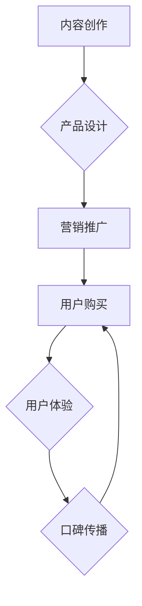

                 

## 如何打造高口碑的程序员知识付费产品

> 关键词：程序员知识付费、口碑营销、产品设计、技术深度、教学质量、社区建设、持续更新

### 1. 背景介绍

近年来，随着互联网技术的发展和程序员人才需求的不断增长，程序员知识付费市场蓬勃发展。众多技术专家和经验丰富的程序员纷纷将自己的知识和技能转化为付费课程，通过线上平台分享给渴望学习和提升的程序员。然而，在激烈的市场竞争中，如何打造高口碑的程序员知识付费产品，成为众多创作者面临的挑战。

### 2. 核心概念与联系

**2.1  知识付费产品体系**

知识付费产品体系是一个包含多个环节的闭环系统，涵盖了内容创作、产品设计、营销推广、用户服务等各个方面。

* **内容创作:** 这是知识付费产品的核心，需要专业技术背景和丰富的教学经验。
* **产品设计:**  需要根据目标用户群体和市场需求，设计出易于理解、易于学习的课程结构和学习模式。
* **营销推广:**  需要通过线上线下渠道，有效地将产品推向目标用户。
* **用户服务:**  需要提供优质的售后服务，及时解决用户遇到的问题，提升用户体验。

**2.2  口碑营销机制**

口碑营销是通过用户对产品或服务的评价和推荐，来影响其他用户的购买决策。对于知识付费产品而言，口碑营销尤为重要，因为它能够有效地降低用户购买的风险感，提升用户对产品的信任度。

* **用户体验:**  优质的用户体验是口碑营销的基础，只有用户对产品感到满意，才会主动推荐给其他人。
* **内容价值:**  课程内容的价值和实用性是口碑营销的关键因素，只有内容能够真正帮助用户解决问题，提升技能，才能获得用户的认可和推荐。
* **社区建设:**  建立一个活跃的学习社区，可以帮助用户互相交流学习，分享经验，增强用户粘性，形成良好的口碑效应。

**Mermaid 流程图**



### 3. 核心算法原理 & 具体操作步骤

**3.1  算法原理概述**

在知识付费产品中，算法原理主要体现在内容推荐、用户画像、学习进度分析等方面。

* **内容推荐算法:**  根据用户的学习历史、兴趣偏好等信息，推荐相关的课程和学习资源。
* **用户画像算法:**  通过分析用户的学习行为、反馈信息等数据，构建用户的学习画像，以便更好地理解用户的需求和学习特点。
* **学习进度分析算法:**  跟踪用户的学习进度，识别用户的学习瓶颈，并提供个性化的学习建议。

**3.2  算法步骤详解**

* **内容推荐算法:**
    1. 收集用户学习历史数据，包括学习过的课程、观看过的视频、阅读过的文章等。
    2. 分析用户学习行为，识别用户的兴趣偏好、学习风格等特征。
    3. 基于用户的学习特征，推荐相关的课程和学习资源。
* **用户画像算法:**
    1. 收集用户的基本信息，如年龄、性别、职业等。
    2. 收集用户的学习行为数据，如学习时间、学习时长、学习进度等。
    3. 分析用户的学习反馈信息，如课程评价、问题反馈等。
    4. 基于以上数据，构建用户的学习画像，包括用户的学习目标、学习能力、学习偏好等。
* **学习进度分析算法:**
    1. 跟踪用户的学习进度，记录用户的学习时间、学习内容、学习完成度等信息。
    2. 分析用户的学习行为，识别用户的学习瓶颈，例如在某个知识点上花费的时间过长，或者多次重复学习某个内容。
    3. 根据用户的学习瓶颈，提供个性化的学习建议，例如推荐相关的学习资源、提供针对性的练习题等。

**3.3  算法优缺点**

* **优点:**
    * 可以根据用户的个性化需求，提供更精准的学习推荐和服务。
    * 可以帮助用户更好地理解自己的学习特点，制定更有效的学习计划。
    * 可以提高用户的学习效率和学习兴趣。
* **缺点:**
    * 需要大量的用户数据进行训练和分析，否则算法的准确性会降低。
    * 需要不断更新和改进算法模型，以适应用户的不断变化的需求。

**3.4  算法应用领域**

* **在线教育平台:**  推荐课程、个性化学习路径、学习进度分析等。
* **知识付费平台:**  用户画像、内容推荐、学习效果评估等。
* **企业培训系统:**  员工技能评估、培训计划定制、学习效果跟踪等。

### 4. 数学模型和公式 & 详细讲解 & 举例说明

**4.1  数学模型构建**

在知识付费产品中，可以使用数学模型来衡量用户学习效果、预测用户学习进度等。例如，可以使用以下公式来计算用户的学习效率：

$$
学习效率 = \frac{学习内容完成度}{学习时间}
$$

其中，学习内容完成度是指用户学习完成的知识点数量或学习时长，学习时间是指用户实际学习的时间。

**4.2  公式推导过程**

该公式的推导过程如下：

1. 假设用户学习了 $n$ 个知识点，学习时间为 $t$ 小时。
2. 学习内容完成度可以表示为 $n$。
3. 学习效率可以定义为学习内容完成度与学习时间之比。
4. 因此，学习效率公式为：

$$
学习效率 = \frac{n}{t}
$$

**4.3  案例分析与讲解**

假设用户 A 学习了 10 个知识点，学习时间为 2 小时，则用户的学习效率为：

$$
学习效率 = \frac{10}{2} = 5
$$

假设用户 B 学习了 20 个知识点，学习时间为 5 小时，则用户的学习效率为：

$$
学习效率 = \frac{20}{5} = 4
$$

从以上例子可以看出，学习效率越高，表示用户学习效率越高。

### 5. 项目实践：代码实例和详细解释说明

**5.1  开发环境搭建**

* **操作系统:**  Windows/macOS/Linux
* **编程语言:**  Python
* **开发工具:**  VS Code/PyCharm
* **库依赖:**  pandas、numpy、scikit-learn等

**5.2  源代码详细实现**

```python
import pandas as pd
from sklearn.cluster import KMeans

# 加载用户学习数据
data = pd.read_csv('user_learning_data.csv')

# 数据预处理
# ...

# 使用 KMeans 算法进行用户画像
kmeans = KMeans(n_clusters=3)
kmeans.fit(data)

# 获取用户所属的类别
user_clusters = kmeans.labels_

# 将用户类别信息添加到数据中
data['user_cluster'] = user_clusters

# 保存用户画像数据
data.to_csv('user_portraits.csv', index=False)
```

**5.3  代码解读与分析**

* 该代码示例展示了如何使用 KMeans 算法进行用户画像。
* 首先，需要加载用户学习数据，并进行数据预处理。
* 然后，使用 KMeans 算法对用户数据进行聚类，将用户分为不同的类别。
* 最后，将用户所属的类别信息添加到数据中，并保存用户画像数据。

**5.4  运行结果展示**

运行该代码后，将生成一个包含用户画像信息的 CSV 文件。

### 6. 实际应用场景

* **个性化学习推荐:**  根据用户的学习画像，推荐相关的课程和学习资源。
* **学习计划定制:**  根据用户的学习目标和学习能力，定制个性化的学习计划。
* **学习效果评估:**  根据用户的学习进度和学习效率，评估用户的学习效果。

**6.4  未来应用展望**

* **人工智能驱动的学习体验:**  利用人工智能技术，打造更加智能化、个性化的学习体验。
* **虚拟现实和增强现实技术:**  将虚拟现实和增强现实技术应用于知识付费产品，提供更加沉浸式的学习体验。
* **跨平台学习生态:**  构建一个跨平台的学习生态，让用户能够随时随地学习。

### 7. 工具和资源推荐

**7.1  学习资源推荐**

* **在线课程平台:**  Coursera、edX、Udemy
* **技术博客:**  Hacker News、Medium、Stack Overflow
* **开源社区:**  GitHub、GitLab

**7.2  开发工具推荐**

* **代码编辑器:**  VS Code、Sublime Text、Atom
* **数据分析工具:**  Python、R、Tableau
* **机器学习库:**  scikit-learn、TensorFlow、PyTorch

**7.3  相关论文推荐**

* **推荐系统:**  Collaborative Filtering, Content-Based Filtering
* **用户画像:**  Clustering, Dimensionality Reduction
* **机器学习:**  Supervised Learning, Unsupervised Learning

### 8. 总结：未来发展趋势与挑战

**8.1  研究成果总结**

近年来，在人工智能、大数据等技术的推动下，知识付费产品的发展取得了显著的成果。

* **内容质量提升:**  越来越多的优质内容涌现，满足了用户多样化的学习需求。
* **学习体验优化:**  个性化学习推荐、互动式学习模式等创新技术，提升了用户的学习体验。
* **用户粘性增强:**  社区建设、用户互动等措施，增强了用户的学习粘性。

**8.2  未来发展趋势**

* **人工智能化学习:**  人工智能技术将更加深入地应用于知识付费产品，提供更加智能化、个性化的学习体验。
* **沉浸式学习体验:**  虚拟现实和增强现实技术将为用户提供更加沉浸式的学习体验。
* **跨平台学习生态:**  知识付费产品将构建更加完善的跨平台学习生态，让用户能够随时随地学习。

**8.3  面临的挑战**

* **内容原创性:**  如何保证知识付费产品的原创性和独特性，避免内容重复和抄袭。
* **用户信任度:**  如何提升用户对知识付费产品的信任度，解决用户付费的顾虑。
* **知识更新:**  如何及时更新知识付费产品的课程内容，满足用户不断变化的需求。

**8.4  研究展望**

未来，知识付费产品将朝着更加智能化、个性化、沉浸式的方向发展。研究者需要不断探索新的技术和模式，为用户提供更加优质的学习体验。

### 9. 附录：常见问题与解答

* **Q1: 如何保证知识付费产品的质量？**

A1:  知识付费产品的质量取决于内容的原创性、实用性和教学效果。创作者需要具备专业的技术背景和丰富的教学经验，并不断更新和改进课程内容。

* **Q2: 如何提升用户对知识付费产品的信任度？**

A2:  可以通过以下方式提升用户信任度：
    * 提供免费试听课程，让用户体验课程质量。
    * 收集用户反馈，并及时改进课程内容。
    * 建立良好的用户社区，让用户互相交流学习，分享经验。

* **Q3: 如何推广知识付费产品？**

A3:  可以通过以下方式推广知识付费产品：
    * 线上推广：利用社交媒体、搜索引擎优化等方式进行推广。
    * 线下推广：参加行业活动、举办线下讲座等方式进行推广。
    * 合作推广：与其他平台或机构合作，进行联合推广。


作者：禅与计算机程序设计艺术 / Zen and the Art of Computer Programming 
<end_of_turn>

