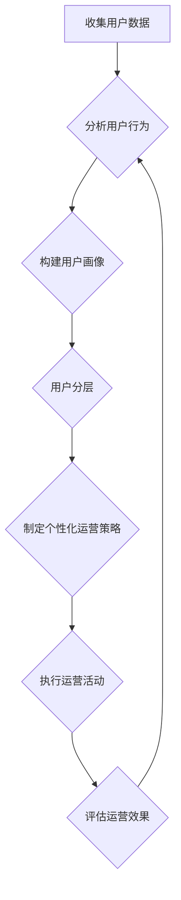

                 

## 如何进行有效的用户分层运营

> 关键词：用户分层、用户画像、运营策略、数据分析、个性化推荐

### 1. 背景介绍

在当今数据爆炸的时代，用户数据已成为企业最重要的资产之一。如何有效地利用这些数据，精准地触达目标用户，并提升用户体验和转化率，是企业运营的关键挑战。用户分层运营，作为一种基于用户数据分析和行为特征的精准营销策略，应运而生。

用户分层运营的核心思想是将用户群体根据其特征、行为、价值等维度进行细分，并针对不同层级的用户制定个性化的运营策略。通过对用户进行精准的分类和定位，企业可以更有效地开展营销活动，提升用户粘性，最终实现商业目标。

### 2. 核心概念与联系

用户分层运营的核心概念包括：

* **用户画像:** 通过收集和分析用户数据，构建用户画像，包括用户基本信息、行为特征、兴趣爱好、消费习惯等。
* **用户分层:** 根据用户画像和运营目标，将用户群体划分为不同的层级，例如新用户、活跃用户、高价值用户等。
* **个性化运营:** 为不同层级的用户制定个性化的运营策略，例如推送个性化推荐、提供差异化服务、开展针对性活动等。

**用户分层运营流程图**



### 3. 核心算法原理 & 具体操作步骤

#### 3.1 算法原理概述

用户分层算法通常基于机器学习和数据挖掘技术，通过对用户数据进行分析和建模，识别用户之间的相似性和差异性，从而实现用户分层。常见的算法包括：

* **K-means聚类算法:** 将用户数据划分为K个簇，每个簇代表一个用户层级。
* **层次聚类算法:** 将用户数据从底层到顶层进行层次化聚类，形成树状结构的用户分层模型。
* **决策树算法:** 根据用户特征和行为构建决策树模型，将用户分类到不同的层级。

#### 3.2 算法步骤详解

以K-means聚类算法为例，用户分层步骤如下：

1. **数据预处理:** 对用户数据进行清洗、转换和特征工程，例如删除缺失值、标准化数值、提取用户特征等。
2. **选择初始聚类中心:** 随机选择K个用户作为初始聚类中心。
3. **计算用户与聚类中心的距离:** 使用距离度量，例如欧氏距离，计算每个用户与每个聚类中心的距离。
4. **将用户分配到最近的聚类中心:** 将每个用户分配到距离其最近的聚类中心所属的簇。
5. **更新聚类中心:** 计算每个簇中所有用户的平均值作为新的聚类中心。
6. **重复步骤3-5:** 直到聚类中心不再发生变化，或达到预设的迭代次数。

#### 3.3 算法优缺点

**优点:**

* 算法简单易懂，易于实现。
* 能够有效地将用户数据进行聚类，识别用户之间的相似性和差异性。

**缺点:**

* 需要事先确定K值，K值的选择会影响聚类结果。
* 对异常值敏感，异常值可能会影响聚类效果。

#### 3.4 算法应用领域

用户分层算法广泛应用于以下领域：

* **电商平台:** 根据用户购买历史、浏览记录等数据，将用户分层为不同消费水平的用户，制定个性化的推荐策略和营销活动。
* **社交媒体平台:** 根据用户活跃度、兴趣爱好等数据，将用户分层为不同活跃度和兴趣的用户，推送个性化的内容和广告。
* **金融机构:** 根据用户信用评分、交易记录等数据，将用户分层为不同风险等级的用户，制定个性化的金融产品和服务。

### 4. 数学模型和公式 & 详细讲解 & 举例说明

#### 4.1 数学模型构建

K-means聚类算法的数学模型可以概括为以下公式：

* **距离度量:**  $d(x, c) = \sqrt{\sum_{i=1}^{n}(x_i - c_i)^2}$

其中，$x$ 是用户数据，$c$ 是聚类中心，$n$ 是用户特征维度数。

* **聚类目标函数:**  $J = \sum_{i=1}^{K}\sum_{x \in C_i} d(x, c_i)^2$

其中，$K$ 是聚类数，$C_i$ 是第$i$个簇。

#### 4.2 公式推导过程

K-means算法的目标是最小化聚类目标函数$J$。算法通过迭代更新聚类中心，逐步降低目标函数值，最终达到收敛。

#### 4.3 案例分析与讲解

假设我们有以下用户数据：

| 用户ID | 年龄 | 收入 |
|---|---|---|
| 1 | 25 | 50000 |
| 2 | 30 | 60000 |
| 3 | 28 | 45000 |
| 4 | 35 | 70000 |
| 5 | 22 | 30000 |

我们希望将用户数据分为两类，可以使用K-means算法进行聚类。

通过计算用户与聚类中心的距离，并根据距离分配用户到不同的簇，最终得到以下聚类结果：

* 簇1: 用户1, 3, 5
* 簇2: 用户2, 4

### 5. 项目实践：代码实例和详细解释说明

#### 5.1 开发环境搭建

* Python 3.x
* scikit-learn 库

#### 5.2 源代码详细实现

```python
from sklearn.cluster import KMeans
import pandas as pd

# 加载用户数据
data = pd.read_csv('user_data.csv')

# 选择特征列
features = ['年龄', '收入']

# 实例化KMeans模型
kmeans = KMeans(n_clusters=2)

# 训练模型
kmeans.fit(data[features])

# 获取聚类标签
labels = kmeans.labels_

# 将聚类标签添加到数据中
data['聚类标签'] = labels

# 打印结果
print(data)
```

#### 5.3 代码解读与分析

* 首先，我们加载用户数据，并选择需要进行聚类的特征列。
* 然后，我们实例化KMeans模型，并设置聚类数为2。
* 接着，我们使用`fit()`方法训练模型，将用户数据进行聚类。
* 训练完成后，我们可以使用`labels_`属性获取每个用户的聚类标签。
* 最后，我们将聚类标签添加到数据中，并打印结果。

#### 5.4 运行结果展示

运行代码后，会输出一个包含用户ID、年龄、收入和聚类标签的DataFrame。

### 6. 实际应用场景

#### 6.1 电商平台

电商平台可以根据用户的购买历史、浏览记录、评价等数据，将用户分层为不同消费水平的用户，例如高价值用户、中价值用户、低价值用户。针对不同层级的用户，可以制定个性化的推荐策略、营销活动和服务。

#### 6.2 社交媒体平台

社交媒体平台可以根据用户的活跃度、兴趣爱好、社交关系等数据，将用户分层为不同活跃度和兴趣的用户，例如活跃用户、潜在用户、沉默用户。针对不同层级的用户，可以推送个性化的内容、广告和活动。

#### 6.3 金融机构

金融机构可以根据用户的信用评分、交易记录、资产状况等数据，将用户分层为不同风险等级的用户，例如高风险用户、中风险用户、低风险用户。针对不同层级的用户，可以提供个性化的金融产品和服务，例如贷款、理财、保险等。

#### 6.4 未来应用展望

随着人工智能技术的不断发展，用户分层运营将更加精准、智能化。未来，用户分层运营将应用于更多领域，例如教育、医疗、旅游等，为用户提供更加个性化、定制化的服务。

### 7. 工具和资源推荐

#### 7.1 学习资源推荐

* **书籍:**
    * 《数据挖掘: 概念与技术》
    * 《机器学习》
* **在线课程:**
    * Coursera: 数据挖掘与机器学习
    * edX: 人工智能导论

#### 7.2 开发工具推荐

* **Python:** 
    * scikit-learn: 机器学习库
    * pandas: 数据分析库
    * matplotlib: 数据可视化库

#### 7.3 相关论文推荐

* **K-means聚类算法:**
    * MacQueen, J. (1967). Some methods for classification and analysis of multivariate observations. Proceedings of the fifth Berkeley symposium on mathematical statistics and probability, 1, 280-297.
* **用户分层运营:**
    * Chen, Y., & Xie, X. (2018). User segmentation and personalized recommendation in e-commerce. In Proceedings of the 2018 ACM International Conference on Information and Knowledge Management (pp. 1631-1639). ACM.

### 8. 总结：未来发展趋势与挑战

#### 8.1 研究成果总结

用户分层运营已取得了一定的成果，在电商、社交媒体、金融等领域得到了广泛应用。

#### 8.2 未来发展趋势

* **更加精准的用户分层:** 利用更先进的机器学习算法和数据分析技术，实现更加精准的用户分层。
* **更加个性化的运营策略:** 根据用户画像和行为特征，制定更加个性化的运营策略，提升用户体验和转化率。
* **跨平台的用户分层:** 将用户数据整合，实现跨平台的用户分层，提供更加全面的用户服务。

#### 8.3 面临的挑战

* **数据隐私保护:** 用户数据敏感性高，需要加强数据隐私保护措施。
* **算法解释性:** 一些机器学习算法的解释性较差，难以理解模型的决策过程。
* **用户反馈机制:** 需要建立有效的用户反馈机制，不断优化用户分层模型和运营策略。

#### 8.4 研究展望

未来，用户分层运营将继续朝着更加精准、智能化、个性化的方向发展。研究者将继续探索新的算法和技术，解决数据隐私保护、算法解释性等挑战，为用户提供更加优质的服务。

### 9. 附录：常见问题与解答

#### 9.1 如何选择合适的聚类数K?

可以使用肘部法则、Silhouette score等方法来选择合适的聚类数K。

#### 9.2 如何处理缺失值?

可以使用均值填充、中位数填充等方法来处理缺失值。

#### 9.3 如何评估聚类效果?

可以使用Silhouette score、Dunn index等指标来评估聚类效果。


作者：禅与计算机程序设计艺术 / Zen and the Art of Computer Programming 
<end_of_turn>

