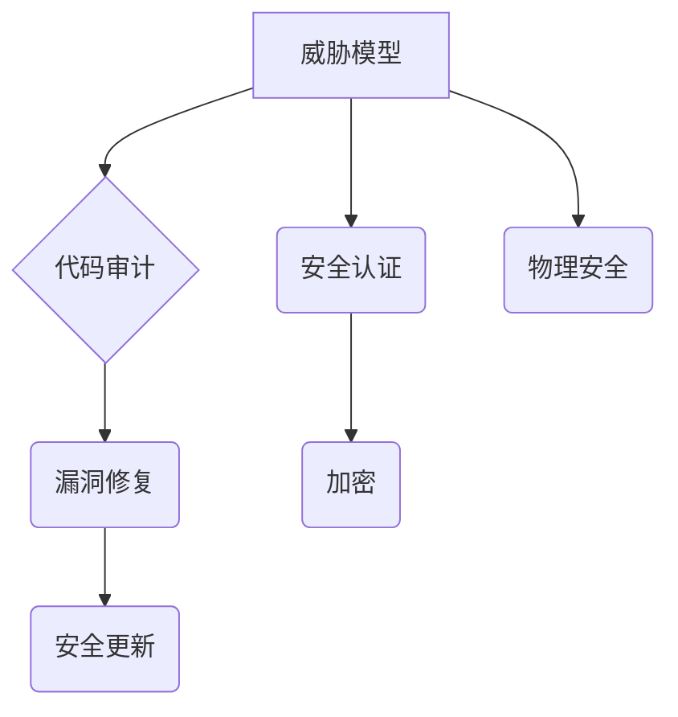

                 

## 嵌入式系统安全策略：保护设备和数据完整性

> 关键词：嵌入式系统、安全策略、设备完整性、数据完整性、威胁模型、安全认证、代码审计、漏洞修复、安全更新、加密、物理安全

### 1. 背景介绍

嵌入式系统无处不在，从智能家居设备到工业控制系统，再到医疗设备，它们在我们的生活中扮演着越来越重要的角色。然而，嵌入式系统的资源受限、软件复杂度高、更新周期长等特点也使其成为攻击者的目标。数据泄露、设备被控制、功能被篡改等安全威胁对嵌入式系统的安全性和可靠性构成严重挑战。

随着物联网（IoT）的发展，嵌入式系统连接网络的比例不断增加，其安全风险也随之扩大。攻击者可以通过网络入侵获取设备数据，控制设备行为，甚至利用漏洞发动攻击，造成重大损失。因此，制定有效的嵌入式系统安全策略，保护设备和数据完整性，至关重要。

### 2. 核心概念与联系

嵌入式系统安全策略的核心概念包括：

* **威胁模型:**  识别潜在的攻击者、攻击目标和攻击手段，为安全策略制定提供依据。
* **安全认证:**  验证用户身份和设备合法性，防止未经授权的访问。
* **代码审计:**  对嵌入式系统软件进行静态和动态分析，发现潜在的安全漏洞。
* **漏洞修复:**  及时修复发现的安全漏洞，降低系统被攻击的风险。
* **安全更新:**  定期更新系统软件和固件，补丁漏洞并增强安全防护。
* **加密:**  对敏感数据进行加密保护，防止数据泄露。
* **物理安全:**  保护设备硬件免受物理攻击，例如篡改、窃取等。

这些概念相互关联，共同构成了嵌入式系统安全策略的框架。



### 3. 核心算法原理 & 具体操作步骤

#### 3.1  算法原理概述

嵌入式系统安全策略的实施需要多种算法和技术，例如：

* **哈希算法:** 用于数据完整性验证，确保数据未被篡改。
* **数字签名算法:** 用于身份验证和数据源确认，确保数据来自可信来源。
* **密码算法:** 用于加密敏感数据，防止数据泄露。
* **身份验证算法:** 用于验证用户身份，防止未经授权的访问。

#### 3.2  算法步骤详解

以哈希算法为例，其具体操作步骤如下：

1. **选择哈希函数:** 不同的哈希函数具有不同的特性，需要根据实际需求选择合适的哈希函数。
2. **计算哈希值:** 将需要验证的数据作为输入，通过哈希函数计算出其哈希值。
3. **存储哈希值:** 将计算出的哈希值存储在安全的地方，例如数据库或固件中。
4. **验证数据完整性:** 当需要验证数据完整性时，将数据再次输入哈希函数，计算出新的哈希值。
5. **比较哈希值:** 将新计算出的哈希值与存储的哈希值进行比较，如果相同则表明数据未被篡改。

#### 3.3  算法优缺点

哈希算法具有以下优点：

* **不可逆性:**  哈希函数是不可逆的，这意味着无法从哈希值恢复原始数据。
* **抗碰撞性:**  哈希函数具有抗碰撞性，这意味着很难找到两个不同的输入数据产生相同的哈希值。
* **快速计算:**  哈希函数的计算速度很快，适合用于大量数据的验证。

然而，哈希算法也存在一些缺点：

* **不可恢复性:**  由于哈希函数是不可逆的，因此一旦数据被篡改，即使计算出的哈希值与存储的哈希值不匹配，也无法恢复原始数据。
* **碰撞攻击:**  虽然哈希函数具有抗碰撞性，但理论上仍然存在碰撞攻击的可能性。

#### 3.4  算法应用领域

哈希算法广泛应用于各种领域，例如：

* **数据完整性验证:**  确保数据未被篡改。
* **密码学:**  用于加密和解密数据。
* **数字签名:**  用于身份验证和数据源确认。
* **文件存储:**  用于文件哈希校验，防止文件损坏。

### 4. 数学模型和公式 & 详细讲解 & 举例说明

#### 4.1  数学模型构建

嵌入式系统安全策略的数学模型可以描述系统安全性的各个方面，例如：

* **威胁模型:**  可以使用概率论和图论来建模攻击者的行为和系统脆弱性。
* **安全认证:**  可以使用密码学理论来构建身份验证和授权机制。
* **代码审计:**  可以使用静态分析和动态分析算法来识别潜在的安全漏洞。

#### 4.2  公式推导过程

以数据完整性验证为例，可以使用哈希函数的数学性质来推导公式：

假设哈希函数为 H(x)，其中 x 为需要验证的数据。

* **数据完整性验证公式:**

 $$
 H(x_1) = H(x_2) \Rightarrow x_1 = x_2
 $$

其中，$x_1$ 和 $x_2$ 为两个数据，如果它们的哈希值相同，则表明它们是相同的。

#### 4.3  案例分析与讲解

假设我们使用 SHA-256 哈希函数对文件进行完整性验证。

1. 将文件内容作为输入，计算出其 SHA-256 哈希值。
2. 将哈希值存储在文件旁边。
3. 当需要验证文件完整性时，重新计算文件内容的 SHA-256 哈希值。
4. 将新计算出的哈希值与存储的哈希值进行比较。
5. 如果两个哈希值相同，则表明文件未被篡改。

### 5. 项目实践：代码实例和详细解释说明

#### 5.1  开发环境搭建

嵌入式系统安全策略的开发环境需要根据具体的硬件平台和软件架构进行搭建。

例如，开发基于 ARM 处理器的嵌入式系统，可以使用 Linux 或 FreeRTOS 操作系统，并使用 C/C++ 语言进行编程。

#### 5.2  源代码详细实现

以下是一个简单的代码示例，演示了如何使用哈希函数对数据进行完整性验证：

```c
#include <stdio.h>
#include <string.h>
#include <openssl/sha.h>

int main() {
    char data[] = "This is a test string.";
    unsigned char hash[SHA256_DIGEST_LENGTH];
    SHA256_CTX sha256;

    SHA256_Init(&sha256);
    SHA256_Update(&sha256, data, strlen(data));
    SHA256_Final(hash, &sha256);

    printf("SHA256 hash: ");
    for (int i = 0; i < SHA256_DIGEST_LENGTH; i++) {
        printf("%02x", hash[i]);
    }
    printf("\n");

    return 0;
}
```

#### 5.3  代码解读与分析

这段代码首先包含了必要的头文件，然后定义了一个测试字符串。

接着，它初始化了一个 SHA256 哈希上下文，并使用 `SHA256_Update()` 函数将测试字符串更新到哈希上下文。

最后，使用 `SHA256_Final()` 函数计算出哈希值，并将结果打印到控制台。

#### 5.4  运行结果展示

运行这段代码后，会输出一个 64 位的十六进制字符串，这是测试字符串的 SHA256 哈希值。

### 6. 实际应用场景

嵌入式系统安全策略在各个领域都有广泛的应用场景：

* **工业控制系统:**  保护工业控制系统免受攻击，防止设备被控制或功能被篡改。
* **医疗设备:**  确保医疗设备的安全性和可靠性，防止数据泄露和医疗事故。
* **汽车电子系统:**  保护汽车电子系统免受攻击，防止车辆失控或安全功能失效。
* **智能家居设备:**  保护智能家居设备免受攻击，防止数据泄露和隐私侵犯。

### 6.4  未来应用展望

随着物联网的发展，嵌入式系统安全策略将变得越来越重要。未来，嵌入式系统安全策略将朝着以下方向发展：

* **更加智能化:**  利用人工智能和机器学习技术，实现更加智能的威胁检测和防御。
* **更加自动化:**  利用自动化工具和流程，简化安全策略的实施和维护。
* **更加协同:**  加强不同系统和设备之间的安全协作，构建更加安全的嵌入式系统生态。

### 7. 工具和资源推荐

#### 7.1  学习资源推荐

* **书籍:**  《嵌入式系统安全》
* **网站:**  OWASP Embedded Security Project

#### 7.2  开发工具推荐

* **代码分析工具:**  Coverity, Fortify
* **安全测试工具:**  Metasploit, Nessus

#### 7.3  相关论文推荐

* **论文:**  "A Survey of Security Issues in Embedded Systems"

### 8. 总结：未来发展趋势与挑战

#### 8.1  研究成果总结

嵌入式系统安全策略的研究取得了显著进展，已经形成了较为完善的理论体系和实践经验。

#### 8.2  未来发展趋势

未来，嵌入式系统安全策略将朝着更加智能化、自动化和协同的方向发展。

#### 8.3  面临的挑战

嵌入式系统安全策略面临着许多挑战，例如：

* **资源受限:**  嵌入式系统资源受限，安全策略的实施需要考虑资源消耗问题。
* **软件复杂度高:**  嵌入式系统软件复杂度高，安全漏洞难以发现和修复。
* **更新周期长:**  嵌入式系统更新周期长，安全补丁的部署难度较大。

#### 8.4  研究展望

未来，需要进一步研究以下问题：

* 如何在资源受限的嵌入式系统中实现更加高效的安全策略。
* 如何利用人工智能和机器学习技术，提高嵌入式系统安全策略的智能化水平。
* 如何构建更加安全的嵌入式系统生态，加强不同系统和设备之间的安全协作。

### 9. 附录：常见问题与解答

#### 9.1  常见问题

* **如何选择合适的哈希函数？**

选择哈希函数需要根据实际需求考虑安全性、性能和易用性等因素。

* **如何防止碰撞攻击？**

可以使用多种哈希函数，或者使用更安全的哈希算法，例如 SHA-3。

* **如何进行代码审计？**

可以使用静态分析和动态分析工具，以及专业的代码审计人员进行代码审计。

#### 9.2  解答

* **如何进行安全更新？**

可以使用固件更新机制，或者使用网络更新机制进行安全更新。

* **如何保护设备硬件免受物理攻击？**

可以使用物理安全措施，例如防篡改芯片、加密存储器等。


作者：禅与计算机程序设计艺术 / Zen and the Art of Computer Programming 
<end_of_turn>

